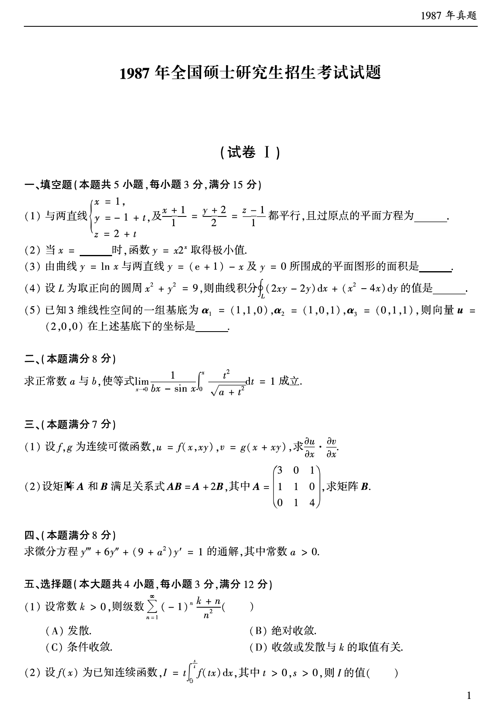
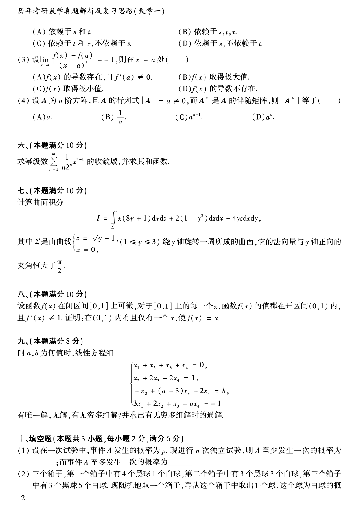
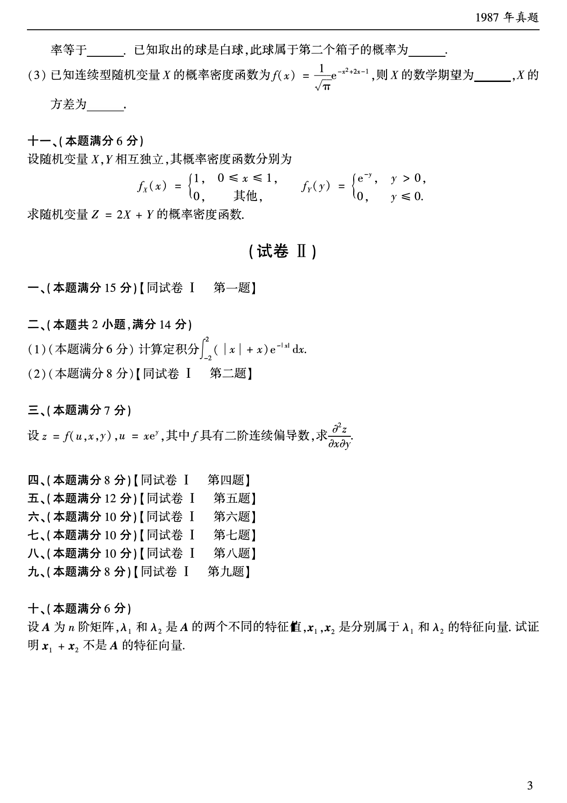

# 1987 年数学一真题

资料类型：考研数学一历年真题
年份：1987
科目：数学一
来源 PDF：`D:\百度网盘\高数资料\【01】1987-2022年数学一真题（PDF）\【合集打印】1987-2009年考研数学一真题【172页】.pdf`
整理状态：已按 PDF 页面图像人工视觉识别，待二次校对

说明：原 PDF 文本层存在乱码和公式错位，本文件不再使用文本层抽取结果。题面依据渲染页图 `images/source_pages/page_002.png` 至 `page_004.png` 视觉转写。

## 试卷 I

**第 1-11 题题图**

### 第 1 题

- 题型：填空题
- 题号：试卷 I 一(1)
- 分值：3
- 模块：高等数学
- 考点：空间解析几何，平面方程
- PDF 页码：2
- 校对状态：人工视觉识别，待二次校对

与两直线

$$
\begin{cases}
x=1,\\
y=-1+t,\\
z=2+t
\end{cases}
$$

及

$$
\frac{x+1}{1}=\frac{y+2}{2}=\frac{z-1}{1}
$$

都平行，且过原点的平面方程为______。

### 第 2 题

- 题型：填空题
- 题号：试卷 I 一(2)
- 分值：3
- 模块：高等数学
- 考点：一元函数极值
- PDF 页码：2
- 校对状态：人工视觉识别，待二次校对

当 $x=$______ 时，函数 $y=x^{2x}$ 取得极小值。

### 第 3 题

- 题型：填空题
- 题号：试卷 I 一(3)
- 分值：3
- 模块：高等数学
- 考点：定积分应用，平面图形面积
- PDF 页码：2
- 校对状态：人工视觉识别，待二次校对

由曲线 $y=\ln x$ 与两直线 $y=(e+1)-x$ 及 $y=0$ 所围成的平面图形的面积是______。

### 第 4 题

- 题型：填空题
- 题号：试卷 I 一(4)
- 分值：3
- 模块：高等数学
- 考点：第二型曲线积分，格林公式
- PDF 页码：2
- 校对状态：人工视觉识别，待二次校对

设 $L$ 为取正向的圆周 $x^2+y^2=9$，则曲线积分

$$
\oint_L (2xy-2y)\,dx+(x^2-4x)\,dy
$$

的值是______。

### 第 5 题

- 题型：填空题
- 题号：试卷 I 一(5)
- 分值：3
- 模块：线性代数
- 考点：向量在基下的坐标
- PDF 页码：2
- 校对状态：人工视觉识别，待二次校对

已知 3 维线性空间的一组基底为

$$
\alpha_1=(1,1,0),\quad \alpha_2=(1,0,1),\quad \alpha_3=(0,1,1),
$$

则向量 $u=(2,0,0)$ 在上述基底下的坐标是______。

### 第 6 题

- 题型：解答题
- 题号：试卷 I 二
- 分值：8
- 模块：高等数学
- 考点：极限，定积分，等价无穷小
- PDF 页码：2
- 校对状态：人工视觉识别，待二次校对

求正常数 $a$ 与 $b$，使等式

$$
\lim_{x\to 0}\frac{1}{bx-\sin x}\int_0^x \frac{t^2}{\sqrt{a+t^2}}\,dt=1
$$

成立。

### 第 7 题

- 题型：解答题
- 题号：试卷 I 三(1)
- 分值：待拆分
- 模块：高等数学
- 考点：多元复合函数偏导数
- PDF 页码：2
- 校对状态：人工视觉识别，待二次校对

设 $f,g$ 为连续可微函数，

$$
u=f(x,xy),\quad v=g(x+xy),
$$

求

$$
\frac{\partial u}{\partial x}\cdot \frac{\partial v}{\partial x}.
$$

### 第 8 题

- 题型：解答题
- 题号：试卷 I 三(2)
- 分值：待拆分
- 模块：线性代数
- 考点：矩阵方程，逆矩阵
- PDF 页码：2
- 校对状态：人工视觉识别，待二次校对

设矩阵 $A$ 和 $B$ 满足关系式 $AB=A+2B$，其中

$$
A=
\begin{pmatrix}
3&0&1\\
1&1&0\\
0&1&4
\end{pmatrix},
$$

求矩阵 $B$。

### 第 9 题

- 题型：解答题
- 题号：试卷 I 四
- 分值：8
- 模块：高等数学
- 考点：常系数线性微分方程
- PDF 页码：2
- 校对状态：人工视觉识别，待二次校对

求微分方程

$$
y'''+6y''+(9+a^2)y'=1
$$

的通解，其中常数 $a>0$。

### 第 10 题

- 题型：选择题
- 题号：试卷 I 五(1)
- 分值：3
- 模块：高等数学
- 考点：级数敛散性，交错级数
- PDF 页码：2
- 校对状态：人工视觉识别，待二次校对

设常数 $k>0$，则级数

$$
\sum_{n=1}^{\infty}(-1)^n\frac{k+n}{n^2}
$$

（ ）

A. 发散。
B. 绝对收敛。
C. 条件收敛。
D. 收敛或发散与 $k$ 的取值有关。

**第 11-19 题题图**

### 第 11 题

- 题型：选择题
- 题号：试卷 I 五(2)
- 分值：3
- 模块：高等数学
- 考点：定积分变量代换
- PDF 页码：2-3
- 校对状态：人工视觉识别，待二次校对

设 $f(x)$ 为已知连续函数，

$$
I=t\int_0^{s/t}f(tx)\,dx,
$$

其中 $t>0,\ s>0$，则 $I$（ ）

A. 依赖于 $s$ 和 $t$。
B. 依赖于 $s,t,x$。
C. 依赖于 $t$ 和 $x$，不依赖于 $s$。
D. 依赖于 $s$，不依赖于 $t$。

### 第 12 题

- 题型：选择题
- 题号：试卷 I 五(3)
- 分值：3
- 模块：高等数学
- 考点：导数定义，极值判定
- PDF 页码：3
- 校对状态：人工视觉识别，待二次校对

设

$$
\lim_{x\to a}\frac{f(x)-f(a)}{(x-a)^2}=-1,
$$

则在 $x=a$ 处（ ）

A. $f(x)$ 的导数存在，且 $f'(a)\ne 0$。
B. $f(x)$ 取得极大值。
C. $f(x)$ 取得极小值。
D. $f(x)$ 的导数不存在。

### 第 13 题

- 题型：选择题
- 题号：试卷 I 五(4)
- 分值：3
- 模块：线性代数
- 考点：伴随矩阵，行列式
- PDF 页码：3
- 校对状态：人工视觉识别，待二次校对

设 $A$ 为 $n$ 阶方阵，且 $A$ 的行列式 $|A|=a\ne 0$，而 $A^*$ 是 $A$ 的伴随矩阵，则 $|A^*|$ 等于（ ）

A. $a$。
B. $\dfrac{1}{a}$。
C. $a^{n-1}$。
D. $a^n$。

### 第 14 题

- 题型：解答题
- 题号：试卷 I 六
- 分值：10
- 模块：高等数学
- 考点：幂级数，和函数
- PDF 页码：3
- 校对状态：人工视觉识别，待二次校对

求幂级数

$$
\sum_{n=1}^{\infty}\frac{1}{n2^n}x^{n-1}
$$

的收敛域，并求其和函数。

### 第 15 题

- 题型：解答题
- 题号：试卷 I 七
- 分值：10
- 模块：高等数学
- 考点：第二型曲面积分，高斯公式
- PDF 页码：3
- 校对状态：人工视觉识别，待二次校对

计算曲面积分

$$
I=\iint_{\Sigma}x(8y+1)\,dy\,dz+2(1-y^2)\,dz\,dx-4yz\,dx\,dy,
$$

其中 $\Sigma$ 是由曲线

$$
\begin{cases}
z=\sqrt{y-1},\\
x=0,
\end{cases}
\quad 1\le y\le 3
$$

绕 $y$ 轴旋转一周所成的曲面，它的法向量与 $y$ 轴正向的夹角恒大于 $\dfrac{\pi}{2}$。

### 第 16 题

- 题型：解答题
- 题号：试卷 I 八
- 分值：10
- 模块：高等数学
- 考点：介值定理，唯一性证明
- PDF 页码：3
- 校对状态：人工视觉识别，待二次校对

设函数 $f(x)$ 在闭区间 $[0,1]$ 上可微，对于 $[0,1]$ 上的每一个 $x$，函数 $f(x)$ 的值都在开区间 $(0,1)$ 内，且 $f'(x)\ne 1$。证明：在 $(0,1)$ 内有且仅有一个 $x$，使 $f(x)=x$。

### 第 17 题

- 题型：解答题
- 题号：试卷 I 九
- 分值：8
- 模块：线性代数
- 考点：线性方程组解的判定，通解
- PDF 页码：3
- 校对状态：人工视觉识别，待二次校对

问 $a,b$ 为何值时，线性方程组

$$
\begin{cases}
x_1+x_2+x_3+x_4=0,\\
x_2+2x_3+2x_4=1,\\
-x_2+(a-3)x_3-2x_4=b,\\
3x_1+2x_2+x_3+ax_4=-1
\end{cases}
$$

有唯一解、无解、有无穷多组解？并求出有无穷多组解时的通解。

### 第 18 题

- 题型：填空题
- 题号：试卷 I 十(1)
- 分值：2
- 模块：概率统计
- 考点：独立重复试验，二项分布
- PDF 页码：3
- 校对状态：人工视觉识别，待二次校对

设在一次试验中，事件 $A$ 发生的概率为 $p$。现进行 $n$ 次独立试验，则 $A$ 至少发生一次的概率为______；而事件 $A$ 至多发生一次的概率为______。

**第 19-21 题题图**

### 第 19 题

- 题型：填空题
- 题号：试卷 I 十(2)
- 分值：2
- 模块：概率统计
- 考点：全概率公式，贝叶斯公式
- PDF 页码：3-4
- 校对状态：人工视觉识别，待二次校对

三个箱子，第一个箱子中有 4 个黑球 1 个白球，第二个箱子中有 3 个黑球 3 个白球，第三个箱子中有 3 个黑球 5 个白球。现随机地取一个箱子，再从这个箱子中取出 1 个球，这个球为白球的概率等于______。已知取出的球是白球，此球属于第二个箱子的概率为______。

### 第 20 题

- 题型：填空题
- 题号：试卷 I 十(3)
- 分值：2
- 模块：概率统计
- 考点：连续型随机变量，正态分布
- PDF 页码：4
- 校对状态：人工视觉识别，待二次校对

已知连续型随机变量 $X$ 的概率密度函数为

$$
f(x)=\frac{1}{\sqrt{\pi}}e^{-x^2+2x-1},
$$

则 $X$ 的数学期望为______，$X$ 的方差为______。

### 第 21 题

- 题型：解答题
- 题号：试卷 I 十一
- 分值：6
- 模块：概率统计
- 考点：随机变量函数分布，卷积
- PDF 页码：4
- 校对状态：人工视觉识别，待二次校对

设随机变量 $X,Y$ 相互独立，其概率密度函数分别为

$$
f_X(x)=
\begin{cases}
1,&0\le x\le 1,\\
0,&\text{其他},
\end{cases}
$$

$$
f_Y(y)=
\begin{cases}
e^{-y},&y>0,\\
0,&y\le 0.
\end{cases}
$$

求随机变量 $Z=2X+Y$ 的概率密度函数。
