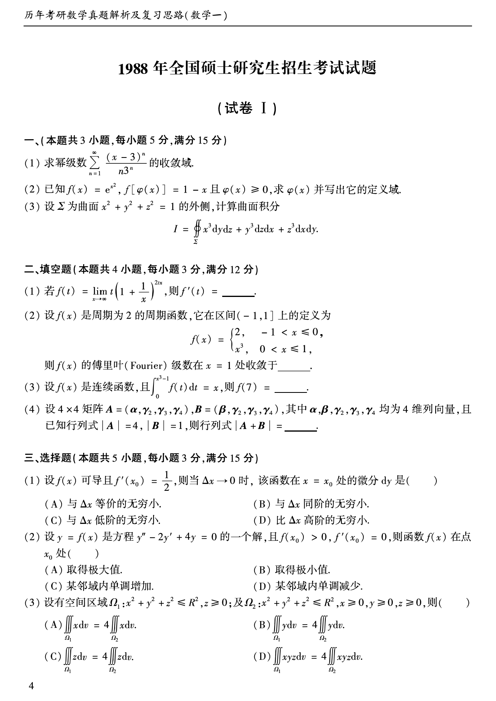
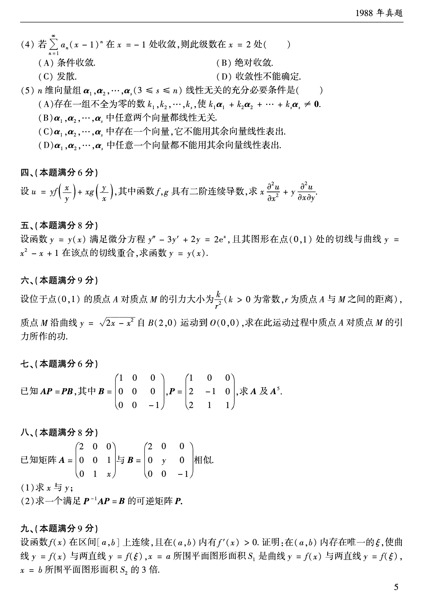
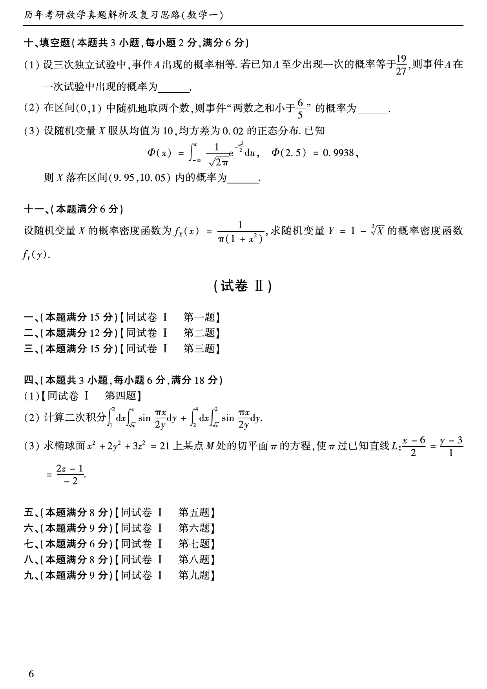

# 1988 年数学一真题

资料类型：考研数学一历年真题  
年份：1988  
科目：数学一  
来源 PDF：`D:\百度网盘\高数资料\【01】1987-2022年数学一真题（PDF）\【合集打印】1987-2009年考研数学一真题【 72页 】.pdf`  
整理状态：已按 PDF 页面图像人工视觉识别，待二次校对  

## 试卷 I

**第 1-10 题题图**

### 第 1 题

- 题型：解答题
- 题号：试卷 I 一(1)
- 分值：5
- 模块：高等数学
- 考点：幂级数，收敛域
- PDF 页码：5
- 校对状态：人工视觉识别，待二次校对

求幂级数

$$
\sum_{n=1}^{\infty}\frac{(x-3)^n}{n3^n}
$$

的收敛域。

### 第 2 题

- 题型：解答题
- 题号：试卷 I 一(2)
- 分值：5
- 模块：高等数学
- 考点：反函数，函数定义域
- PDF 页码：5
- 校对状态：人工视觉识别，待二次校对

已知

$$
f(x)=e^{x^2},\quad f[\varphi(x)]=1-x
$$

且 $\varphi(x)\ge 0$，求 $\varphi(x)$ 并写出它的定义域。

### 第 3 题

- 题型：解答题
- 题号：试卷 I 一(3)
- 分值：5
- 模块：高等数学
- 考点：第二型曲面积分，高斯公式
- PDF 页码：5
- 校对状态：人工视觉识别，待二次校对

设 $\Sigma$ 为曲面 $x^2+y^2+z^2=1$ 的外侧，计算曲面积分

$$
I=\iint_{\Sigma}x^3\,dy\,dz+y^3\,dz\,dx+z^3\,dx\,dy.
$$

### 第 4 题

- 题型：填空题
- 题号：试卷 I 二(1)
- 分值：3
- 模块：高等数学
- 考点：极限，导数
- PDF 页码：5
- 校对状态：人工视觉识别，待二次校对

若

$$
f(t)=\lim_{x\to\infty}t\left(1+\frac{1}{x}\right)^{2tx},
$$

则 $f'(t)=$______。

### 第 5 题

- 题型：填空题
- 题号：试卷 I 二(2)
- 分值：3
- 模块：高等数学
- 考点：傅里叶级数，收敛定理
- PDF 页码：5
- 校对状态：人工视觉识别，待二次校对

设 $f(x)$ 是周期为 2 的周期函数，它在区间 $(-1,1]$ 上的定义为

$$
f(x)=
\begin{cases}
2,&-1<x\le 0,\\
x^3,&0<x\le 1,
\end{cases}
$$

则 $f(x)$ 的傅里叶（Fourier）级数在 $x=1$ 处收敛于______。

### 第 6 题

- 题型：填空题
- 题号：试卷 I 二(3)
- 分值：3
- 模块：高等数学
- 考点：变上限积分，导数
- PDF 页码：5
- 校对状态：人工视觉识别，待二次校对

设 $f(x)$ 是连续函数，且

$$
\int_0^{x^3-1}f(t)\,dt=x,
$$

则 $f(7)=$______。

### 第 7 题

- 题型：填空题
- 题号：试卷 I 二(4)
- 分值：3
- 模块：线性代数
- 考点：行列式，多重线性
- PDF 页码：5
- 校对状态：人工视觉识别，待二次校对

设 $4\times 4$ 矩阵

$$
A=(\alpha,\gamma_2,\gamma_3,\gamma_4),\quad
B=(\beta,\gamma_2,\gamma_3,\gamma_4),
$$

其中 $\alpha,\beta,\gamma_2,\gamma_3,\gamma_4$ 均为 4 维列向量，且已知行列式 $|A|=4,\ |B|=1$，则行列式 $|A+B|=$______。

### 第 8 题

- 题型：选择题
- 题号：试卷 I 三(1)
- 分值：3
- 模块：高等数学
- 考点：微分，等价无穷小
- PDF 页码：5
- 校对状态：人工视觉识别，待二次校对

设 $f(x)$ 可导且 $f'(x_0)=\dfrac{1}{2}$，则当 $\Delta x\to 0$ 时，该函数在 $x=x_0$ 处的微分 $dy$ 是（ ）

A. 与 $\Delta x$ 等价的无穷小。  
B. 与 $\Delta x$ 同阶的无穷小。  
C. 与 $\Delta x$ 低阶的无穷小。  
D. 比 $\Delta x$ 高阶的无穷小。

### 第 9 题

- 题型：选择题
- 题号：试卷 I 三(2)
- 分值：3
- 模块：高等数学
- 考点：常系数微分方程，极值判定
- PDF 页码：5
- 校对状态：人工视觉识别，待二次校对

设 $y=f(x)$ 是方程

$$
y''-2y'+4y=0
$$

的一个解，且 $f(x_0)>0,\ f'(x_0)=0$，则函数 $f(x)$ 在点 $x_0$ 处（ ）

A. 取得极大值。  
B. 取得极小值。  
C. 某邻域内单调增加。  
D. 某邻域内单调减少。

### 第 10 题

- 题型：选择题
- 题号：试卷 I 三(3)
- 分值：3
- 模块：高等数学
- 考点：三重积分，对称性
- PDF 页码：5
- 校对状态：人工视觉识别，待二次校对

设有空间区域

$$
\Omega_1:\ x^2+y^2+z^2\le R^2,\ z\ge 0;
$$

及

$$
\Omega_2:\ x^2+y^2+z^2\le R^2,\ x\ge 0,\ y\ge 0,\ z\ge 0,
$$

则（ ）

A. $\displaystyle\iiint_{\Omega_1}x\,dv=4\iiint_{\Omega_2}x\,dv$。  
B. $\displaystyle\iiint_{\Omega_1}y\,dv=4\iiint_{\Omega_2}y\,dv$。  
C. $\displaystyle\iiint_{\Omega_1}z\,dv=4\iiint_{\Omega_2}z\,dv$。  
D. $\displaystyle\iiint_{\Omega_1}xyz\,dv=4\iiint_{\Omega_2}xyz\,dv$。

**第 11-18 题题图**

### 第 11 题

- 题型：选择题
- 题号：试卷 I 三(4)
- 分值：3
- 模块：高等数学
- 考点：幂级数，收敛半径
- PDF 页码：6
- 校对状态：人工视觉识别，待二次校对

若

$$
\sum_{n=1}^{\infty}a_n(x-1)^n
$$

在 $x=-1$ 处收敛，则此级数在 $x=2$ 处（ ）

A. 条件收敛。  
B. 绝对收敛。  
C. 发散。  
D. 收敛性不能确定。

### 第 12 题

- 题型：选择题
- 题号：试卷 I 三(5)
- 分值：3
- 模块：线性代数
- 考点：线性无关
- PDF 页码：6
- 校对状态：人工视觉识别，待二次校对

$n$ 维向量组 $\alpha_1,\alpha_2,\cdots,\alpha_s\ (3\le s\le n)$ 线性无关的充分必要条件是（ ）

A. 存在一组不全为零的数 $k_1,k_2,\cdots,k_s$，使 $k_1\alpha_1+k_2\alpha_2+\cdots+k_s\alpha_s\ne 0$。  
B. $\alpha_1,\alpha_2,\cdots,\alpha_s$ 中任意两个向量都线性无关。  
C. $\alpha_1,\alpha_2,\cdots,\alpha_s$ 中存在一个向量，它不能用其余向量线性表示。  
D. $\alpha_1,\alpha_2,\cdots,\alpha_s$ 中任意一个向量都不能用其余向量线性表示。

### 第 13 题

- 题型：解答题
- 题号：试卷 I 四
- 分值：6
- 模块：高等数学
- 考点：二元函数偏导数，齐次函数
- PDF 页码：6
- 校对状态：人工视觉识别，待二次校对

设

$$
u=yf\left(\frac{x}{y}\right)+xg\left(\frac{y}{x}\right),
$$

其中函数 $f,g$ 具有二阶连续导数，求

$$
x\frac{\partial^2u}{\partial x^2}
+y\frac{\partial^2u}{\partial x\partial y}.
$$

### 第 14 题

- 题型：解答题
- 题号：试卷 I 五
- 分值：8
- 模块：高等数学
- 考点：常系数线性微分方程，初值问题
- PDF 页码：6
- 校对状态：人工视觉识别，待二次校对

设函数 $y=y(x)$ 满足微分方程

$$
y''-3y'+2y=2e^x,
$$

且其图形在点 $(0,1)$ 处的切线与曲线 $y=x^2-x+1$ 在该点的切线重合，求函数 $y=y(x)$。

### 第 15 题

- 题型：解答题
- 题号：试卷 I 六
- 分值：9
- 模块：高等数学
- 考点：曲线积分，变力做功
- PDF 页码：6
- 校对状态：人工视觉识别，待二次校对

设位于点 $(0,1)$ 的质点 $A$ 对质点 $M$ 的引力大小为

$$
\frac{k}{r^2}
$$

（$k>0$ 为常数，$r$ 为质点 $A$ 与 $M$ 之间的距离），质点 $M$ 沿曲线

$$
y=\sqrt{2x-x^2}
$$

自 $B(2,0)$ 运动到 $O(0,0)$，求在此运动过程中质点 $A$ 对质点 $M$ 的引力所作的功。

### 第 16 题

- 题型：解答题
- 题号：试卷 I 七
- 分值：6
- 模块：线性代数
- 考点：矩阵方程，矩阵幂
- PDF 页码：6
- 校对状态：人工视觉识别，待二次校对

已知 $AP=PB$，其中

$$
B=
\begin{pmatrix}
1&0&0\\
0&0&0\\
0&0&-1
\end{pmatrix},
\quad
P=
\begin{pmatrix}
1&0&0\\
2&-1&0\\
2&1&1
\end{pmatrix},
$$

求 $A$ 及 $A^5$。

### 第 17 题

- 题型：解答题
- 题号：试卷 I 八
- 分值：8
- 模块：线性代数
- 考点：相似矩阵，可逆矩阵
- PDF 页码：6
- 校对状态：人工视觉识别，待二次校对

已知矩阵

$$
A=
\begin{pmatrix}
2&0&0\\
0&0&1\\
0&1&x
\end{pmatrix}
\quad\text{与}\quad
B=
\begin{pmatrix}
2&0&0\\
0&y&0\\
0&0&-1
\end{pmatrix}
$$

相似。

1. 求 $x$ 与 $y$；
2. 求一个满足 $P^{-1}AP=B$ 的可逆矩阵 $P$。

### 第 18 题

- 题型：证明题
- 题号：试卷 I 九
- 分值：9
- 模块：高等数学
- 考点：定积分应用，面积，存在唯一性
- PDF 页码：6
- 校对状态：人工视觉识别，待二次校对

设函数 $f(x)$ 在区间 $[a,b]$ 上连续，且在 $(a,b)$ 内有 $f'(x)>0$。证明：在 $(a,b)$ 内存在唯一的 $\xi$，使曲线 $y=f(x)$ 与两直线 $y=f(\xi),\ x=a$ 所围平面图形面积 $S_1$ 是曲线 $y=f(x)$ 与两直线 $y=f(\xi),\ x=b$ 所围平面图形面积 $S_2$ 的 3 倍。

**第 19-22 题题图**

### 第 19 题

- 题型：填空题
- 题号：试卷 I 十(1)
- 分值：2
- 模块：概率统计
- 考点：独立重复试验
- PDF 页码：7
- 校对状态：人工视觉识别，待二次校对

设三次独立试验中，事件 $A$ 出现的概率相等。若已知 $A$ 至少出现一次的概率等于 $\dfrac{19}{27}$，则事件 $A$ 在一次试验中出现的概率为______。

### 第 20 题

- 题型：填空题
- 题号：试卷 I 十(2)
- 分值：2
- 模块：概率统计
- 考点：几何概型
- PDF 页码：7
- 校对状态：人工视觉识别，待二次校对

在区间 $(0,1)$ 中随机地取两个数，则事件“两数之和小于 $\dfrac{6}{5}$”的概率为______。

### 第 21 题

- 题型：填空题
- 题号：试卷 I 十(3)
- 分值：2
- 模块：概率统计
- 考点：正态分布
- PDF 页码：7
- 校对状态：人工视觉识别，待二次校对

设随机变量 $X$ 服从均值为 10，均方差为 0.02 的正态分布。已知

$$
\Phi(x)=\int_{-\infty}^{x}\frac{1}{\sqrt{2\pi}}e^{-\frac{u^2}{2}}\,du,
\quad
\Phi(2.5)=0.9938,
$$

则 $X$ 落在区间 $(9.95,10.05)$ 内的概率为______。

### 第 22 题

- 题型：解答题
- 题号：试卷 I 十一
- 分值：6
- 模块：概率统计
- 考点：随机变量函数分布，概率密度
- PDF 页码：7
- 校对状态：人工视觉识别，待二次校对

设随机变量 $X$ 的概率密度函数为

$$
f_X(x)=\frac{1}{\pi(1+x^2)},
$$

求随机变量

$$
Y=1-\sqrt[3]{X}
$$

的概率密度函数 $f_Y(y)$。
