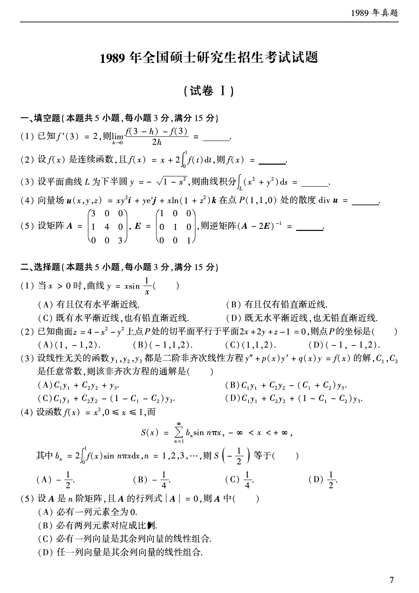
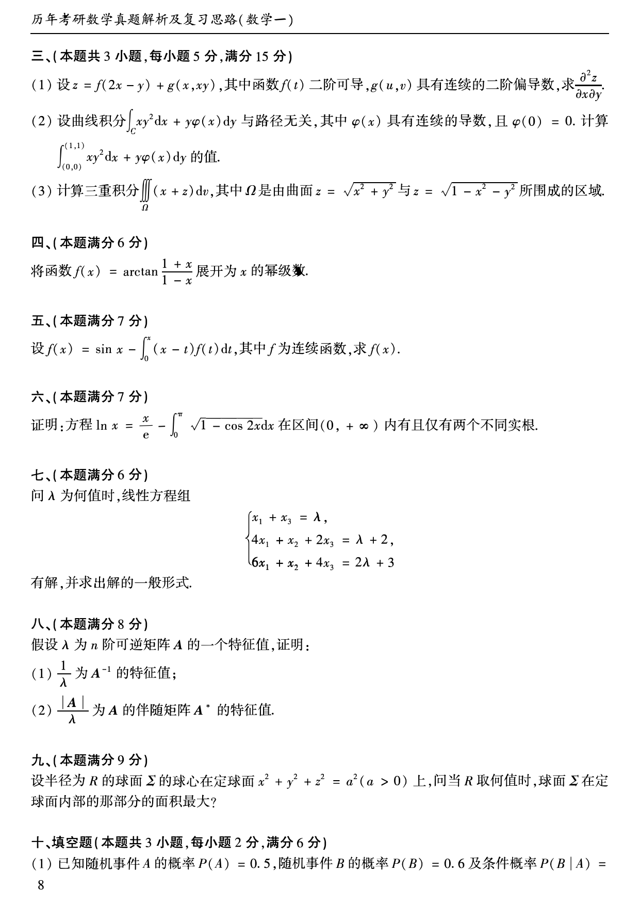
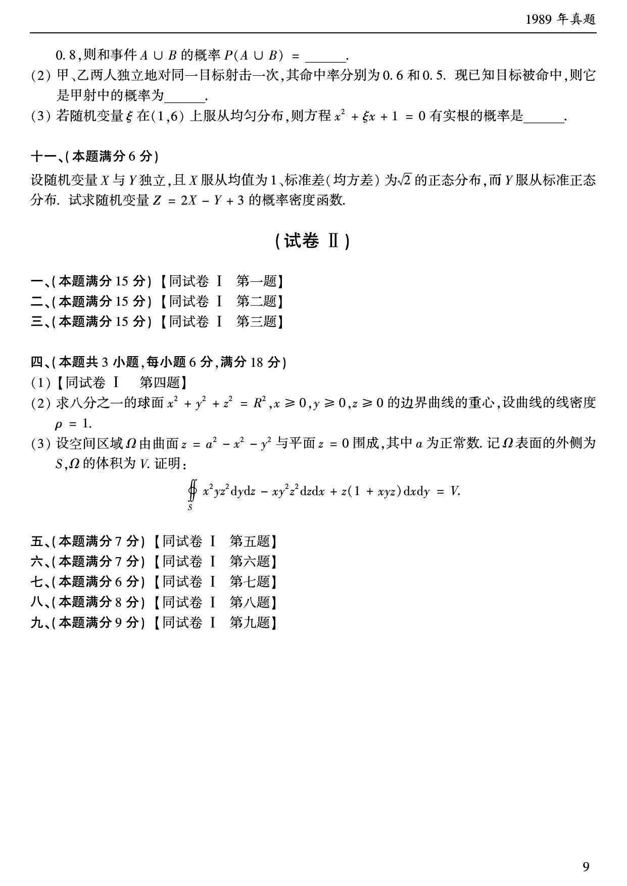

# 1989 年数学一真题

资料类型：考研数学一历年真题  
年份：1989  
科目：数学一  
来源 PDF：`D:\百度网盘\高数资料\【01】1987-2022年数学一真题（PDF）\【合集打印】1987-2009年考研数学一真题【 72页 】.pdf`  
整理状态：已按题干与答案页图像复核，已完成答案解析同步  

## 试卷 I

**第 1-10 题题图**

### 第 1 题

- 题型：填空题
- 题号：试卷 I 一(1)
- 分值：3
- 模块：高等数学
- 考点：导数定义
- PDF 页码：8
- 校对状态：已按题干与答案页图像复核

已知 $f'(3)=2$，则

$$
\lim_{h\to 0}\frac{f(3-h)-f(3)}{2h}=______。
$$

### 第 2 题

- 题型：填空题
- 题号：试卷 I 一(2)
- 分值：3
- 模块：高等数学
- 考点：积分方程
- PDF 页码：8
- 校对状态：已按题干与答案页图像复核

设 $f(x)$ 是连续函数，且

$$
f(x)=x+2\int_0^1 f(t)\,dt,
$$

则 $f(x)=$______。

### 第 3 题

- 题型：填空题
- 题号：试卷 I 一(3)
- 分值：3
- 模块：高等数学
- 考点：第一型曲线积分
- PDF 页码：8
- 校对状态：已按题干与答案页图像复核

设平面曲线 $L$ 为下半圆

$$
y=-\sqrt{1-x^2},
$$

则曲线积分

$$
\int_L (x^2+y^2)\,ds=______。
$$

### 第 4 题

- 题型：填空题
- 题号：试卷 I 一(4)
- 分值：3
- 模块：高等数学
- 考点：散度
- PDF 页码：8
- 校对状态：已按题干与答案页图像复核

向量场

$$
\boldsymbol{u}(x,y,z)=xy^2\boldsymbol{i}+ye^z\boldsymbol{j}+x\ln(1+z^2)\boldsymbol{k}
$$

在点 $P(1,1,0)$ 处的散度 $\operatorname{div}\boldsymbol{u}=$______。

### 第 5 题

- 题型：填空题
- 题号：试卷 I 一(5)
- 分值：3
- 模块：线性代数
- 考点：逆矩阵
- PDF 页码：8
- 校对状态：已按题干与答案页图像复核

设矩阵

$$
A=
\begin{pmatrix}
3&0&0\\
1&4&0\\
0&0&3
\end{pmatrix},
\quad
E=
\begin{pmatrix}
1&0&0\\
0&1&0\\
0&0&1
\end{pmatrix},
$$

则逆矩阵 $(A-2E)^{-1}=$______。

### 第 6 题

- 题型：选择题
- 题号：试卷 I 二(1)
- 分值：3
- 模块：高等数学
- 考点：渐近线
- PDF 页码：8
- 校对状态：已按题干与答案页图像复核

当 $x>0$ 时，曲线

$$
y=x\sin\frac{1}{x}
$$

（ ）

A. 有且仅有水平渐近线。  
B. 有且仅有铅直渐近线。  
C. 既有水平渐近线，也有铅直渐近线。  
D. 既无水平渐近线，也无铅直渐近线。

### 第 7 题

- 题型：选择题
- 题号：试卷 I 二(2)
- 分值：3
- 模块：高等数学
- 考点：曲面切平面
- PDF 页码：8
- 校对状态：已按题干与答案页图像复核

已知曲面

$$
z=4-x^2-y^2
$$

上点 $P$ 处的切平面平行于平面 $2x+2y+z-1=0$，则点 $P$ 的坐标是（ ）

A. $(1,-1,2)$。  
B. $(-1,1,2)$。  
C. $(1,1,2)$。  
D. $(-1,-1,2)$。

### 第 8 题

- 题型：选择题
- 题号：试卷 I 二(3)
- 分值：3
- 模块：高等数学
- 考点：二阶非齐次线性微分方程，通解结构
- PDF 页码：8
- 校对状态：已按题干与答案页图像复核

设线性无关的函数 $y_1,y_2,y_3$ 都是二阶非齐次线性方程

$$
y''+p(x)y'+q(x)y=f(x)
$$

的解，$C_1,C_2$ 是任意常数，则该非齐次方程的通解是（ ）

A. $C_1y_1+C_2y_2+y_3$。  
B. $C_1y_1+C_2y_2-(C_1+C_2)y_3$。  
C. $C_1y_1+C_2y_2-(1-C_1-C_2)y_3$。  
D. $C_1y_1+C_2y_2+(1-C_1-C_2)y_3$。

### 第 9 题

- 题型：选择题
- 题号：试卷 I 二(4)
- 分值：3
- 模块：高等数学
- 考点：傅里叶正弦级数
- PDF 页码：8
- 校对状态：已按题干与答案页图像复核

设函数 $f(x)=x^2,\ 0\le x\le 1$，而

$$
S(x)=\sum_{n=1}^{\infty}b_n\sin n\pi x,\quad -\infty<x<+\infty,
$$

其中

$$
b_n=2\int_0^1 f(x)\sin n\pi x\,dx,\quad n=1,2,3,\cdots,
$$

则 $S\left(-\dfrac{1}{2}\right)$ 等于（ ）

A. $-\dfrac{1}{2}$。  
B. $-\dfrac{1}{4}$。  
C. $\dfrac{1}{4}$。  
D. $\dfrac{1}{2}$。

### 第 10 题

- 题型：选择题
- 题号：试卷 I 二(5)
- 分值：3
- 模块：线性代数
- 考点：行列式，列向量线性相关
- PDF 页码：8
- 校对状态：已按题干与答案页图像复核

设 $A$ 是 $n$ 阶矩阵，且 $A$ 的行列式 $|A|=0$，则 $A$ 中（ ）

A. 必有一列元素全为 0。  
B. 必有两列元素对应成比例。  
C. 必有一列向量是其余列向量的线性组合。  
D. 任一列向量是其余列向量的线性组合。

**第 11-20 题题图**

### 第 11 题

- 题型：解答题
- 题号：试卷 I 三(1)
- 分值：5
- 模块：高等数学
- 考点：多元复合函数二阶偏导数
- PDF 页码：9
- 校对状态：已按题干与答案页图像复核

设

$$
z=f(2x-y)+g(x,xy),
$$

其中函数 $f(t)$ 二阶可导，$g(u,v)$ 具有连续的二阶偏导数，求

$$
\frac{\partial^2z}{\partial x\partial y}.
$$

### 第 12 题

- 题型：解答题
- 题号：试卷 I 三(2)
- 分值：5
- 模块：高等数学
- 考点：曲线积分与路径无关
- PDF 页码：9
- 校对状态：已按题干与答案页图像复核

设曲线积分

$$
\int_C xy^2\,dx+y\varphi(x)\,dy
$$

与路径无关，其中 $\varphi(x)$ 具有连续的导数，且 $\varphi(0)=0$。计算

$$
\int_{(0,0)}^{(1,1)}xy^2\,dx+y\varphi(x)\,dy
$$

的值。

### 第 13 题

- 题型：解答题
- 题号：试卷 I 三(3)
- 分值：5
- 模块：高等数学
- 考点：三重积分
- PDF 页码：9
- 校对状态：已按题干与答案页图像复核

计算三重积分

$$
\iiint_{\Omega}(x+z)\,dv,
$$

其中 $\Omega$ 是由曲面

$$
z=\sqrt{x^2+y^2}
$$

与

$$
z=\sqrt{1-x^2-y^2}
$$

所围成的区域。

### 第 14 题

- 题型：解答题
- 题号：试卷 I 四
- 分值：6
- 模块：高等数学
- 考点：幂级数展开
- PDF 页码：9
- 校对状态：已按题干与答案页图像复核

将函数

$$
f(x)=\arctan\frac{1+x}{1-x}
$$

展开为 $x$ 的幂级数。

### 第 15 题

- 题型：解答题
- 题号：试卷 I 五
- 分值：7
- 模块：高等数学
- 考点：积分方程，微分方程
- PDF 页码：9
- 校对状态：已按题干与答案页图像复核

设

$$
f(x)=\sin x-\int_0^x (x-t)f(t)\,dt,
$$

其中 $f$ 为连续函数，求 $f(x)$。

### 第 16 题

- 题型：证明题
- 题号：试卷 I 六
- 分值：7
- 模块：高等数学
- 考点：方程根的存在性
- PDF 页码：9
- 校对状态：已按题干与答案页图像复核

证明：方程

$$
\ln x=\frac{x}{e}-\int_0^\pi\sqrt{1-\cos 2t}\,dt
$$

在区间 $(0,+\infty)$ 内有且仅有两个不同实根。

### 第 17 题

- 题型：解答题
- 题号：试卷 I 七
- 分值：6
- 模块：线性代数
- 考点：线性方程组，参数讨论
- PDF 页码：9
- 校对状态：已按题干与答案页图像复核

问 $\lambda$ 为何值时，线性方程组

$$
\begin{cases}
x_1+x_3=\lambda,\\
4x_1+x_2+2x_3=\lambda+2,\\
6x_1+x_2+4x_3=2\lambda+3
\end{cases}
$$

有解，并求出解的一般形式。

### 第 18 题

- 题型：证明题
- 题号：试卷 I 八
- 分值：8
- 模块：线性代数
- 考点：特征值，逆矩阵，伴随矩阵
- PDF 页码：9
- 校对状态：已按题干与答案页图像复核

假设 $\lambda$ 为 $n$ 阶可逆矩阵 $A$ 的一个特征值，证明：

1. $\dfrac{1}{\lambda}$ 为 $A^{-1}$ 的特征值；
2. $\dfrac{|A|}{\lambda}$ 为 $A$ 的伴随矩阵 $A^*$ 的特征值。

### 第 19 题

- 题型：解答题
- 题号：试卷 I 九
- 分值：9
- 模块：高等数学
- 考点：空间几何，球面面积
- PDF 页码：9
- 校对状态：已按题干与答案页图像复核

设半径为 $R$ 的球面 $\Sigma$ 的球心在定球面

$$
x^2+y^2+z^2=a^2\quad(a>0)
$$

上，问当 $R$ 取何值时，球面 $\Sigma$ 在定球面内部的那部分的面积最大？

**第 20-23 题题图**

### 第 20 题

- 题型：填空题
- 题号：试卷 I 十(1)
- 分值：2
- 模块：概率统计
- 考点：条件概率
- PDF 页码：9-10
- 校对状态：已按题干与答案页图像复核

已知随机事件 $A$ 的概率 $P(A)=0.5$，随机事件 $B$ 的概率 $P(B)=0.6$ 及条件概率 $P(B\mid A)=0.8$，则和事件 $A\cup B$ 的概率

$$
P(A\cup B)=______。
$$

### 第 21 题

- 题型：填空题
- 题号：试卷 I 十(2)
- 分值：2
- 模块：概率统计
- 考点：条件概率
- PDF 页码：10
- 校对状态：已按题干与答案页图像复核

甲、乙两人独立地对同一目标射击一次，其命中率分别为 $0.6$ 和 $0.5$。现已知目标被命中，则它是甲射中的概率为______。

### 第 22 题

- 题型：填空题
- 题号：试卷 I 十(3)
- 分值：2
- 模块：概率统计
- 考点：几何概型，随机方程
- PDF 页码：10
- 校对状态：已按题干与答案页图像复核

若随机变量 $\xi$ 在 $(1,6)$ 上服从均匀分布，则方程

$$
x^2+\xi x+1=0
$$

有实根的概率是______。

### 第 23 题

- 题型：解答题
- 题号：试卷 I 十一
- 分值：6
- 模块：概率统计
- 考点：正态分布，随机变量线性组合
- PDF 页码：10
- 校对状态：已按题干与答案页图像复核

设随机变量 $X$ 与 $Y$ 独立，且 $X$ 服从均值为 1、标准差（均方差）为 $\sqrt{2}$ 的正态分布，而 $Y$ 服从标准正态分布。试求随机变量

$$
Z=2X-Y+3
$$

的概率密度函数。
