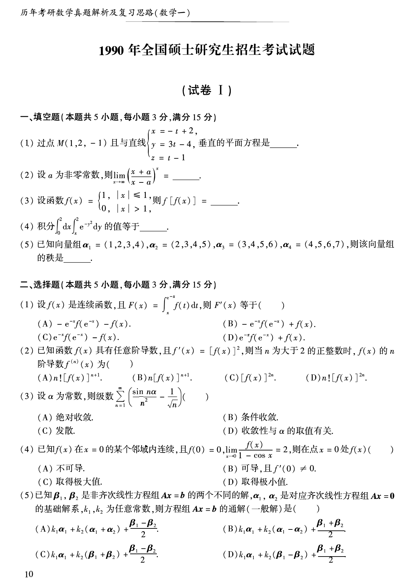
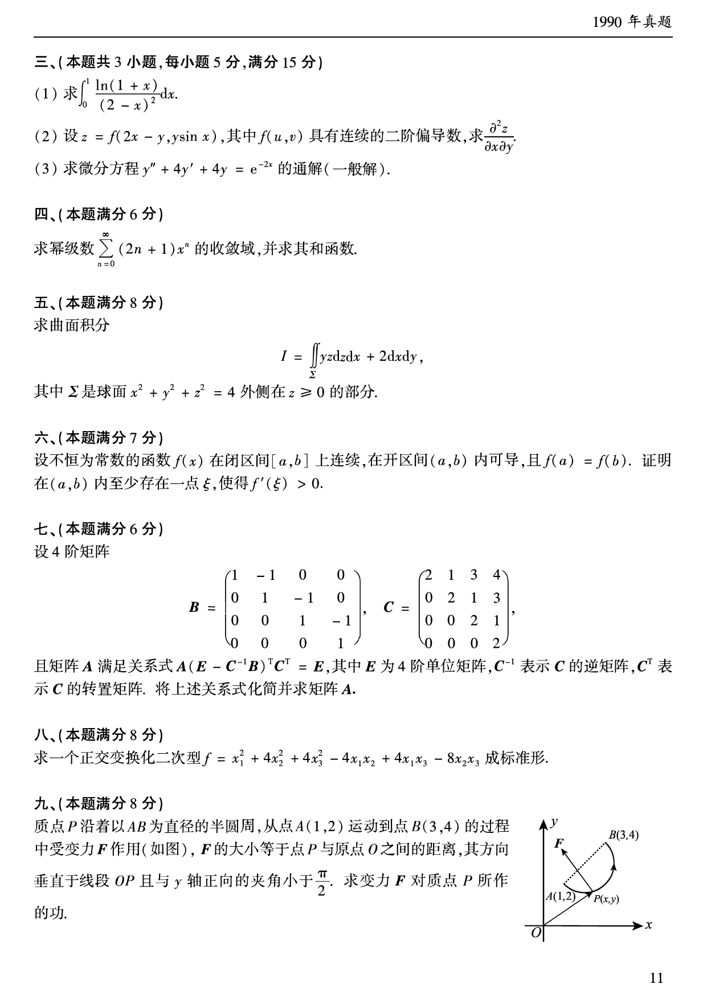
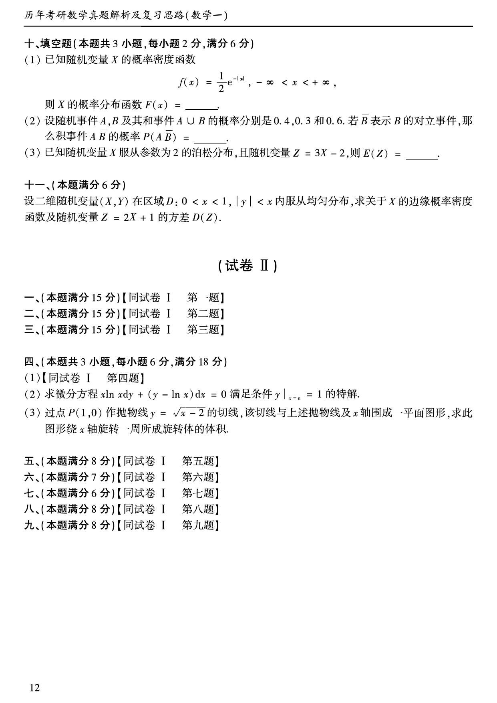

# 1990 年数学一真题

资料类型：考研数学一历年真题  
年份：1990  
科目：数学一  
来源 PDF：`D:\百度网盘\高数资料\【01】1987-2022年数学一真题（PDF）\【合集打印】1987-2009年考研数学一真题【 72页 】.pdf`  
整理状态：已按原卷页面图像完成校对，并与答案解析同步  

## 试卷 I

**第 1-10 题题图**

### 第 1 题

- 题型：填空题
- 题号：试卷 I 一(1)
- 分值：3
- 模块：高等数学
- 考点：空间解析几何，平面方程
- PDF 页码：11
- 校对状态：已校对

过点 $M(1,2,-1)$ 且与直线

$$
\begin{cases}
x=-t+2,\\
y=3t-4,\\
z=t-1
\end{cases}
$$

垂直的平面方程是______。

### 第 2 题

- 题型：填空题
- 题号：试卷 I 一(2)
- 分值：3
- 模块：高等数学
- 考点：重要极限
- PDF 页码：11
- 校对状态：已校对

设 $a$ 为非零常数，则

$$
\lim_{x\to\infty}\left(\frac{x+a}{x-a}\right)^x=______。
$$

### 第 3 题

- 题型：填空题
- 题号：试卷 I 一(3)
- 分值：3
- 模块：高等数学
- 考点：复合函数
- PDF 页码：11
- 校对状态：已校对

设函数

$$
f(x)=
\begin{cases}
1,&|x|\le 1,\\
0,&|x|>1,
\end{cases}
$$

则 $f[f(x)]=$______。

### 第 4 题

- 题型：填空题
- 题号：试卷 I 一(4)
- 分值：3
- 模块：高等数学
- 考点：二重积分，交换积分次序
- PDF 页码：11
- 校对状态：已校对

积分

$$
\int_0^2 dx\int_x^2 e^{-y^2}\,dy
$$

的值等于______。

### 第 5 题

- 题型：填空题
- 题号：试卷 I 一(5)
- 分值：3
- 模块：线性代数
- 考点：向量组的秩
- PDF 页码：11
- 校对状态：已校对

已知向量组

$$
\alpha_1=(1,2,3,4),\quad
\alpha_2=(2,3,4,5),\quad
\alpha_3=(3,4,5,6),\quad
\alpha_4=(4,5,6,7),
$$

则该向量组的秩是______。

### 第 6 题

- 题型：选择题
- 题号：试卷 I 二(1)
- 分值：3
- 模块：高等数学
- 考点：变限积分求导
- PDF 页码：11
- 校对状态：已校对

设 $f(x)$ 是连续函数，且

$$
F(x)=\int_x^{e^{-x}}f(t)\,dt,
$$

则 $F'(x)$ 等于（ ）

A. $-e^{-x}f(e^{-x})-f(x)$。  
B. $-e^{-x}f(e^{-x})+f(x)$。  
C. $e^{-x}f(e^{-x})-f(x)$。  
D. $e^{-x}f(e^{-x})+f(x)$。

### 第 7 题

- 题型：选择题
- 题号：试卷 I 二(2)
- 分值：3
- 模块：高等数学
- 考点：高阶导数
- PDF 页码：11
- 校对状态：已校对

已知函数 $f(x)$ 具有任意阶导数，且

$$
f'(x)=[f(x)]^2,
$$

则当 $n$ 为大于 2 的正整数时，$f(x)$ 的 $n$ 阶导数 $f^{(n)}(x)$ 为（ ）

A. $n![f(x)]^{n+1}$。  
B. $n[f(x)]^{n+1}$。  
C. $[f(x)]^{2n}$。  
D. $n![f(x)]^{2n}$。

### 第 8 题

- 题型：选择题
- 题号：试卷 I 二(3)
- 分值：3
- 模块：高等数学
- 考点：级数敛散性
- PDF 页码：11
- 校对状态：已校对

设 $\alpha$ 为常数，则级数

$$
\sum_{n=1}^{\infty}\left(\frac{\sin n\alpha}{n^2}-\frac{1}{\sqrt{n}}\right)
$$

（ ）

A. 绝对收敛。  
B. 条件收敛。  
C. 发散。  
D. 收敛性与 $\alpha$ 的取值有关。

### 第 9 题

- 题型：选择题
- 题号：试卷 I 二(4)
- 分值：3
- 模块：高等数学
- 考点：极限，极值
- PDF 页码：11
- 校对状态：已校对

已知 $f(x)$ 在 $x=0$ 的某个邻域内连续，且 $f(0)=0$，

$$
\lim_{x\to 0}\frac{f(x)}{1-\cos x}=2,
$$

则在点 $x=0$ 处 $f(x)$（ ）

A. 不可导。  
B. 可导，且 $f'(0)\ne 0$。  
C. 取得极大值。  
D. 取得极小值。

### 第 10 题

- 题型：选择题
- 题号：试卷 I 二(5)
- 分值：3
- 模块：线性代数
- 考点：非齐次线性方程组通解
- PDF 页码：11
- 校对状态：已校对

已知 $\beta_1,\beta_2$ 是非齐次线性方程组 $Ax=b$ 的两个不同的解，$\alpha_1,\alpha_2$ 是对应齐次线性方程组 $Ax=0$ 的基础解系，$k_1,k_2$ 为任意常数，则方程组 $Ax=b$ 的通解（一般解）是（ ）

A. $k_1\alpha_1+k_2(\alpha_1+\alpha_2)+\dfrac{\beta_1-\beta_2}{2}$。  
B. $k_1\alpha_1+k_2(\alpha_1-\alpha_2)+\dfrac{\beta_1+\beta_2}{2}$。  
C. $k_1\alpha_1+k_2(\beta_1+\beta_2)+\dfrac{\beta_1-\beta_2}{2}$。  
D. $k_1\alpha_1+k_2(\beta_1-\beta_2)+\dfrac{\beta_1+\beta_2}{2}$。

**第 11-19 题题图**

### 第 11 题

- 题型：解答题
- 题号：试卷 I 三(1)
- 分值：5
- 模块：高等数学
- 考点：定积分
- PDF 页码：12
- 校对状态：已校对

求

$$
\int_0^1\frac{\ln(1+x)}{(2-x)^2}\,dx.
$$

### 第 12 题

- 题型：解答题
- 题号：试卷 I 三(2)
- 分值：5
- 模块：高等数学
- 考点：多元复合函数二阶偏导数
- PDF 页码：12
- 校对状态：已校对

设

$$
z=f(2x-y,y\sin x),
$$

其中 $f(u,v)$ 具有连续的二阶偏导数，求

$$
\frac{\partial^2z}{\partial x\partial y}.
$$

### 第 13 题

- 题型：解答题
- 题号：试卷 I 三(3)
- 分值：5
- 模块：高等数学
- 考点：常系数线性微分方程
- PDF 页码：12
- 校对状态：已校对

求微分方程

$$
y''+4y'+4y=e^{-2x}
$$

的通解（一般解）。

### 第 14 题

- 题型：解答题
- 题号：试卷 I 四
- 分值：6
- 模块：高等数学
- 考点：幂级数，和函数
- PDF 页码：12
- 校对状态：已校对

求幂级数

$$
\sum_{n=0}^{\infty}(2n+1)x^n
$$

的收敛域，并求其和函数。

### 第 15 题

- 题型：解答题
- 题号：试卷 I 五
- 分值：8
- 模块：高等数学
- 考点：第二型曲面积分
- PDF 页码：12
- 校对状态：已校对

求曲面积分

$$
I=\iint_{\Sigma}yz\,dz\,dx+2\,dx\,dy,
$$

其中 $\Sigma$ 是球面 $x^2+y^2+z^2=4$ 外侧在 $z\ge 0$ 的部分。

### 第 16 题

- 题型：证明题
- 题号：试卷 I 六
- 分值：7
- 模块：高等数学
- 考点：罗尔定理，导数存在性
- PDF 页码：12
- 校对状态：已校对

设不恒为常数的函数 $f(x)$ 在闭区间 $[a,b]$ 上连续，在开区间 $(a,b)$ 内可导，且 $f(a)=f(b)$。证明在 $(a,b)$ 内至少存在一点 $\xi$，使得 $f'(\xi)>0$。

### 第 17 题

- 题型：解答题
- 题号：试卷 I 七
- 分值：6
- 模块：线性代数
- 考点：矩阵运算，逆矩阵
- PDF 页码：12
- 校对状态：已校对

设 4 阶矩阵

$$
B=
\begin{pmatrix}
1&-1&0&0\\
0&1&-1&0\\
0&0&1&-1\\
0&0&0&1
\end{pmatrix},
\quad
C=
\begin{pmatrix}
2&1&3&4\\
0&2&1&3\\
0&0&2&1\\
0&0&0&2
\end{pmatrix},
$$

且矩阵 $A$ 满足关系式

$$
A(E-C^{-1}B)^TC^T=E,
$$

其中 $E$ 为 4 阶单位矩阵，$C^{-1}$ 表示 $C$ 的逆矩阵，$C^T$ 表示 $C$ 的转置矩阵。将上述关系式化简并求矩阵 $A$。

### 第 18 题

- 题型：解答题
- 题号：试卷 I 八
- 分值：8
- 模块：线性代数
- 考点：二次型，正交变换
- PDF 页码：12
- 校对状态：已校对

求一个正交变换化二次型

$$
f=x_1^2+4x_2^2+4x_3^2-4x_1x_2+4x_1x_3-8x_2x_3
$$

成标准形。

### 第 19 题

- 题型：解答题
- 题号：试卷 I 九
- 分值：8
- 模块：高等数学
- 考点：曲线积分，变力做功
- PDF 页码：12
- 校对状态：已校对

质点 $P$ 沿着以 $AB$ 为直径的半圆周，从点 $A(1,2)$ 运动到点 $B(3,4)$ 的过程中受变力 $F$ 作用（如图），$F$ 的大小等于点 $P$ 与原点 $O$ 之间的距离，其方向垂直于线段 $OP$ 且与 $y$ 轴正向的夹角小于 $\dfrac{\pi}{2}$。求变力 $F$ 对质点 $P$ 所作的功。

**第 20-23 题题图**

### 第 20 题

- 题型：填空题
- 题号：试卷 I 十(1)
- 分值：2
- 模块：概率统计
- 考点：概率分布函数
- PDF 页码：13
- 校对状态：已校对

已知随机变量 $X$ 的概率密度函数

$$
f(x)=\frac{1}{2}e^{-|x|},\quad -\infty<x<+\infty,
$$

则 $X$ 的概率分布函数 $F(x)=$______。

### 第 21 题

- 题型：填空题
- 题号：试卷 I 十(2)
- 分值：2
- 模块：概率统计
- 考点：事件概率
- PDF 页码：13
- 校对状态：已校对

设随机事件 $A,B$ 及其和事件 $A\cup B$ 的概率分别是 $0.4,0.3$ 和 $0.6$。若 $\overline{B}$ 表示 $B$ 的对立事件，那么积事件 $A\overline{B}$ 的概率

$$
P(A\overline{B})=______。
$$

### 第 22 题

- 题型：填空题
- 题号：试卷 I 十(3)
- 分值：2
- 模块：概率统计
- 考点：泊松分布，数学期望
- PDF 页码：13
- 校对状态：已校对

已知随机变量 $X$ 服从参数为 2 的泊松分布，且随机变量 $Z=3X-2$，则

$$
E(Z)=______。
$$

### 第 23 题

- 题型：解答题
- 题号：试卷 I 十一
- 分值：6
- 模块：概率统计
- 考点：二维均匀分布，边缘密度，方差
- PDF 页码：13
- 校对状态：已校对

设二维随机变量 $(X,Y)$ 在区域

$$
D:\ 0<x<1,\quad |y|<x
$$

内服从均匀分布，求关于 $X$ 的边缘概率密度函数及随机变量 $Z=2X+1$ 的方差 $D(Z)$。
