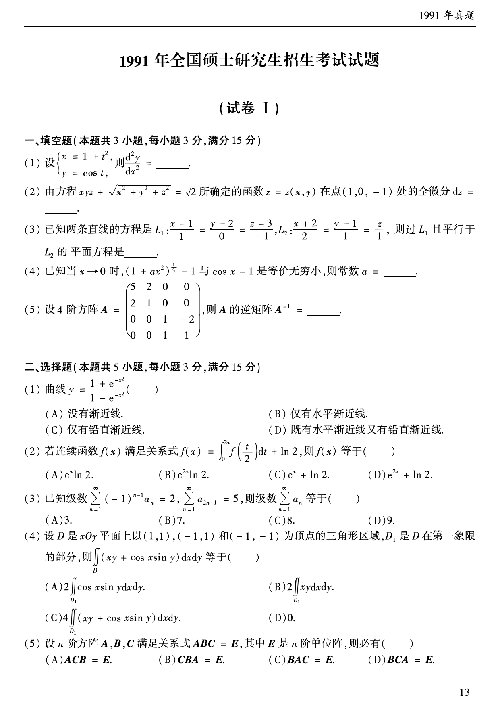
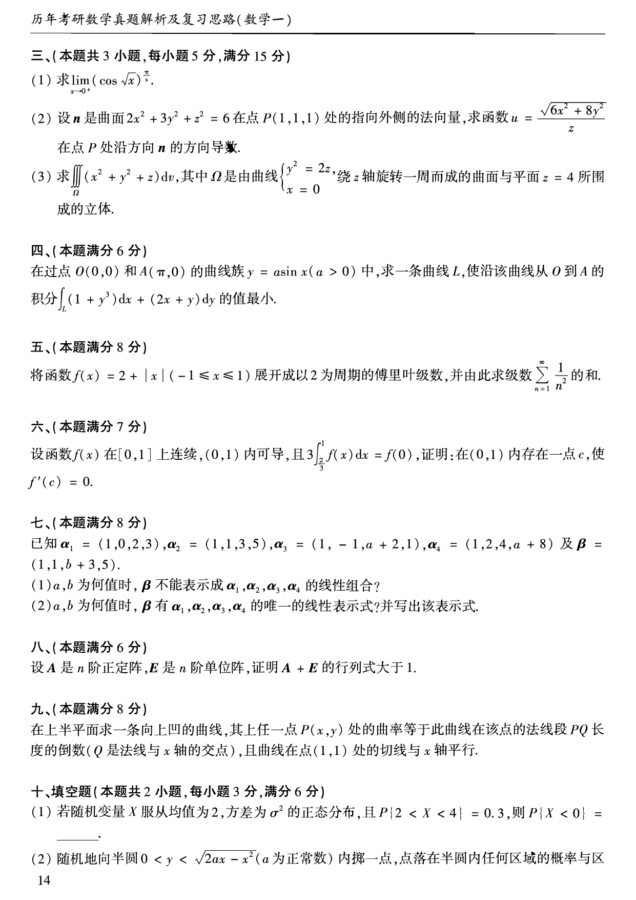
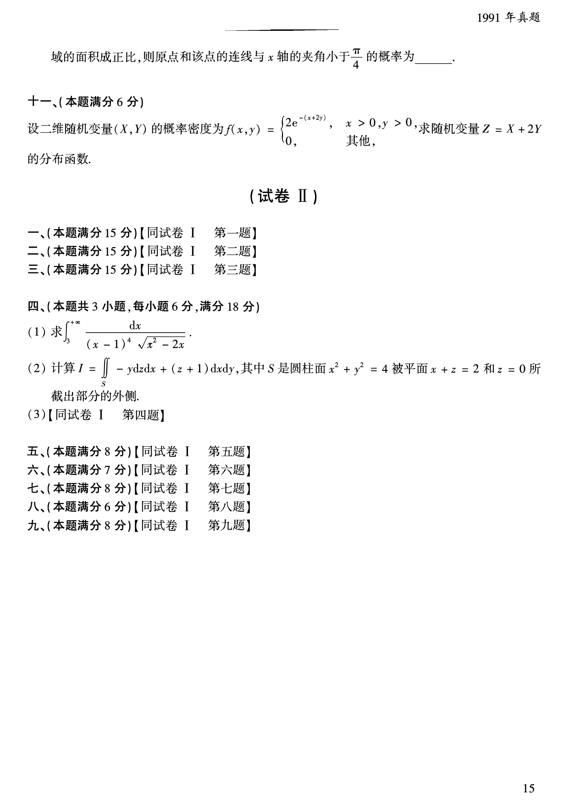

# 1991 年数学一真题

资料类型：考研数学一历年真题  
年份：1991  
科目：数学一  
来源 PDF：`D:\百度网盘\高数资料\【01】1987-2022年数学一真题（PDF）\【合集打印】1987-2009年考研数学一真题【 72页 】.pdf`  
整理状态：已按 PDF 页面图像人工视觉识别，待二次校对  

## 试卷 I

**第 1-10 题题图**

### 第 1 题

- 题型：填空题
- 题号：试卷 I 一(1)
- 分值：3
- PDF 页码：14
- 校对状态：人工视觉识别，待二次校对

设

$$
\begin{cases}
x=1+t^2,\\
y=\cos t,
\end{cases}
$$

则

$$
\frac{d^2y}{dx^2}=______。
$$

### 第 2 题

- 题型：填空题
- 题号：试卷 I 一(2)
- 分值：3
- PDF 页码：14
- 校对状态：人工视觉识别，待二次校对

由方程

$$
xyz+\sqrt{x^2+y^2+z^2}=\sqrt{2}
$$

所确定的函数 $z=z(x,y)$ 在点 $(1,0,-1)$ 处的全微分 $dz=$______。

### 第 3 题

- 题型：填空题
- 题号：试卷 I 一(3)
- 分值：3
- PDF 页码：14
- 校对状态：人工视觉识别，待二次校对

已知两条直线的方程是

$$
L_1:\frac{x-1}{1}=\frac{y-2}{0}=\frac{z-3}{-1},
\quad
L_2:\frac{x+2}{2}=\frac{y-1}{1}=\frac{z}{1},
$$

则过 $L_1$ 且平行于 $L_2$ 的平面方程是______。

### 第 4 题

- 题型：填空题
- 题号：试卷 I 一(4)
- 分值：3
- PDF 页码：14
- 校对状态：人工视觉识别，待二次校对

已知当 $x\to 0$ 时，$(1+ax^2)^{1/3}-1$ 与 $\cos x-1$ 是等价无穷小，则常数 $a=$______。

### 第 5 题

- 题型：填空题
- 题号：试卷 I 一(5)
- 分值：3
- PDF 页码：14
- 校对状态：人工视觉识别，待二次校对

设 4 阶方阵

$$
A=
\begin{pmatrix}
5&2&0&0\\
2&1&0&0\\
0&0&1&-2\\
0&0&1&1
\end{pmatrix},
$$

则 $A$ 的逆矩阵 $A^{-1}=$______。

### 第 6 题

- 题型：选择题
- 题号：试卷 I 二(1)
- 分值：3
- PDF 页码：14
- 校对状态：人工视觉识别，待二次校对

曲线

$$
y=\frac{1+e^{-x^2}}{1-e^{-x^2}}
$$

（ ）

A. 没有渐近线。  
B. 仅有水平渐近线。  
C. 仅有铅直渐近线。  
D. 既有水平渐近线又有铅直渐近线。

### 第 7 题

- 题型：选择题
- 题号：试卷 I 二(2)
- 分值：3
- PDF 页码：14
- 校对状态：人工视觉识别，待二次校对

若连续函数 $f(x)$ 满足关系式

$$
f(x)=\int_0^{2x}f\left(\frac{t}{2}\right)\,dt+\ln 2,
$$

则 $f(x)$ 等于（ ）

A. $e^x\ln 2$。  
B. $e^{2x}\ln 2$。  
C. $e^x+\ln 2$。  
D. $e^{2x}+\ln 2$。

### 第 8 题

- 题型：选择题
- 题号：试卷 I 二(3)
- 分值：3
- PDF 页码：14
- 校对状态：人工视觉识别，待二次校对

已知级数

$$
\sum_{n=1}^{\infty}(-1)^{n-1}a_n=2,
\quad
\sum_{n=1}^{\infty}a_{2n-1}=5,
$$

则级数 $\displaystyle\sum_{n=1}^{\infty}a_n$ 等于（ ）

A. $3$。  
B. $7$。  
C. $8$。  
D. $9$。

### 第 9 题

- 题型：选择题
- 题号：试卷 I 二(4)
- 分值：3
- PDF 页码：14
- 校对状态：人工视觉识别，待二次校对

设 $D$ 是 $xOy$ 平面上以 $(1,1),(-1,1)$ 和 $(-1,-1)$ 为顶点的三角形区域，$D_1$ 是 $D$ 在第一象限的部分，则

$$
\iint_D (xy+\cos x\sin y)\,dx\,dy
$$

等于（ ）

A. $2\displaystyle\iint_{D_1}\cos x\sin y\,dx\,dy$。  
B. $2\displaystyle\iint_{D_1}xy\,dx\,dy$。  
C. $4\displaystyle\iint_{D_1}(xy+\cos x\sin y)\,dx\,dy$。  
D. $0$。

### 第 10 题

- 题型：选择题
- 题号：试卷 I 二(5)
- 分值：3
- PDF 页码：14
- 校对状态：人工视觉识别，待二次校对

设 $n$ 阶方阵 $A,B,C$ 满足关系式 $ABC=E$，其中 $E$ 是 $n$ 阶单位阵，则必有（ ）

A. $ACB=E$。  
B. $CBA=E$。  
C. $BAC=E$。  
D. $BCA=E$。

**第 11-21 题题图**

### 第 11 题

- 题型：解答题
- 题号：试卷 I 三(1)
- 分值：5
- PDF 页码：15
- 校对状态：人工视觉识别，待二次校对

求

$$
\lim_{x\to 0^+}(\cos\sqrt{x})^{\pi/x}.
$$

### 第 12 题

- 题型：解答题
- 题号：试卷 I 三(2)
- 分值：5
- PDF 页码：15
- 校对状态：人工视觉识别，待二次校对

设 $\boldsymbol{n}$ 是曲面

$$
2x^2+3y^2+z^2=6
$$

在点 $P(1,1,1)$ 处的指向外侧的法向量，求函数

$$
u=\frac{\sqrt{6x^2+8y^2}}{z}
$$

在点 $P$ 处沿方向 $\boldsymbol{n}$ 的方向导数。

### 第 13 题

- 题型：解答题
- 题号：试卷 I 三(3)
- 分值：5
- PDF 页码：15
- 校对状态：人工视觉识别，待二次校对

求

$$
\iiint_{\Omega}(x^2+y^2+z)\,dv,
$$

其中 $\Omega$ 是由曲线

$$
\begin{cases}
y^2=2z,\\
x=0
\end{cases}
$$

绕 $z$ 轴旋转一周而成的曲面与平面 $z=4$ 所围成的立体。

### 第 14 题

- 题型：解答题
- 题号：试卷 I 四
- 分值：6
- PDF 页码：15
- 校对状态：人工视觉识别，待二次校对

在过点 $O(0,0)$ 和 $A(\pi,0)$ 的曲线族 $y=a\sin x\ (a>0)$ 中，求一条曲线 $L$，使沿该曲线从 $O$ 到 $A$ 的积分

$$
\int_L (1+y^3)\,dx+(2x+y)\,dy
$$

的值最小。

### 第 15 题

- 题型：解答题
- 题号：试卷 I 五
- 分值：8
- PDF 页码：15
- 校对状态：人工视觉识别，待二次校对

将函数

$$
f(x)=2+|x|\quad(-1\le x\le 1)
$$

展开成以 2 为周期的傅里叶级数，并由此求级数

$$
\sum_{n=1}^{\infty}\frac{1}{n^2}
$$

的和。

### 第 16 题

- 题型：证明题
- 题号：试卷 I 六
- 分值：7
- PDF 页码：15
- 校对状态：人工视觉识别，待二次校对

设函数 $f(x)$ 在 $[0,1]$ 上连续，$(0,1)$ 内可导，且

$$
3\int_{2/3}^{1}f(x)\,dx=f(0),
$$

证明：在 $(0,1)$ 内存在一点 $c$，使 $f'(c)=0$。

### 第 17 题

- 题型：解答题
- 题号：试卷 I 七
- 分值：8
- PDF 页码：15
- 校对状态：人工视觉识别，待二次校对

已知

$$
\alpha_1=(1,0,2,3),\quad
\alpha_2=(1,1,3,5),\quad
\alpha_3=(1,-1,a+2,1),
\quad
\alpha_4=(1,2,4,a+8)
$$

及

$$
\beta=(1,1,b+3,5).
$$

1. $a,b$ 为何值时，$\beta$ 不能表示成 $\alpha_1,\alpha_2,\alpha_3,\alpha_4$ 的线性组合？
2. $a,b$ 为何值时，$\beta$ 有 $\alpha_1,\alpha_2,\alpha_3,\alpha_4$ 的唯一的线性表示式？并写出该表示式。

### 第 18 题

- 题型：证明题
- 题号：试卷 I 八
- 分值：6
- PDF 页码：15
- 校对状态：人工视觉识别，待二次校对

设 $A$ 是 $n$ 阶正定阵，$E$ 是 $n$ 阶单位阵，证明 $A+E$ 的行列式大于 1。

### 第 19 题

- 题型：解答题
- 题号：试卷 I 九
- 分值：8
- PDF 页码：15
- 校对状态：人工视觉识别，待二次校对

在上半平面求一条向上凹的曲线，其上任一点 $P(x,y)$ 处的曲率等于此曲线在该点的法线段 $PQ$ 长度的倒数（$Q$ 是法线与 $x$ 轴的交点），且曲线在点 $(1,1)$ 处的切线与 $x$ 轴平行。

### 第 20 题

- 题型：填空题
- 题号：试卷 I 十(1)
- 分值：3
- PDF 页码：15
- 校对状态：人工视觉识别，待二次校对

若随机变量 $X$ 服从均值为 2、方差为 $\sigma^2$ 的正态分布，且

$$
P\{2<X<4\}=0.3,
$$

则 $P\{X<0\}=$______。

**第 21-22 题题图**

### 第 21 题

- 题型：填空题
- 题号：试卷 I 十(2)
- 分值：3
- PDF 页码：15-16
- 校对状态：人工视觉识别，待二次校对

随机地向半圆

$$
0<y<\sqrt{2ax-x^2}\quad(a\text{ 为正常数})
$$

内掷一点，点落在半圆内任何区域的概率与区域的面积成正比，则原点和该点的连线与 $x$ 轴的夹角小于 $\dfrac{\pi}{4}$ 的概率为______。

### 第 22 题

- 题型：解答题
- 题号：试卷 I 十一
- 分值：6
- PDF 页码：16
- 校对状态：人工视觉识别，待二次校对

设二维随机变量 $(X,Y)$ 的概率密度为

$$
f(x,y)=
\begin{cases}
2e^{-(x+2y)},&x>0,\ y>0,\\
0,&\text{其他},
\end{cases}
$$

求随机变量 $Z=X+2Y$ 的分布函数。
