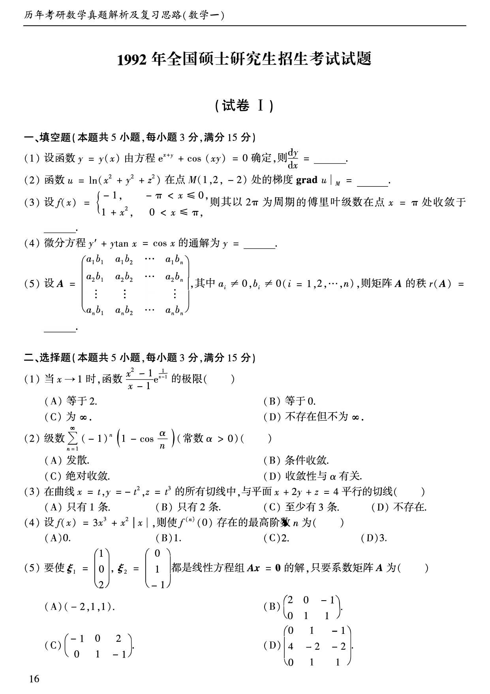
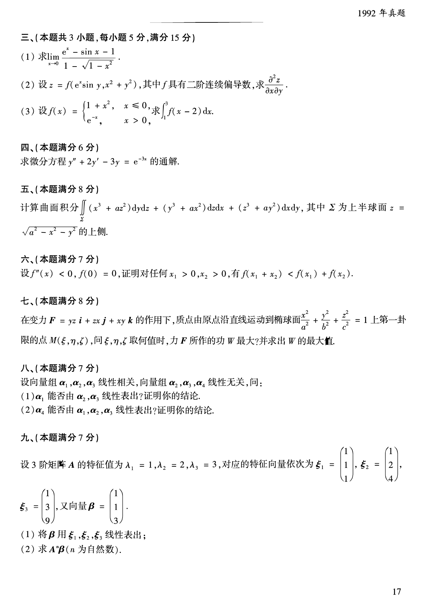
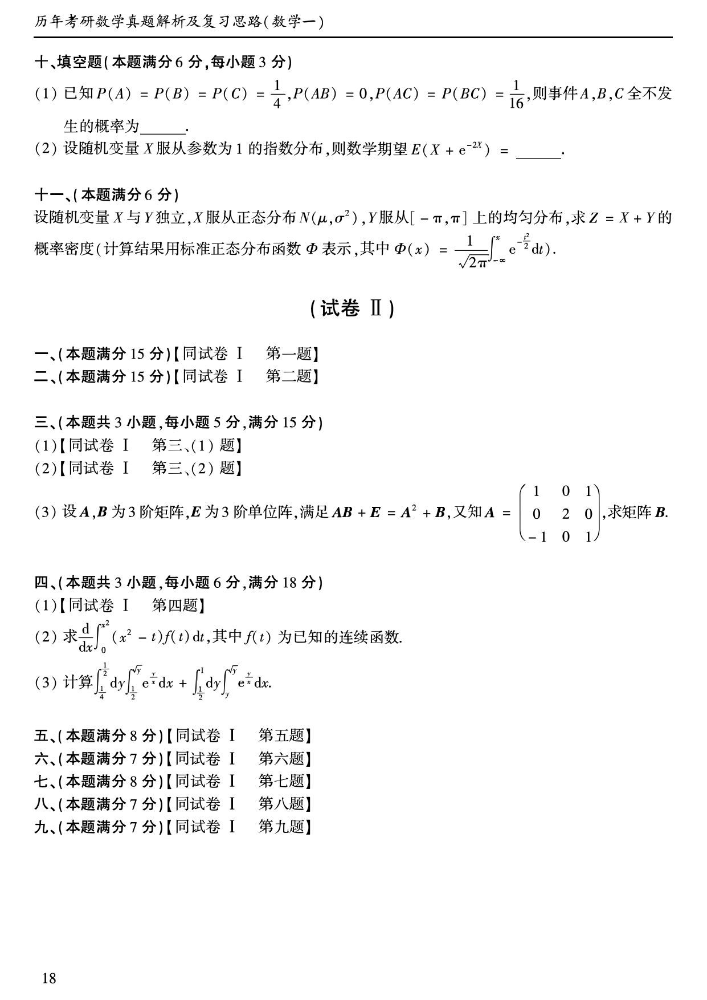

# 1992 年数学一真题

资料类型：考研数学一历年真题  
年份：1992  
科目：数学一  
来源 PDF：`D:\百度网盘\高数资料\【01】1987-2022年数学一真题（PDF）\【合集打印】1987-2009年考研数学一真题【 72页 】.pdf`  
整理状态：已按 PDF 页面图像人工视觉识别，待二次校对  

## 试卷 I

**第 1-10 题题图**

### 第 1 题

- 题型：填空题
- 题号：试卷 I 一(1)
- 分值：3
- PDF 页码：17
- 校对状态：人工视觉识别，待二次校对

设函数 $y=y(x)$ 由方程

$$
e^{x+y}+\cos(xy)=0
$$

确定，则 $\dfrac{dy}{dx}=$______。

### 第 2 题

- 题型：填空题
- 题号：试卷 I 一(2)
- 分值：3
- PDF 页码：17
- 校对状态：人工视觉识别，待二次校对

函数

$$
u=\ln(x^2+y^2+z^2)
$$

在点 $M(1,2,-2)$ 处的梯度

$$
\operatorname{grad}u\big|_M=______。
$$

### 第 3 题

- 题型：填空题
- 题号：试卷 I 一(3)
- 分值：3
- PDF 页码：17
- 校对状态：人工视觉识别，待二次校对

设

$$
f(x)=
\begin{cases}
-1,&-\pi<x\le 0,\\
1+x^2,&0<x\le \pi,
\end{cases}
$$

则其以 $2\pi$ 为周期的傅里叶级数在点 $x=\pi$ 处收敛于______。

### 第 4 题

- 题型：填空题
- 题号：试卷 I 一(4)
- 分值：3
- PDF 页码：17
- 校对状态：人工视觉识别，待二次校对

微分方程

$$
y'+y\tan x=\cos x
$$

的通解为 $y=$______。

### 第 5 题

- 题型：填空题
- 题号：试卷 I 一(5)
- 分值：3
- PDF 页码：17
- 校对状态：人工视觉识别，待二次校对

设

$$
A=
\begin{pmatrix}
a_1b_1&a_1b_2&\cdots&a_1b_n\\
a_2b_1&a_2b_2&\cdots&a_2b_n\\
\vdots&\vdots&&\vdots\\
a_nb_1&a_nb_2&\cdots&a_nb_n
\end{pmatrix},
$$

其中 $a_i\ne 0,\ b_i\ne 0\ (i=1,2,\cdots,n)$，则矩阵 $A$ 的秩 $r(A)=$______。

### 第 6 题

- 题型：选择题
- 题号：试卷 I 二(1)
- 分值：3
- PDF 页码：17
- 校对状态：人工视觉识别，待二次校对

当 $x\to 1$ 时，函数

$$
\frac{x^2-1}{x-1}e^{\frac{1}{x-1}}
$$

的极限（ ）

A. 等于 2。  
B. 等于 0。  
C. 为 $\infty$。  
D. 不存在但不为 $\infty$。

### 第 7 题

- 题型：选择题
- 题号：试卷 I 二(2)
- 分值：3
- PDF 页码：17
- 校对状态：人工视觉识别，待二次校对

级数

$$
\sum_{n=1}^{\infty}(-1)^n\left(1-\cos\frac{\alpha}{n}\right)
$$

（常数 $\alpha>0$）（ ）

A. 发散。  
B. 条件收敛。  
C. 绝对收敛。  
D. 收敛性与 $\alpha$ 有关。

### 第 8 题

- 题型：选择题
- 题号：试卷 I 二(3)
- 分值：3
- PDF 页码：17
- 校对状态：人工视觉识别，待二次校对

在曲线

$$
x=t,\quad y=-t^2,\quad z=t^3
$$

的所有切线中，与平面 $x+2y+z=4$ 平行的切线（ ）

A. 只有 1 条。  
B. 只有 2 条。  
C. 至少有 3 条。  
D. 不存在。

### 第 9 题

- 题型：选择题
- 题号：试卷 I 二(4)
- 分值：3
- PDF 页码：17
- 校对状态：人工视觉识别，待二次校对

设

$$
f(x)=3x^3+x^2|x|,
$$

则使 $f^{(n)}(0)$ 存在的最高阶数 $n$ 为（ ）

A. $0$。  
B. $1$。  
C. $2$。  
D. $3$。

### 第 10 题

- 题型：选择题
- 题号：试卷 I 二(5)
- 分值：3
- PDF 页码：17
- 校对状态：人工视觉识别，待二次校对

要使

$$
\xi_1=
\begin{pmatrix}
1\\0\\2
\end{pmatrix},
\quad
\xi_2=
\begin{pmatrix}
0\\1\\-1
\end{pmatrix}
$$

都是线性方程组 $Ax=0$ 的解，只要系数矩阵 $A$ 为（ ）

A. $\begin{pmatrix}-2&1&1\end{pmatrix}$。  
B. $\begin{pmatrix}2&0&-1\\0&1&1\end{pmatrix}$。  
C. $\begin{pmatrix}-1&0&2\\0&1&-1\end{pmatrix}$。  
D. $\begin{pmatrix}0&1&-1\\4&-2&-2\\0&1&1\end{pmatrix}$。

**第 11-19 题题图**

### 第 11 题

- 题型：解答题
- 题号：试卷 I 三(1)
- 分值：5
- PDF 页码：18
- 校对状态：人工视觉识别，待二次校对

求

$$
\lim_{x\to 0}\frac{e^x-\sin x-1}{1-\sqrt{1-x^2}}.
$$

### 第 12 题

- 题型：解答题
- 题号：试卷 I 三(2)
- 分值：5
- PDF 页码：18
- 校对状态：人工视觉识别，待二次校对

设

$$
z=f(e^x\sin y,x^2+y^2),
$$

其中 $f$ 具有二阶连续偏导数，求

$$
\frac{\partial^2z}{\partial x\partial y}.
$$

### 第 13 题

- 题型：解答题
- 题号：试卷 I 三(3)
- 分值：5
- PDF 页码：18
- 校对状态：人工视觉识别，待二次校对

设

$$
f(x)=
\begin{cases}
1+x^2,&x\le 0,\\
e^{-x},&x>0,
\end{cases}
$$

求

$$
\int_1^3 f(x-2)\,dx.
$$

### 第 14 题

- 题型：解答题
- 题号：试卷 I 四
- 分值：6
- PDF 页码：18
- 校对状态：人工视觉识别，待二次校对

求微分方程

$$
y''+2y'-3y=e^{-3x}
$$

的通解。

### 第 15 题

- 题型：解答题
- 题号：试卷 I 五
- 分值：8
- PDF 页码：18
- 校对状态：人工视觉识别，待二次校对

计算曲面积分

$$
\iint_{\Sigma}(x^3+az^2)\,dy\,dz+(y^3+ax^2)\,dz\,dx+(z^3+ay^2)\,dx\,dy,
$$

其中 $\Sigma$ 为上半球面

$$
z=\sqrt{a^2-x^2-y^2}
$$

的上侧。

### 第 16 题

- 题型：证明题
- 题号：试卷 I 六
- 分值：7
- PDF 页码：18
- 校对状态：人工视觉识别，待二次校对

设 $f''(x)<0,\ f(0)=0$，证明对任何 $x_1>0,\ x_2>0$，有

$$
f(x_1+x_2)<f(x_1)+f(x_2).
$$

### 第 17 题

- 题型：解答题
- 题号：试卷 I 七
- 分值：8
- PDF 页码：18
- 校对状态：人工视觉识别，待二次校对

在变力

$$
\boldsymbol{F}=yz\,\boldsymbol{i}+zx\,\boldsymbol{j}+xy\,\boldsymbol{k}
$$

的作用下，质点由原点沿直线运动到椭球面

$$
\frac{x^2}{a^2}+\frac{y^2}{b^2}+\frac{z^2}{c^2}=1
$$

上第一卦限的点 $M(\xi,\eta,\zeta)$，问 $\xi,\eta,\zeta$ 取何值时，力 $\boldsymbol{F}$ 所作的功 $W$ 最大？并求出 $W$ 的最大值。

### 第 18 题

- 题型：解答题
- 题号：试卷 I 八
- 分值：7
- PDF 页码：18
- 校对状态：人工视觉识别，待二次校对

设向量组 $\alpha_1,\alpha_2,\alpha_3$ 线性相关，向量组 $\alpha_2,\alpha_3,\alpha_4$ 线性无关，问：

1. $\alpha_1$ 能否由 $\alpha_2,\alpha_3$ 线性表示？证明你的结论。
2. $\alpha_4$ 能否由 $\alpha_1,\alpha_2,\alpha_3$ 线性表示？证明你的结论。

### 第 19 题

- 题型：解答题
- 题号：试卷 I 九
- 分值：7
- PDF 页码：18
- 校对状态：人工视觉识别，待二次校对

设 3 阶矩阵 $A$ 的特征值为 $\lambda_1=1,\lambda_2=2,\lambda_3=3$，对应的特征向量依次为

$$
\xi_1=
\begin{pmatrix}
1\\1\\1
\end{pmatrix},
\quad
\xi_2=
\begin{pmatrix}
1\\2\\4
\end{pmatrix},
\quad
\xi_3=
\begin{pmatrix}
1\\3\\9
\end{pmatrix},
$$

又向量

$$
\beta=
\begin{pmatrix}
1\\1\\3
\end{pmatrix}.
$$

1. 将 $\beta$ 用 $\xi_1,\xi_2,\xi_3$ 线性表示；
2. 求 $A^n\beta\ (n\text{ 为自然数})$。

**第 20-22 题题图**

### 第 20 题

- 题型：填空题
- 题号：试卷 I 十(1)
- 分值：3
- PDF 页码：19
- 校对状态：人工视觉识别，待二次校对

已知

$$
P(A)=P(B)=P(C)=\frac{1}{4},\quad P(AB)=0,\quad P(AC)=P(BC)=\frac{1}{16},
$$

则事件 $A,B,C$ 全不发生的概率为______。

### 第 21 题

- 题型：填空题
- 题号：试卷 I 十(2)
- 分值：3
- PDF 页码：19
- 校对状态：人工视觉识别，待二次校对

设随机变量 $X$ 服从参数为 1 的指数分布，则数学期望

$$
E(X+e^{-2X})=______。
$$

### 第 22 题

- 题型：解答题
- 题号：试卷 I 十一
- 分值：6
- PDF 页码：19
- 校对状态：人工视觉识别，待二次校对

设随机变量 $X$ 与 $Y$ 独立，$X$ 服从正态分布 $N(\mu,\sigma^2)$，$Y$ 服从 $[-\pi,\pi]$ 上的均匀分布，求 $Z=X+Y$ 的概率密度（计算结果用标准正态分布函数 $\Phi$ 表示，其中

$$
\Phi(x)=\frac{1}{\sqrt{2\pi}}\int_{-\infty}^x e^{-t^2/2}\,dt
$$

）。
