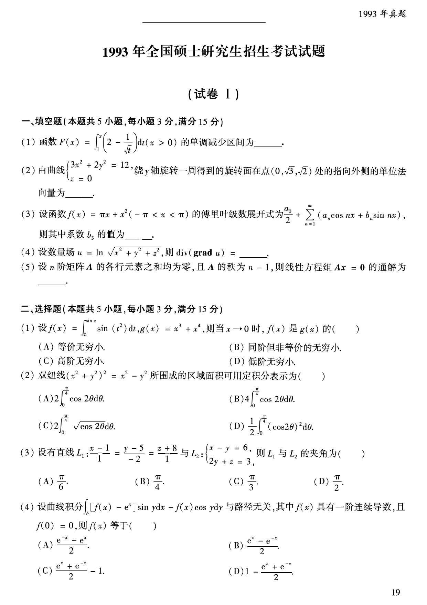
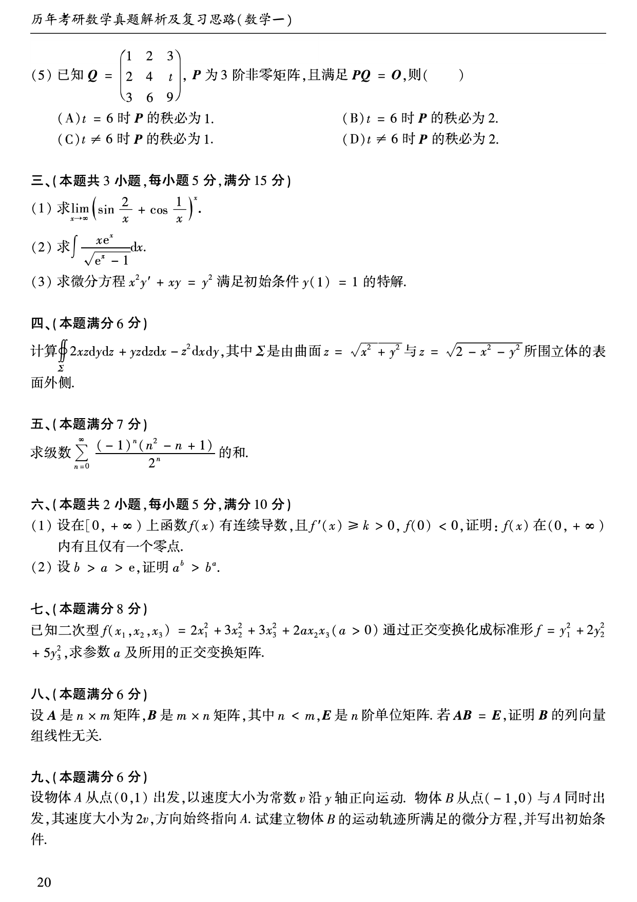
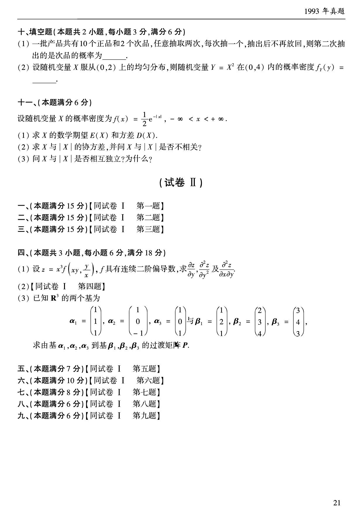

# 1993 年数学一真题

资料类型：考研数学一历年真题  
年份：1993  
科目：数学一  
来源 PDF：`D:\百度网盘\高数资料\【01】1987-2022年数学一真题（PDF）\【合集打印】1987-2009年考研数学一真题【 72页 】.pdf`  
整理状态：已按 PDF 页面图像人工视觉识别，待二次校对  

## 试卷 I

**第 1-9 题题图**

### 第 1 题

- 题型：填空题
- 题号：试卷 I 一(1)
- 分值：3
- PDF 页码：20
- 校对状态：人工视觉识别，待二次校对

函数

$$
F(x)=\int_1^x\left(2-\frac{1}{\sqrt{t}}\right)\,dt\quad(x>0)
$$

的单调减少区间为______。

### 第 2 题

- 题型：填空题
- 题号：试卷 I 一(2)
- 分值：3
- PDF 页码：20
- 校对状态：人工视觉识别，待二次校对

由曲线

$$
\begin{cases}
3x^2+2y^2=12,\\
z=0
\end{cases}
$$

绕 $y$ 轴旋转一周得到的旋转面在点 $(0,\sqrt{3},\sqrt{2})$ 处的指向外侧的单位法向量为______。

### 第 3 题

- 题型：填空题
- 题号：试卷 I 一(3)
- 分值：3
- PDF 页码：20
- 校对状态：人工视觉识别，待二次校对

设函数 $f(x)=\pi x+x^2\ (-\pi<x<\pi)$ 的傅里叶级数展开式为

$$
\frac{a_0}{2}+\sum_{n=1}^{\infty}(a_n\cos nx+b_n\sin nx),
$$

则其中系数 $b_3$ 的值为______。

### 第 4 题

- 题型：填空题
- 题号：试卷 I 一(4)
- 分值：3
- PDF 页码：20
- 校对状态：人工视觉识别，待二次校对

设数量场

$$
u=\ln\sqrt{x^2+y^2+z^2},
$$

则 $\operatorname{div}(\operatorname{grad}u)=$______。

### 第 5 题

- 题型：填空题
- 题号：试卷 I 一(5)
- 分值：3
- PDF 页码：20
- 校对状态：人工视觉识别，待二次校对

设 $n$ 阶矩阵 $A$ 的各行元素之和均为零，且 $A$ 的秩为 $n-1$，则线性方程组 $Ax=0$ 的通解为______。

### 第 6 题

- 题型：选择题
- 题号：试卷 I 二(1)
- 分值：3
- PDF 页码：20
- 校对状态：人工视觉识别，待二次校对

设

$$
f(x)=\int_0^{\sin x}\sin(t^2)\,dt,\quad g(x)=x^3+x^4,
$$

则当 $x\to 0$ 时，$f(x)$ 是 $g(x)$ 的（ ）

A. 等价无穷小。  
B. 同阶但非等价的无穷小。  
C. 高阶无穷小。  
D. 低阶无穷小。

### 第 7 题

- 题型：选择题
- 题号：试卷 I 二(2)
- 分值：3
- PDF 页码：20
- 校对状态：人工视觉识别，待二次校对

双纽线

$$
(x^2+y^2)^2=x^2-y^2
$$

所围成的区域面积可用定积分表示为（ ）

A. $2\displaystyle\int_0^{\pi/4}\cos 2\theta\,d\theta$。  
B. $4\displaystyle\int_0^{\pi/4}\cos 2\theta\,d\theta$。  
C. $2\displaystyle\int_0^{\pi/4}\sqrt{\cos 2\theta}\,d\theta$。  
D. $\dfrac{1}{2}\displaystyle\int_0^{\pi/4}(\cos 2\theta)^2\,d\theta$。

### 第 8 题

- 题型：选择题
- 题号：试卷 I 二(3)
- 分值：3
- PDF 页码：20
- 校对状态：人工视觉识别，待二次校对

设有直线

$$
L_1:\frac{x-1}{1}=\frac{y-5}{-2}=\frac{z+8}{1}
$$

与

$$
L_2:
\begin{cases}
x-y=6,\\
2y+z=3,
\end{cases}
$$

则 $L_1$ 与 $L_2$ 的夹角为（ ）

A. $\dfrac{\pi}{6}$。  
B. $\dfrac{\pi}{4}$。  
C. $\dfrac{\pi}{3}$。  
D. $\dfrac{\pi}{2}$。

### 第 9 题

- 题型：选择题
- 题号：试卷 I 二(4)
- 分值：3
- PDF 页码：20
- 校对状态：人工视觉识别，待二次校对

设曲线积分

$$
\int_L [f(x)-e^x]\sin y\,dx-f(x)\cos y\,dy
$$

与路径无关，其中 $f(x)$ 具有一阶连续导数，且 $f(0)=0$，则 $f(x)$ 等于（ ）

A. $\dfrac{e^{-x}-e^x}{2}$。  
B. $\dfrac{e^x-e^{-x}}{2}$。  
C. $\dfrac{e^x+e^{-x}}{2}-1$。  
D. $1-\dfrac{e^x+e^{-x}}{2}$。

**第 10-20 题题图**

### 第 10 题

- 题型：选择题
- 题号：试卷 I 二(5)
- 分值：3
- PDF 页码：21
- 校对状态：人工视觉识别，待二次校对

已知

$$
Q=
\begin{pmatrix}
1&2&3\\
2&4&t\\
3&6&9
\end{pmatrix},
$$

$P$ 为 3 阶非零矩阵，且满足 $PQ=O$，则（ ）

A. $t=6$ 时 $P$ 的秩必为 1。  
B. $t=6$ 时 $P$ 的秩必为 2。  
C. $t\ne 6$ 时 $P$ 的秩必为 1。  
D. $t\ne 6$ 时 $P$ 的秩必为 2。

### 第 11 题

- 题型：解答题
- 题号：试卷 I 三(1)
- 分值：5
- PDF 页码：21
- 校对状态：人工视觉识别，待二次校对

求

$$
\lim_{x\to\infty}\left(\sin\frac{2}{x}+\cos\frac{1}{x}\right)^x.
$$

### 第 12 题

- 题型：解答题
- 题号：试卷 I 三(2)
- 分值：5
- PDF 页码：21
- 校对状态：人工视觉识别，待二次校对

求

$$
\int \frac{xe^x}{\sqrt{e^x-1}}\,dx.
$$

### 第 13 题

- 题型：解答题
- 题号：试卷 I 三(3)
- 分值：5
- PDF 页码：21
- 校对状态：人工视觉识别，待二次校对

求微分方程

$$
x^2y'+xy=y^2
$$

满足初始条件 $y(1)=1$ 的特解。

### 第 14 题

- 题型：解答题
- 题号：试卷 I 四
- 分值：6
- PDF 页码：21
- 校对状态：人工视觉识别，待二次校对

计算

$$
\iint_{\Sigma}2xz\,dy\,dz+yz\,dz\,dx-z^2\,dx\,dy,
$$

其中 $\Sigma$ 是由曲面

$$
z=\sqrt{x^2+y^2}
$$

与

$$
z=\sqrt{2-x^2-y^2}
$$

所围立体的表面外侧。

### 第 15 题

- 题型：解答题
- 题号：试卷 I 五
- 分值：7
- PDF 页码：21
- 校对状态：人工视觉识别，待二次校对

求级数

$$
\sum_{n=0}^{\infty}\frac{(-1)^n(n^2-n+1)}{2^n}
$$

的和。

### 第 16 题

- 题型：证明题
- 题号：试卷 I 六(1)
- 分值：5
- PDF 页码：21
- 校对状态：人工视觉识别，待二次校对

设在 $[0,+\infty)$ 上函数 $f(x)$ 有连续导数，且 $f'(x)\ge k>0,\ f(0)<0$，证明：$f(x)$ 在 $(0,+\infty)$ 内有且仅有一个零点。

### 第 17 题

- 题型：证明题
- 题号：试卷 I 六(2)
- 分值：5
- PDF 页码：21
- 校对状态：人工视觉识别，待二次校对

设 $b>a>e$，证明

$$
a^b>b^a.
$$

### 第 18 题

- 题型：解答题
- 题号：试卷 I 七
- 分值：8
- PDF 页码：21
- 校对状态：人工视觉识别，待二次校对

已知二次型

$$
f(x_1,x_2,x_3)=2x_1^2+3x_2^2+3x_3^2+2ax_2x_3\quad(a>0)
$$

通过正交变换化成标准形

$$
f=y_1^2+2y_2^2+5y_3^2,
$$

求参数 $a$ 及所用的正交变换矩阵。

### 第 19 题

- 题型：证明题
- 题号：试卷 I 八
- 分值：6
- PDF 页码：21
- 校对状态：人工视觉识别，待二次校对

设 $A$ 是 $n\times m$ 矩阵，$B$ 是 $m\times n$ 矩阵，其中 $n<m$，$E$ 是 $n$ 阶单位阵。若 $AB=E$，证明 $B$ 的列向量组线性无关。

### 第 20 题

- 题型：解答题
- 题号：试卷 I 九
- 分值：6
- PDF 页码：21
- 校对状态：人工视觉识别，待二次校对

设物体 $A$ 从点 $(0,1)$ 出发，以速度大小为常数 $v$ 沿 $y$ 轴正向运动。物体 $B$ 从点 $(-1,0)$ 与 $A$ 同时出发，其速度大小为 $2v$，方向始终指向 $A$。试建立物体 $B$ 的运动轨迹所满足的微分方程，并写出初始条件。

**第 21-23 题题图**

### 第 21 题

- 题型：填空题
- 题号：试卷 I 十(1)
- 分值：3
- PDF 页码：22
- 校对状态：人工视觉识别，待二次校对

一批产品共有 10 个正品和 2 个次品，任意抽取两次，每次抽一个，抽出后不再放回，则第二次抽出的是次品的概率为______。

### 第 22 题

- 题型：填空题
- 题号：试卷 I 十(2)
- 分值：3
- PDF 页码：22
- 校对状态：人工视觉识别，待二次校对

设随机变量 $X$ 服从 $(0,2)$ 上的均匀分布，则随机变量 $Y=X^2$ 在 $(0,4)$ 内的概率密度

$$
f_Y(y)=______。
$$

### 第 23 题

- 题型：解答题
- 题号：试卷 I 十一
- 分值：6
- PDF 页码：22
- 校对状态：人工视觉识别，待二次校对

设随机变量 $X$ 的概率密度为

$$
f(x)=\frac{1}{2}e^{-|x|},\quad -\infty<x<+\infty.
$$

1. 求 $X$ 的数学期望 $E(X)$ 和方差 $D(X)$；
2. 求 $X$ 与 $|X|$ 的协方差，并问 $X$ 与 $|X|$ 是否不相关？
3. 问 $X$ 与 $|X|$ 是否相互独立？为什么？
