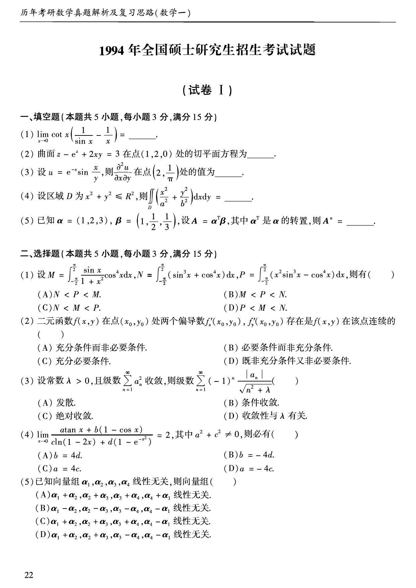
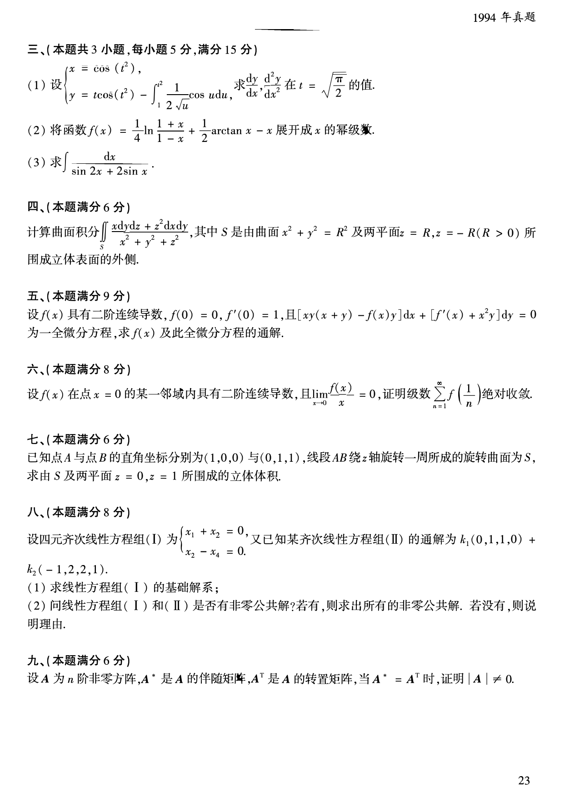
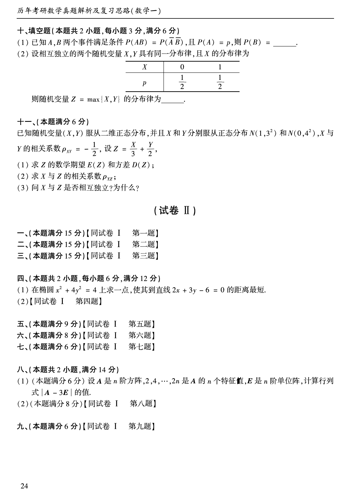

# 1994 年数学一真题

资料类型：考研数学一历年真题  
年份：1994  
科目：数学一  
来源 PDF：`D:\百度网盘\高数资料\【01】1987-2022年数学一真题（PDF）\【合集打印】1987-2009年考研数学一真题【 72页 】.pdf`  
整理状态：已按 PDF 页面图像完成题干校对  

## 试卷 I

**第 1-10 题题图**

### 第 1 题

- 题型：填空题
- 题号：试卷 I 一(1)
- 分值：3
- PDF 页码：23
- 校对状态：已校对

$$
\lim_{x\to 0}\cot x\left(\frac{1}{\sin x}-\frac{1}{x}\right)=\_\_\_\_\_\_。
$$

### 第 2 题

- 题型：填空题
- 题号：试卷 I 一(2)
- 分值：3
- PDF 页码：23
- 校对状态：已校对

曲面

$$
z-e^z+2xy=3
$$

在点 $(1,2,0)$ 处的切平面方程为______。

### 第 3 题

- 题型：填空题
- 题号：试卷 I 一(3)
- 分值：3
- PDF 页码：23
- 校对状态：已校对

设

$$
u=e^{-x}\sin\frac{x}{y},
$$

则

$$
\frac{\partial^2u}{\partial x\partial y}
$$

在点 $\left(2,\dfrac{1}{\pi}\right)$ 处的值为______。

### 第 4 题

- 题型：填空题
- 题号：试卷 I 一(4)
- 分值：3
- PDF 页码：23
- 校对状态：已校对

设区域 $D$ 为 $x^2+y^2\le R^2$，则

$$
\iint_D\left(\frac{x^2}{a^2}+\frac{y^2}{b^2}\right)\,dx\,dy=\_\_\_\_\_\_。
$$

### 第 5 题

- 题型：填空题
- 题号：试卷 I 一(5)
- 分值：3
- PDF 页码：23
- 校对状态：已校对

已知

$$
\alpha=(1,2,3),\quad \beta=\left(1,\frac{1}{2},\frac{1}{3}\right),
$$

设 $A=\alpha^T\beta$，其中 $\alpha^T$ 是 $\alpha$ 的转置，则 $A^n=$______。

### 第 6 题

- 题型：选择题
- 题号：试卷 I 二(1)
- 分值：3
- PDF 页码：23
- 校对状态：已校对

设

$$
M=\int_{-\pi/2}^{\pi/2}\frac{\sin x}{1+x^2}\cos^4x\,dx,
$$

$$
N=\int_{-\pi/2}^{\pi/2}(\sin^3x+\cos^4x)\,dx,
$$

$$
P=\int_{-\pi/2}^{\pi/2}(x^2\sin^3x-\cos^4x)\,dx,
$$

则有（ ）

A. $N<P<M$。  
B. $M<P<N$。  
C. $N<M<P$。  
D. $P<M<N$。

### 第 7 题

- 题型：选择题
- 题号：试卷 I 二(2)
- 分值：3
- PDF 页码：23
- 校对状态：已校对

二元函数 $f(x,y)$ 在点 $(x_0,y_0)$ 处两个偏导数 $f'_x(x_0,y_0), f'_y(x_0,y_0)$ 存在是 $f(x,y)$ 在该点连续的（ ）

A. 充分条件而非必要条件。  
B. 必要条件而非充分条件。  
C. 充分必要条件。  
D. 既非充分条件又非必要条件。

### 第 8 题

- 题型：选择题
- 题号：试卷 I 二(3)
- 分值：3
- PDF 页码：23
- 校对状态：已校对

设常数 $\lambda>0$，且级数 $\displaystyle\sum_{n=1}^{\infty}a_n^2$ 收敛，则级数

$$
\sum_{n=1}^{\infty}(-1)^n\frac{|a_n|}{\sqrt{n^2+\lambda}}
$$

（ ）

A. 发散。  
B. 条件收敛。  
C. 绝对收敛。  
D. 收敛性与 $\lambda$ 有关。

### 第 9 题

- 题型：选择题
- 题号：试卷 I 二(4)
- 分值：3
- PDF 页码：23
- 校对状态：已校对

$$
\lim_{x\to 0}\frac{a\tan x+b(1-\cos x)}{c\ln(1-2x)+d(1-e^{-x^2})}=2,
$$

其中 $a^2+c^2\ne 0$，则必有（ ）

A. $b=4d$。  
B. $b=-4d$。  
C. $a=4c$。  
D. $a=-4c$。

### 第 10 题

- 题型：选择题
- 题号：试卷 I 二(5)
- 分值：3
- PDF 页码：23
- 校对状态：已校对

已知向量组 $\alpha_1,\alpha_2,\alpha_3,\alpha_4$ 线性无关，则向量组（ ）

A. $\alpha_1+\alpha_2,\alpha_2+\alpha_3,\alpha_3+\alpha_4,\alpha_4+\alpha_1$ 线性无关。  
B. $\alpha_1-\alpha_2,\alpha_2-\alpha_3,\alpha_3-\alpha_4,\alpha_4-\alpha_1$ 线性无关。  
C. $\alpha_1+\alpha_2,\alpha_2+\alpha_3,\alpha_3+\alpha_4,\alpha_4-\alpha_1$ 线性无关。  
D. $\alpha_1+\alpha_2,\alpha_2+\alpha_3,\alpha_3-\alpha_4,\alpha_4-\alpha_1$ 线性无关。

**第 11-19 题题图**

### 第 11 题

- 题型：解答题
- 题号：试卷 I 三(1)
- 分值：5
- PDF 页码：24
- 校对状态：已校对

设

$$
\begin{cases}
x=\cos(t^2),\\
y=t\cos(t^2)-\displaystyle\int_1^{t^2}\frac{1}{2\sqrt{u}}\cos u\,du,
\end{cases}
$$

求

$$
\frac{dy}{dx},\quad \frac{d^2y}{dx^2}
$$

在 $t=\sqrt{\dfrac{\pi}{2}}$ 的值。

### 第 12 题

- 题型：解答题
- 题号：试卷 I 三(2)
- 分值：5
- PDF 页码：24
- 校对状态：已校对

将函数

$$
f(x)=\frac{1}{4}\ln\frac{1+x}{1-x}+\frac{1}{2}\arctan x-x
$$

展开成 $x$ 的幂级数。

### 第 13 题

- 题型：解答题
- 题号：试卷 I 三(3)
- 分值：5
- PDF 页码：24
- 校对状态：已校对

求

$$
\int \frac{dx}{\sin 2x+2\sin x}.
$$

### 第 14 题

- 题型：解答题
- 题号：试卷 I 四
- 分值：6
- PDF 页码：24
- 校对状态：已校对

计算曲面积分

$$
\iint_S \frac{x\,dy\,dz+z^2\,dx\,dy}{x^2+y^2+z^2},
$$

其中 $S$ 是由曲面 $x^2+y^2=R^2$ 及两平面 $z=R,\ z=-R\ (R>0)$ 所围成立体表面的外侧。

### 第 15 题

- 题型：解答题
- 题号：试卷 I 五
- 分值：9
- PDF 页码：24
- 校对状态：已校对

设 $f(x)$ 具有二阶连续导数，$f(0)=0,\ f'(0)=1$，且

$$
[xy(x+y)-f(x)y]\,dx+[f'(x)+x^2y]\,dy=0
$$

为一全微分方程，求 $f(x)$ 及此全微分方程的通解。

### 第 16 题

- 题型：证明题
- 题号：试卷 I 六
- 分值：8
- PDF 页码：24
- 校对状态：已校对

设 $f(x)$ 在点 $x=0$ 的某一邻域内具有二阶连续导数，且

$$
\lim_{x\to 0}\frac{f(x)}{x}=0,
$$

证明级数

$$
\sum_{n=1}^{\infty}f\left(\frac{1}{n}\right)
$$

绝对收敛。

### 第 17 题

- 题型：解答题
- 题号：试卷 I 七
- 分值：6
- PDF 页码：24
- 校对状态：已校对

已知点 $A$ 与点 $B$ 的直角坐标分别为 $(1,0,0)$ 与 $(0,1,1)$，线段 $AB$ 绕 $z$ 轴旋转一周所成的旋转曲面 $S$，求由 $S$ 及两平面 $z=0,\ z=1$ 所围成的立体体积。

### 第 18 题

- 题型：解答题
- 题号：试卷 I 八
- 分值：8
- PDF 页码：24
- 校对状态：已校对

设四元齐次线性方程组（I）为

$$
\begin{cases}
x_1+x_2=0,\\
x_2-x_4=0,
\end{cases}
$$

又已知某齐次线性方程组（II）的通解为

$$
k_1(0,1,1,0)+k_2(-1,2,2,1).
$$

1. 求线性方程组（I）的基础解系；
2. 问线性方程组（I）和（II）是否有非零公共解？若有，则求出所有的非零公共解；若没有，则说明理由。

### 第 19 题

- 题型：证明题
- 题号：试卷 I 九
- 分值：6
- PDF 页码：24
- 校对状态：已校对

设 $A$ 为 $n$ 阶非零方阵，$A^*$ 是 $A$ 的伴随矩阵，$A^T$ 是 $A$ 的转置矩阵，当 $A^*=A^T$ 时，证明 $|A|\ne 0$。

**第 20-22 题题图**

### 第 20 题

- 题型：填空题
- 题号：试卷 I 十(1)
- 分值：3
- PDF 页码：25
- 校对状态：已校对

已知 $A,B$ 两个事件满足条件

$$
P(AB)=P(\overline{A}\,\overline{B}),
$$

且 $P(A)=p$，则 $P(B)=$______。

### 第 21 题

- 题型：填空题
- 题号：试卷 I 十(2)
- 分值：3
- PDF 页码：25
- 校对状态：已校对

设相互独立的两个随机变量 $X,Y$ 具有同一分布律，且 $X$ 的分布律为

| $X$ | 0 | 1 |
|---|---:|---:|
| $p$ | $\dfrac{1}{2}$ | $\dfrac{1}{2}$ |

则随机变量 $Z=\max\{X,Y\}$ 的分布律为______。

### 第 22 题

- 题型：解答题
- 题号：试卷 I 十一
- 分值：6
- PDF 页码：25
- 校对状态：已校对

已知随机变量 $(X,Y)$ 服从二维正态分布，并且 $X$ 和 $Y$ 分别服从正态分布 $N(1,3^2)$ 和 $N(0,4^2)$，$X$ 与 $Y$ 的相关系数 $\rho_{XY}=-\dfrac{1}{2}$，设

$$
Z=\frac{X}{3}+\frac{Y}{2}.
$$

1. 求 $Z$ 的数学期望 $E(Z)$ 和方差 $D(Z)$；
2. 求 $X$ 与 $Z$ 的相关系数 $\rho_{XZ}$；
3. 问 $X$ 与 $Z$ 是否相互独立？为什么？
