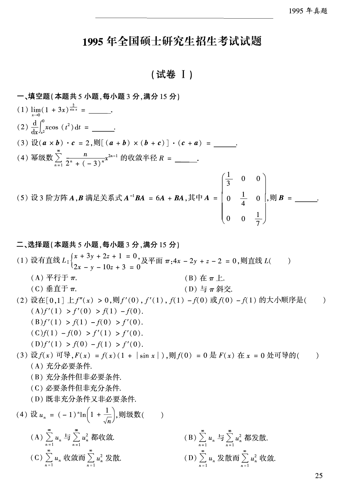
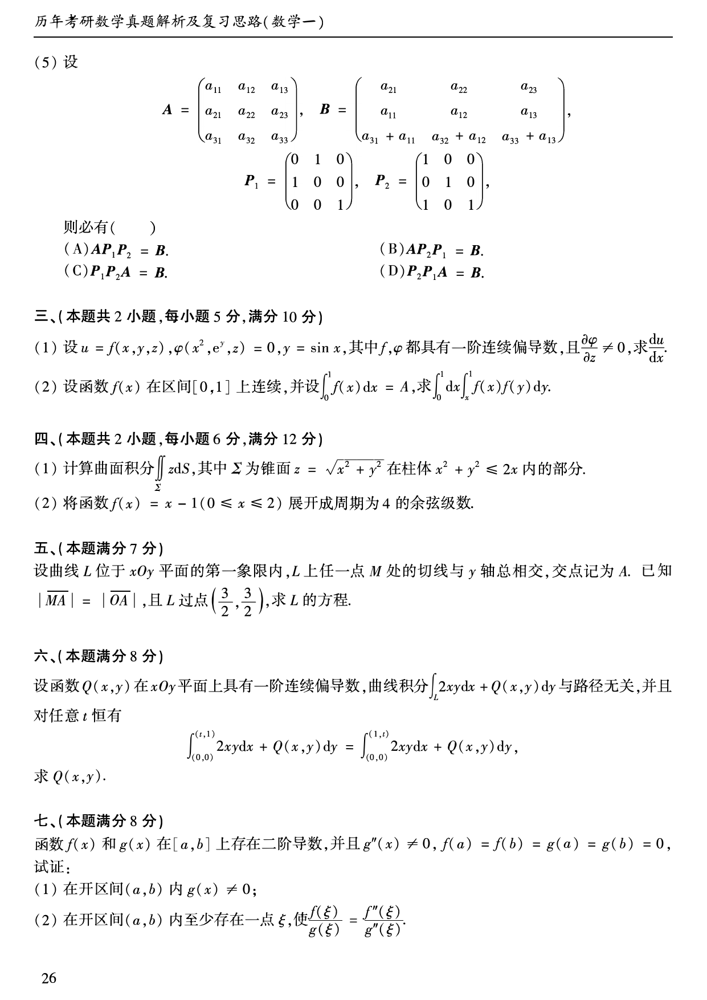
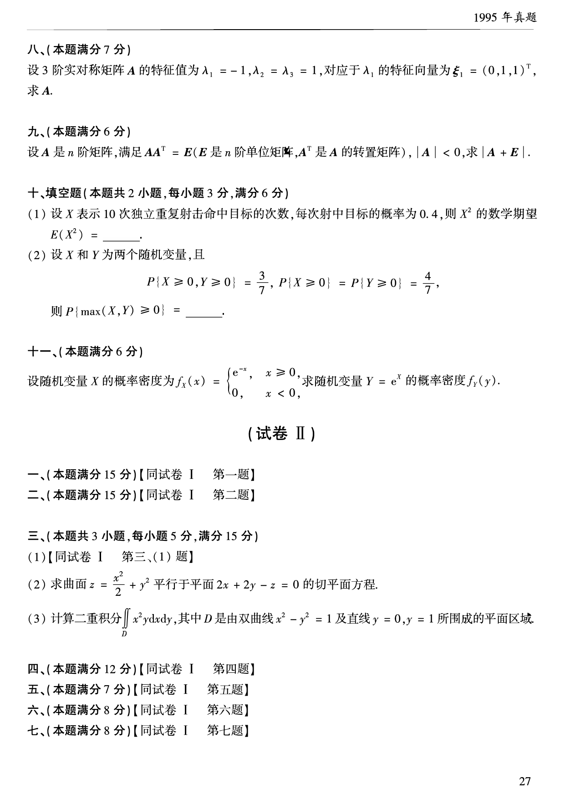

# 1995 年数学一真题

资料类型：考研数学一历年真题  
年份：1995  
科目：数学一  
来源 PDF：`D:\百度网盘\高数资料\【01】1987-2022年数学一真题（PDF）\【合集打印】1987-2009年考研数学一真题【 72页 】.pdf`  
整理状态：已按 PDF 页面图像人工视觉识别，待二次校对  

## 试卷 I

**第 1-9 题题图**

### 第 1 题

- 题型：填空题
- 题号：试卷 I 一(1)
- 分值：3
- PDF 页码：26
- 校对状态：人工视觉识别，待二次校对

$$
\lim_{x\to 0}(1+3x)^{\frac{2}{\sin x}}=______。
$$

### 第 2 题

- 题型：填空题
- 题号：试卷 I 一(2)
- 分值：3
- PDF 页码：26
- 校对状态：人工视觉识别，待二次校对

$$
\frac{d}{dx}\int_{x^2}^{0}x\cos(t^2)\,dt=______。
$$

### 第 3 题

- 题型：填空题
- 题号：试卷 I 一(3)
- 分值：3
- PDF 页码：26
- 校对状态：人工视觉识别，待二次校对

设 $(\boldsymbol{a}\times\boldsymbol{b})\cdot\boldsymbol{c}=2$，则

$$
[(\boldsymbol{a}+\boldsymbol{b})\times(\boldsymbol{b}+\boldsymbol{c})]\cdot(\boldsymbol{c}+\boldsymbol{a})=______。
$$

### 第 4 题

- 题型：填空题
- 题号：试卷 I 一(4)
- 分值：3
- PDF 页码：26
- 校对状态：人工视觉识别，待二次校对

幂级数

$$
\sum_{n=1}^{\infty}\frac{n}{2^n+(-3)^n}x^{2n-1}
$$

的收敛半径 $R=$______。

### 第 5 题

- 题型：填空题
- 题号：试卷 I 一(5)
- 分值：3
- PDF 页码：26
- 校对状态：人工视觉识别，待二次校对

设 3 阶方阵 $A,B$ 满足关系式

$$
A^{-1}BA=6A+BA,
$$

其中

$$
A=
\begin{pmatrix}
\frac{1}{3}&0&0\\
0&\frac{1}{4}&0\\
0&0&\frac{1}{7}
\end{pmatrix},
$$

则 $B=$______。

### 第 6 题

- 题型：选择题
- 题号：试卷 I 二(1)
- 分值：3
- PDF 页码：26
- 校对状态：人工视觉识别，待二次校对

设有直线

$$
L:
\begin{cases}
x+3y+2z+1=0,\\
2x-y-10z+3=0
\end{cases}
$$

及平面 $\pi:4x-2y+z-2=0$，则直线 $L$（ ）

A. 平行于 $\pi$。  
B. 在 $\pi$ 上。  
C. 垂直于 $\pi$。  
D. 与 $\pi$ 斜交。

### 第 7 题

- 题型：选择题
- 题号：试卷 I 二(2)
- 分值：3
- PDF 页码：26
- 校对状态：人工视觉识别，待二次校对

设在 $[0,1]$ 上 $f''(x)>0$，则 $f'(0), f'(1), f(1)-f(0)$ 或 $f(0)-f(1)$ 的大小顺序是（ ）

A. $f'(1)>f'(0)>f(1)-f(0)$。  
B. $f'(1)>f(1)-f(0)>f'(0)$。  
C. $f(1)-f(0)>f'(1)>f'(0)$。  
D. $f'(1)>f(0)-f(1)>f'(0)$。

### 第 8 题

- 题型：选择题
- 题号：试卷 I 二(3)
- 分值：3
- PDF 页码：26
- 校对状态：人工视觉识别，待二次校对

设 $f(x)$ 可导，

$$
F(x)=f(x)(1+|\sin x|),
$$

则 $f(0)=0$ 是 $F(x)$ 在 $x=0$ 处可导的（ ）

A. 充分必要条件。  
B. 充分条件但非必要条件。  
C. 必要条件但非充分条件。  
D. 既非充分条件又非必要条件。

### 第 9 题

- 题型：选择题
- 题号：试卷 I 二(4)
- 分值：3
- PDF 页码：26
- 校对状态：人工视觉识别，待二次校对

设

$$
u_n=(-1)^n\ln\left(1+\frac{1}{\sqrt n}\right),
$$

则级数（ ）

A. $\displaystyle\sum_{n=1}^{\infty}u_n$ 与 $\displaystyle\sum_{n=1}^{\infty}u_n^2$ 都收敛。  
B. $\displaystyle\sum_{n=1}^{\infty}u_n$ 与 $\displaystyle\sum_{n=1}^{\infty}u_n^2$ 都发散。  
C. $\displaystyle\sum_{n=1}^{\infty}u_n$ 收敛而 $\displaystyle\sum_{n=1}^{\infty}u_n^2$ 发散。  
D. $\displaystyle\sum_{n=1}^{\infty}u_n$ 发散而 $\displaystyle\sum_{n=1}^{\infty}u_n^2$ 收敛。

**第 10-17 题题图**

### 第 10 题

- 题型：选择题
- 题号：试卷 I 二(5)
- 分值：3
- PDF 页码：27
- 校对状态：人工视觉识别，待二次校对

设

$$
A=
\begin{pmatrix}
a_{11}&a_{12}&a_{13}\\
a_{21}&a_{22}&a_{23}\\
a_{31}&a_{32}&a_{33}
\end{pmatrix},
\quad
B=
\begin{pmatrix}
a_{21}&a_{22}&a_{23}\\
a_{11}&a_{12}&a_{13}\\
a_{31}+a_{11}&a_{32}+a_{12}&a_{33}+a_{13}
\end{pmatrix},
$$

$$
P_1=
\begin{pmatrix}
0&1&0\\
1&0&0\\
0&0&1
\end{pmatrix},
\quad
P_2=
\begin{pmatrix}
1&0&0\\
0&1&0\\
1&0&1
\end{pmatrix},
$$

则必有（ ）

A. $AP_1P_2=B$。  
B. $AP_2P_1=B$。  
C. $P_1P_2A=B$。  
D. $P_2P_1A=B$。

### 第 11 题

- 题型：解答题
- 题号：试卷 I 三(1)
- 分值：5
- PDF 页码：27
- 校对状态：人工视觉识别，待二次校对

设

$$
u=f(x,y,z),\quad \varphi(x^2,e^y,z)=0,\quad y=\sin x,
$$

其中 $f,\varphi$ 都具有一阶连续偏导数，且 $\dfrac{\partial\varphi}{\partial z}\ne 0$，求 $\dfrac{du}{dx}$。

### 第 12 题

- 题型：解答题
- 题号：试卷 I 三(2)
- 分值：5
- PDF 页码：27
- 校对状态：人工视觉识别，待二次校对

设函数 $f(x)$ 在区间 $[0,1]$ 上连续，并设

$$
\int_0^1 f(x)\,dx=A,
$$

求

$$
\int_0^1 dx\int_x^1 f(x)f(y)\,dy.
$$

### 第 13 题

- 题型：解答题
- 题号：试卷 I 四(1)
- 分值：6
- PDF 页码：27
- 校对状态：人工视觉识别，待二次校对

计算曲面积分

$$
\iint_{\Sigma} z\,dS,
$$

其中 $\Sigma$ 为锥面 $z=\sqrt{x^2+y^2}$ 在柱体 $x^2+y^2\le 2x$ 内的部分。

### 第 14 题

- 题型：解答题
- 题号：试卷 I 四(2)
- 分值：6
- PDF 页码：27
- 校对状态：人工视觉识别，待二次校对

将函数 $f(x)=x-1\ (0\le x\le 2)$ 展开成周期为 4 的余弦级数。

### 第 15 题

- 题型：解答题
- 题号：试卷 I 五
- 分值：7
- PDF 页码：27
- 校对状态：人工视觉识别，待二次校对

设曲线 $L$ 位于 $xOy$ 平面的第一象限内，$L$ 上任一点 $M$ 处的切线与 $y$ 轴总相交，交点记为 $A$。已知 $|\overline{MA}|=|\overline{OA}|$，且 $L$ 过点 $\left(\dfrac{3}{2},\dfrac{3}{2}\right)$，求 $L$ 的方程。

### 第 16 题

- 题型：解答题
- 题号：试卷 I 六
- 分值：8
- PDF 页码：27
- 校对状态：人工视觉识别，待二次校对

设函数 $Q(x,y)$ 在 $xOy$ 平面上具有一阶连续偏导数，曲线积分

$$
\int_L 2xy\,dx+Q(x,y)\,dy
$$

与路径无关，并且对任意 $t$ 恒有

$$
\int_{(0,0)}^{(t,1)}2xy\,dx+Q(x,y)\,dy
=
\int_{(0,0)}^{(1,t)}2xy\,dx+Q(x,y)\,dy,
$$

求 $Q(x,y)$。

### 第 17 题

- 题型：证明题
- 题号：试卷 I 七
- 分值：8
- PDF 页码：27
- 校对状态：人工视觉识别，待二次校对

函数 $f(x)$ 和 $g(x)$ 在 $[a,b]$ 上存在二阶导数，并且 $g''(x)\ne 0,\ f(a)=f(b)=g(a)=g(b)=0$，试证：

1. 在开区间 $(a,b)$ 内 $g(x)\ne 0$；
2. 在开区间 $(a,b)$ 内至少存在一点 $\xi$，使

$$
\frac{f(\xi)}{g(\xi)}=\frac{f''(\xi)}{g''(\xi)}.
$$

**第 18-22 题题图**

### 第 18 题

- 题型：解答题
- 题号：试卷 I 八
- 分值：7
- PDF 页码：28
- 校对状态：人工视觉识别，待二次校对

设 3 阶实对称矩阵 $A$ 的特征值为 $\lambda_1=-1,\lambda_2=\lambda_3=1$，对应于 $\lambda_1$ 的特征向量为

$$
\xi_1=(0,1,1)^T,
$$

求 $A$。

### 第 19 题

- 题型：解答题
- 题号：试卷 I 九
- 分值：6
- PDF 页码：28
- 校对状态：人工视觉识别，待二次校对

设 $A$ 是 $n$ 阶矩阵，满足

$$
AA^T=E,
$$

其中 $E$ 是 $n$ 阶单位阵，$A^T$ 是 $A$ 的转置矩阵，$|A|<0$，求 $|A+E|$。

### 第 20 题

- 题型：填空题
- 题号：试卷 I 十(1)
- 分值：3
- PDF 页码：28
- 校对状态：人工视觉识别，待二次校对

设 $X$ 表示 10 次独立重复射击命中目标的次数，每次射中目标的概率为 $0.4$，则 $X^2$ 的数学期望

$$
E(X^2)=______。
$$

### 第 21 题

- 题型：填空题
- 题号：试卷 I 十(2)
- 分值：3
- PDF 页码：28
- 校对状态：人工视觉识别，待二次校对

设 $X$ 和 $Y$ 为两个随机变量，且

$$
P\{X\ge 0,Y\ge 0\}=\frac{3}{7},\quad P\{X\ge 0\}=P\{Y\ge 0\}=\frac{4}{7},
$$

则

$$
P\{\max(X,Y)\ge 0\}=______。
$$

### 第 22 题

- 题型：解答题
- 题号：试卷 I 十一
- 分值：6
- PDF 页码：28
- 校对状态：人工视觉识别，待二次校对

设随机变量 $X$ 的概率密度为

$$
f_X(x)=
\begin{cases}
e^{-x},&x\ge 0,\\
0,&x<0,
\end{cases}
$$

求随机变量 $Y=e^X$ 的概率密度 $f_Y(y)$。
