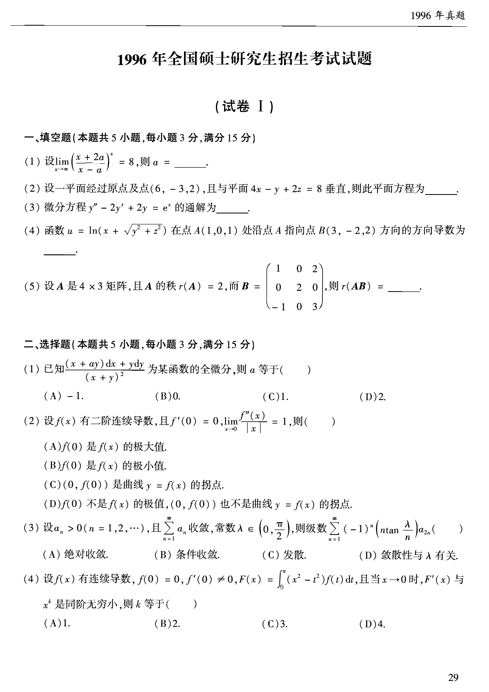
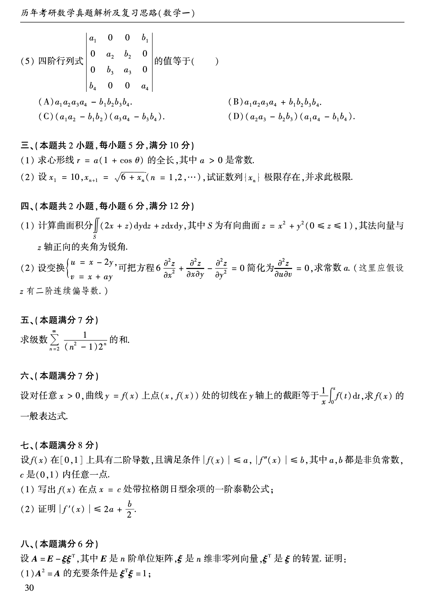
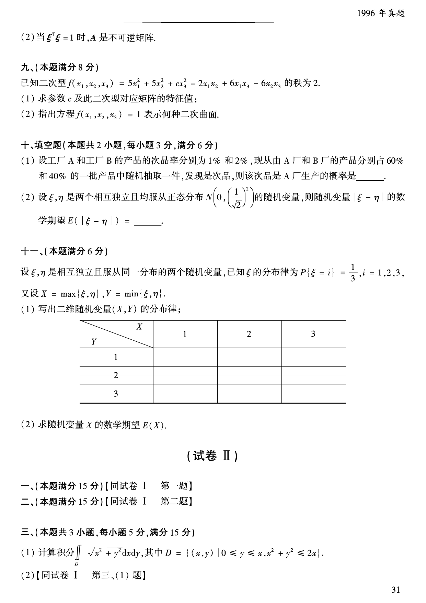

# 1996 年数学一真题

资料类型：考研数学一历年真题  
年份：1996  
科目：数学一  
来源 PDF：`D:\百度网盘\高数资料\【01】1987-2022年数学一真题（PDF）\【合集打印】1987-2009年考研数学一真题【 72页 】.pdf`  
整理状态：已按 PDF 页面图像人工视觉识别，待二次校对  

## 试卷 I

**第 1-9 题题图**

### 第 1 题

- 题型：填空题
- 题号：试卷 I 一(1)
- 分值：3
- PDF 页码：30
- 校对状态：人工视觉识别，待二次校对

$$
\lim_{x\to\infty}\left(\frac{x+2a}{x-a}\right)^x=8,
$$

则 $a=$______。

### 第 2 题

- 题型：填空题
- 题号：试卷 I 一(2)
- 分值：3
- PDF 页码：30
- 校对状态：人工视觉识别，待二次校对

设一平面经过原点及点 $(6,-3,2)$，且与平面

$$
4x-y+2z=8
$$

垂直，则此平面方程为______。

### 第 3 题

- 题型：填空题
- 题号：试卷 I 一(3)
- 分值：3
- PDF 页码：30
- 校对状态：人工视觉识别，待二次校对

微分方程

$$
y''-2y'+2y=e^x
$$

的通解为______。

### 第 4 题

- 题型：填空题
- 题号：试卷 I 一(4)
- 分值：3
- PDF 页码：30
- 校对状态：人工视觉识别，待二次校对

函数

$$
u=\ln\left(x+\sqrt{y^2+z^2}\right)
$$

在点 $A(1,0,1)$ 处沿点 $A$ 指向点 $B(3,-2,2)$ 方向的方向导数为______。

### 第 5 题

- 题型：填空题
- 题号：试卷 I 一(5)
- 分值：3
- PDF 页码：30
- 校对状态：人工视觉识别，待二次校对

设 $A$ 是 $4\times 3$ 矩阵，且 $r(A)=2$，而

$$
B=
\begin{pmatrix}
1&0&2\\
0&2&0\\
-1&0&3
\end{pmatrix},
$$

则 $r(AB)=$______。

### 第 6 题

- 题型：选择题
- 题号：试卷 I 二(1)
- 分值：3
- PDF 页码：30
- 校对状态：人工视觉识别，待二次校对

已知

$$
\frac{(x+ay)\,dx+y\,dy}{(x+y)^2}
$$

为某函数的全微分，则 $a$ 等于（ ）。

A. $-1$  
B. $0$  
C. $1$  
D. $2$

### 第 7 题

- 题型：选择题
- 题号：试卷 I 二(2)
- 分值：3
- PDF 页码：30
- 校对状态：人工视觉识别，待二次校对

设 $f(x)$ 具有二阶连续导数，且

$$
f'(0)=0,\qquad \lim_{x\to 0}\frac{f''(x)}{|x|}=1,
$$

则（ ）。

A. $f(0)$ 是函数 $f(x)$ 的极大值  
B. $f(0)$ 是函数 $f(x)$ 的极小值  
C. 点 $(0,f(0))$ 是曲线 $y=f(x)$ 的拐点  
D. $f(0)$ 不是函数 $f(x)$ 的极值，点 $(0,f(0))$ 也不是曲线 $y=f(x)$ 的拐点

### 第 8 题

- 题型：选择题
- 题号：试卷 I 二(3)
- 分值：3
- PDF 页码：30
- 校对状态：人工视觉识别，待二次校对

设 $a_n>0\ (n=1,2,\cdots)$，且级数 $\sum_{n=1}^{\infty}a_n$ 收敛，$\lambda\in\left(0,\frac{\pi}{2}\right)$，则级数

$$
\sum_{n=1}^{\infty}(-1)^n\left(n\tan\frac{\lambda}{n}\right)a_{2n}
$$

（ ）。

A. 绝对收敛  
B. 条件收敛  
C. 发散  
D. 敛散性与 $\lambda$ 有关

### 第 9 题

- 题型：选择题
- 题号：试卷 I 二(4)
- 分值：3
- PDF 页码：30
- 校对状态：人工视觉识别，待二次校对

设函数 $f(x)$ 具有连续导数，且 $f(0)=0,\ f'(0)\ne0$。若

$$
F(x)=\int_0^x (x^2-t^2)f(t)\,dt,
$$

则当 $x\to0$ 时，$F'(x)$ 是 $x$ 的几阶无穷小？（ ）

A. $1$ 阶  
B. $2$ 阶  
C. $3$ 阶  
D. $4$ 阶

**第 10-18 题题图**

### 第 10 题

- 题型：选择题
- 题号：试卷 I 二(5)
- 分值：3
- PDF 页码：31
- 校对状态：人工视觉识别，待二次校对

行列式

$$
\begin{vmatrix}
a_1&0&0&b_1\\
0&a_2&b_2&0\\
0&b_3&a_3&0\\
b_4&0&0&a_4
\end{vmatrix}
$$

的值等于（ ）。

A. $a_1a_2a_3a_4-b_1b_2b_3b_4$  
B. $a_1a_2a_3a_4+b_1b_2b_3b_4$  
C. $(a_1a_2-b_1b_2)(a_3a_4-b_3b_4)$  
D. $(a_2a_3-b_2b_3)(a_1a_4-b_1b_4)$

### 第 11 题

- 题型：解答题
- 题号：试卷 I 三(1)
- 分值：5
- PDF 页码：31
- 校对状态：人工视觉识别，待二次校对

求心形线

$$
r=a(1+\cos\theta)
$$

的全长，其中 $a>0$ 为常数。

### 第 12 题

- 题型：证明题
- 题号：试卷 I 三(2)
- 分值：5
- PDF 页码：31
- 校对状态：人工视觉识别，待二次校对

设 $x_1=10$，

$$
x_{n+1}=\sqrt{6+x_n}\quad(n=1,2,\cdots),
$$

证明数列 $\{x_n\}$ 的极限存在，并求此极限。

### 第 13 题

- 题型：解答题
- 题号：试卷 I 四(1)
- 分值：6
- PDF 页码：31
- 校对状态：人工视觉识别，待二次校对

计算曲面积分

$$
\iint_S (2x+z)\,dy\,dz+z\,dx\,dy,
$$

其中 $S$ 为有向曲面

$$
z=x^2+y^2,\qquad 0\le z\le 1,
$$

其法向量与 $z$ 轴正向的夹角为锐角。

### 第 14 题

- 题型：解答题
- 题号：试卷 I 四(2)
- 分值：6
- PDF 页码：31
- 校对状态：人工视觉识别，待二次校对

设变换

$$
\begin{cases}
u=x-2y,\\
v=x+ay
\end{cases}
$$

可把方程

$$
6\frac{\partial^2 z}{\partial x^2}
+\frac{\partial^2 z}{\partial x\partial y}
-\frac{\partial^2 z}{\partial y^2}=0
$$

化为 $\dfrac{\partial^2 z}{\partial u\partial v}=0$。求常数 $a$，其中 $z$ 具有二阶连续偏导数。

### 第 15 题

- 题型：解答题
- 题号：试卷 I 五
- 分值：7
- PDF 页码：31
- 校对状态：人工视觉识别，待二次校对

求级数

$$
\sum_{n=2}^{\infty}\frac{1}{(n^2-1)2^n}
$$

的和。

### 第 16 题

- 题型：解答题
- 题号：试卷 I 六
- 分值：7
- PDF 页码：31
- 校对状态：人工视觉识别，待二次校对

对任意 $x>0$，曲线 $y=f(x)$ 在点 $(x,f(x))$ 处的切线在 $y$ 轴上的截距等于

$$
\frac{1}{x}\int_0^x f(t)\,dt。
$$

求 $f(x)$ 的一般表达式。

### 第 17 题

- 题型：证明题
- 题号：试卷 I 七
- 分值：8
- PDF 页码：31
- 校对状态：人工视觉识别，待二次校对

设 $f(x)$ 在区间 $[0,1]$ 上具有二阶导数，且

$$
|f(x)|\le a,\qquad |f''(x)|\le b\quad(0\le x\le1),
$$

其中 $a,b$ 为正常数。

(1) 写出 $f(x)$ 在点 $x=c$ 处带拉格朗日型余项的一阶泰勒公式；

(2) 证明

$$
|f'(x)|\le 2a+\frac{b}{2}.
$$

**第 18-22 题题图**

### 第 18 题

- 题型：证明题
- 题号：试卷 I 八
- 分值：8
- PDF 页码：31-32
- 校对状态：人工视觉识别，待二次校对

设

$$
A=E-\xi\xi^T,
$$

其中 $E$ 为 $n$ 阶单位矩阵，$\xi$ 为非零列向量，$\xi^T$ 是 $\xi$ 的转置。证明：

(1) $A^2=A$ 的充分必要条件是 $\xi^T\xi=1$；

(2) 当 $\xi^T\xi=1$ 时，$A$ 是不可逆矩阵。

### 第 19 题

- 题型：解答题
- 题号：试卷 I 九
- 分值：8
- PDF 页码：32
- 校对状态：人工视觉识别，待二次校对

已知二次型

$$
f(x_1,x_2,x_3)=5x_1^2+5x_2^2+cx_3^2-2x_1x_2+6x_1x_3-6x_2x_3
$$

的秩为 $2$。

(1) 求参数 $c$ 及此二次型对应矩阵的特征值；

(2) 指出方程 $f(x_1,x_2,x_3)=1$ 表示何种二次曲面。

### 第 20 题

- 题型：填空题
- 题号：试卷 I 十(1)
- 分值：3
- PDF 页码：32
- 校对状态：人工视觉识别，待二次校对

设工厂 $A$ 和工厂 $B$ 的产品的次品率分别为 $1\%$ 和 $2\%$，现从由 $A$ 厂和 $B$ 厂的产品分别占 $60\%$ 和 $40\%$ 的一批产品中随机抽取一件，发现是次品，则该次品是 $A$ 厂生产的概率是______。

### 第 21 题

- 题型：填空题
- 题号：试卷 I 十(2)
- 分值：3
- PDF 页码：32
- 校对状态：人工视觉识别，待二次校对

设 $\xi,\eta$ 是两个相互独立且均服从正态分布

$$
N\left(0,\left(\frac{1}{\sqrt{2}}\right)^2\right)
$$

的随机变量，则随机变量 $|\xi-\eta|$ 的数学期望

$$
E(|\xi-\eta|)=______。
$$

### 第 22 题

- 题型：解答题
- 题号：试卷 I 十一
- 分值：6
- PDF 页码：32
- 校对状态：人工视觉识别，待二次校对

设 $\xi,\eta$ 是相互独立且服从同一分布的两个随机变量，已知 $\xi$ 的分布律为

$$
P\{\xi=i\}=\frac{1}{3},\qquad i=1,2,3,
$$

又设

$$
X=\max\{\xi,\eta\},\qquad Y=\min\{\xi,\eta\}.
$$

(1) 写出二维随机变量 $(X,Y)$ 的分布律；

| $Y\backslash X$ | 1 | 2 | 3 |
| --- | --- | --- | --- |
| 1 |  |  |  |
| 2 |  |  |  |
| 3 |  |  |  |

(2) 求随机变量 $X$ 的数学期望 $E(X)$。
