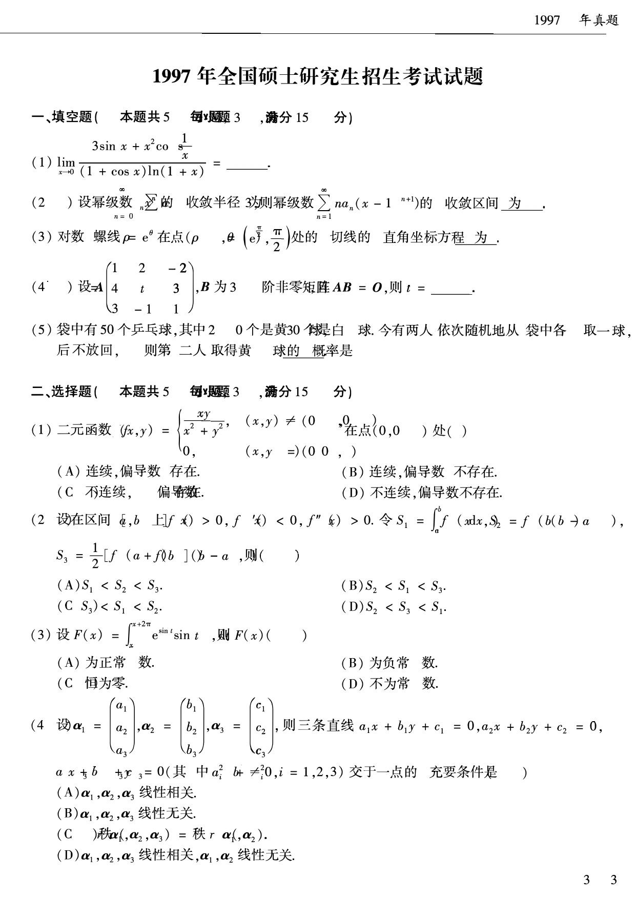
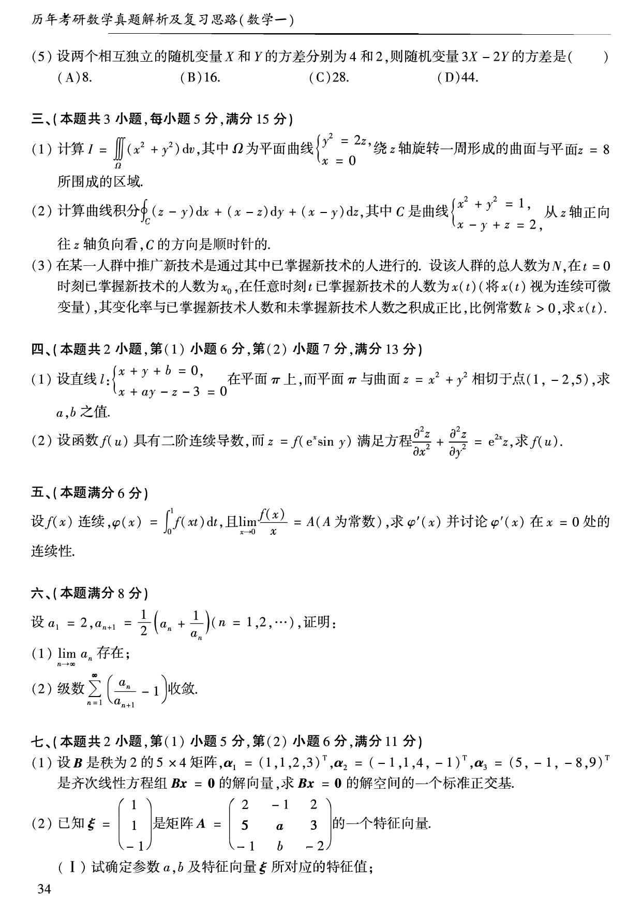
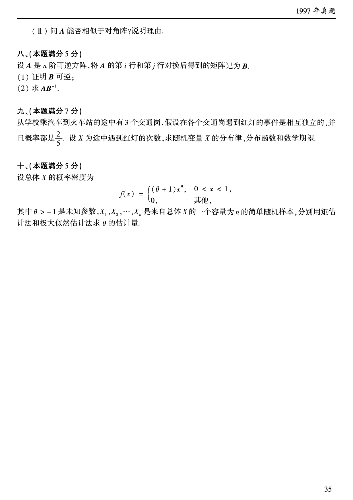

# 1997 年数学一真题

资料类型：考研数学一历年真题  
年份：1997  
科目：数学一  
来源 PDF：`D:\百度网盘\高数资料\【01】1987-2022年数学一真题（PDF）\【合集打印】1987-2009年考研数学一真题【 72页 】.pdf`  
整理状态：已按 PDF 页面图像人工视觉识别，待二次校对  

说明：原 PDF 文本层存在乱码和公式错位，本文件不再使用文本层抽取结果。题面依据渲染页图 `images/source_pages/page_034.png` 至 `page_036.png` 视觉转写。

## 1997 数一原卷题目

**第 1-9 题题图**

### 第 1 题

- 题型：填空题
- 题号：一(1)
- 分值：3
- PDF 页码：34
- 校对状态：人工视觉识别，待二次校对

$$
\lim_{x\to0}\frac{3\sin x+x^2\cos\frac{1}{x}}{(1+\cos x)\ln(1+x)}=______。
$$

### 第 2 题

- 题型：填空题
- 题号：一(2)
- 分值：3
- PDF 页码：34
- 校对状态：人工视觉识别，待二次校对

设幂级数

$$
\sum_{n=0}^{\infty}a_nx^n
$$

的收敛半径为 $3$，则幂级数

$$
\sum_{n=1}^{\infty}na_n(x-1)^{n+1}
$$

的收敛区间为______。

### 第 3 题

- 题型：填空题
- 题号：一(3)
- 分值：3
- PDF 页码：34
- 校对状态：人工视觉识别，待二次校对

对数螺线 $\rho=e^\theta$ 在点

$$
(\rho,\theta)=\left(e^{\frac{\pi}{2}},\frac{\pi}{2}\right)
$$

处的切线的直角坐标方程为______。

### 第 4 题

- 题型：填空题
- 题号：一(4)
- 分值：3
- PDF 页码：34
- 校对状态：人工视觉识别，待二次校对

设

$$
A=
\begin{pmatrix}
1&2&-2\\
4&t&3\\
3&-1&1
\end{pmatrix},
$$

$B$ 为 $3$ 阶非零矩阵，$AB=O$，则 $t=$______。

### 第 5 题

- 题型：填空题
- 题号：一(5)
- 分值：3
- PDF 页码：34
- 校对状态：人工视觉识别，待二次校对

袋中有 $50$ 个乒乓球，其中 $20$ 个是黄球、$30$ 个是白球。今有两人依次随机地从袋中各取一球，后不放回，则第二人取得黄球的概率是______。

### 第 6 题

- 题型：选择题
- 题号：二(1)
- 分值：3
- PDF 页码：34
- 校对状态：人工视觉识别，待二次校对

二元函数

$$
f(x,y)=
\begin{cases}
\dfrac{xy}{x^2+y^2},&(x,y)\ne(0,0),\\
0,&(x,y)=(0,0)
\end{cases}
$$

在点 $(0,0)$ 处（ ）。

A. 连续，偏导数存在  
B. 连续，偏导数不存在  
C. 不连续，偏导数存在  
D. 不连续，偏导数不存在

### 第 7 题

- 题型：选择题
- 题号：二(2)
- 分值：3
- PDF 页码：34
- 校对状态：人工视觉识别，待二次校对

设在区间 $[a,b]$ 上 $f(x)>0,\ f'(x)<0,\ f''(x)>0$。令

$$
S_1=\int_a^b f(x)\,dx,\qquad S_2=f(b)(b-a),
$$

$$
S_3=\frac{1}{2}[f(a)+f(b)](b-a),
$$

则（ ）。

A. $S_1<S_2<S_3$  
B. $S_2<S_1<S_3$  
C. $S_3<S_1<S_2$  
D. $S_2<S_3<S_1$

### 第 8 题

- 题型：选择题
- 题号：二(3)
- 分值：3
- PDF 页码：34
- 校对状态：人工视觉识别，待二次校对

设

$$
F(x)=\int_x^{x+2\pi}e^{\sin t}\sin t\,dt,
$$

则 $F(x)$（ ）。

A. 为正常数  
B. 为负常数  
C. 恒为零  
D. 不为常数

### 第 9 题

- 题型：选择题
- 题号：二(4)
- 分值：3
- PDF 页码：34
- 校对状态：人工视觉识别，待二次校对

设

$$
\boldsymbol{\alpha}_1=
\begin{pmatrix}
a_1\\a_2\\a_3
\end{pmatrix},\quad
\boldsymbol{\alpha}_2=
\begin{pmatrix}
b_1\\b_2\\b_3
\end{pmatrix},\quad
\boldsymbol{\alpha}_3=
\begin{pmatrix}
c_1\\c_2\\c_3
\end{pmatrix},
$$

则三条直线

$$
a_1x+b_1y+c_1=0,\quad a_2x+b_2y+c_2=0,\quad a_3x+b_3y+c_3=0
$$

（其中 $a_i^2+b_i^2\ne0,\ i=1,2,3$）交于一点的充要条件是（ ）。

A. $\boldsymbol{\alpha}_1,\boldsymbol{\alpha}_2,\boldsymbol{\alpha}_3$ 线性相关  
B. $\boldsymbol{\alpha}_1,\boldsymbol{\alpha}_2,\boldsymbol{\alpha}_3$ 线性无关  
C. $r(\boldsymbol{\alpha}_1,\boldsymbol{\alpha}_2,\boldsymbol{\alpha}_3)=r(\boldsymbol{\alpha}_1,\boldsymbol{\alpha}_2)$  
D. $\boldsymbol{\alpha}_1,\boldsymbol{\alpha}_2,\boldsymbol{\alpha}_3$ 线性相关，$\boldsymbol{\alpha}_1,\boldsymbol{\alpha}_2$ 线性无关

**第 10-19 题题图**

### 第 10 题

- 题型：选择题
- 题号：二(5)
- 分值：3
- PDF 页码：35
- 校对状态：人工视觉识别，待二次校对

设两个相互独立的随机变量 $X$ 和 $Y$ 的方差分别为 $4$ 和 $2$，则随机变量 $3X-2Y$ 的方差是（ ）。

A. $8$  
B. $16$  
C. $28$  
D. $44$

### 第 11 题

- 题型：解答题
- 题号：三(1)
- 分值：5
- PDF 页码：35
- 校对状态：人工视觉识别，待二次校对

计算

$$
I=\iiint_{\Omega}(x^2+y^2)\,dv,
$$

其中 $\Omega$ 为平面曲线

$$
\begin{cases}
y^2=2z,\\
x=0
\end{cases}
$$

绕 $z$ 轴旋转一周形成的曲面与平面 $z=8$ 所围成的区域。

### 第 12 题

- 题型：解答题
- 题号：三(2)
- 分值：5
- PDF 页码：35
- 校对状态：人工视觉识别，待二次校对

计算曲线积分

$$
\oint_C (z-y)\,dx+(x-z)\,dy+(x-y)\,dz,
$$

其中 $C$ 是曲线

$$
\begin{cases}
x^2+y^2=1,\\
x-y+z=2
\end{cases}
$$

从 $z$ 轴正向往 $z$ 轴负向看，$C$ 的方向是顺时针的。

### 第 13 题

- 题型：解答题
- 题号：三(3)
- 分值：5
- PDF 页码：35
- 校对状态：人工视觉识别，待二次校对

在某一人群中推广新技术是通过其中已掌握新技术的人进行的。设该人群的总人数为 $N$，在 $t=0$ 时刻已掌握新技术的人数为 $x_0$，在任意时刻 $t$ 已掌握新技术的人数为 $x(t)$（将 $x(t)$ 视为连续可微变量），其变化率与已掌握新技术人数和未掌握新技术人数之积成正比，比例常数 $k>0$，求 $x(t)$。

### 第 14 题

- 题型：解答题
- 题号：四(1)
- 分值：6
- PDF 页码：35
- 校对状态：人工视觉识别，待二次校对

设直线

$$
l:\begin{cases}
x+y+b=0,\\
x+ay-z-3=0
\end{cases}
$$

在平面 $\pi$ 上，而平面 $\pi$ 与曲面 $z=x^2+y^2$ 相切于点 $(1,-2,5)$，求 $a,b$ 之值。

### 第 15 题

- 题型：解答题
- 题号：四(2)
- 分值：7
- PDF 页码：35
- 校对状态：人工视觉识别，待二次校对

设函数 $f(u)$ 具有二阶连续导数，而

$$
z=f(e^x\sin y)
$$

满足方程

$$
\frac{\partial^2 z}{\partial x^2}+\frac{\partial^2 z}{\partial y^2}=e^{2x}z,
$$

求 $f(u)$。

### 第 16 题

- 题型：解答题
- 题号：五
- 分值：6
- PDF 页码：35
- 校对状态：人工视觉识别，待二次校对

设 $f(x)$ 连续，

$$
\varphi(x)=\int_0^1 f(xt)\,dt,
$$

且

$$
\lim_{x\to0}\frac{f(x)}{x}=A
$$

（$A$ 为常数），求 $\varphi'(x)$ 并讨论 $\varphi'(x)$ 在 $x=0$ 处的连续性。

### 第 17 题

- 题型：证明题
- 题号：六
- 分值：8
- PDF 页码：35
- 校对状态：人工视觉识别，待二次校对

设 $a_1=2$，

$$
a_{n+1}=\frac{1}{2}\left(a_n+\frac{1}{a_n}\right)\quad(n=1,2,\cdots),
$$

证明：

(1) $\lim_{n\to\infty}a_n$ 存在；

(2) 级数

$$
\sum_{n=1}^{\infty}\left(\frac{a_n}{a_{n+1}}-1\right)
$$

收敛。

### 第 18 题

- 题型：解答题
- 题号：七(1)
- 分值：5
- PDF 页码：35
- 校对状态：人工视觉识别，待二次校对

设 $B$ 是秩为 $2$ 的 $5\times4$ 矩阵，

$$
\boldsymbol{\alpha}_1=(1,1,2,3)^T,\quad
\boldsymbol{\alpha}_2=(-1,1,4,-1)^T,\quad
\boldsymbol{\alpha}_3=(5,-1,-8,9)^T
$$

是齐次线性方程组 $B\boldsymbol{x}=0$ 的解向量，求 $B\boldsymbol{x}=0$ 的解空间的一个标准正交基。

**第 19-22 题题图**

### 第 19 题

- 题型：解答题
- 题号：七(2)
- 分值：6
- PDF 页码：35-36
- 校对状态：人工视觉识别，待二次校对

已知

$$
\boldsymbol{\xi}=
\begin{pmatrix}
1\\1\\-1
\end{pmatrix}
$$

是矩阵

$$
A=
\begin{pmatrix}
2&-1&2\\
5&a&3\\
-1&b&-2
\end{pmatrix}
$$

的一个特征向量。

(I) 试确定参数 $a,b$ 及特征向量 $\boldsymbol{\xi}$ 所对应的特征值；

(II) 问 $A$ 能否相似于对角阵？说明理由。

### 第 20 题

- 题型：证明题
- 题号：八
- 分值：5
- PDF 页码：36
- 校对状态：人工视觉识别，待二次校对

设 $A$ 是 $n$ 阶可逆方阵，将 $A$ 的第 $i$ 行和第 $j$ 行对换后得到的矩阵记为 $B$。

(1) 证明 $B$ 可逆；

(2) 求 $AB^{-1}$。

### 第 21 题

- 题型：解答题
- 题号：九
- 分值：7
- PDF 页码：36
- 校对状态：人工视觉识别，待二次校对

从学校乘汽车到火车站的途中有 $3$ 个交通岗，假设在各个交通岗遇到红灯的事件是相互独立的，并且概率都是 $\frac{2}{5}$。设 $X$ 为途中遇到红灯的次数，求随机变量 $X$ 的分布律、分布函数和数学期望。

### 第 22 题

- 题型：解答题
- 题号：十
- 分值：5
- PDF 页码：36
- 校对状态：人工视觉识别，待二次校对

设总体 $X$ 的概率密度为

$$
f(x)=
\begin{cases}
(\theta+1)x^\theta,&0<x<1,\\
0,&\text{其他},
\end{cases}
$$

其中 $\theta>-1$ 是未知参数，$X_1,X_2,\cdots,X_n$ 是来自总体 $X$ 的一个容量为 $n$ 的简单随机样本，分别用矩估计法和极大似然估计法求 $\theta$ 的估计量。
