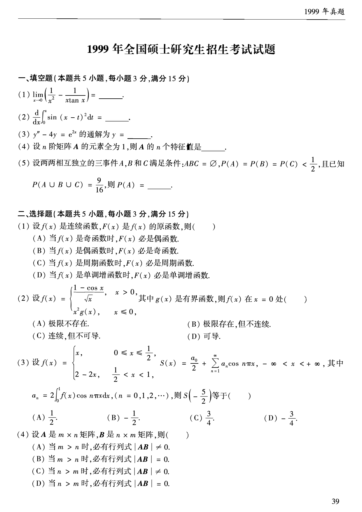
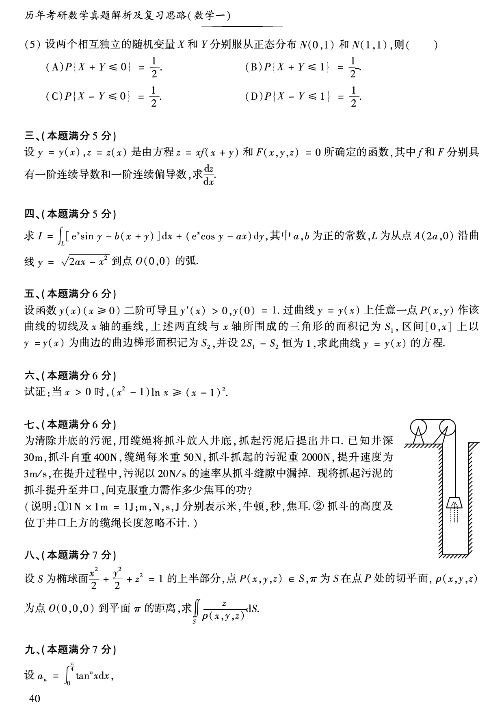
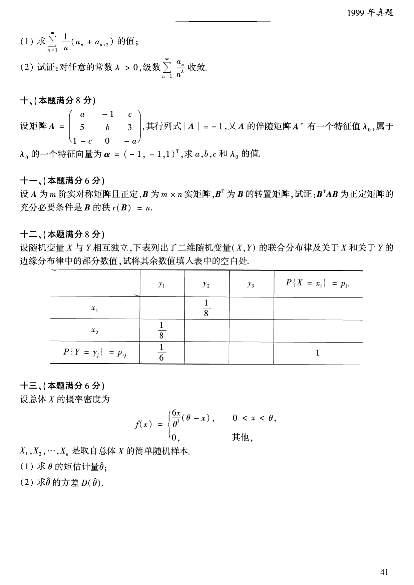

# 1999 年数学一真题

资料类型：考研数学一历年真题  
年份：1999  
科目：数学一  
来源 PDF：`D:\百度网盘\高数资料\【01】1987-2022年数学一真题（PDF）\【合集打印】1987-2009年考研数学一真题【 72页 】.pdf`  
整理状态：已按 PDF 页面图像人工视觉识别，待二次校对  

说明：原 PDF 文本层存在乱码和公式错位，本文件不再使用文本层抽取结果。题面依据渲染页图 `images/source_pages/page_040.png` 至 `page_042.png` 视觉转写。

## 1999 数一原卷题目

**第 1-9 题题图**

### 第 1 题

- 题型：填空题
- 题号：一(1)
- 分值：3
- PDF 页码：40
- 校对状态：人工视觉识别，待二次校对

$$
\lim_{x\to0}\left(\frac{1}{x^2}-\frac{1}{x\tan x}\right)=______。
$$

### 第 2 题

- 题型：填空题
- 题号：一(2)
- 分值：3
- PDF 页码：40
- 校对状态：人工视觉识别，待二次校对

$$
\frac{d}{dx}\int_0^x \sin\bigl((x-t)^2\bigr)\,dt=______。
$$

### 第 3 题

- 题型：填空题
- 题号：一(3)
- 分值：3
- PDF 页码：40
- 校对状态：人工视觉识别，待二次校对

$$
y''-4y=e^{2x}
$$

的通解为 $y=$______。

### 第 4 题

- 题型：填空题
- 题号：一(4)
- 分值：3
- PDF 页码：40
- 校对状态：人工视觉识别，待二次校对

设 $n$ 阶矩阵 $A$ 的元素全为 $1$，则 $A$ 的 $n$ 个特征值是______。

### 第 5 题

- 题型：填空题
- 题号：一(5)
- 分值：3
- PDF 页码：40
- 校对状态：人工视觉识别，待二次校对

设两两相互独立的三事件 $A,B,C$ 满足条件：$ABC=\varnothing$，

$$
P(A)=P(B)=P(C)<\frac{1}{2},
$$

且已知

$$
P(A\cup B\cup C)=\frac{9}{16},
$$

则 $P(A)=$______。

### 第 6 题

- 题型：选择题
- 题号：二(1)
- 分值：3
- PDF 页码：40
- 校对状态：人工视觉识别，待二次校对

设 $f(x)$ 是连续函数，$F(x)$ 是 $f(x)$ 的原函数，则（ ）。

A. 当 $f(x)$ 是奇函数时，$F(x)$ 必是偶函数  
B. 当 $f(x)$ 是偶函数时，$F(x)$ 必是奇函数  
C. 当 $f(x)$ 是周期函数时，$F(x)$ 必是周期函数  
D. 当 $f(x)$ 是单调增函数时，$F(x)$ 必是单调增函数

### 第 7 题

- 题型：选择题
- 题号：二(2)
- 分值：3
- PDF 页码：40
- 校对状态：人工视觉识别，待二次校对

设

$$
f(x)=
\begin{cases}
\dfrac{1-\cos x}{\sqrt{x}},&x>0,\\
x^2g(x),&x\le0,
\end{cases}
$$

其中 $g(x)$ 是有界函数，则 $f(x)$ 在 $x=0$ 处（ ）。

A. 极限不存在  
B. 极限存在，但不连续  
C. 连续，但不可导  
D. 可导

### 第 8 题

- 题型：选择题
- 题号：二(3)
- 分值：3
- PDF 页码：40
- 校对状态：人工视觉识别，待二次校对

设

$$
f(x)=
\begin{cases}
x,&0\le x\le\frac{1}{2},\\
2-2x,&\frac{1}{2}<x<1,
\end{cases}
$$

$$
S(x)=\frac{a_0}{2}+\sum_{n=1}^{\infty}a_n\cos n\pi x,\qquad -\infty<x<+\infty,
$$

其中

$$
a_n=2\int_0^1 f(x)\cos n\pi x\,dx\quad(n=0,1,2,\cdots),
$$

则 $S\left(-\frac{5}{2}\right)$ 等于（ ）。

A. $\frac{1}{2}$  
B. $-\frac{1}{2}$  
C. $\frac{3}{4}$  
D. $-\frac{3}{4}$

### 第 9 题

- 题型：选择题
- 题号：二(4)
- 分值：3
- PDF 页码：40
- 校对状态：人工视觉识别，待二次校对

设 $A$ 是 $m\times n$ 矩阵，$B$ 是 $n\times m$ 矩阵，则（ ）。

A. 当 $m>n$ 时，必有行列式 $|AB|\ne0$  
B. 当 $m>n$ 时，必有行列式 $|AB|=0$  
C. 当 $n>m$ 时，必有行列式 $|AB|\ne0$  
D. 当 $n>m$ 时，必有行列式 $|AB|=0$

**第 10-17 题题图**

### 第 10 题

- 题型：选择题
- 题号：二(5)
- 分值：3
- PDF 页码：41
- 校对状态：人工视觉识别，待二次校对

设两个相互独立的随机变量 $X$ 和 $Y$ 分别服从正态分布 $N(0,1)$ 和 $N(1,1)$，则（ ）。

A. $P\{X+Y\le0\}=\frac{1}{2}$  
B. $P\{X+Y\le1\}=\frac{1}{2}$  
C. $P\{X-Y\le0\}=\frac{1}{2}$  
D. $P\{X-Y\le1\}=\frac{1}{2}$

### 第 11 题

- 题型：解答题
- 题号：三
- 分值：5
- PDF 页码：41
- 校对状态：人工视觉识别，待二次校对

设 $y=y(x),\ z=z(x)$ 是由方程

$$
z=xf(x+y)
$$

和

$$
F(x,y,z)=0
$$

所确定的函数，其中 $f$ 和 $F$ 分别具有一阶连续导数和一阶连续偏导数，求 $\dfrac{dz}{dx}$。

### 第 12 题

- 题型：解答题
- 题号：四
- 分值：5
- PDF 页码：41
- 校对状态：人工视觉识别，待二次校对

求

$$
I=\int_L [e^x\sin y-b(x+y)]\,dx+(e^x\cos y-ax)\,dy,
$$

其中 $a,b$ 为正的常数，$L$ 为从点 $A(2a,0)$ 沿曲线

$$
y=\sqrt{2ax-x^2}
$$

到点 $O(0,0)$ 的弧。

### 第 13 题

- 题型：解答题
- 题号：五
- 分值：6
- PDF 页码：41
- 校对状态：人工视觉识别，待二次校对

设函数 $y=y(x)$（$x\ge0$）二阶可导且 $y'(x)>0,\ y(0)=1$。过曲线 $y=y(x)$ 上任意一点 $P(x,y)$ 作该曲线的切线及 $x$ 轴的垂线，上述两直线与 $x$ 轴所围成的三角形的面积记为 $S_1$，区间 $[0,x]$ 上以 $y=y(x)$ 为曲边的曲边梯形面积记为 $S_2$，并设 $2S_1-S_2$ 恒为 $1$，求此曲线 $y=y(x)$ 的方程。

### 第 14 题

- 题型：证明题
- 题号：六
- 分值：6
- PDF 页码：41
- 校对状态：人工视觉识别，待二次校对

试证：当 $x>0$ 时，

$$
(x^2-1)\ln x\ge (x-1)^2。
$$

### 第 15 题

- 题型：解答题
- 题号：七
- 分值：6
- PDF 页码：41
- 校对状态：人工视觉识别，待二次校对

为清除井底的污泥，用缆绳将抓斗放入井底，抓起污泥后提出井口。已知井深 $30\,\mathrm{m}$，抓斗自重 $400\,\mathrm{N}$，缆绳每米重 $50\,\mathrm{N}$，抓斗抓起的污泥重 $2000\,\mathrm{N}$，提升速度为 $3\,\mathrm{m/s}$，在提升过程中，污泥以 $20\,\mathrm{N/s}$ 的速率从抓斗缝隙中漏掉。现将抓起污泥的抓斗提升至井口，问克服重力需作多少焦耳的功？

说明：$1\,\mathrm{N}\times1\,\mathrm{m}=1\,\mathrm{J}$；$m,N,s,J$ 分别表示米、牛顿、秒、焦耳。抓斗的高度及位于井口上方的绳绳长度忽略不计。

### 第 16 题

- 题型：解答题
- 题号：八
- 分值：7
- PDF 页码：41
- 校对状态：人工视觉识别，待二次校对

设 $S$ 为椭球面

$$
\frac{x^2}{2}+\frac{y^2}{2}+z^2=1
$$

的上半部分，点 $P(x,y,z)\in S$，$\pi$ 为 $S$ 在点 $P$ 处的切平面，$\rho(x,y,z)$ 为点 $O(0,0,0)$ 到平面 $\pi$ 的距离，求

$$
\iint_S \frac{z}{\rho(x,y,z)}\,dS。
$$

**第 17-21 题题图**

### 第 17 题

- 题型：解答题
- 题号：九
- 分值：7
- PDF 页码：41-42
- 校对状态：人工视觉识别，待二次校对

设

$$
a_n=\int_0^{\frac{\pi}{4}}\tan^n x\,dx。
$$

(1) 求

$$
\sum_{n=1}^{\infty}\frac{1}{n}(a_n+a_{n+2})
$$

的值；

(2) 试证：对任意的常数 $\lambda>0$，级数

$$
\sum_{n=1}^{\infty}\frac{a_n}{n^\lambda}
$$

收敛。

### 第 18 题

- 题型：解答题
- 题号：十
- 分值：8
- PDF 页码：42
- 校对状态：人工视觉识别，待二次校对

设矩阵

$$
A=
\begin{pmatrix}
a&-1&c\\
5&b&3\\
1-c&0&-a
\end{pmatrix},
$$

其行列式 $|A|=-1$，又 $A$ 的伴随矩阵 $A^*$ 有一个特征值 $\lambda_0$，属于 $\lambda_0$ 的一个特征向量为

$$
\boldsymbol{\alpha}=(-1,-1,1)^T,
$$

求 $a,b,c$ 和 $\lambda_0$ 的值。

### 第 19 题

- 题型：证明题
- 题号：十一
- 分值：6
- PDF 页码：42
- 校对状态：人工视觉识别，待二次校对

设 $A$ 为 $m$ 阶实对称矩阵且正定，$B$ 为 $m\times n$ 实矩阵，$B^T$ 为 $B$ 的转置矩阵，试证：$B^TAB$ 为正定矩阵的充分必要条件是 $B$ 的秩 $r(B)=n$。

### 第 20 题

- 题型：解答题
- 题号：十二
- 分值：8
- PDF 页码：42
- 校对状态：人工视觉识别，待二次校对

设随机变量 $X$ 与 $Y$ 相互独立，下表列出了二维随机变量 $(X,Y)$ 的联合分布律及关于 $X$ 和关于 $Y$ 的边缘分布律中的部分数值，试将其余数值填入表中的空白处。

|  | $y_1$ | $y_2$ | $y_3$ | $P\{X=x_i\}=p_{i\cdot}$ |
| --- | --- | --- | --- | --- |
| $x_1$ |  | $\frac{1}{8}$ |  |  |
| $x_2$ | $\frac{1}{8}$ |  |  |  |
| $P\{Y=y_j\}=p_{\cdot j}$ | $\frac{1}{6}$ |  |  | 1 |

### 第 21 题

- 题型：解答题
- 题号：十三
- 分值：6
- PDF 页码：42
- 校对状态：人工视觉识别，待二次校对

设总体 $X$ 的概率密度为

$$
f(x)=
\begin{cases}
\dfrac{6x}{\theta^3}(\theta-x),&0<x<\theta,\\
0,&\text{其他},
\end{cases}
$$

$X_1,X_2,\cdots,X_n$ 是取自总体 $X$ 的简单随机样本。

(1) 求 $\theta$ 的矩估计量 $\hat{\theta}$；

(2) 求 $\hat{\theta}$ 的方差 $D(\hat{\theta})$。
