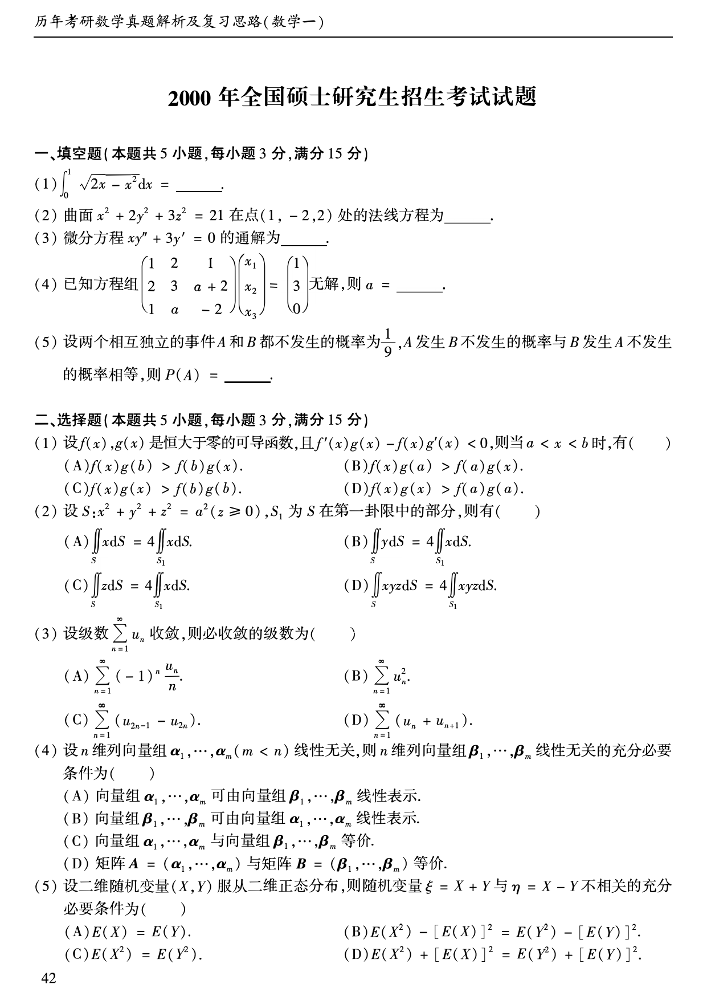
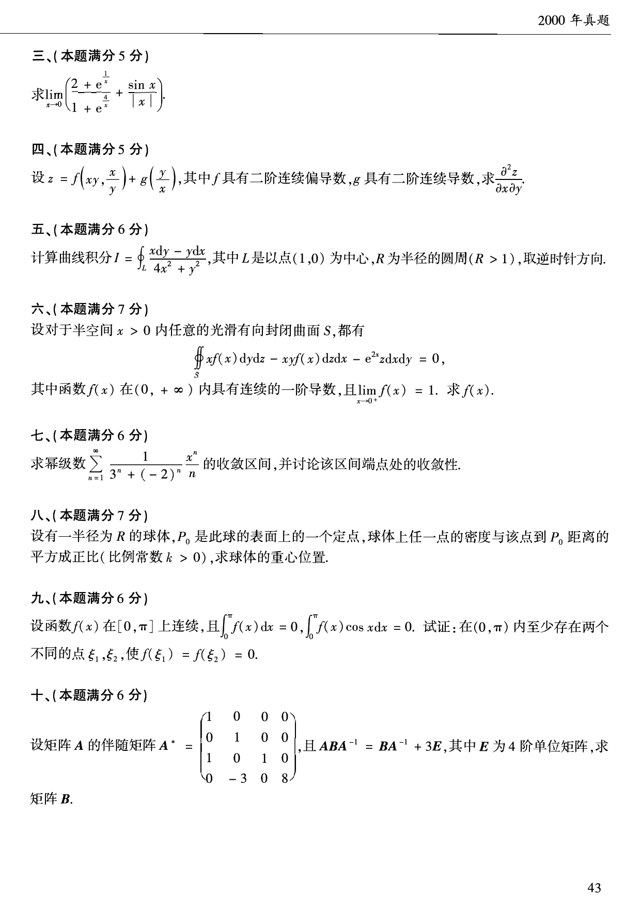
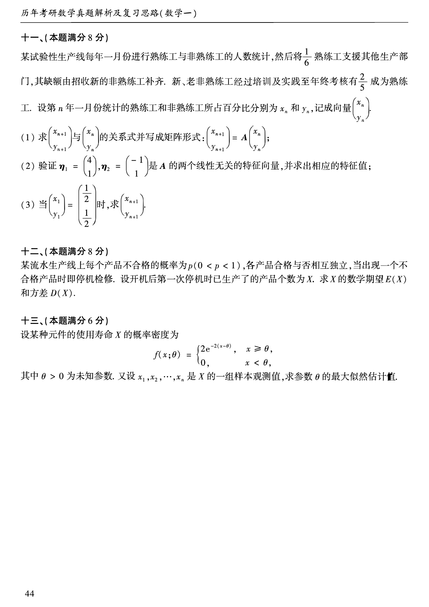

# 2000 年数学一真题

资料类型：考研数学一历年真题  
年份：2000  
科目：数学一  
来源 PDF：`D:\百度网盘\高数资料\【01】1987-2022年数学一真题（PDF）\【合集打印】1987-2009年考研数学一真题【 72页 】.pdf`  
整理状态：已按 PDF 页面图像人工视觉识别，待二次校对  

说明：原 PDF 文本层存在乱码和公式错位，本文件不再使用文本层抽取结果。题面依据渲染页图 `images/source_pages/page_043.png` 至 `page_045.png` 视觉转写。

## 2000 数一原卷题目

**第 1-10 题题图**

### 第 1 题

- 题型：填空题
- 题号：一(1)
- 分值：3
- PDF 页码：43
- 校对状态：人工视觉识别，待二次校对

$$
\int_0^1\sqrt{2x-x^2}\,dx=______。
$$

### 第 2 题

- 题型：填空题
- 题号：一(2)
- 分值：3
- PDF 页码：43
- 校对状态：人工视觉识别，待二次校对

曲面

$$
x^2+2y^2+3z^2=21
$$

在点 $(1,-2,2)$ 处的法线方程为______。

### 第 3 题

- 题型：填空题
- 题号：一(3)
- 分值：3
- PDF 页码：43
- 校对状态：人工视觉识别，待二次校对

微分方程

$$
xy''+3y'=0
$$

的通解为______。

### 第 4 题

- 题型：填空题
- 题号：一(4)
- 分值：3
- PDF 页码：43
- 校对状态：人工视觉识别，待二次校对

已知方程组

$$
\begin{pmatrix}
1&2&1\\
2&3&a+2\\
1&a&-2
\end{pmatrix}
\begin{pmatrix}
x_1\\x_2\\x_3
\end{pmatrix}
=
\begin{pmatrix}
1\\3\\0
\end{pmatrix}
$$

无解，则 $a=$______。

### 第 5 题

- 题型：填空题
- 题号：一(5)
- 分值：3
- PDF 页码：43
- 校对状态：人工视觉识别，待二次校对

设两个相互独立的事件 $A$ 和 $B$ 都不发生的概率为 $\frac{1}{9}$，$A$ 发生 $B$ 不发生的概率与 $B$ 发生 $A$ 不发生的概率相等，则 $P(A)=$______。

### 第 6 题

- 题型：选择题
- 题号：二(1)
- 分值：3
- PDF 页码：43
- 校对状态：人工视觉识别，待二次校对

设 $f(x),g(x)$ 是恒大于零的可导函数，且

$$
f'(x)g(x)-f(x)g'(x)<0,
$$

则当 $a<x<b$ 时，有（ ）。

A. $f(x)g(b)>f(b)g(x)$  
B. $f(x)g(a)>f(a)g(x)$  
C. $f(x)g(x)>f(b)g(b)$  
D. $f(x)g(x)>f(a)g(a)$

### 第 7 题

- 题型：选择题
- 题号：二(2)
- 分值：3
- PDF 页码：43
- 校对状态：人工视觉识别，待二次校对

设

$$
S:x^2+y^2+z^2=a^2\quad(z\ge0),
$$

$S_1$ 为 $S$ 在第一卦限中的部分，则有（ ）。

A. $\displaystyle\iint_S x\,dS=4\iint_{S_1}x\,dS$  
B. $\displaystyle\iint_S y\,dS=4\iint_{S_1}x\,dS$  
C. $\displaystyle\iint_S z\,dS=4\iint_{S_1}x\,dS$  
D. $\displaystyle\iint_S xyz\,dS=4\iint_{S_1}xyz\,dS$

### 第 8 题

- 题型：选择题
- 题号：二(3)
- 分值：3
- PDF 页码：43
- 校对状态：人工视觉识别，待二次校对

设级数 $\sum_{n=1}^{\infty}u_n$ 收敛，则必收敛的级数为（ ）。

A. $\displaystyle\sum_{n=1}^{\infty}(-1)^n\frac{u_n}{n}$  
B. $\displaystyle\sum_{n=1}^{\infty}u_n^2$  
C. $\displaystyle\sum_{n=1}^{\infty}(u_{2n-1}-u_{2n})$  
D. $\displaystyle\sum_{n=1}^{\infty}(u_n+u_{n+1})$

### 第 9 题

- 题型：选择题
- 题号：二(4)
- 分值：3
- PDF 页码：43
- 校对状态：人工视觉识别，待二次校对

设 $n$ 维列向量组 $\boldsymbol{\alpha}_1,\cdots,\boldsymbol{\alpha}_m\ (m<n)$ 线性无关，则 $n$ 维列向量组 $\boldsymbol{\beta}_1,\cdots,\boldsymbol{\beta}_m$ 线性无关的充分必要条件为（ ）。

A. 向量组 $\boldsymbol{\alpha}_1,\cdots,\boldsymbol{\alpha}_m$ 可由向量组 $\boldsymbol{\beta}_1,\cdots,\boldsymbol{\beta}_m$ 线性表示  
B. 向量组 $\boldsymbol{\beta}_1,\cdots,\boldsymbol{\beta}_m$ 可由向量组 $\boldsymbol{\alpha}_1,\cdots,\boldsymbol{\alpha}_m$ 线性表示  
C. 向量组 $\boldsymbol{\alpha}_1,\cdots,\boldsymbol{\alpha}_m$ 与向量组 $\boldsymbol{\beta}_1,\cdots,\boldsymbol{\beta}_m$ 等价  
D. 矩阵 $A=(\boldsymbol{\alpha}_1,\cdots,\boldsymbol{\alpha}_m)$ 与矩阵 $B=(\boldsymbol{\beta}_1,\cdots,\boldsymbol{\beta}_m)$ 等价

### 第 10 题

- 题型：选择题
- 题号：二(5)
- 分值：3
- PDF 页码：43
- 校对状态：人工视觉识别，待二次校对

设二维随机变量 $(X,Y)$ 服从二维正态分布，则随机变量 $\xi=X+Y$ 与 $\eta=X-Y$ 不相关的充分必要条件为（ ）。

A. $E(X)=E(Y)$  
B. $E(X^2)-[E(X)]^2=E(Y^2)-[E(Y)]^2$  
C. $E(X^2)=E(Y^2)$  
D. $E(X^2)+[E(X)]^2=E(Y^2)+[E(Y)]^2$

**第 11-18 题题图**

### 第 11 题

- 题型：解答题
- 题号：三
- 分值：5
- PDF 页码：44
- 校对状态：人工视觉识别，待二次校对

求

$$
\lim_{x\to0}\left(\frac{2+e^{\frac{1}{x}}}{1+e^{\frac{4}{x}}}+\frac{\sin x}{|x|}\right).
$$

### 第 12 题

- 题型：解答题
- 题号：四
- 分值：5
- PDF 页码：44
- 校对状态：人工视觉识别，待二次校对

设

$$
z=f\left(xy,\frac{x}{y}\right)+g\left(\frac{y}{x}\right),
$$

其中 $f$ 具有二阶连续偏导数，$g$ 具有二阶连续导数，求

$$
\frac{\partial^2 z}{\partial x\partial y}。
$$

### 第 13 题

- 题型：解答题
- 题号：五
- 分值：6
- PDF 页码：44
- 校对状态：人工视觉识别，待二次校对

计算曲线积分

$$
I=\oint_L\frac{x\,dy-y\,dx}{4x^2+y^2},
$$

其中 $L$ 是以点 $(1,0)$ 为中心，$R$ 为半径的圆周（$R>1$），取逆时针方向。

### 第 14 题

- 题型：解答题
- 题号：六
- 分值：7
- PDF 页码：44
- 校对状态：人工视觉识别，待二次校对

设对于半空间 $x>0$ 内任意的光滑有向封闭曲面 $S$，都有

$$
\oiint_S xf(x)\,dy\,dz-xyf(x)\,dz\,dx-e^{2x}z\,dx\,dy=0,
$$

其中函数 $f(x)$ 在 $(0,+\infty)$ 内具有连续的一阶导数，且

$$
\lim_{x\to0^+}f(x)=1。
$$

求 $f(x)$。

### 第 15 题

- 题型：解答题
- 题号：七
- 分值：6
- PDF 页码：44
- 校对状态：人工视觉识别，待二次校对

求幂级数

$$
\sum_{n=1}^{\infty}\frac{1}{3^n+(-2)^n}\frac{x^n}{n}
$$

的收敛区间，并讨论该区间端点处的收敛性。

### 第 16 题

- 题型：解答题
- 题号：八
- 分值：7
- PDF 页码：44
- 校对状态：人工视觉识别，待二次校对

设有一半径为 $R$ 的球体，$P_0$ 是此球的表面上的一个定点，球体上任一点的密度与该点到 $P_0$ 距离的平方成正比（比例常数 $k>0$），求球体的重心位置。

### 第 17 题

- 题型：证明题
- 题号：九
- 分值：6
- PDF 页码：44
- 校对状态：人工视觉识别，待二次校对

设函数 $f(x)$ 在 $[0,\pi]$ 上连续，且

$$
\int_0^\pi f(x)\,dx=0,\qquad \int_0^\pi f(x)\cos x\,dx=0。
$$

试证：在 $(0,\pi)$ 内至少存在两个不同的点 $\xi_1,\xi_2$，使

$$
f(\xi_1)=f(\xi_2)=0。
$$

### 第 18 题

- 题型：解答题
- 题号：十
- 分值：6
- PDF 页码：44
- 校对状态：人工视觉识别，待二次校对

设矩阵 $A$ 的伴随矩阵

$$
A^*=
\begin{pmatrix}
1&0&0&0\\
0&1&0&0\\
1&0&1&0\\
0&-3&0&8
\end{pmatrix},
$$

且

$$
ABA^{-1}=BA^{-1}+3E,
$$

其中 $E$ 为 $4$ 阶单位矩阵，求矩阵 $B$。

**第 19-21 题题图**

### 第 19 题

- 题型：解答题
- 题号：十一
- 分值：8
- PDF 页码：45
- 校对状态：人工视觉识别，待二次校对

某试验性生产线每年一月份进行熟练工与非熟练工的人数统计，然后将 $\frac{1}{6}$ 熟练工支援其他生产部门，其缺额由招收新的非熟练工补齐。新、老非熟练工经过培训及实践至年终考核有 $\frac{2}{5}$ 成为熟练工。设第 $n$ 年一月份统计的熟练工和非熟练工所占百分比分别为 $x_n$ 和 $y_n$，记成向量

$$
\begin{pmatrix}
x_n\\y_n
\end{pmatrix}.
$$

(1) 求

$$
\begin{pmatrix}
x_{n+1}\\y_{n+1}
\end{pmatrix}
$$

与

$$
\begin{pmatrix}
x_n\\y_n
\end{pmatrix}
$$

的关系式并写成矩阵形式：

$$
\begin{pmatrix}
x_{n+1}\\y_{n+1}
\end{pmatrix}
=A
\begin{pmatrix}
x_n\\y_n
\end{pmatrix};
$$

(2) 验证

$$
\boldsymbol{\eta}_1=
\begin{pmatrix}
4\\1
\end{pmatrix},
\qquad
\boldsymbol{\eta}_2=
\begin{pmatrix}
-1\\1
\end{pmatrix}
$$

是 $A$ 的两个线性无关的特征向量，并求出相应的特征值；

(3) 当

$$
\begin{pmatrix}
x_1\\y_1
\end{pmatrix}
=
\begin{pmatrix}
\frac{1}{2}\\\frac{1}{2}
\end{pmatrix}
$$

时，求

$$
\begin{pmatrix}
x_{n+1}\\y_{n+1}
\end{pmatrix}.
$$

### 第 20 题

- 题型：解答题
- 题号：十二
- 分值：8
- PDF 页码：45
- 校对状态：人工视觉识别，待二次校对

某流水生产线上每个产品不合格的概率为 $p\ (0<p<1)$，各产品合格与否相互独立，当出现一个不合格产品时即停机检修。设开机后第一次停机时已生产了的产品个数为 $X$。求 $X$ 的数学期望 $E(X)$ 和方差 $D(X)$。

### 第 21 题

- 题型：解答题
- 题号：十三
- 分值：6
- PDF 页码：45
- 校对状态：人工视觉识别，待二次校对

设某种元件的使用寿命 $X$ 的概率密度为

$$
f(x;\theta)=
\begin{cases}
2e^{-2(x-\theta)},&x\ge\theta,\\
0,&x<\theta,
\end{cases}
$$

其中 $\theta>0$ 为未知参数。又设 $x_1,x_2,\cdots,x_n$ 是 $X$ 的一组样本观测值，求参数 $\theta$ 的最大似然估计值。
