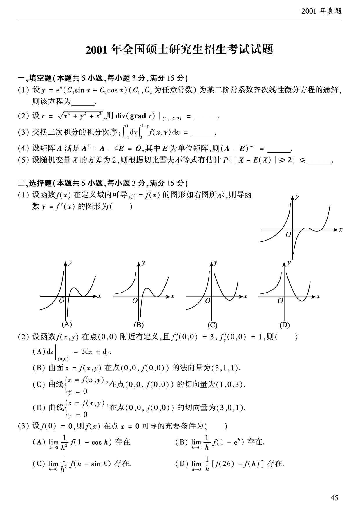
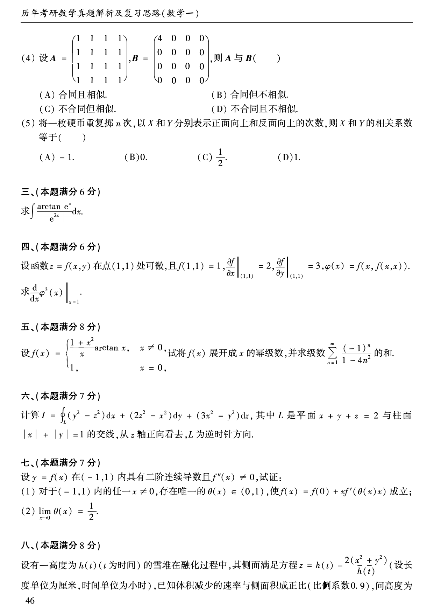
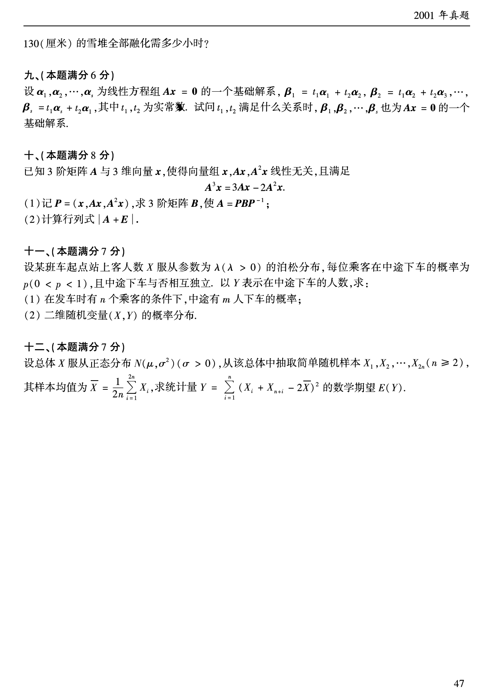

# 2001 年数学一真题

资料类型：考研数学一历年真题  
年份：2001  
科目：数学一  
来源 PDF：`D:\百度网盘\高数资料\【01】1987-2022年数学一真题（PDF）\【合集打印】1987-2009年考研数学一真题【 72页 】.pdf`  
整理状态：已按 PDF 页面图像人工视觉识别，待二次校对  

说明：原 PDF 文本层存在乱码和公式错位，本文件不再使用文本层抽取结果。题面依据渲染页图 `images/source_pages/page_046.png` 至 `page_048.png` 视觉转写。

## 2001 数一原卷题目

**第 1-5 题题图**

### 第 1 题

- 题型：填空题
- 题号：一(1)
- 分值：3
- PDF 页码：46
- 校对状态：人工视觉识别，待二次校对

设

$$
y=e^x(C_1\sin x+C_2\cos x)
$$

（$C_1,C_2$ 为任意常数）为某二阶常系数齐次线性微分方程的通解，则该方程为______。

### 第 2 题

- 题型：填空题
- 题号：一(2)
- 分值：3
- PDF 页码：46
- 校对状态：人工视觉识别，待二次校对

设

$$
r=\sqrt{x^2+y^2+z^2},
$$

则

$$
\operatorname{div}(\operatorname{grad} r)\big|_{(1,-2,2)}=______。
$$

### 第 3 题

- 题型：填空题
- 题号：一(3)
- 分值：3
- PDF 页码：46
- 校对状态：人工视觉识别，待二次校对

交换二次积分的积分次序：

$$
\int_{-1}^{0}dy\int_2^{1-y}f(x,y)\,dx=______。
$$

### 第 4 题

- 题型：填空题
- 题号：一(4)
- 分值：3
- PDF 页码：46
- 校对状态：人工视觉识别，待二次校对

设矩阵 $A$ 满足

$$
A^2+A-4E=O,
$$

其中 $E$ 为单位矩阵，则

$$
(A-E)^{-1}=______。
$$

### 第 5 题

- 题型：填空题
- 题号：一(5)
- 分值：3
- PDF 页码：46
- 校对状态：人工视觉识别，待二次校对

设随机变量 $X$ 的方差为 $2$，则根据切比雪夫不等式有估计

$$
P\{|X-E(X)|\ge2\}\le______。
$$

### 第 6 题

- 题型：选择题
- 题号：二(1)
- 分值：3
- PDF 页码：46
- 校对状态：人工视觉识别，待二次校对

原函数图像：

题干：

设函数 $f(x)$ 在定义域内可导，$y=f(x)$ 的图形如图所示，则导函数 $y=f'(x)$ 的图形为（ ）。

选项：

A.

B.

C.

D.

**第 7-8 题题图**

### 第 7 题

- 题型：选择题
- 题号：二(2)
- 分值：3
- PDF 页码：46
- 校对状态：人工视觉识别，待二次校对

设函数 $f(x,y)$ 在点 $(0,0)$ 附近有定义，且

$$
f'_x(0,0)=3,\qquad f'_y(0,0)=1,
$$

则（ ）。

A. $\displaystyle dz\big|_{(0,0)}=3\,dx+dy$  
B. 曲面 $z=f(x,y)$ 在点 $(0,0,f(0,0))$ 的法向量为 $(3,1,1)$  
C. 曲线 $\begin{cases}z=f(x,y),\\y=0\end{cases}$ 在点 $(0,0,f(0,0))$ 的切向量为 $(1,0,3)$  
D. 曲线 $\begin{cases}z=f(x,y),\\y=0\end{cases}$ 在点 $(0,0,f(0,0))$ 的切向量为 $(3,0,1)$

### 第 8 题

- 题型：选择题
- 题号：二(3)
- 分值：3
- PDF 页码：46
- 校对状态：人工视觉识别，待二次校对

设 $f(0)=0$，则 $f(x)$ 在点 $x=0$ 可导的充分必要条件为（ ）。

A. $\displaystyle\lim_{h\to0}\frac{1}{h^2}f(1-\cos h)$ 存在  
B. $\displaystyle\lim_{h\to0}\frac{1}{h}f(1-e^h)$ 存在  
C. $\displaystyle\lim_{h\to0}\frac{1}{h^2}f(h-\sin h)$ 存在  
D. $\displaystyle\lim_{h\to0}\frac{1}{h}[f(2h)-f(h)]$ 存在

**第 9-16 题题图**

### 第 9 题

- 题型：选择题
- 题号：二(4)
- 分值：3
- PDF 页码：47
- 校对状态：人工视觉识别，待二次校对

设

$$
A=
\begin{pmatrix}
1&1&1&1\\
1&1&1&1\\
1&1&1&1\\
1&1&1&1
\end{pmatrix},
\qquad
B=
\begin{pmatrix}
4&0&0&0\\
0&0&0&0\\
0&0&0&0\\
0&0&0&0
\end{pmatrix},
$$

则 $A$ 与 $B$（ ）。

A. 合同且相似  
B. 合同但不相似  
C. 不合同但相似  
D. 不合同且不相似

### 第 10 题

- 题型：选择题
- 题号：二(5)
- 分值：3
- PDF 页码：47
- 校对状态：人工视觉识别，待二次校对

将一枚硬币重复掷 $n$ 次，以 $X$ 和 $Y$ 分别表示正面向上和反面向上的次数，则 $X$ 和 $Y$ 的相关系数等于（ ）。

A. $-1$  
B. $0$  
C. $\frac{1}{2}$  
D. $1$

### 第 11 题

- 题型：解答题
- 题号：三
- 分值：6
- PDF 页码：47
- 校对状态：人工视觉识别，待二次校对

求

$$
\int \frac{\arctan e^x}{e^{2x}}\,dx。
$$

### 第 12 题

- 题型：解答题
- 题号：四
- 分值：6
- PDF 页码：47
- 校对状态：人工视觉识别，待二次校对

设函数 $z=f(x,y)$ 在点 $(1,1)$ 处可微，且

$$
f(1,1)=1,\qquad
\left.\frac{\partial f}{\partial x}\right|_{(1,1)}=2,\qquad
\left.\frac{\partial f}{\partial y}\right|_{(1,1)}=3,
$$

$$
\varphi(x)=f(x,f(x,x)).
$$

求

$$
\left.\frac{d}{dx}\varphi^3(x)\right|_{x=1}。
$$

### 第 13 题

- 题型：解答题
- 题号：五
- 分值：8
- PDF 页码：47
- 校对状态：人工视觉识别，待二次校对

设

$$
f(x)=
\begin{cases}
\dfrac{1+x^2}{x}\arctan x,&x\ne0,\\
1,&x=0,
\end{cases}
$$

试将 $f(x)$ 展开成 $x$ 的幂级数，并求级数

$$
\sum_{n=1}^{\infty}\frac{(-1)^n}{1-4n^2}
$$

的和。

### 第 14 题

- 题型：解答题
- 题号：六
- 分值：7
- PDF 页码：47
- 校对状态：人工视觉识别，待二次校对

计算

$$
I=\oint_L (y^2-z^2)\,dx+(2z^2-x^2)\,dy+(3x^2-y^2)\,dz,
$$

其中 $L$ 是平面 $x+y+z=2$ 与柱面 $|x|+|y|=1$ 的交线，从 $z$ 轴正向看去，$L$ 为逆时针方向。

### 第 15 题

- 题型：证明题
- 题号：七
- 分值：7
- PDF 页码：47
- 校对状态：人工视觉识别，待二次校对

设 $y=f(x)$ 在 $(-1,1)$ 内具有二阶连续导数且 $f''(x)\ne0$，试证：

(1) 对于 $(-1,1)$ 内的任一 $x\ne0$，存在唯一的 $\theta(x)\in(0,1)$，使

$$
f(x)=f(0)+xf'(\theta(x)x)
$$

成立；

(2)

$$
\lim_{x\to0}\theta(x)=\frac{1}{2}。
$$

**第 16-20 题题图**

### 第 16 题

- 题型：解答题
- 题号：八
- 分值：8
- PDF 页码：47-48
- 校对状态：人工视觉识别，待二次校对

设有一高度为 $h(t)$（$t$ 为时间）的雪堆在融化过程中，其侧面满足方程

$$
z=h(t)-\frac{2(x^2+y^2)}{h(t)}
$$

（设长度单位为厘米，时间单位为小时），已知体积减少的速率与侧面积成正比（比例系数 $0.9$），问高度为 $130$ 厘米的雪堆全部融化需多少小时？

### 第 17 题

- 题型：解答题
- 题号：九
- 分值：6
- PDF 页码：48
- 校对状态：人工视觉识别，待二次校对

设 $\boldsymbol{\alpha}_1,\boldsymbol{\alpha}_2,\cdots,\boldsymbol{\alpha}_s$ 为线性方程组 $A\boldsymbol{x}=0$ 的一个基础解系，

$$
\boldsymbol{\beta}_1=t_1\boldsymbol{\alpha}_1+t_2\boldsymbol{\alpha}_2,\quad
\boldsymbol{\beta}_2=t_1\boldsymbol{\alpha}_2+t_2\boldsymbol{\alpha}_3,\quad\cdots,\quad
\boldsymbol{\beta}_s=t_1\boldsymbol{\alpha}_s+t_2\boldsymbol{\alpha}_1,
$$

其中 $t_1,t_2$ 为实常数。试问 $t_1,t_2$ 满足什么关系时，$\boldsymbol{\beta}_1,\boldsymbol{\beta}_2,\cdots,\boldsymbol{\beta}_s$ 也为 $A\boldsymbol{x}=0$ 的一个基础解系。

### 第 18 题

- 题型：解答题
- 题号：十
- 分值：8
- PDF 页码：48
- 校对状态：人工视觉识别，待二次校对

已知 $3$ 阶矩阵 $A$ 与 $3$ 维向量 $\boldsymbol{x}$，使得向量组

$$
\boldsymbol{x},A\boldsymbol{x},A^2\boldsymbol{x}
$$

线性无关，且满足

$$
A^3\boldsymbol{x}=3A\boldsymbol{x}-2A^2\boldsymbol{x}。
$$

(1) 记

$$
P=(\boldsymbol{x},A\boldsymbol{x},A^2\boldsymbol{x}),
$$

求 $3$ 阶矩阵 $B$，使

$$
A=PBP^{-1};
$$

(2) 计算行列式 $\det(A+E)$。

### 第 19 题

- 题型：解答题
- 题号：十一
- 分值：7
- PDF 页码：48
- 校对状态：人工视觉识别，待二次校对

设某班车起点站上客人数 $X$ 服从参数为 $\lambda\ (\lambda>0)$ 的泊松分布，每位乘客在中途下车的概率为 $p\ (0<p<1)$，且中途下车与否相互独立。以 $Y$ 表示在中途下车的人数，求：

(1) 在发车时有 $n$ 个乘客的条件下，中途有 $m$ 人下车的概率；

(2) 二维随机变量 $(X,Y)$ 的概率分布。

### 第 20 题

- 题型：解答题
- 题号：十二
- 分值：7
- PDF 页码：48
- 校对状态：人工视觉识别，待二次校对

设总体 $X$ 服从正态分布 $N(\mu,\sigma^2)$（$\sigma>0$），从该总体中抽取简单随机样本

$$
X_1,X_2,\cdots,X_{2n}\quad(n\ge2),
$$

其样本均值为

$$
\overline{X}=\frac{1}{2n}\sum_{i=1}^{2n}X_i,
$$

求统计量

$$
Y=\sum_{i=1}^{n}(X_i+X_{n+i}-2\overline{X})^2
$$

的数学期望 $E(Y)$。
