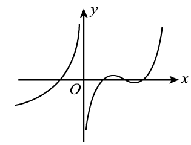
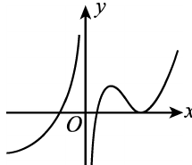
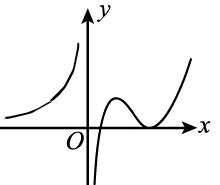
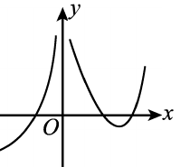
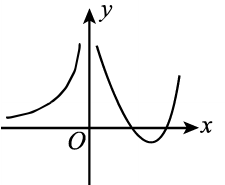

# 2001 数学一第 6 题

## 题目

原函数图像：

题干：

设函数 $f(x)$ 在定义域内可导，$y=f(x)$ 的图形如图所示，则导函数 $y=f'(x)$ 的图形为（ ）。

选项：

A.

B.

C.

D.

## 标准答案

D

## 解析

从题图看，$y=f(x)$ 在 $y$ 轴左侧严格单调增加，因此当 $x<0$ 时有
$$
f'(x)>0.
$$
导函数图像在这一段应位于 $x$ 轴上方，可排除 A、C。

又在 $y$ 轴右侧靠近 $y$ 轴的一段，原函数图像仍是单调增加的，所以导函数在这一段也应为正，可进一步排除 B。

故选 D。

## 来源

- 题目来源：`math1_2001_questions.md`
- 答案来源：`math1_2001_answers.md`
