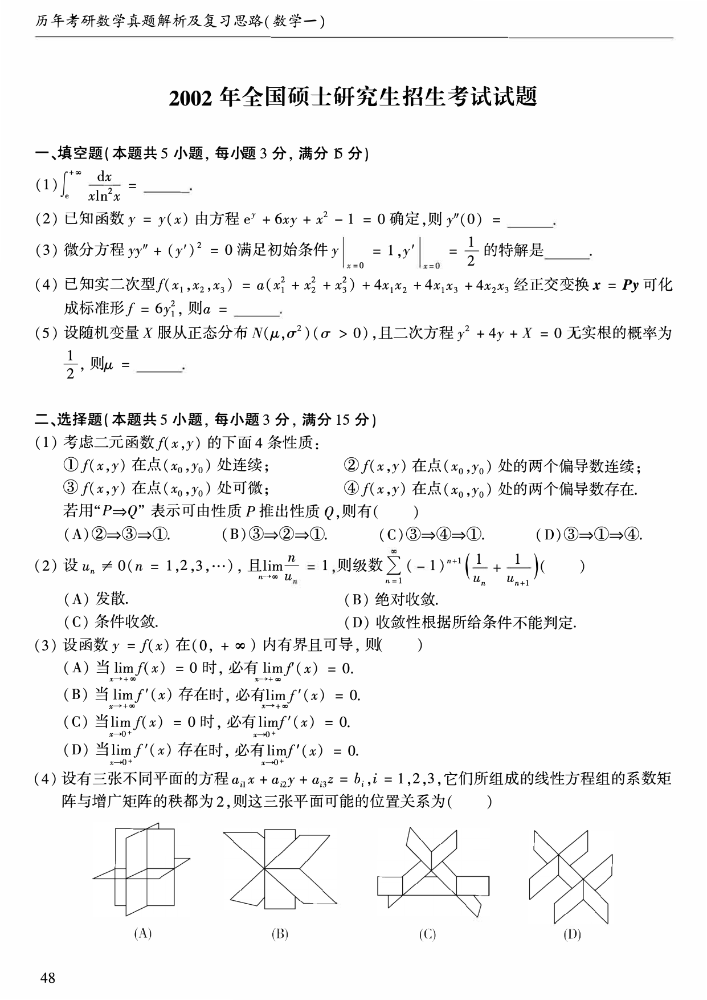
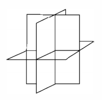
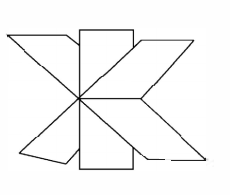
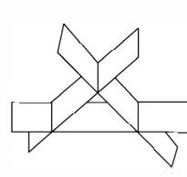
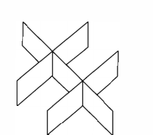
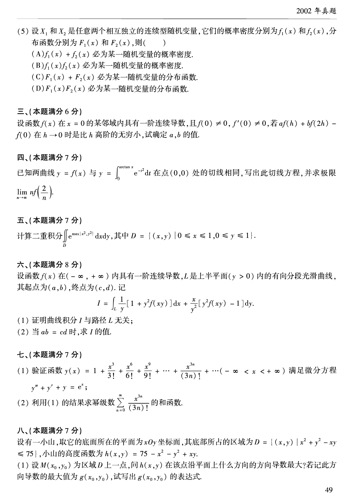
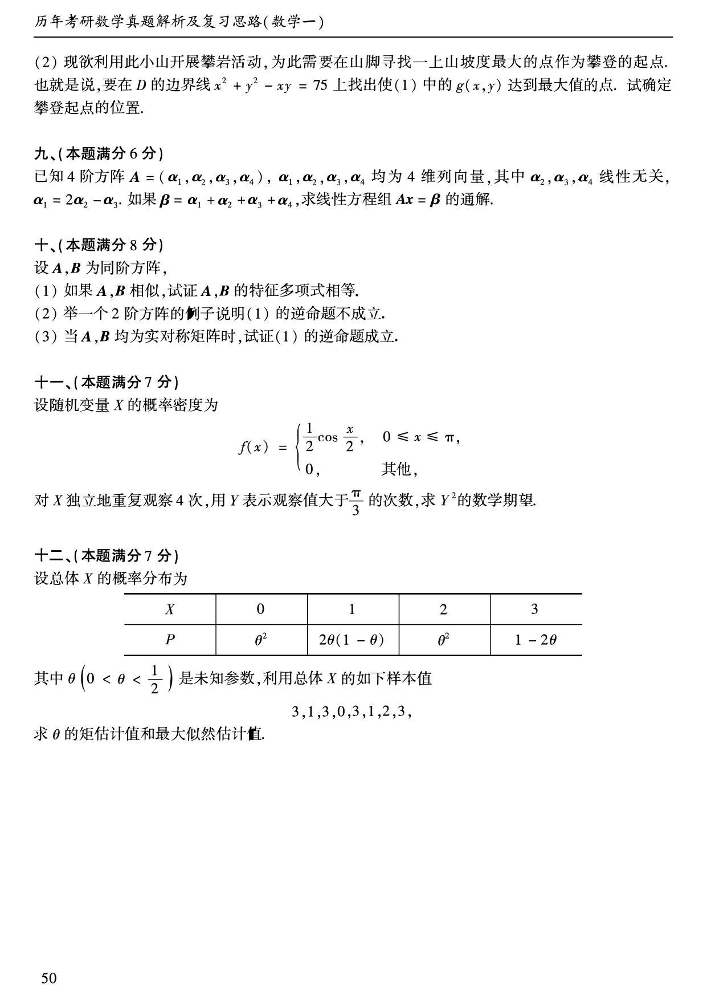

# 2002 年数学一真题

资料类型：考研数学一历年真题  
年份：2002  
科目：数学一  
来源 PDF：`D:\百度网盘\高数资料\【01】1987-2022年数学一真题（PDF）\【合集打印】1987-2009年考研数学一真题【 72页 】.pdf`  
整理状态：已按 PDF 页面图像人工视觉识别，待二次校对  

说明：原 PDF 文本层存在乱码和公式错位，本文件不再使用文本层抽取结果。题面依据渲染页图 `images/source_pages/page_049.png` 至 `page_051.png` 视觉转写。

## 2002 数一原卷题目

**第 1-8 题题图**

### 第 1 题

- 题型：填空题
- 题号：一(1)
- 分值：3
- PDF 页码：49
- 校对状态：人工视觉识别，待二次校对

$$
\int_e^{+\infty}\frac{dx}{x\ln^2 x}=______。
$$

### 第 2 题

- 题型：填空题
- 题号：一(2)
- 分值：3
- PDF 页码：49
- 校对状态：人工视觉识别，待二次校对

已知函数 $y=y(x)$ 由方程

$$
e^y+6xy+x^2-1=0
$$

确定，则 $y''(0)=$______。

### 第 3 题

- 题型：填空题
- 题号：一(3)
- 分值：3
- PDF 页码：49
- 校对状态：人工视觉识别，待二次校对

微分方程

$$
yy''+(y')^2=0
$$

满足初始条件

$$
y\big|_{x=0}=1,\qquad y'\big|_{x=0}=\frac{1}{2}
$$

的特解是______。

### 第 4 题

- 题型：填空题
- 题号：一(4)
- 分值：3
- PDF 页码：49
- 校对状态：人工视觉识别，待二次校对

已知实二次型

$$
f(x_1,x_2,x_3)=a(x_1^2+x_2^2+x_3^2)+4x_1x_2+4x_1x_3+4x_2x_3
$$

经正交变换 $\boldsymbol{x}=P\boldsymbol{y}$ 可化成标准形

$$
f=6y_1^2,
$$

则 $a=$______。

### 第 5 题

- 题型：填空题
- 题号：一(5)
- 分值：3
- PDF 页码：49
- 校对状态：人工视觉识别，待二次校对

设随机变量 $X$ 服从正态分布 $N(\mu,\sigma^2)$（$\sigma>0$），且二次方程

$$
y^2+4y+X=0
$$

无实根的概率为 $\frac{1}{2}$，则 $\mu=$______。

### 第 6 题

- 题型：选择题
- 题号：二(1)
- 分值：3
- PDF 页码：49
- 校对状态：人工视觉识别，待二次校对

考虑二元函数 $f(x,y)$ 的下面 $4$ 条性质：

① $f(x,y)$ 在点 $(x_0,y_0)$ 处连续；  
② $f(x,y)$ 在点 $(x_0,y_0)$ 处的两个偏导数连续；  
③ $f(x,y)$ 在点 $(x_0,y_0)$ 处可微；  
④ $f(x,y)$ 在点 $(x_0,y_0)$ 处的两个偏导数存在。

若用“$P\Rightarrow Q$”表示可由性质 $P$ 推出性质 $Q$，则有（ ）。

A. ② $\Rightarrow$ ③ $\Rightarrow$ ①  
B. ③ $\Rightarrow$ ② $\Rightarrow$ ①  
C. ③ $\Rightarrow$ ④ $\Rightarrow$ ①  
D. ③ $\Rightarrow$ ① $\Rightarrow$ ④

### 第 7 题

- 题型：选择题
- 题号：二(2)
- 分值：3
- PDF 页码：49
- 校对状态：人工视觉识别，待二次校对

设 $u_n\ne0\ (n=1,2,3,\cdots)$，且

$$
\lim_{n\to\infty}\frac{n}{u_n}=1,
$$

则级数

$$
\sum_{n=1}^{\infty}(-1)^{n+1}\left(\frac{1}{u_n}+\frac{1}{u_{n+1}}\right)
$$

（ ）。

A. 发散  
B. 绝对收敛  
C. 条件收敛  
D. 收敛性根据所给条件不能判定

### 第 8 题

- 题型：选择题
- 题号：二(3)
- 分值：3
- PDF 页码：49
- 校对状态：人工视觉识别，待二次校对

设函数 $y=f(x)$ 在 $(0,+\infty)$ 内有界且可导，则（ ）。

A. 当 $\displaystyle\lim_{x\to+\infty}f(x)=0$ 时，必有 $\displaystyle\lim_{x\to+\infty}f'(x)=0$  
B. 当 $\displaystyle\lim_{x\to+\infty}f'(x)$ 存在时，必有 $\displaystyle\lim_{x\to+\infty}f'(x)=0$  
C. 当 $\displaystyle\lim_{x\to0^+}f(x)=0$ 时，必有 $\displaystyle\lim_{x\to0^+}f'(x)=0$  
D. 当 $\displaystyle\lim_{x\to0^+}f'(x)$ 存在时，必有 $\displaystyle\lim_{x\to0^+}f'(x)=0$

### 第 9 题

- 题型：选择题
- 题号：二(4)
- 分值：3
- PDF 页码：49
- 校对状态：人工视觉识别，待二次校对

设有三张不同平面的方程

$$
a_{i1}x+a_{i2}y+a_{i3}z=b_i,\qquad i=1,2,3,
$$

它们所组成的线性方程组的系数矩阵与增广矩阵的秩都为 $2$，则这三张平面可能的位置关系为（ ）。

选项：

A.

B.

C.

D.

**第 10-16 题题图**

### 第 10 题

- 题型：选择题
- 题号：二(5)
- 分值：3
- PDF 页码：50
- 校对状态：人工视觉识别，待二次校对

设 $X_1$ 和 $X_2$ 是任意两个相互独立的连续型随机变量，它们的概率密度分别为 $f_1(x)$ 和 $f_2(x)$，分布函数分别为 $F_1(x)$ 和 $F_2(x)$，则（ ）。

A. $f_1(x)+f_2(x)$ 必为某一随机变量的概率密度  
B. $f_1(x)f_2(x)$ 必为某一随机变量的概率密度  
C. $F_1(x)+F_2(x)$ 必为某一随机变量的分布函数  
D. $F_1(x)F_2(x)$ 必为某一随机变量的分布函数

### 第 11 题

- 题型：解答题
- 题号：三
- 分值：6
- PDF 页码：50
- 校对状态：人工视觉识别，待二次校对

设函数 $f(x)$ 在 $x=0$ 的某邻域内具有一阶连续导数，且 $f(0)\ne0,\ f'(0)\ne0$，若

$$
af(h)+bf(2h)-f'(0)
$$

在 $h\to0$ 时是比 $h$ 高阶的无穷小，试确定 $a,b$ 的值。

### 第 12 题

- 题型：解答题
- 题号：四
- 分值：7
- PDF 页码：50
- 校对状态：人工视觉识别，待二次校对

已知两曲线 $y=f(x)$ 与

$$
y=\int_0^{\arctan x}e^{-t^2}\,dt
$$

在点 $(0,0)$ 处的切线相同，写出此切线方程，并求极限

$$
\lim_{n\to\infty} n f\left(\frac{2}{n}\right).
$$

### 第 13 题

- 题型：解答题
- 题号：五
- 分值：7
- PDF 页码：50
- 校对状态：人工视觉识别，待二次校对

计算二重积分

$$
\iint_D e^{\max\{x^2,y^2\}}\,dx\,dy,
$$

其中

$$
D=\{(x,y)\mid 0\le x\le1,\ 0\le y\le1\}.
$$

### 第 14 题

- 题型：解答题
- 题号：六
- 分值：8
- PDF 页码：50
- 校对状态：人工视觉识别，待二次校对

设函数 $f(x)$ 在 $(-\infty,+\infty)$ 内具有一阶连续导数，$L$ 是上半平面（$y>0$）内的有向分段光滑曲线，其起点为 $(a,b)$，终点为 $(c,d)$。记

$$
I=\int_L \frac{1}{y}[1+y^2f(xy)]\,dx+\frac{x}{y^2}[y^2f(xy)-1]\,dy.
$$

(1) 证明曲线积分 $I$ 与路径 $L$ 无关；

(2) 当 $ab=cd$ 时，求 $I$ 的值。

### 第 15 题

- 题型：解答题
- 题号：七
- 分值：7
- PDF 页码：50
- 校对状态：人工视觉识别，待二次校对

(1) 验证函数

$$
y(x)=1+\frac{x^3}{3!}+\frac{x^6}{6!}+\frac{x^9}{9!}+\cdots+\frac{x^{3n}}{(3n)!}+\cdots\quad(-\infty<x<+\infty)
$$

满足微分方程

$$
y''+y'+y=e^x;
$$

(2) 利用 (1) 的结果求幂级数

$$
\sum_{n=0}^{\infty}\frac{x^{3n}}{(3n)!}
$$

的和函数。

**第 16-20 题题图**

### 第 16 题

- 题型：解答题
- 题号：八
- 分值：7
- PDF 页码：50-51
- 校对状态：人工视觉识别，待二次校对

设有一小山，取它的底面所在的平面为 $xOy$ 坐标面，其底部所占的区域为

$$
D=\{(x,y)\mid x^2+y^2-xy\le75\},
$$

小山的高度函数为

$$
h(x,y)=75-x^2-y^2+xy。
$$

(1) 设 $M(x_0,y_0)$ 为区域 $D$ 上一点，问 $h(x,y)$ 在该点沿平面上什么方向的方向导数最大？若记此方向导数的最大值为 $g(x_0,y_0)$，试写出 $g(x_0,y_0)$ 的表达式。

(2) 现欲利用此小山开展攀岩活动，为此需要在山脚寻找一上山坡度最大的点作为攀登的起点。也就是说，要在 $D$ 的边界线

$$
x^2+y^2-xy=75
$$

上找出使 (1) 中的 $g(x,y)$ 达到最大值的点。试确定攀登起点的位置。

### 第 17 题

- 题型：解答题
- 题号：九
- 分值：6
- PDF 页码：51
- 校对状态：人工视觉识别，待二次校对

已知 $4$ 阶方阵

$$
A=(\boldsymbol{\alpha}_1,\boldsymbol{\alpha}_2,\boldsymbol{\alpha}_3,\boldsymbol{\alpha}_4),
$$

$\boldsymbol{\alpha}_1,\boldsymbol{\alpha}_2,\boldsymbol{\alpha}_3,\boldsymbol{\alpha}_4$ 均为 $4$ 维列向量，其中 $\boldsymbol{\alpha}_2,\boldsymbol{\alpha}_3,\boldsymbol{\alpha}_4$ 线性无关，

$$
\boldsymbol{\alpha}_1=2\boldsymbol{\alpha}_2-\boldsymbol{\alpha}_3.
$$

如果

$$
\boldsymbol{\beta}=\boldsymbol{\alpha}_1+\boldsymbol{\alpha}_2+\boldsymbol{\alpha}_3+\boldsymbol{\alpha}_4,
$$

求线性方程组 $A\boldsymbol{x}=\boldsymbol{\beta}$ 的通解。

### 第 18 题

- 题型：证明题
- 题号：十
- 分值：8
- PDF 页码：51
- 校对状态：人工视觉识别，待二次校对

设 $A,B$ 为同阶方阵，

(1) 如果 $A,B$ 相似，试证 $A,B$ 的特征多项式相等；

(2) 举一个 $2$ 阶方阵的例子说明 (1) 的逆命题不成立；

(3) 当 $A,B$ 均为实对称矩阵时，试证 (1) 的逆命题成立。

### 第 19 题

- 题型：解答题
- 题号：十一
- 分值：7
- PDF 页码：51
- 校对状态：人工视觉识别，待二次校对

设随机变量 $X$ 的概率密度为

$$
f(x)=
\begin{cases}
\frac{1}{2}\cos\frac{x}{2},&0\le x\le\pi,\\
0,&\text{其他},
\end{cases}
$$

对 $X$ 独立地重复观察 $4$ 次，用 $Y$ 表示观察值大于 $\frac{\pi}{3}$ 的次数，求 $Y^2$ 的数学期望。

### 第 20 题

- 题型：解答题
- 题号：十二
- 分值：7
- PDF 页码：51
- 校对状态：人工视觉识别，待二次校对

设总体 $X$ 的概率分布为

| $X$ | 0 | 1 | 2 | 3 |
| --- | --- | --- | --- | --- |
| $P$ | $\theta^2$ | $2\theta(1-\theta)$ | $\theta^2$ | $1-2\theta$ |

其中 $\theta\left(0<\theta<\frac{1}{2}\right)$ 是未知参数，利用总体 $X$ 的如下样本值

$$
3,\ 1,\ 3,\ 0,\ 3,\ 1,\ 2,\ 3,
$$

求 $\theta$ 的矩估计值和最大似然估计值。
