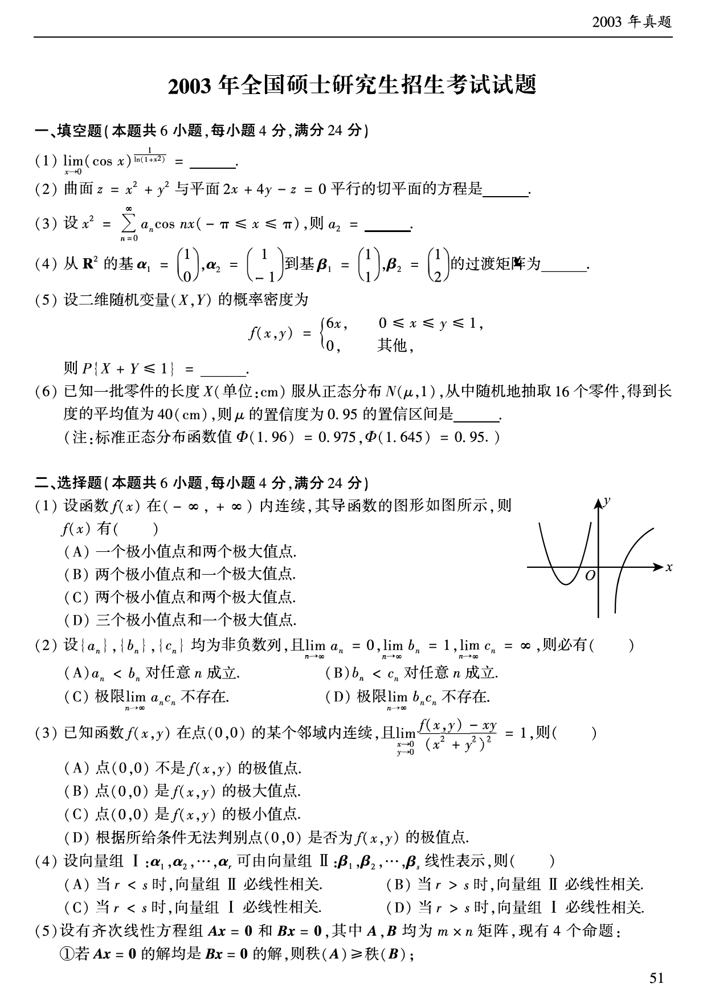
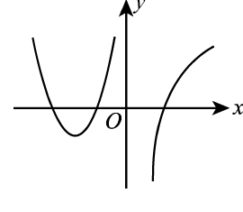
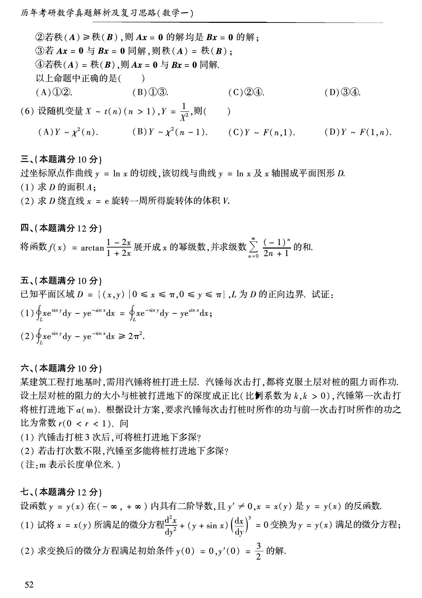
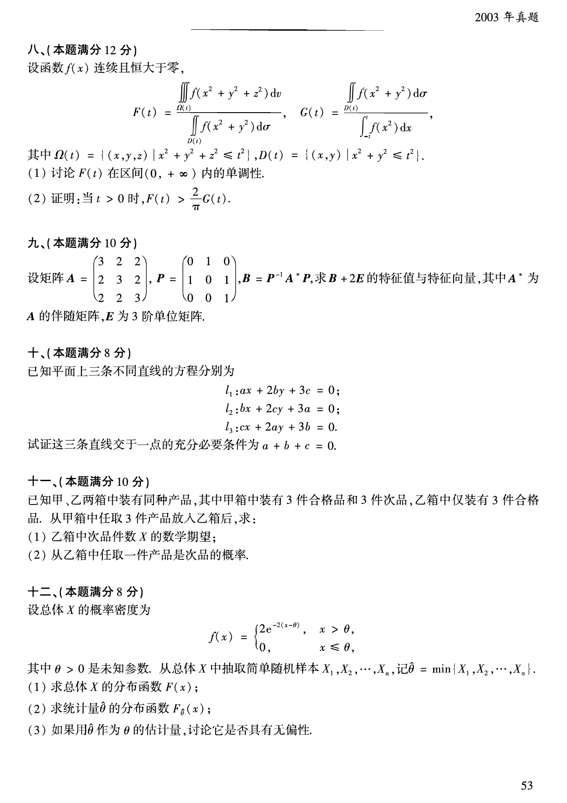

# 2003 年数学一真题

资料类型：考研数学一历年真题  
年份：2003  
科目：数学一  
来源 PDF：`D:\百度网盘\高数资料\【01】1987-2022年数学一真题（PDF）\【合集打印】1987-2009年考研数学一真题【 72页 】.pdf`  
整理状态：已按 PDF 页面图像人工视觉识别，待二次校对  

说明：原 PDF 文本层存在乱码和公式错位，本文件不再使用文本层抽取结果。题面依据渲染页图 `images/source_pages/page_052.png` 至 `page_054.png` 视觉转写。

## 2003 数一原卷题目

**第 1-6 题题图**

### 第 1 题

- 题型：填空题
- 题号：一(1)
- 分值：4
- PDF 页码：52
- 校对状态：人工视觉识别，待二次校对

$$
\lim_{x\to0}(\cos x)^{\frac{1}{\ln(1+x^2)}}=______。
$$

### 第 2 题

- 题型：填空题
- 题号：一(2)
- 分值：4
- PDF 页码：52
- 校对状态：人工视觉识别，待二次校对

曲面

$$
z=x^2+y^2
$$

与平面 $2x+4y-z=0$ 平行的切平面的方程是______。

### 第 3 题

- 题型：填空题
- 题号：一(3)
- 分值：4
- PDF 页码：52
- 校对状态：人工视觉识别，待二次校对

设

$$
x^2=\sum_{n=0}^{\infty}a_n\cos nx\qquad(-\pi\le x\le\pi),
$$

则 $a_2=$______。

### 第 4 题

- 题型：填空题
- 题号：一(4)
- 分值：4
- PDF 页码：52
- 校对状态：人工视觉识别，待二次校对

从 $\mathbb{R}^2$ 的基

$$
\boldsymbol{\alpha}_1=
\begin{pmatrix}
1\\0
\end{pmatrix},
\qquad
\boldsymbol{\alpha}_2=
\begin{pmatrix}
1\\-1
\end{pmatrix}
$$

到基

$$
\boldsymbol{\beta}_1=
\begin{pmatrix}
1\\1
\end{pmatrix},
\qquad
\boldsymbol{\beta}_2=
\begin{pmatrix}
1\\2
\end{pmatrix}
$$

的过渡矩阵为______。

### 第 5 题

- 题型：填空题
- 题号：一(5)
- 分值：4
- PDF 页码：52
- 校对状态：人工视觉识别，待二次校对

设二维随机变量 $(X,Y)$ 的概率密度为

$$
f(x,y)=
\begin{cases}
6x,&0\le x\le y\le1,\\
0,&\text{其他},
\end{cases}
$$

则 $P\{X+Y\le1\}=$______。

### 第 6 题

- 题型：填空题
- 题号：一(6)
- 分值：4
- PDF 页码：52
- 校对状态：人工视觉识别，待二次校对

已知一批零件的长度 $X$（单位：cm）服从正态分布 $N(\mu,1)$，从中随机地抽取 $16$ 个零件，得到长度的平均值为 $40\,\mathrm{cm}$，则 $\mu$ 的置信度为 $0.95$ 的置信区间是______。

注：标准正态分布函数值 $\Phi(1.96)=0.975,\ \Phi(1.645)=0.95$。

### 第 7 题

- 题型：选择题
- 题号：二(1)
- 分值：4
- PDF 页码：52
- 校对状态：人工视觉识别，待二次校对

导函数图像：

图形说明：图中给出的是 $y=f'(x)$ 的图像；左侧分支先下降后上升并与 $x$ 轴有两个交点，右侧分支单调上升并与 $x$ 轴有一个交点。

题干：

设函数 $f(x)$ 在 $(-\infty,+\infty)$ 内连续，其导函数的图形如图所示，则 $f(x)$ 有（ ）。

A. 一个极小值点和两个极大值点  
B. 两个极小值点和一个极大值点  
C. 两个极小值点和两个极大值点  
D. 三个极小值点和一个极大值点

**第 8-11 题题图**

### 第 8 题

- 题型：选择题
- 题号：二(2)
- 分值：4
- PDF 页码：52
- 校对状态：人工视觉识别，待二次校对

设 $\{a_n\},\{b_n\},\{c_n\}$ 均为非负数列，且

$$
\lim_{n\to\infty}a_n=0,\qquad
\lim_{n\to\infty}b_n=1,\qquad
\lim_{n\to\infty}c_n=\infty,
$$

则必有（ ）。

A. $a_n<b_n$ 对任意 $n$ 成立  
B. $b_n<c_n$ 对任意 $n$ 成立  
C. 极限 $\lim_{n\to\infty}a_nc_n$ 不存在  
D. 极限 $\lim_{n\to\infty}b_nc_n$ 不存在

### 第 9 题

- 题型：选择题
- 题号：二(3)
- 分值：4
- PDF 页码：52
- 校对状态：人工视觉识别，待二次校对

已知函数 $f(x,y)$ 在点 $(0,0)$ 的某个邻域内连续，且

$$
\lim_{\substack{x\to0\\y\to0}}\frac{f(x,y)-xy}{(x^2+y^2)^2}=1,
$$

则（ ）。

A. 点 $(0,0)$ 不是 $f(x,y)$ 的极值点  
B. 点 $(0,0)$ 是 $f(x,y)$ 的极大值点  
C. 点 $(0,0)$ 是 $f(x,y)$ 的极小值点  
D. 根据所给条件无法判别点 $(0,0)$ 是否为 $f(x,y)$ 的极值点

### 第 10 题

- 题型：选择题
- 题号：二(4)
- 分值：4
- PDF 页码：52
- 校对状态：人工视觉识别，待二次校对

设向量组 I：$\boldsymbol{\alpha}_1,\boldsymbol{\alpha}_2,\cdots,\boldsymbol{\alpha}_r$ 可由向量组 II：$\boldsymbol{\beta}_1,\boldsymbol{\beta}_2,\cdots,\boldsymbol{\beta}_s$ 线性表示，则（ ）。

A. 当 $r<s$ 时，向量组 II 必线性相关  
B. 当 $r>s$ 时，向量组 II 必线性相关  
C. 当 $r<s$ 时，向量组 I 必线性相关  
D. 当 $r>s$ 时，向量组 I 必线性相关

**第 11-17 题题图**

### 第 11 题

- 题型：选择题
- 题号：二(5)
- 分值：4
- PDF 页码：52-53
- 校对状态：人工视觉识别，待二次校对

设有齐次线性方程组 $A\boldsymbol{x}=0$ 和 $B\boldsymbol{x}=0$，其中 $A,B$ 均为 $m\times n$ 矩阵。现有 $4$ 个命题：

① 若 $A\boldsymbol{x}=0$ 的解均是 $B\boldsymbol{x}=0$ 的解，则秩 $(A)\ge$ 秩 $(B)$；  
② 若秩 $(A)\ge$ 秩 $(B)$，则 $A\boldsymbol{x}=0$ 的解均是 $B\boldsymbol{x}=0$ 的解；  
③ 若 $A\boldsymbol{x}=0$ 与 $B\boldsymbol{x}=0$ 同解，则秩 $(A)=$ 秩 $(B)$；  
④ 若秩 $(A)=$ 秩 $(B)$，则 $A\boldsymbol{x}=0$ 与 $B\boldsymbol{x}=0$ 同解。

以上命题中正确的是（ ）。

A. ①②  
B. ①③  
C. ②④  
D. ③④

### 第 12 题

- 题型：选择题
- 题号：二(6)
- 分值：4
- PDF 页码：53
- 校对状态：人工视觉识别，待二次校对

设随机变量 $X\sim t(n)$（$n>1$），

$$
Y=\frac{1}{X^2},
$$

则（ ）。

A. $Y\sim\chi^2(n)$  
B. $Y\sim\chi^2(n-1)$  
C. $Y\sim F(n,1)$  
D. $Y\sim F(1,n)$

### 第 13 题

- 题型：解答题
- 题号：三
- 分值：10
- PDF 页码：53
- 校对状态：人工视觉识别，待二次校对

过坐标原点作曲线 $y=\ln x$ 的切线，该切线与曲线 $y=\ln x$ 及 $x$ 轴围成平面图形 $D$。

(1) 求 $D$ 的面积 $A$；

(2) 求 $D$ 绕直线 $x=e$ 旋转一周所得旋转体的体积 $V$。

### 第 14 题

- 题型：解答题
- 题号：四
- 分值：12
- PDF 页码：53
- 校对状态：人工视觉识别，待二次校对

将函数

$$
f(x)=\arctan\frac{1-2x}{1+2x}
$$

展开成 $x$ 的幂级数，并求级数

$$
\sum_{n=0}^{\infty}\frac{(-1)^n}{2n+1}
$$

的和。

### 第 15 题

- 题型：证明题
- 题号：五
- 分值：10
- PDF 页码：53
- 校对状态：人工视觉识别，待二次校对

已知平面区域

$$
D=\{(x,y)\mid 0\le x\le\pi,\ 0\le y\le\pi\},
$$

$L$ 为 $D$ 的正向边界。试证：

(1)

$$
\oint_L xe^{\sin y}\,dy-ye^{-\sin x}\,dx
=
\oint_L xe^{-\sin y}\,dy-ye^{\sin x}\,dx;
$$

(2)

$$
\oint_L xe^{\sin y}\,dy-ye^{-\sin x}\,dx\ge2\pi^2。
$$

### 第 16 题

- 题型：解答题
- 题号：六
- 分值：10
- PDF 页码：53
- 校对状态：人工视觉识别，待二次校对

某建筑工程打地基时，需用汽锤将桩打进土层。汽锤每次击打，都将克服土层对桩的阻力而作功。设土层对桩的阻力的大小与桩被打进地下的深度成正比（比例系数为 $k,\ k>0$），汽锤第一次击打将桩打进地下 $a\,(\mathrm{m})$。根据设计方案，要求汽锤每次击打桩时所作的功与前一次击打时所作的功之比为常数 $r\ (0<r<1)$。问：

(1) 汽锤击打桩 $3$ 次后，可将桩打进地下多深？

(2) 若击打次数不限，汽锤至多能将桩打进地下多深？

注：$m$ 表示长度单位米。

### 第 17 题

- 题型：解答题
- 题号：七
- 分值：12
- PDF 页码：53
- 校对状态：人工视觉识别，待二次校对

设函数 $y=y(x)$ 在 $(-\infty,+\infty)$ 内具有二阶导数，且 $y'\ne0$，$x=x(y)$ 是 $y=y(x)$ 的反函数。

(1) 试将 $x=x(y)$ 所满足的微分方程

$$
\frac{d^2x}{dy^2}+(y+\sin x)\left(\frac{dx}{dy}\right)^3=0
$$

变换为 $y=y(x)$ 满足的微分方程；

(2) 求变换后的微分方程满足初始条件

$$
y(0)=0,\qquad y'(0)=\frac{3}{2}
$$

的解。

**第 18-22 题题图**

### 第 18 题

- 题型：证明题
- 题号：八
- 分值：12
- PDF 页码：54
- 校对状态：人工视觉识别，待二次校对

设函数 $f(x)$ 连续且恒大于零，

$$
F(t)=
\frac{\iiint_{\Omega(t)} f(x^2+y^2+z^2)\,dv}
{\iint_{D(t)} f(x^2+y^2)\,d\sigma},
$$

$$
G(t)=
\frac{\iint_{D(t)} f(x^2+y^2)\,d\sigma}
{\int_{-t}^{t} f(x^2)\,dx},
$$

其中

$$
\Omega(t)=\{(x,y,z)\mid x^2+y^2+z^2\le t^2\},
$$

$$
D(t)=\{(x,y)\mid x^2+y^2\le t^2\}.
$$

(1) 讨论 $F(t)$ 在区间 $(0,+\infty)$ 内的单调性；

(2) 证明：当 $t>0$ 时，

$$
F(t)>\frac{2}{\pi}G(t)。
$$

### 第 19 题

- 题型：解答题
- 题号：九
- 分值：10
- PDF 页码：54
- 校对状态：人工视觉识别，待二次校对

设矩阵

$$
A=
\begin{pmatrix}
3&2&2\\
2&3&2\\
2&2&3
\end{pmatrix},
\qquad
P=
\begin{pmatrix}
0&1&0\\
1&0&1\\
0&0&1
\end{pmatrix},
$$

$$
B=P^{-1}A^*P,
$$

求 $B+2E$ 的特征值与特征向量，其中 $A^*$ 为 $A$ 的伴随矩阵，$E$ 为 $3$ 阶单位矩阵。

### 第 20 题

- 题型：证明题
- 题号：十
- 分值：8
- PDF 页码：54
- 校对状态：人工视觉识别，待二次校对

已知平面上三条不同直线的方程分别为

$$
l_1:ax+2by+3c=0,
$$

$$
l_2:bx+2cy+3a=0,
$$

$$
l_3:cx+2ay+3b=0.
$$

试证这三条直线交于一点的充分必要条件为

$$
a+b+c=0。
$$

### 第 21 题

- 题型：解答题
- 题号：十一
- 分值：10
- PDF 页码：54
- 校对状态：人工视觉识别，待二次校对

已知甲、乙两箱中装有同种产品，其中甲箱中装有 $3$ 件合格品和 $3$ 件次品，乙箱中仅装有 $3$ 件合格品。从甲箱中任取 $3$ 件产品放入乙箱后，求：

(1) 乙箱中次品件数 $X$ 的数学期望；

(2) 从乙箱中任取一件产品是次品的概率。

### 第 22 题

- 题型：解答题
- 题号：十二
- 分值：8
- PDF 页码：54
- 校对状态：人工视觉识别，待二次校对

设总体 $X$ 的概率密度为

$$
f(x)=
\begin{cases}
2e^{-2(x-\theta)},&x>\theta,\\
0,&x\le\theta,
\end{cases}
$$

其中 $\theta>0$ 是未知参数。从总体 $X$ 中抽取简单随机样本 $X_1,X_2,\cdots,X_n$，记

$$
\hat{\theta}=\min\{X_1,X_2,\cdots,X_n\}.
$$

(1) 求总体 $X$ 的分布函数 $F(x)$；

(2) 求统计量 $\hat{\theta}$ 的分布函数 $F_{\hat{\theta}}(x)$；

(3) 如果用 $\hat{\theta}$ 作为 $\theta$ 的估计量，讨论它是否具有无偏性。
