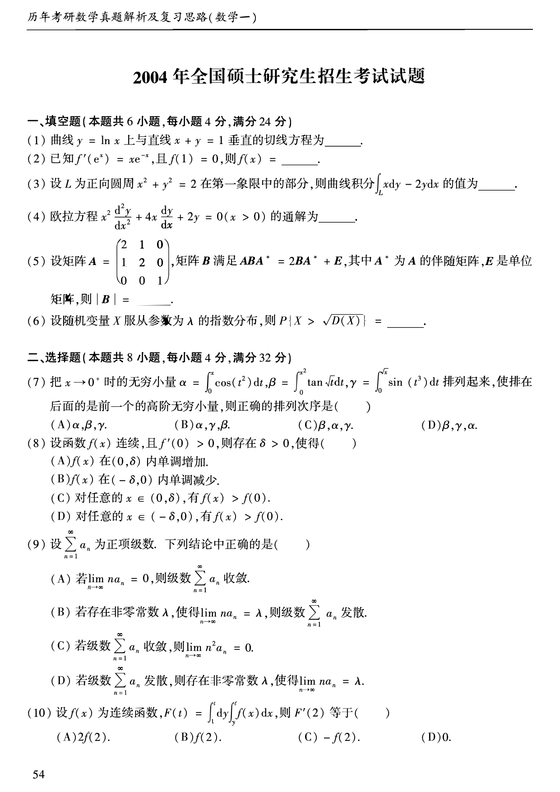
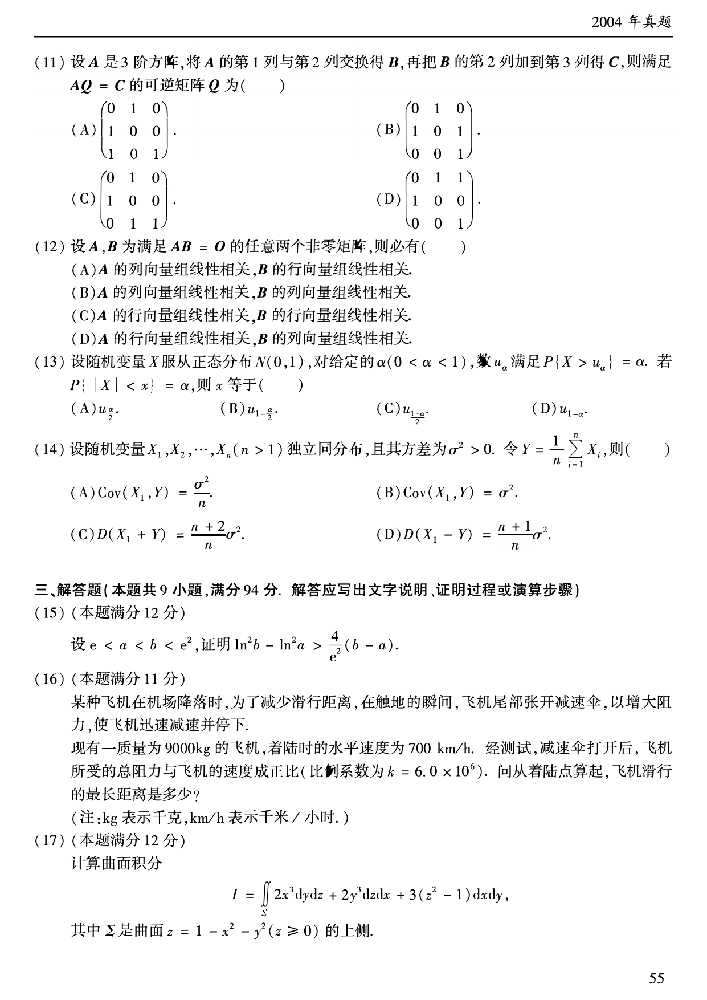
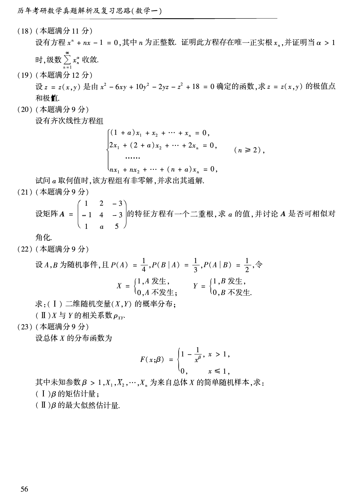

# 2004 年数学一真题

资料类型：考研数学一历年真题  
年份：2004  
科目：数学一  
来源 PDF：`D:\百度网盘\高数资料\【01】1987-2022年数学一真题（PDF）\【合集打印】1987-2009年考研数学一真题【 72页 】.pdf`  
整理状态：已按 PDF 页面图像人工视觉识别，待二次校对  

说明：原 PDF 文本层存在乱码和公式错位，本文件不再使用文本层抽取结果。题面依据渲染页图 `images/source_pages/page_055.png` 至 `page_057.png` 视觉转写。

## 2004 数一原卷题目

**第 1-10 题题图**

### 第 1 题

- 题型：填空题
- 题号：一(1)
- 分值：4
- PDF 页码：55
- 校对状态：人工视觉识别，待二次校对

曲线 $y=\ln x$ 上与直线 $x+y=1$ 垂直的切线方程为______。

### 第 2 题

- 题型：填空题
- 题号：一(2)
- 分值：4
- PDF 页码：55
- 校对状态：人工视觉识别，待二次校对

已知

$$
f'(e^x)=xe^{-x},
$$

且 $f(1)=0$，则 $f(x)=$______。

### 第 3 题

- 题型：填空题
- 题号：一(3)
- 分值：4
- PDF 页码：55
- 校对状态：人工视觉识别，待二次校对

设 $L$ 为正向圆周 $x^2+y^2=2$ 在第一象限中的部分，则曲线积分

$$
\int_L x\,dy-2y\,dx
$$

的值为______。

### 第 4 题

- 题型：填空题
- 题号：一(4)
- 分值：4
- PDF 页码：55
- 校对状态：人工视觉识别，待二次校对

欧拉方程

$$
x^2\frac{d^2y}{dx^2}+4x\frac{dy}{dx}+2y=0\quad(x>0)
$$

的通解为______。

### 第 5 题

- 题型：填空题
- 题号：一(5)
- 分值：4
- PDF 页码：55
- 校对状态：人工视觉识别，待二次校对

设矩阵

$$
A=
\begin{pmatrix}
2&1&0\\
1&2&0\\
0&0&1
\end{pmatrix},
$$

矩阵 $B$ 满足

$$
ABA^*=2BA^*+E,
$$

其中 $A^*$ 为 $A$ 的伴随矩阵，$E$ 是单位矩阵，则 $\det B=$______。

### 第 6 题

- 题型：填空题
- 题号：一(6)
- 分值：4
- PDF 页码：55
- 校对状态：人工视觉识别，待二次校对

设随机变量 $X$ 服从参数为 $\lambda$ 的指数分布，则

$$
P\{X>\sqrt{D(X)}\}=______。
$$

### 第 7 题

- 题型：选择题
- 题号：二(7)
- 分值：4
- PDF 页码：55
- 校对状态：人工视觉识别，待二次校对

把 $x\to0^+$ 时的无穷小量

$$
\alpha=\int_0^x\cos(t^2)\,dt,\qquad
\beta=\int_0^{x^2}\tan\sqrt{t}\,dt,\qquad
\gamma=\int_0^{\sqrt{x}}\sin(t^3)\,dt
$$

排列起来，使排在后面的是前一个的高阶无穷小，则正确的排列次序是（ ）。

A. $\alpha,\beta,\gamma$  
B. $\alpha,\gamma,\beta$  
C. $\beta,\alpha,\gamma$  
D. $\beta,\gamma,\alpha$

### 第 8 题

- 题型：选择题
- 题号：二(8)
- 分值：4
- PDF 页码：55
- 校对状态：人工视觉识别，待二次校对

设函数 $f(x)$ 连续，且 $f'(0)>0$，则存在 $\delta>0$，使得（ ）。

A. $f(x)$ 在 $(0,\delta)$ 内单调增加  
B. $f(x)$ 在 $(-\delta,0)$ 内单调减少  
C. 对任意的 $x\in(0,\delta)$，有 $f(x)>f(0)$  
D. 对任意的 $x\in(-\delta,0)$，有 $f(x)>f(0)$

### 第 9 题

- 题型：选择题
- 题号：二(9)
- 分值：4
- PDF 页码：55
- 校对状态：人工视觉识别，待二次校对

设 $\sum_{n=1}^{\infty}a_n$ 为正项级数。下列结论中正确的是（ ）。

A. 若 $\displaystyle\lim_{n\to\infty}na_n=0$，则级数 $\sum_{n=1}^{\infty}a_n$ 收敛  
B. 若存在非零常数 $\lambda$，使得 $\displaystyle\lim_{n\to\infty}na_n=\lambda$，则级数 $\sum_{n=1}^{\infty}a_n$ 发散  
C. 若级数 $\sum_{n=1}^{\infty}a_n$ 收敛，则 $\displaystyle\lim_{n\to\infty}n^2a_n=0$  
D. 若级数 $\sum_{n=1}^{\infty}a_n$ 发散，则存在非零常数 $\lambda$，使得 $\displaystyle\lim_{n\to\infty}na_n=\lambda$

### 第 10 题

- 题型：选择题
- 题号：二(10)
- 分值：4
- PDF 页码：55
- 校对状态：人工视觉识别，待二次校对

设 $f(x)$ 为连续函数，

$$
F(t)=\int_1^t dy\int_y^t f(x)\,dx,
$$

则 $F'(2)$ 等于（ ）。

A. $2f(2)$  
B. $f(2)$  
C. $-f(2)$  
D. $0$

**第 11-17 题题图**

### 第 11 题

- 题型：选择题
- 题号：二(11)
- 分值：4
- PDF 页码：56
- 校对状态：人工视觉识别，待二次校对

设 $A$ 是 $3$ 阶方阵，将 $A$ 的第 $1$ 列与第 $2$ 列交换得 $B$，再把 $B$ 的第 $2$ 列加到第 $3$ 列得 $C$，则满足 $AQ=C$ 的可逆矩阵 $Q$ 为（ ）。

A.
$$
\begin{pmatrix}
0&1&0\\
1&0&0\\
1&0&1
\end{pmatrix}
$$

B.
$$
\begin{pmatrix}
0&1&0\\
1&0&1\\
0&0&1
\end{pmatrix}
$$

C.
$$
\begin{pmatrix}
0&1&0\\
1&0&0\\
0&1&1
\end{pmatrix}
$$

D.
$$
\begin{pmatrix}
0&1&1\\
1&0&0\\
0&0&1
\end{pmatrix}
$$

### 第 12 题

- 题型：选择题
- 题号：二(12)
- 分值：4
- PDF 页码：56
- 校对状态：人工视觉识别，待二次校对

设 $A,B$ 为满足 $AB=O$ 的任意两个非零矩阵，则必有（ ）。

A. $A$ 的列向量组线性相关，$B$ 的行向量组线性相关  
B. $A$ 的列向量组线性相关，$B$ 的列向量组线性相关  
C. $A$ 的行向量组线性相关，$B$ 的行向量组线性相关  
D. $A$ 的行向量组线性相关，$B$ 的列向量组线性相关

### 第 13 题

- 题型：选择题
- 题号：二(13)
- 分值：4
- PDF 页码：56
- 校对状态：人工视觉识别，待二次校对

设随机变量 $X$ 服从正态分布 $N(0,1)$，对给定的 $\alpha\ (0<\alpha<1)$，数 $u_\alpha$ 满足

$$
P\{X>u_\alpha\}=\alpha。
$$

若 $P\{|X|<x\}=\alpha$，则 $x$ 等于（ ）。

A. $u_{\frac{\alpha}{2}}$  
B. $u_{1-\frac{\alpha}{2}}$  
C. $u_{\frac{1-\alpha}{2}}$  
D. $u_{1-\alpha}$

### 第 14 题

- 题型：选择题
- 题号：二(14)
- 分值：4
- PDF 页码：56
- 校对状态：人工视觉识别，待二次校对

设随机变量 $X_1,X_2,\cdots,X_n\ (n>1)$ 独立同分布，且其方差为 $\sigma^2>0$。令

$$
Y=\frac{1}{n}\sum_{i=1}^{n}X_i,
$$

则（ ）。

A. $\operatorname{Cov}(X_1,Y)=\dfrac{\sigma^2}{n}$  
B. $\operatorname{Cov}(X_1,Y)=\sigma^2$  
C. $D(X_1+Y)=\dfrac{n+2}{n}\sigma^2$  
D. $D(X_1-Y)=\dfrac{n+1}{n}\sigma^2$

### 第 15 题

- 题型：证明题
- 题号：三(15)
- 分值：12
- PDF 页码：56
- 校对状态：人工视觉识别，待二次校对

设 $e<a<b<e^2$，证明

$$
\ln^2 b-\ln^2 a>\frac{4}{e^2}(b-a)。
$$

### 第 16 题

- 题型：解答题
- 题号：三(16)
- 分值：11
- PDF 页码：56
- 校对状态：人工视觉识别，待二次校对

某种飞机在机场降落时，为了减少滑行距离，在触地的瞬间，飞机尾部张开减速伞，以增大阻力，使飞机迅速减速并停下。

现有一质量为 $9000\,\mathrm{kg}$ 的飞机，着陆时的水平速度为 $700\,\mathrm{km/h}$。经测试，减速伞打开后，飞机所受的总阻力与飞机的速度成正比（比例系数为 $k=6.0\times10^6$）。问从着陆点算起，飞机滑行的最长距离是多少？

注：$\mathrm{kg}$ 表示千克，$\mathrm{km/h}$ 表示千米/小时。

### 第 17 题

- 题型：解答题
- 题号：三(17)
- 分值：12
- PDF 页码：56
- 校对状态：人工视觉识别，待二次校对

计算曲面积分

$$
I=\iint_{\Sigma}2x^3\,dy\,dz+2y^3\,dz\,dx+3(z^2-1)\,dx\,dy,
$$

其中 $\Sigma$ 是曲面

$$
z=1-x^2-y^2\quad(z\ge0)
$$

的上侧。

**第 18-23 题题图**

### 第 18 题

- 题型：证明题
- 题号：三(18)
- 分值：11
- PDF 页码：57
- 校对状态：人工视觉识别，待二次校对

设有方程

$$
x^n+nx-1=0,
$$

其中 $n$ 为正整数。证明此方程存在唯一正实根 $x_n$，并证明当 $\alpha>1$ 时，级数

$$
\sum_{n=1}^{\infty}x_n^\alpha
$$

收敛。

### 第 19 题

- 题型：解答题
- 题号：三(19)
- 分值：12
- PDF 页码：57
- 校对状态：人工视觉识别，待二次校对

设 $z=z(x,y)$ 是由

$$
x^2-6xy+10y^2-2yz-z^2+18=0
$$

确定的函数，求 $z=z(x,y)$ 的极值点和极值。

### 第 20 题

- 题型：解答题
- 题号：三(20)
- 分值：9
- PDF 页码：57
- 校对状态：人工视觉识别，待二次校对

设有齐次线性方程组

$$
\begin{cases}
(1+a)x_1+x_2+\cdots+x_n=0,\\
2x_1+(2+a)x_2+\cdots+2x_n=0,\\
\cdots\\
nx_1+nx_2+\cdots+(n+a)x_n=0
\end{cases}
\qquad(n\ge2),
$$

试问 $a$ 取何值时，该方程组有非零解，并求出其通解。

### 第 21 题

- 题型：解答题
- 题号：三(21)
- 分值：9
- PDF 页码：57
- 校对状态：人工视觉识别，待二次校对

设矩阵

$$
A=
\begin{pmatrix}
1&2&-3\\
-1&4&-3\\
1&a&5
\end{pmatrix}
$$

的特征方程有一个二重根，求 $a$ 的值，并讨论 $A$ 是否可相似对角化。

### 第 22 题

- 题型：解答题
- 题号：三(22)
- 分值：9
- PDF 页码：57
- 校对状态：人工视觉识别，待二次校对

设 $A,B$ 为随机事件，且

$$
P(A)=\frac{1}{4},\qquad P(B\mid A)=\frac{1}{3},\qquad P(A\mid B)=\frac{1}{2}。
$$

令

$$
X=
\begin{cases}
1,&A\text{ 发生},\\
0,&A\text{ 不发生},
\end{cases}
\qquad
Y=
\begin{cases}
1,&B\text{ 发生},\\
0,&B\text{ 不发生}.
\end{cases}
$$

求：

(I) 二维随机变量 $(X,Y)$ 的概率分布；

(II) $X$ 与 $Y$ 的相关系数 $\rho_{XY}$。

### 第 23 题

- 题型：解答题
- 题号：三(23)
- 分值：9
- PDF 页码：57
- 校对状态：人工视觉识别，待二次校对

设总体 $X$ 的分布函数为

$$
F(x;\beta)=
\begin{cases}
1-\dfrac{1}{x^\beta},&x>1,\\
0,&x\le1,
\end{cases}
$$

其中未知参数 $\beta>1$，$X_1,X_2,\cdots,X_n$ 为来自总体 $X$ 的简单随机样本，求：

(I) $\beta$ 的矩估计量；

(II) $\beta$ 的最大似然估计量。
