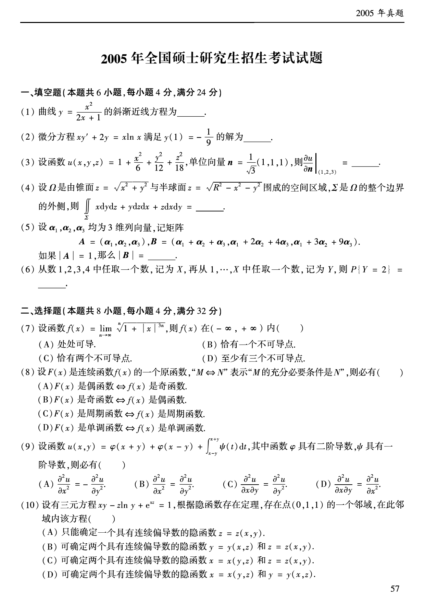
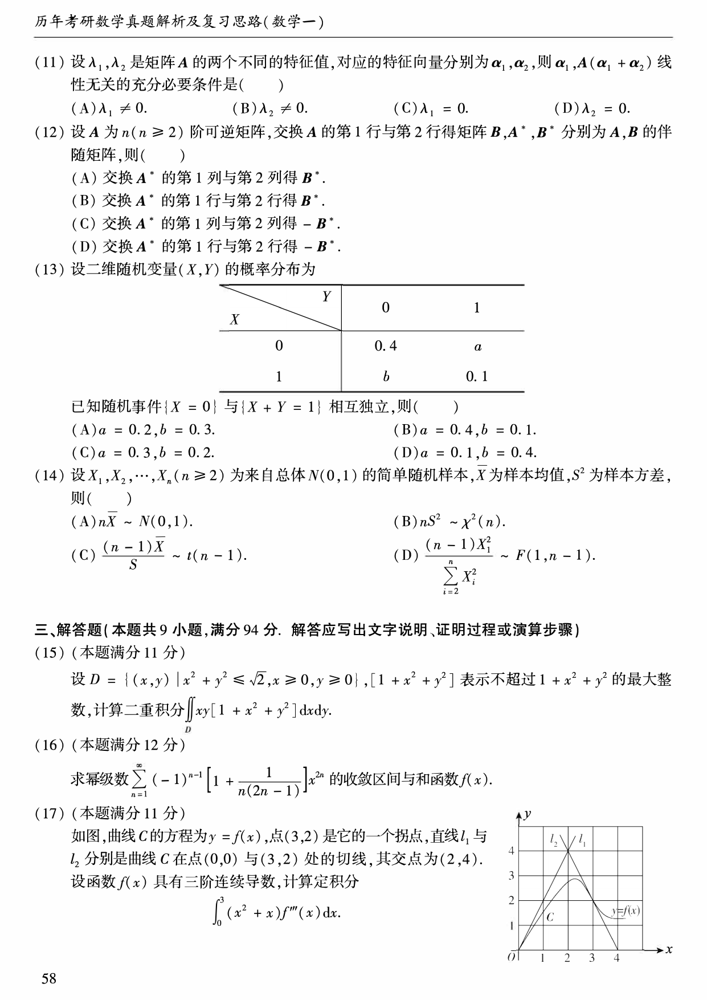
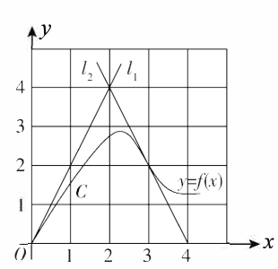
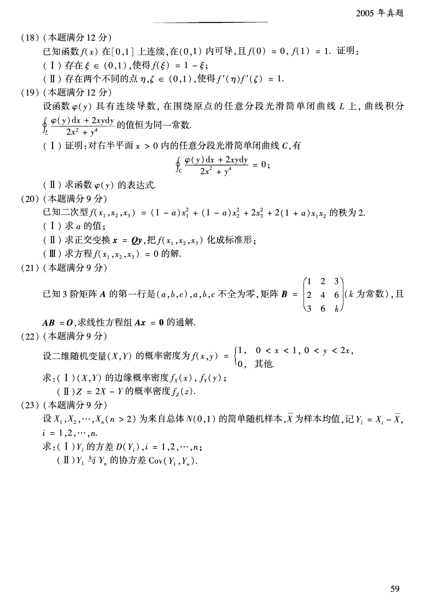

# 2005 年数学一真题

资料类型：考研数学一历年真题  
年份：2005  
科目：数学一  
来源 PDF：`D:\百度网盘\高数资料\【01】1987-2022年数学一真题（PDF）\【合集打印】1987-2009年考研数学一真题【 72页 】.pdf`  
整理状态：已按 PDF 页面图像人工视觉识别，待二次校对  

说明：原 PDF 文本层存在乱码和公式错位，本文件不再使用文本层抽取结果。题面依据渲染页图 `images/source_pages/page_058.png` 至 `page_060.png` 视觉转写。

## 2005 数一原卷题目

**第 1-10 题题图**

### 第 1 题

- 题型：填空题
- 题号：一(1)
- 分值：4
- PDF 页码：58
- 校对状态：人工视觉识别，待二次校对

曲线

$$
y=\frac{x^2}{2x+1}
$$

的斜渐近线方程为______。

### 第 2 题

- 题型：填空题
- 题号：一(2)
- 分值：4
- PDF 页码：58
- 校对状态：人工视觉识别，待二次校对

微分方程

$$
xy'+2y=x\ln x
$$

满足 $y(1)=-\frac{1}{9}$ 的解为______。

### 第 3 题

- 题型：填空题
- 题号：一(3)
- 分值：4
- PDF 页码：58
- 校对状态：人工视觉识别，待二次校对

设函数

$$
u(x,y,z)=1+\frac{x^2}{6}+\frac{y^2}{12}+\frac{z^2}{18},
$$

单位向量

$$
\boldsymbol{n}=\frac{1}{\sqrt{3}}(1,1,1),
$$

则

$$
\left.\frac{\partial u}{\partial n}\right|_{(1,2,3)}=______。
$$

### 第 4 题

- 题型：填空题
- 题号：一(4)
- 分值：4
- PDF 页码：58
- 校对状态：人工视觉识别，待二次校对

设 $\Omega$ 是由锥面

$$
z=\sqrt{x^2+y^2}
$$

与半球面

$$
z=\sqrt{R^2-x^2-y^2}
$$

围成的空间区域，$\Sigma$ 是 $\Omega$ 的整个边界的外侧，则

$$
\iint_{\Sigma}x\,dy\,dz+y\,dz\,dx+z\,dx\,dy=______。
$$

### 第 5 题

- 题型：填空题
- 题号：一(5)
- 分值：4
- PDF 页码：58
- 校对状态：人工视觉识别，待二次校对

设 $\boldsymbol{\alpha}_1,\boldsymbol{\alpha}_2,\boldsymbol{\alpha}_3$ 均为 $3$ 维列向量，记矩阵

$$
A=(\boldsymbol{\alpha}_1,\boldsymbol{\alpha}_2,\boldsymbol{\alpha}_3),
$$

$$
B=(\boldsymbol{\alpha}_1+\boldsymbol{\alpha}_2+\boldsymbol{\alpha}_3,\ 
\boldsymbol{\alpha}_1+2\boldsymbol{\alpha}_2+4\boldsymbol{\alpha}_3,\ 
\boldsymbol{\alpha}_1+3\boldsymbol{\alpha}_2+9\boldsymbol{\alpha}_3).
$$

如果 $\det A=1$，那么 $\det B=$______。

### 第 6 题

- 题型：填空题
- 题号：一(6)
- 分值：4
- PDF 页码：58
- 校对状态：人工视觉识别，待二次校对

从数 $1,2,3,4$ 中任取一个数，记为 $X$，再从 $1,\cdots,X$ 中任取一个数，记为 $Y$，则

$$
P\{Y=2\}=______。
$$

### 第 7 题

- 题型：选择题
- 题号：二(7)
- 分值：4
- PDF 页码：58
- 校对状态：人工视觉识别，待二次校对

设函数

$$
f(x)=\lim_{n\to\infty}\sqrt[n]{1+|x|^{3n}},
$$

则 $f(x)$ 在 $(-\infty,+\infty)$ 内（ ）。

A. 处处可导  
B. 恰有一个不可导点  
C. 恰有两个不可导点  
D. 至少有三个不可导点

### 第 8 题

- 题型：选择题
- 题号：二(8)
- 分值：4
- PDF 页码：58
- 校对状态：人工视觉识别，待二次校对

设 $F(x)$ 是连续函数 $f(x)$ 的一个原函数，“$M\Leftrightarrow N$”表示“$M$ 的充分必要条件是 $N$”，则必有（ ）。

A. $F(x)$ 是偶函数 $\Leftrightarrow f(x)$ 是奇函数  
B. $F(x)$ 是奇函数 $\Leftrightarrow f(x)$ 是偶函数  
C. $F(x)$ 是周期函数 $\Leftrightarrow f(x)$ 是周期函数  
D. $F(x)$ 是单调函数 $\Leftrightarrow f(x)$ 是单调函数

### 第 9 题

- 题型：选择题
- 题号：二(9)
- 分值：4
- PDF 页码：58
- 校对状态：人工视觉识别，待二次校对

设函数

$$
u(x,y)=\varphi(x+y)+\varphi(x-y)+\int_{x-y}^{x+y}\psi(t)\,dt,
$$

其中函数 $\varphi$ 具有二阶导数，$\psi$ 具有一阶导数，则必有（ ）。

A. $\dfrac{\partial^2u}{\partial x^2}=-\dfrac{\partial^2u}{\partial y^2}$  
B. $\dfrac{\partial^2u}{\partial x^2}=\dfrac{\partial^2u}{\partial y^2}$  
C. $\dfrac{\partial^2u}{\partial x\partial y}=\dfrac{\partial^2u}{\partial y^2}$  
D. $\dfrac{\partial^2u}{\partial x\partial y}=\dfrac{\partial^2u}{\partial x^2}$

### 第 10 题

- 题型：选择题
- 题号：二(10)
- 分值：4
- PDF 页码：58
- 校对状态：人工视觉识别，待二次校对

设有三元方程

$$
xy-z\ln y+e^{xz}=1,
$$

根据隐函数存在定理，存在点 $(0,1,1)$ 的一个邻域，在此邻域内该方程（ ）。

A. 只能确定一个具有连续偏导数的隐函数 $z=z(x,y)$  
B. 可确定两个具有连续偏导数的隐函数 $y=y(x,z)$ 和 $z=z(x,y)$  
C. 可确定两个具有连续偏导数的隐函数 $x=x(y,z)$ 和 $z=z(x,y)$  
D. 可确定两个具有连续偏导数的隐函数 $x=x(y,z)$ 和 $y=y(x,z)$

**第 11-16 题题图**

### 第 11 题

- 题型：选择题
- 题号：二(11)
- 分值：4
- PDF 页码：59
- 校对状态：人工视觉识别，待二次校对

设 $\lambda_1,\lambda_2$ 是矩阵 $A$ 的两个不同的特征值，对应的特征向量分别为 $\boldsymbol{\alpha}_1,\boldsymbol{\alpha}_2$，则 $\boldsymbol{\alpha}_1,\ A(\boldsymbol{\alpha}_1+\boldsymbol{\alpha}_2)$ 线性无关的充分必要条件是（ ）。

A. $\lambda_1\ne0$  
B. $\lambda_2\ne0$  
C. $\lambda_1=0$  
D. $\lambda_2=0$

### 第 12 题

- 题型：选择题
- 题号：二(12)
- 分值：4
- PDF 页码：59
- 校对状态：人工视觉识别，待二次校对

设 $A$ 为 $n\ (n\ge2)$ 阶可逆矩阵，交换 $A$ 的第 $1$ 行与第 $2$ 行得矩阵 $B$，$A^*,B^*$ 分别为 $A,B$ 的伴随矩阵，则（ ）。

A. 交换 $A^*$ 的第 $1$ 列与第 $2$ 列得 $B^*$  
B. 交换 $A^*$ 的第 $1$ 行与第 $2$ 行得 $B^*$  
C. 交换 $A^*$ 的第 $1$ 列与第 $2$ 列得 $-B^*$  
D. 交换 $A^*$ 的第 $1$ 行与第 $2$ 行得 $-B^*$

### 第 13 题

- 题型：选择题
- 题号：二(13)
- 分值：4
- PDF 页码：59
- 校对状态：人工视觉识别，待二次校对

设二维随机变量 $(X,Y)$ 的概率分布为

| $X\backslash Y$ | 0 | 1 |
| --- | --- | --- |
| 0 | 0.4 | $a$ |
| 1 | $b$ | 0.1 |

已知随机事件 $\{X=0\}$ 与 $\{X+Y=1\}$ 相互独立，则（ ）。

A. $a=0.2,\ b=0.3$  
B. $a=0.4,\ b=0.1$  
C. $a=0.3,\ b=0.2$  
D. $a=0.1,\ b=0.4$

### 第 14 题

- 题型：选择题
- 题号：二(14)
- 分值：4
- PDF 页码：59
- 校对状态：人工视觉识别，待二次校对

设 $X_1,X_2,\cdots,X_n\ (n\ge2)$ 为来自总体 $N(0,1)$ 的简单随机样本，$\overline{X}$ 为样本均值，$S^2$ 为样本方差，则（ ）。

A. $n\overline{X}\sim N(0,1)$  
B. $nS^2\sim\chi^2(n)$  
C. $\dfrac{(n-1)\overline{X}}{S}\sim t(n-1)$  
D. $\dfrac{(n-1)X_1^2}{\sum_{i=2}^{n}X_i^2}\sim F(1,n-1)$

### 第 15 题

- 题型：解答题
- 题号：三(15)
- 分值：11
- PDF 页码：59
- 校对状态：人工视觉识别，待二次校对

设

$$
D=\{(x,y)\mid x^2+y^2\le\sqrt{2},\ x\ge0,\ y\ge0\},
$$

$[1+x^2+y^2]$ 表示不超过 $1+x^2+y^2$ 的最大整数，计算二重积分

$$
\iint_D xy[1+x^2+y^2]\,dx\,dy。
$$

### 第 16 题

- 题型：解答题
- 题号：三(16)
- 分值：12
- PDF 页码：59
- 校对状态：人工视觉识别，待二次校对

求幂级数

$$
\sum_{n=1}^{\infty}(-1)^{n-1}\left[1+\frac{1}{n(2n-1)}\right]x^{2n}
$$

的收敛区间与和函数 $f(x)$。

### 第 17 题

- 题型：解答题
- 题号：三(17)
- 分值：11
- PDF 页码：59
- 校对状态：人工视觉识别，待二次校对

配图：

图形说明：曲线 $C:y=f(x)$ 经过 $(0,0)$ 与 $(3,2)$；直线 $l_1,l_2$ 分别为曲线在这两点处的切线，交于 $(2,4)$。

题干：

如图，曲线 $C$ 的方程为 $y=f(x)$，点 $(3,2)$ 是它的一个拐点，直线 $l_1$ 与 $l_2$ 分别是曲线 $C$ 在点 $(0,0)$ 与 $(3,2)$ 处的切线，其交点为 $(2,4)$。设函数 $f(x)$ 具有三阶连续导数，计算定积分

$$
\int_0^3 (x^2+x)f'''(x)\,dx。
$$

**第 18-23 题题图**

### 第 18 题

- 题型：证明题
- 题号：三(18)
- 分值：12
- PDF 页码：60
- 校对状态：人工视觉识别，待二次校对

已知函数 $f(x)$ 在 $[0,1]$ 上连续，在 $(0,1)$ 内可导，且 $f(0)=0,\ f(1)=1$。证明：

(I) 存在 $\xi\in(0,1)$，使得 $f(\xi)=1-\xi$；

(II) 存在两个不同的点 $\eta,\zeta\in(0,1)$，使得

$$
f'(\eta)f'(\zeta)=1。
$$

### 第 19 题

- 题型：证明题
- 题号：三(19)
- 分值：12
- PDF 页码：60
- 校对状态：人工视觉识别，待二次校对

设函数 $\varphi(y)$ 具有连续导数，在围绕原点的任意分段光滑简单闭曲线 $L$ 上，曲线积分

$$
\oint_L\frac{\varphi(y)\,dx+2xy\,dy}{2x^2+y^4}
$$

的值恒为同一常数。

(I) 证明：对右半平面 $x>0$ 内的任意分段光滑简单闭曲线 $C$，有

$$
\oint_C\frac{\varphi(y)\,dx+2xy\,dy}{2x^2+y^4}=0;
$$

(II) 求函数 $\varphi(y)$ 的表达式。

### 第 20 题

- 题型：解答题
- 题号：三(20)
- 分值：9
- PDF 页码：60
- 校对状态：人工视觉识别，待二次校对

已知二次型

$$
f(x_1,x_2,x_3)=(1-a)x_1^2+(1-a)x_2^2+2x_3^2+2(1+a)x_1x_2
$$

的秩为 $2$。

(I) 求 $a$ 的值；

(II) 求正交变换 $\boldsymbol{x}=Q\boldsymbol{y}$，把 $f(x_1,x_2,x_3)$ 化成标准形；

(III) 求方程 $f(x_1,x_2,x_3)=0$ 的解。

### 第 21 题

- 题型：解答题
- 题号：三(21)
- 分值：9
- PDF 页码：60
- 校对状态：人工视觉识别，待二次校对

已知 $3$ 阶矩阵 $A$ 的第一行是 $(a,b,c)$，$a,b,c$ 不全为零，矩阵

$$
B=
\begin{pmatrix}
1&2&3\\
2&4&6\\
3&6&k
\end{pmatrix}
$$

（$k$ 为常数），且

$$
AB=O,
$$

求线性方程组 $A\boldsymbol{x}=0$ 的通解。

### 第 22 题

- 题型：解答题
- 题号：三(22)
- 分值：9
- PDF 页码：60
- 校对状态：人工视觉识别，待二次校对

设二维随机变量 $(X,Y)$ 的概率密度为

$$
f(x,y)=
\begin{cases}
1,&0<x<1,\ 0<y<2x,\\
0,&\text{其他}.
\end{cases}
$$

求：

(I) $(X,Y)$ 的边缘概率密度 $f_X(x),f_Y(y)$；

(II) $Z=2X-Y$ 的概率密度 $f_Z(z)$。

### 第 23 题

- 题型：解答题
- 题号：三(23)
- 分值：9
- PDF 页码：60
- 校对状态：人工视觉识别，待二次校对

设 $X_1,X_2,\cdots,X_n\ (n>2)$ 为来自总体 $N(0,1)$ 的简单随机样本，$\overline{X}$ 为样本均值，记

$$
Y_i=X_i-\overline{X},\qquad i=1,2,\cdots,n。
$$

求：

(I) $Y_i$ 的方差 $D(Y_i),\ i=1,2,\cdots,n$；

(II) $Y_1$ 与 $Y_n$ 的协方差 $\operatorname{Cov}(Y_1,Y_n)$。
