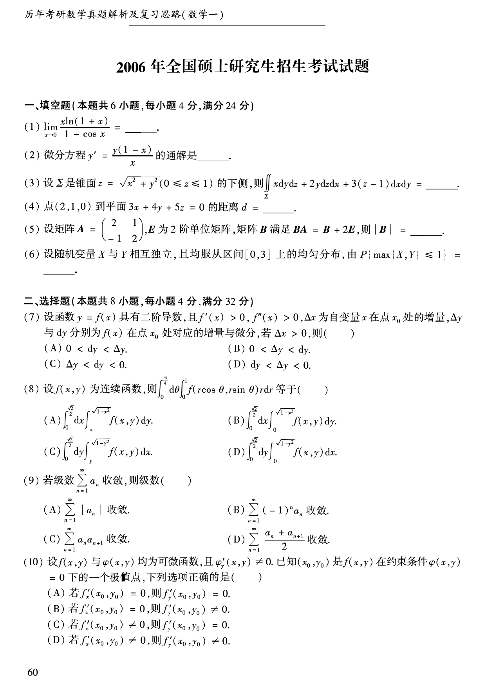
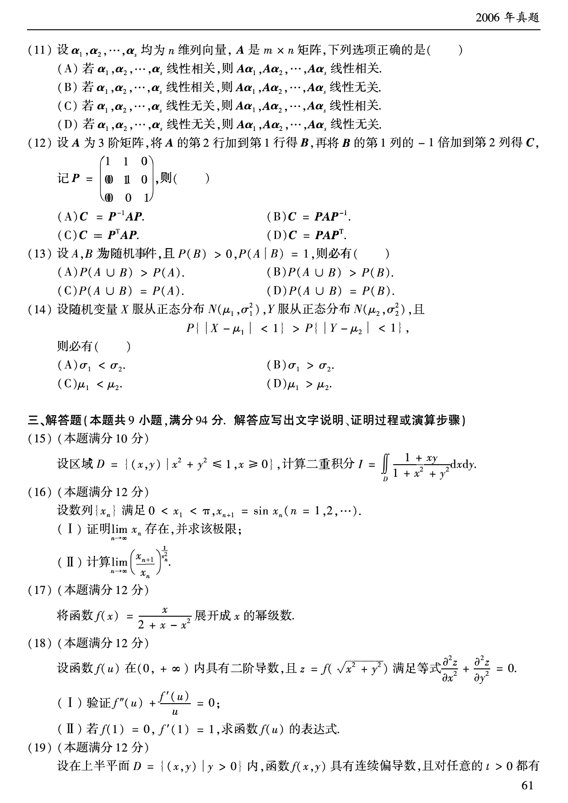
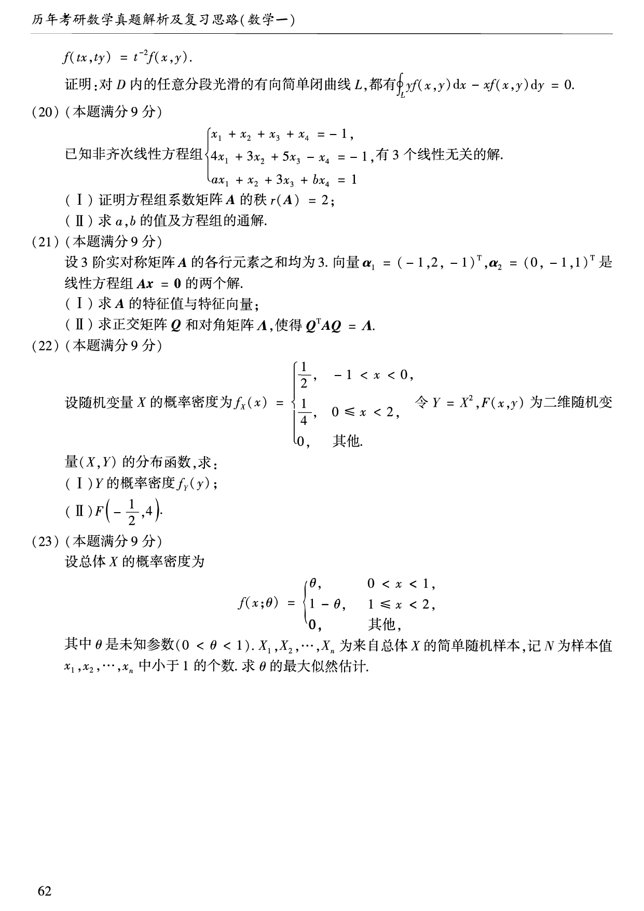

# 2006 年数学一真题

资料类型：考研数学一历年真题  
年份：2006  
科目：数学一  
来源 PDF：`D:\百度网盘\高数资料\【01】1987-2022年数学一真题（PDF）\【合集打印】1987-2009年考研数学一真题【 72页 】.pdf`  
整理状态：已按 PDF 页面图像人工视觉识别，待二次校对  

说明：原 PDF 文本层存在乱码和公式错位，本文件不再使用文本层抽取结果。题面依据渲染页图 `images/source_pages/page_061.png` 至 `page_063.png` 视觉转写。

## 2006 数一原卷题目

**第 1-10 题题图**

### 第 1 题

- 题型：填空题
- 题号：一(1)
- 分值：4
- PDF 页码：61
- 校对状态：人工视觉识别，待二次校对

$$
\lim_{x\to0}\frac{x\ln(1+x)}{1-\cos x}=______。
$$

### 第 2 题

- 题型：填空题
- 题号：一(2)
- 分值：4
- PDF 页码：61
- 校对状态：人工视觉识别，待二次校对

微分方程

$$
y'=\frac{y(1-x)}{x}
$$

的通解是______。

### 第 3 题

- 题型：填空题
- 题号：一(3)
- 分值：4
- PDF 页码：61
- 校对状态：人工视觉识别，待二次校对

设 $\Sigma$ 是锥面

$$
z=\sqrt{x^2+y^2}\quad(0\le z\le1)
$$

的下侧，则

$$
\iint_{\Sigma}x\,dy\,dz+2y\,dz\,dx+3(z-1)\,dx\,dy=______。
$$

### 第 4 题

- 题型：填空题
- 题号：一(4)
- 分值：4
- PDF 页码：61
- 校对状态：人工视觉识别，待二次校对

点 $(2,1,0)$ 到平面

$$
3x+4y+5z=0
$$

的距离 $d=$______。

### 第 5 题

- 题型：填空题
- 题号：一(5)
- 分值：4
- PDF 页码：61
- 校对状态：人工视觉识别，待二次校对

设矩阵

$$
A=
\begin{pmatrix}
2&1\\
-1&2
\end{pmatrix},
$$

$E$ 为 $2$ 阶单位矩阵，矩阵 $B$ 满足

$$
BA=B+2E,
$$

则 $\det B=$______。

### 第 6 题

- 题型：填空题
- 题号：一(6)
- 分值：4
- PDF 页码：61
- 校对状态：人工视觉识别，待二次校对

设随机变量 $X$ 与 $Y$ 相互独立，且均服从区间 $[0,3]$ 上的均匀分布，由

$$
P\{\max\{X,Y\}\le1\}=______。
$$

### 第 7 题

- 题型：选择题
- 题号：二(7)
- 分值：4
- PDF 页码：61
- 校对状态：人工视觉识别，待二次校对

设函数 $y=f(x)$ 具有二阶导数，且 $f'(x)>0,\ f''(x)>0$，$\Delta x$ 为自变量 $x$ 在点 $x_0$ 处的增量，$\Delta y$ 与 $dy$ 分别为 $f(x)$ 在点 $x_0$ 处对应的增量与微分，若 $\Delta x>0$，则（ ）。

A. $0<dy<\Delta y$  
B. $0<\Delta y<dy$  
C. $\Delta y<dy<0$  
D. $dy<\Delta y<0$

### 第 8 题

- 题型：选择题
- 题号：二(8)
- 分值：4
- PDF 页码：61
- 校对状态：人工视觉识别，待二次校对

设 $f(x,y)$ 为连续函数，则

$$
\int_0^{\frac{\pi}{4}}d\theta\int_0^1 f(r\cos\theta,r\sin\theta)\,r\,dr
$$

等于（ ）。

A. $\displaystyle\int_0^{\frac{\sqrt{2}}{2}}dx\int_x^{\sqrt{1-x^2}}f(x,y)\,dy$  
B. $\displaystyle\int_0^{\frac{\sqrt{2}}{2}}dx\int_0^{\sqrt{1-x^2}}f(x,y)\,dy$  
C. $\displaystyle\int_0^{\frac{\sqrt{2}}{2}}dy\int_y^{\sqrt{1-y^2}}f(x,y)\,dx$  
D. $\displaystyle\int_0^{\frac{\sqrt{2}}{2}}dy\int_0^{\sqrt{1-y^2}}f(x,y)\,dx$

### 第 9 题

- 题型：选择题
- 题号：二(9)
- 分值：4
- PDF 页码：61
- 校对状态：人工视觉识别，待二次校对

若级数 $\sum_{n=1}^{\infty}a_n$ 收敛，则级数（ ）。

A. $\displaystyle\sum_{n=1}^{\infty}|a_n|$ 收敛  
B. $\displaystyle\sum_{n=1}^{\infty}(-1)^na_n$ 收敛  
C. $\displaystyle\sum_{n=1}^{\infty}a_na_{n+1}$ 收敛  
D. $\displaystyle\sum_{n=1}^{\infty}\frac{a_n+a_{n+1}}{2}$ 收敛

### 第 10 题

- 题型：选择题
- 题号：二(10)
- 分值：4
- PDF 页码：61
- 校对状态：人工视觉识别，待二次校对

设 $f(x,y)$ 与 $\varphi(x,y)$ 均为可微函数，且 $\varphi'_y(x,y)\ne0$。已知 $(x_0,y_0)$ 是 $f(x,y)$ 在约束条件 $\varphi(x,y)=0$ 下的一个极值点，下列选项正确的是（ ）。

A. 若 $f'_x(x_0,y_0)=0$，则 $f'_y(x_0,y_0)=0$  
B. 若 $f'_x(x_0,y_0)=0$，则 $f'_y(x_0,y_0)\ne0$  
C. 若 $f'_x(x_0,y_0)\ne0$，则 $f'_y(x_0,y_0)=0$  
D. 若 $f'_x(x_0,y_0)\ne0$，则 $f'_y(x_0,y_0)\ne0$

**第 11-19 题题图**

### 第 11 题

- 题型：选择题
- 题号：二(11)
- 分值：4
- PDF 页码：62
- 校对状态：人工视觉识别，待二次校对

设 $\boldsymbol{\alpha}_1,\boldsymbol{\alpha}_2,\cdots,\boldsymbol{\alpha}_s$ 均为 $n$ 维列向量，$A$ 是 $m\times n$ 矩阵，下列选项正确的是（ ）。

A. 若 $\boldsymbol{\alpha}_1,\boldsymbol{\alpha}_2,\cdots,\boldsymbol{\alpha}_s$ 线性相关，则 $A\boldsymbol{\alpha}_1,A\boldsymbol{\alpha}_2,\cdots,A\boldsymbol{\alpha}_s$ 线性相关  
B. 若 $\boldsymbol{\alpha}_1,\boldsymbol{\alpha}_2,\cdots,\boldsymbol{\alpha}_s$ 线性相关，则 $A\boldsymbol{\alpha}_1,A\boldsymbol{\alpha}_2,\cdots,A\boldsymbol{\alpha}_s$ 线性无关  
C. 若 $\boldsymbol{\alpha}_1,\boldsymbol{\alpha}_2,\cdots,\boldsymbol{\alpha}_s$ 线性无关，则 $A\boldsymbol{\alpha}_1,A\boldsymbol{\alpha}_2,\cdots,A\boldsymbol{\alpha}_s$ 线性相关  
D. 若 $\boldsymbol{\alpha}_1,\boldsymbol{\alpha}_2,\cdots,\boldsymbol{\alpha}_s$ 线性无关，则 $A\boldsymbol{\alpha}_1,A\boldsymbol{\alpha}_2,\cdots,A\boldsymbol{\alpha}_s$ 线性无关

### 第 12 题

- 题型：选择题
- 题号：二(12)
- 分值：4
- PDF 页码：62
- 校对状态：人工视觉识别，待二次校对

设 $A$ 为 $3$ 阶矩阵，将 $A$ 的第 $2$ 行加到第 $1$ 行得 $B$，再将 $B$ 的第 $1$ 列的 $-1$ 倍加到第 $2$ 列得 $C$，记

$$
P=
\begin{pmatrix}
1&1&0\\
0&1&0\\
0&0&1
\end{pmatrix},
$$

则（ ）。

A. $C=P^{-1}AP$  
B. $C=PAP^{-1}$  
C. $C=P^TAP$  
D. $C=PAP^T$

### 第 13 题

- 题型：选择题
- 题号：二(13)
- 分值：4
- PDF 页码：62
- 校对状态：人工视觉识别，待二次校对

设 $A,B$ 为随机事件，且 $P(B)>0,\ P(A\mid B)=1$，则必有（ ）。

A. $P(A\cup B)>P(A)$  
B. $P(A\cup B)>P(B)$  
C. $P(A\cup B)=P(A)$  
D. $P(A\cup B)=P(B)$

### 第 14 题

- 题型：选择题
- 题号：二(14)
- 分值：4
- PDF 页码：62
- 校对状态：人工视觉识别，待二次校对

设随机变量 $X$ 服从正态分布 $N(\mu_1,\sigma_1^2)$，$Y$ 服从正态分布 $N(\mu_2,\sigma_2^2)$，且

$$
P\{|X-\mu_1|<1\}>P\{|Y-\mu_2|<1\},
$$

则必有（ ）。

A. $\sigma_1<\sigma_2$  
B. $\sigma_1>\sigma_2$  
C. $\mu_1<\mu_2$  
D. $\mu_1>\mu_2$

### 第 15 题

- 题型：解答题
- 题号：三(15)
- 分值：10
- PDF 页码：62
- 校对状态：人工视觉识别，待二次校对

设区域

$$
D=\{(x,y)\mid x^2+y^2\le1,\ x\ge0\},
$$

计算二重积分

$$
I=\iint_D\frac{1+xy}{1+x^2+y^2}\,dx\,dy。
$$

### 第 16 题

- 题型：解答题
- 题号：三(16)
- 分值：12
- PDF 页码：62
- 校对状态：人工视觉识别，待二次校对

设数列 $\{x_n\}$ 满足

$$
0<x_1<\pi,\qquad x_{n+1}=\sin x_n\quad(n=1,2,\cdots).
$$

(I) 证明 $\lim_{n\to\infty}x_n$ 存在，并求该极限；

(II) 计算

$$
\lim_{n\to\infty}\left(\frac{x_{n+1}}{x_n}\right)^{\frac{1}{x_n^2}}。
$$

### 第 17 题

- 题型：解答题
- 题号：三(17)
- 分值：12
- PDF 页码：62
- 校对状态：人工视觉识别，待二次校对

将函数

$$
f(x)=\frac{x}{2+x-x^2}
$$

展开成 $x$ 的幂级数。

### 第 18 题

- 题型：解答题
- 题号：三(18)
- 分值：12
- PDF 页码：62
- 校对状态：人工视觉识别，待二次校对

设函数 $f(u)$ 在 $(0,+\infty)$ 内具有二阶导数，且

$$
z=f\left(\sqrt{x^2+y^2}\right)
$$

满足等式

$$
\frac{\partial^2 z}{\partial x^2}+\frac{\partial^2 z}{\partial y^2}=0。
$$

(I) 验证

$$
f''(u)+\frac{f'(u)}{u}=0;
$$

(II) 若 $f(1)=0,\ f'(1)=1$，求函数 $f(u)$ 的表达式。

**第 19-23 题题图**

### 第 19 题

- 题型：证明题
- 题号：三(19)
- 分值：12
- PDF 页码：62-63
- 校对状态：人工视觉识别，待二次校对

设在上半平面

$$
D=\{(x,y)\mid y>0\}
$$

内，函数 $f(x,y)$ 具有连续偏导数，且对任意的 $t>0$ 都有

$$
f(tx,ty)=t^{-2}f(x,y)。
$$

证明：对 $D$ 内的任意分段光滑的有向简单闭曲线 $L$，都有

$$
\oint_L yf(x,y)\,dx-xf(x,y)\,dy=0。
$$

### 第 20 题

- 题型：解答题
- 题号：三(20)
- 分值：9
- PDF 页码：63
- 校对状态：人工视觉识别，待二次校对

已知非齐次线性方程组

$$
\begin{cases}
x_1+x_2+x_3+x_4=-1,\\
4x_1+3x_2+5x_3-x_4=-1,\\
ax_1+x_2+3x_3+bx_4=1
\end{cases}
$$

有 $3$ 个线性无关的解。

(I) 证明方程组系数矩阵 $A$ 的秩 $r(A)=2$；

(II) 求 $a,b$ 的值及方程组的通解。

### 第 21 题

- 题型：解答题
- 题号：三(21)
- 分值：9
- PDF 页码：63
- 校对状态：人工视觉识别，待二次校对

设 $3$ 阶实对称矩阵 $A$ 的各行元素之和均为 $3$，向量

$$
\boldsymbol{\alpha}_1=(-1,2,-1)^T,\qquad
\boldsymbol{\alpha}_2=(0,-1,1)^T
$$

是线性方程组 $A\boldsymbol{x}=0$ 的两个解。

(I) 求 $A$ 的特征值与特征向量；

(II) 求正交矩阵 $Q$ 和对角矩阵 $\Lambda$，使得

$$
Q^TAQ=\Lambda。
$$

### 第 22 题

- 题型：解答题
- 题号：三(22)
- 分值：9
- PDF 页码：63
- 校对状态：人工视觉识别，待二次校对

设随机变量 $X$ 的概率密度为

$$
f_X(x)=
\begin{cases}
\frac{1}{2},&-1<x<0,\\
\frac{1}{4},&0\le x<2,\\
0,&\text{其他}.
\end{cases}
$$

令 $Y=X^2$，$F(x,y)$ 为二维随机变量 $(X,Y)$ 的分布函数，求：

(I) $Y$ 的概率密度 $f_Y(y)$；

(II) $F\left(-\frac{1}{2},4\right)$。

### 第 23 题

- 题型：解答题
- 题号：三(23)
- 分值：9
- PDF 页码：63
- 校对状态：人工视觉识别，待二次校对

设总体 $X$ 的概率密度为

$$
f(x;\theta)=
\begin{cases}
\theta,&0<x<1,\\
1-\theta,&1\le x<2,\\
0,&\text{其他},
\end{cases}
$$

其中 $\theta$ 是未知参数（$0<\theta<1$）。$X_1,X_2,\cdots,X_n$ 为来自总体 $X$ 的简单随机样本，记 $N$ 为样本值 $x_1,x_2,\cdots,x_n$ 中小于 $1$ 的个数。求 $\theta$ 的最大似然估计。
