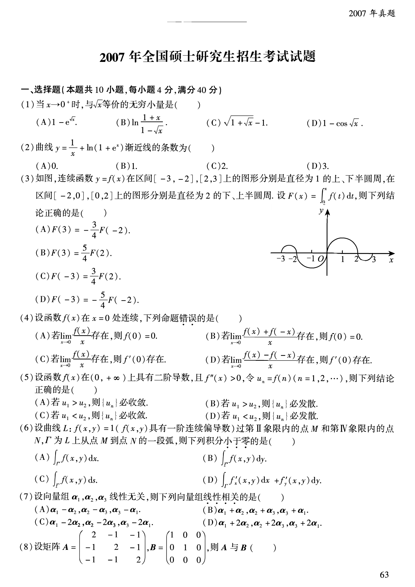
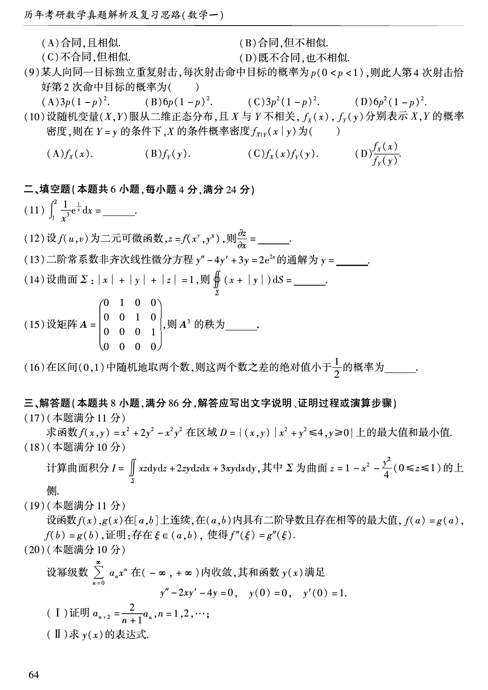
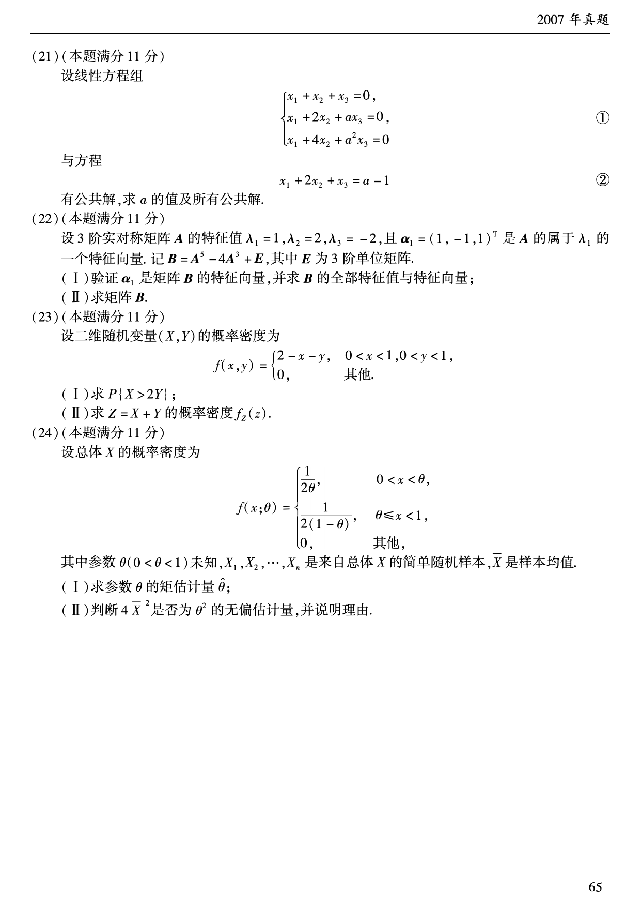

# 2007 年数学一真题

资料类型：考研数学一历年真题  
年份：2007  
科目：数学一  
来源 PDF：`D:\百度网盘\高数资料\【01】1987-2022年数学一真题（PDF）\【合集打印】1987-2009年考研数学一真题【 72页 】.pdf`  
整理状态：已按 PDF 页面图像人工视觉识别，待二次校对  

说明：原 PDF 文本层存在乱码和公式错位，本文件不再使用文本层抽取结果。题面依据渲染页图 `images/source_pages/page_064.png` 至 `page_066.png` 视觉转写。

## 2007 数一原卷题目

**第 1-2 题题图**

### 第 1 题

- 题型：选择题
- 题号：一(1)
- 分值：4
- PDF 页码：64
- 校对状态：人工视觉识别，待二次校对

当 $x\to0^+$ 时，与 $\sqrt{x}$ 等价的无穷小量是（ ）。

A. $1-e^{\sqrt{x}}$  
B. $\ln\left(\dfrac{1+x}{1-\sqrt{x}}\right)$  
C. $\sqrt{1+\sqrt{x}}-1$  
D. $1-\cos\sqrt{x}$

### 第 2 题

- 题型：选择题
- 题号：一(2)
- 分值：4
- PDF 页码：64
- 校对状态：人工视觉识别，待二次校对

曲线

$$
y=\frac{1}{x}+\ln(1+e^x)
$$

渐近线的条数为（ ）。

A. $0$  
B. $1$  
C. $2$  
D. $3$

### 第 3 题

- 题型：选择题
- 题号：一(3)
- 分值：4
- PDF 页码：64
- 校对状态：人工视觉识别，待二次校对

函数图像：

图形说明：$y=f(x)$ 在 $[-3,-2]$ 上为直径 $1$ 的上半圆周，在 $[2,3]$ 上为直径 $1$ 的下半圆周；在 $[-2,0]$ 上为直径 $2$ 的下半圆周，在 $[0,2]$ 上为直径 $2$ 的上半圆周。

题干：

如图，连续函数 $y=f(x)$ 在区间 $[-3,-2]$、$[2,3]$ 上的图形分别是直径为 $1$ 的上、下半圆周，在区间 $[-2,0]$、$[0,2]$ 上的图形分别是直径为 $2$ 的下、上半圆周。设

$$
F(x)=\int_0^x f(t)\,dt,
$$

则下列结论正确的是（ ）。

A. $F(3)=-\frac{3}{4}F(-2)$  
B. $F(3)=\frac{5}{4}F(2)$  
C. $F(-3)=\frac{3}{4}F(2)$  
D. $F(-3)=-\frac{5}{4}F(-2)$

**第 4-8 题题图**

### 第 4 题

- 题型：选择题
- 题号：一(4)
- 分值：4
- PDF 页码：64
- 校对状态：人工视觉识别，待二次校对

设函数 $f(x)$ 在 $x=0$ 处连续，下列命题错误的是（ ）。

A. 若 $\displaystyle\lim_{x\to0}\frac{f(x)}{x}$ 存在，则 $f(0)=0$  
B. 若 $\displaystyle\lim_{x\to0}\frac{f(x)+f(-x)}{x}$ 存在，则 $f(0)=0$  
C. 若 $\displaystyle\lim_{x\to0}\frac{f(x)}{x}$ 存在，则 $f'(0)$ 存在  
D. 若 $\displaystyle\lim_{x\to0}\frac{f(x)-f(-x)}{x}$ 存在，则 $f'(0)$ 存在

### 第 5 题

- 题型：选择题
- 题号：一(5)
- 分值：4
- PDF 页码：64
- 校对状态：人工视觉识别，待二次校对

设函数 $f(x)$ 在 $(0,+\infty)$ 上具有二阶导数，且 $f''(x)>0$，令

$$
u_n=f(n)\quad(n=1,2,\cdots),
$$

则下列结论正确的是（ ）。

A. 若 $u_1>u_2$，则 $\{u_n\}$ 必收敛  
B. 若 $u_1>u_2$，则 $\{u_n\}$ 必发散  
C. 若 $u_1<u_2$，则 $\{u_n\}$ 必收敛  
D. 若 $u_1<u_2$，则 $\{u_n\}$ 必发散

### 第 6 题

- 题型：选择题
- 题号：一(6)
- 分值：4
- PDF 页码：64
- 校对状态：人工视觉识别，待二次校对

设曲线 $L:f(x,y)=1$（$f(x,y)$ 具有一阶连续偏导数）过第 II 象限内的点 $M$ 和第 IV 象限内的点 $N$，$\Gamma$ 为 $L$ 上从点 $M$ 到点 $N$ 的一段弧，则下列积分小于零的是（ ）。

A. $\displaystyle\int_{\Gamma}f(x,y)\,dx$  
B. $\displaystyle\int_{\Gamma}f(x,y)\,dy$  
C. $\displaystyle\int_{\Gamma}f(x,y)\,ds$  
D. $\displaystyle\int_{\Gamma}f'_x(x,y)\,dx+f'_y(x,y)\,dy$

### 第 7 题

- 题型：选择题
- 题号：一(7)
- 分值：4
- PDF 页码：64
- 校对状态：人工视觉识别，待二次校对

设向量组 $\boldsymbol{\alpha}_1,\boldsymbol{\alpha}_2,\boldsymbol{\alpha}_3$ 线性无关，则下列向量组线性相关的是（ ）。

A. $\boldsymbol{\alpha}_1-\boldsymbol{\alpha}_2,\ \boldsymbol{\alpha}_2-\boldsymbol{\alpha}_3,\ \boldsymbol{\alpha}_3-\boldsymbol{\alpha}_1$  
B. $\boldsymbol{\alpha}_1+\boldsymbol{\alpha}_2,\ \boldsymbol{\alpha}_2+\boldsymbol{\alpha}_3,\ \boldsymbol{\alpha}_3+\boldsymbol{\alpha}_1$  
C. $\boldsymbol{\alpha}_1-2\boldsymbol{\alpha}_2,\ \boldsymbol{\alpha}_2-2\boldsymbol{\alpha}_3,\ \boldsymbol{\alpha}_3-2\boldsymbol{\alpha}_1$  
D. $\boldsymbol{\alpha}_1+2\boldsymbol{\alpha}_2,\ \boldsymbol{\alpha}_2+2\boldsymbol{\alpha}_3,\ \boldsymbol{\alpha}_3+2\boldsymbol{\alpha}_1$

**第 8-20 题题图**

### 第 8 题

- 题型：选择题
- 题号：一(8)
- 分值：4
- PDF 页码：64-65
- 校对状态：人工视觉识别，待二次校对

设矩阵

$$
A=
\begin{pmatrix}
2&-1&-1\\
-1&2&-1\\
-1&-1&2
\end{pmatrix},
\qquad
B=
\begin{pmatrix}
1&0&0\\
0&1&0\\
0&0&0
\end{pmatrix},
$$

则 $A$ 与 $B$（ ）。

A. 合同，且相似  
B. 合同，但不相似  
C. 不合同，但相似  
D. 既不合同，也不相似

### 第 9 题

- 题型：选择题
- 题号：一(9)
- 分值：4
- PDF 页码：65
- 校对状态：人工视觉识别，待二次校对

某人向同一目标独立、重复射击，每次射击命中目标的概率为 $p\ (0<p<1)$，则此人第 $4$ 次射击恰好第 $2$ 次命中目标的概率为（ ）。

A. $3p(1-p)^2$  
B. $6p(1-p)^2$  
C. $3p^2(1-p)^2$  
D. $6p^2(1-p)^2$

### 第 10 题

- 题型：选择题
- 题号：一(10)
- 分值：4
- PDF 页码：65
- 校对状态：人工视觉识别，待二次校对

设随机变量 $(X,Y)$ 服从二维正态分布，且 $X$ 与 $Y$ 不相关，$f_X(x),f_Y(y)$ 分别表示 $X,Y$ 的概率密度，则在 $Y=y$ 的条件下，$X$ 的条件概率密度 $f_{X\mid Y}(x\mid y)$ 为（ ）。

A. $f_X(x)$  
B. $f_Y(y)$  
C. $f_X(x)f_Y(y)$  
D. $\dfrac{f_X(x)}{f_Y(y)}$

### 第 11 题

- 题型：填空题
- 题号：二(11)
- 分值：4
- PDF 页码：65
- 校对状态：人工视觉识别，待二次校对

$$
\int_1^2\frac{1}{x^3}e^{\frac{1}{x}}\,dx=______。
$$

### 第 12 题

- 题型：填空题
- 题号：二(12)
- 分值：4
- PDF 页码：65
- 校对状态：人工视觉识别，待二次校对

设 $f(u,v)$ 为二元可微函数，

$$
z=f(x^y,y^x),
$$

则

$$
\frac{\partial z}{\partial x}=______。
$$

### 第 13 题

- 题型：填空题
- 题号：二(13)
- 分值：4
- PDF 页码：65
- 校对状态：人工视觉识别，待二次校对

二阶常系数非齐次线性微分方程

$$
y''-4y'+3y=2e^{2x}
$$

的通解为 $y=$______。

### 第 14 题

- 题型：填空题
- 题号：二(14)
- 分值：4
- PDF 页码：65
- 校对状态：人工视觉识别，待二次校对

设曲面

$$
\Sigma:|x|+|y|+|z|=1,
$$

则

$$
\iint_{\Sigma}(x+|y|)\,dS=______。
$$

### 第 15 题

- 题型：填空题
- 题号：二(15)
- 分值：4
- PDF 页码：65
- 校对状态：人工视觉识别，待二次校对

设矩阵

$$
A=
\begin{pmatrix}
0&1&0&0\\
0&0&1&0\\
0&0&0&1\\
0&0&0&0
\end{pmatrix},
$$

则 $A^3$ 的秩为______。

### 第 16 题

- 题型：填空题
- 题号：二(16)
- 分值：4
- PDF 页码：65
- 校对状态：人工视觉识别，待二次校对

在区间 $(0,1)$ 中随机地取两个数，则这两个数之差的绝对值小于 $\frac{1}{2}$ 的概率为______。

### 第 17 题

- 题型：解答题
- 题号：三(17)
- 分值：11
- PDF 页码：65
- 校对状态：人工视觉识别，待二次校对

求函数

$$
f(x,y)=x^2+2y^2-x^2y^2
$$

在区域

$$
D=\{(x,y)\mid x^2+y^2\le4,\ y\ge0\}
$$

上的最大值和最小值。

### 第 18 题

- 题型：解答题
- 题号：三(18)
- 分值：10
- PDF 页码：65
- 校对状态：人工视觉识别，待二次校对

计算曲面积分

$$
I=\iint_{\Sigma}xz\,dy\,dz+2zy\,dz\,dx+3xy\,dx\,dy,
$$

其中 $\Sigma$ 为曲面

$$
z=1-x^2-\frac{y^2}{4}\quad(0\le z\le1)
$$

的上侧。

### 第 19 题

- 题型：证明题
- 题号：三(19)
- 分值：11
- PDF 页码：65
- 校对状态：人工视觉识别，待二次校对

设函数 $f(x),g(x)$ 在 $[a,b]$ 上连续，在 $(a,b)$ 内具有二阶导数且存在相等的最大值，$f(a)=g(a),\ f(b)=g(b)$。证明：存在 $\xi\in(a,b)$，使得

$$
f''(\xi)=g''(\xi)。
$$

### 第 20 题

- 题型：解答题
- 题号：三(20)
- 分值：10
- PDF 页码：65
- 校对状态：人工视觉识别，待二次校对

设幂级数

$$
\sum_{n=0}^{\infty}a_nx^n
$$

在 $(-\infty,+\infty)$ 内收敛，其和函数 $y(x)$ 满足

$$
y''-2xy'-4y=0,\qquad y(0)=0,\qquad y'(0)=1。
$$

(I) 证明

$$
a_{n+2}=\frac{2}{n+1}a_n,\qquad n=1,2,\cdots;
$$

(II) 求 $y(x)$ 的表达式。

**第 21-24 题题图**

### 第 21 题

- 题型：解答题
- 题号：三(21)
- 分值：11
- PDF 页码：66
- 校对状态：人工视觉识别，待二次校对

设线性方程组

$$
\begin{cases}
x_1+x_2+x_3=0,\\
x_1+2x_2+ax_3=0,\\
x_1+4x_2+a^2x_3=0
\end{cases}
\tag{1}
$$

与方程

$$
x_1+2x_2+x_3=a-1
\tag{2}
$$

有公共解，求 $a$ 的值及所有公共解。

### 第 22 题

- 题型：解答题
- 题号：三(22)
- 分值：11
- PDF 页码：66
- 校对状态：人工视觉识别，待二次校对

设 $3$ 阶实对称矩阵 $A$ 的特征值 $\lambda_1=1,\lambda_2=2,\lambda_3=-2$，且

$$
\boldsymbol{\alpha}_1=(1,-1,1)^T
$$

是 $A$ 的属于 $\lambda_1$ 的一个特征向量。记

$$
B=A^5-4A^3+E,
$$

其中 $E$ 为 $3$ 阶单位矩阵。

(I) 验证 $\boldsymbol{\alpha}_1$ 是矩阵 $B$ 的特征向量，并求 $B$ 的全部特征值与特征向量；

(II) 求矩阵 $B$。

### 第 23 题

- 题型：解答题
- 题号：三(23)
- 分值：11
- PDF 页码：66
- 校对状态：人工视觉识别，待二次校对

设二维随机变量 $(X,Y)$ 的概率密度为

$$
f(x,y)=
\begin{cases}
2-x-y,&0<x<1,\ 0<y<1,\\
0,&\text{其他}.
\end{cases}
$$

(I) 求 $P\{X>2Y\}$；

(II) 求 $Z=X+Y$ 的概率密度 $f_Z(z)$。

### 第 24 题

- 题型：解答题
- 题号：三(24)
- 分值：11
- PDF 页码：66
- 校对状态：人工视觉识别，待二次校对

设总体 $X$ 的概率密度为

$$
f(x;\theta)=
\begin{cases}
\dfrac{1}{2\theta},&0<x<\theta,\\
\dfrac{1}{2(1-\theta)},&\theta\le x<1,\\
0,&\text{其他},
\end{cases}
$$

其中参数 $\theta\ (0<\theta<1)$ 未知，$X_1,X_2,\cdots,X_n$ 是来自总体 $X$ 的简单随机样本，$\overline{X}$ 是样本均值。

(I) 求参数 $\theta$ 的矩估计量 $\hat{\theta}$；

(II) 判断 $4\overline{X}^2$ 是否为 $\theta^2$ 的无偏估计量，并说明理由。
