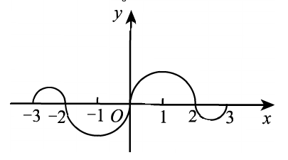

# 2007 数学一第 3 题

## 题目

函数图像：

图形说明：$y=f(x)$ 在 $[-3,-2]$ 上为直径 $1$ 的上半圆周，在 $[2,3]$ 上为直径 $1$ 的下半圆周；在 $[-2,0]$ 上为直径 $2$ 的下半圆周，在 $[0,2]$ 上为直径 $2$ 的上半圆周。

题干：

如图，连续函数 $y=f(x)$ 在区间 $[-3,-2]$、$[2,3]$ 上的图形分别是直径为 $1$ 的上、下半圆周，在区间 $[-2,0]$、$[0,2]$ 上的图形分别是直径为 $2$ 的下、上半圆周。设

$$
F(x)=\int_0^x f(t)\,dt,
$$

则下列结论正确的是（ ）。

A. $F(3)=-\frac{3}{4}F(-2)$
B. $F(3)=\frac{5}{4}F(2)$
C. $F(-3)=\frac{3}{4}F(2)$
D. $F(-3)=-\frac{5}{4}F(-2)$

## 标准答案

C

## 解析

由图形可知 $f(x)$ 为奇函数，所以
$$
F(x)=\int_0^x f(t)\,dt
$$
为偶函数。

在 $[0,2]$ 上是直径为 $2$ 的上半圆，面积为 $\pi/2$，故
$$
F(2)=\frac{\pi}{2}.
$$
在 $[2,3]$ 上是直径为 $1$ 的下半圆，面积为 $-\pi/8$，故
$$
F(3)=\frac{\pi}{2}-\frac{\pi}{8}=\frac{3\pi}{8}.
$$
于是
$$
F(-3)=F(3)=\frac{3\pi}{8}
=\frac{3}{4}F(2).
$$
选 C。

## 来源

- 题目来源：`math1_2007_questions.md`
- 答案来源：`math1_2007_answers.md`
