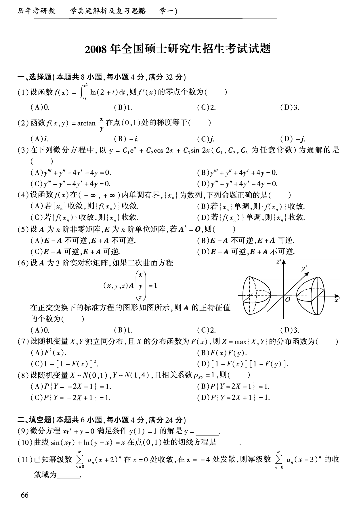
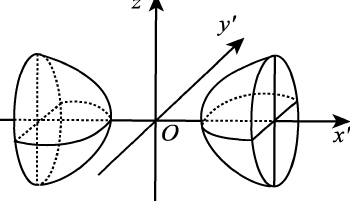
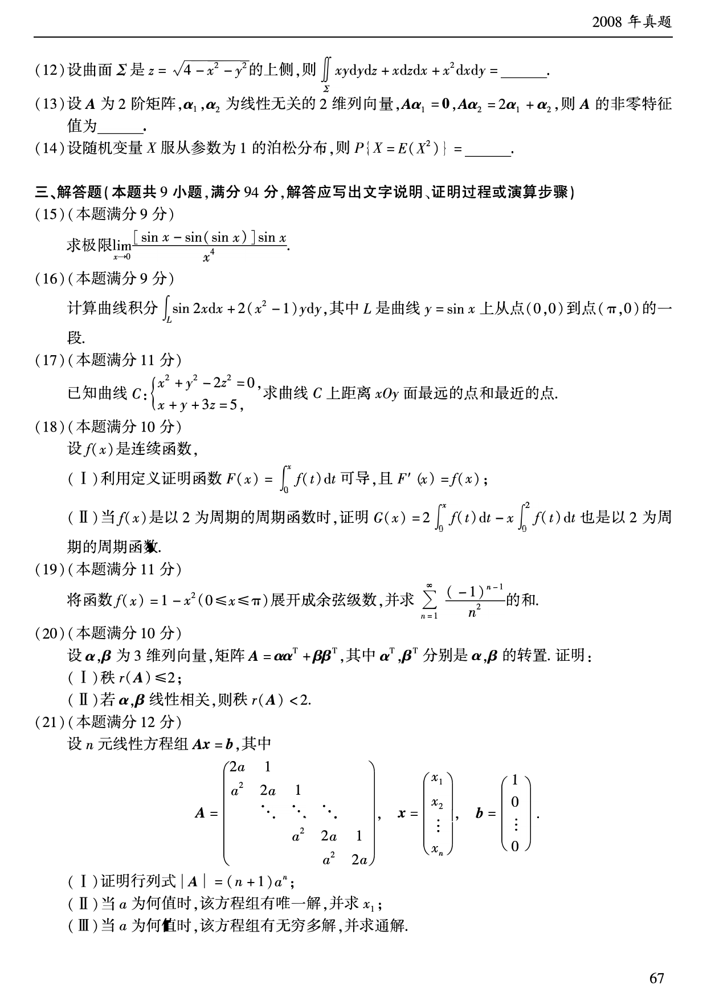
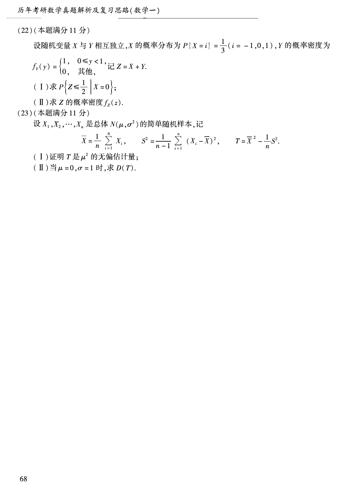

# 2008 年数学一真题

资料类型：考研数学一历年真题  
年份：2008  
科目：数学一  
来源 PDF：`D:\百度网盘\高数资料\【01】1987-2022年数学一真题（PDF）\【合集打印】1987-2009年考研数学一真题【 72页 】.pdf`  
整理状态：已按 PDF 页面图像人工视觉识别，待二次校对  

说明：原 PDF 文本层存在乱码和公式错位，本文件不再使用文本层抽取结果。题面依据渲染页图 `images/source_pages/page_067.png` 至 `page_069.png` 视觉转写。

## 2008 数一原卷题目

**第 1-5 题题图**

### 第 1 题

- 题型：选择题
- 题号：一(1)
- 分值：4
- PDF 页码：67
- 校对状态：人工视觉识别，待二次校对

设函数

$$
f(x)=\int_0^{x^2}\ln(2+t)\,dt,
$$

则 $f'(x)$ 的零点个数为（ ）。

A. $0$  
B. $1$  
C. $2$  
D. $3$

### 第 2 题

- 题型：选择题
- 题号：一(2)
- 分值：4
- PDF 页码：67
- 校对状态：人工视觉识别，待二次校对

函数

$$
f(x,y)=\arctan\frac{x}{y}
$$

在点 $(0,1)$ 处的梯度等于（ ）。

A. $\boldsymbol{i}$  
B. $-\boldsymbol{i}$  
C. $\boldsymbol{j}$  
D. $-\boldsymbol{j}$

### 第 3 题

- 题型：选择题
- 题号：一(3)
- 分值：4
- PDF 页码：67
- 校对状态：人工视觉识别，待二次校对

在下列微分方程中，以

$$
y=C_1e^x+C_2\cos2x+C_3\sin2x
$$

（$C_1,C_2,C_3$ 为任意常数）为通解的是（ ）。

A. $y'''+y''-4y'-4y=0$  
B. $y'''+y''+4y'+4y=0$  
C. $y'''-y''-4y'+4y=0$  
D. $y'''-y''+4y'-4y=0$

### 第 4 题

- 题型：选择题
- 题号：一(4)
- 分值：4
- PDF 页码：67
- 校对状态：人工视觉识别，待二次校对

设函数 $f(x)$ 在 $(-\infty,+\infty)$ 内单调有界，$\{x_n\}$ 为数列，下列命题正确的是（ ）。

A. 若 $\{x_n\}$ 收敛，则 $\{f(x_n)\}$ 收敛  
B. 若 $\{x_n\}$ 单调，则 $\{f(x_n)\}$ 收敛  
C. 若 $\{f(x_n)\}$ 收敛，则 $\{x_n\}$ 收敛  
D. 若 $\{f(x_n)\}$ 单调，则 $\{x_n\}$ 收敛

### 第 5 题

- 题型：选择题
- 题号：一(5)
- 分值：4
- PDF 页码：67
- 校对状态：人工视觉识别，待二次校对

设 $A$ 为 $n$ 阶非零矩阵，$E$ 为 $n$ 阶单位矩阵，若

$$
A^3=O,
$$

则（ ）。

A. $E-A$ 不可逆，$E+A$ 不可逆  
B. $E-A$ 不可逆，$E+A$ 可逆  
C. $E-A$ 可逆，$E+A$ 可逆  
D. $E-A$ 可逆，$E+A$ 不可逆

### 第 6 题

- 题型：选择题
- 题号：一(6)
- 分值：4
- PDF 页码：67
- 校对状态：人工视觉识别，待二次校对

标准方程图形：

图形说明：图中曲面在正交坐标系 $O-x'y'z'$ 中分成沿 $x'$ 轴左右分布的两支。

题干：

设 $A$ 为 $3$ 阶实对称矩阵，如果二次曲面方程

$$
(x,y,z)A
\begin{pmatrix}
x\\y\\z
\end{pmatrix}
=1
$$

在正交变换下的标准方程的图形如图所示，则 $A$ 的正特征值的个数为（ ）。

A. $0$  
B. $1$  
C. $2$  
D. $3$

**第 7-11 题题图**

### 第 7 题

- 题型：选择题
- 题号：一(7)
- 分值：4
- PDF 页码：67
- 校对状态：人工视觉识别，待二次校对

设随机变量 $X,Y$ 独立同分布，且 $X$ 的分布函数为 $F(x)$，则

$$
Z=\max\{X,Y\}
$$

的分布函数为（ ）。

A. $F^2(x)$  
B. $F(x)F(y)$  
C. $1-[1-F(x)]^2$  
D. $[1-F(x)][1-F(y)]$

### 第 8 题

- 题型：选择题
- 题号：一(8)
- 分值：4
- PDF 页码：67
- 校对状态：人工视觉识别，待二次校对

设随机变量 $X\sim N(0,1)$，$Y\sim N(1,4)$，且相关系数 $\rho_{XY}=1$，则（ ）。

A. $P\{Y=-2X-1\}=1$  
B. $P\{Y=2X-1\}=1$  
C. $P\{Y=-2X+1\}=1$  
D. $P\{Y=2X+1\}=1$

### 第 9 题

- 题型：填空题
- 题号：二(9)
- 分值：4
- PDF 页码：67
- 校对状态：人工视觉识别，待二次校对

微分方程

$$
xy'+y=0
$$

满足条件 $y(1)=1$ 的解是 $y=$______。

### 第 10 题

- 题型：填空题
- 题号：二(10)
- 分值：4
- PDF 页码：67
- 校对状态：人工视觉识别，待二次校对

曲线

$$
\sin(xy)+\ln(y-x)=x
$$

在点 $(0,1)$ 处的切线方程是______。

### 第 11 题

- 题型：填空题
- 题号：二(11)
- 分值：4
- PDF 页码：67
- 校对状态：人工视觉识别，待二次校对

已知幂级数

$$
\sum_{n=0}^{\infty}a_n(x+2)^n
$$

在 $x=0$ 处收敛，在 $x=-4$ 处发散，则幂级数

$$
\sum_{n=0}^{\infty}a_n(x-3)^n
$$

的收敛域为______。

**第 12-21 题题图**

### 第 12 题

- 题型：填空题
- 题号：二(12)
- 分值：4
- PDF 页码：68
- 校对状态：人工视觉识别，待二次校对

设曲面 $\Sigma$ 是

$$
z=\sqrt{4-x^2-y^2}
$$

的上侧，则

$$
\iint_{\Sigma}xy\,dy\,dz+x\,dz\,dx+x^2\,dx\,dy=______。
$$

### 第 13 题

- 题型：填空题
- 题号：二(13)
- 分值：4
- PDF 页码：68
- 校对状态：人工视觉识别，待二次校对

设 $A$ 为 $2$ 阶矩阵，$\boldsymbol{\alpha}_1,\boldsymbol{\alpha}_2$ 为线性无关的 $2$ 维列向量，

$$
A\boldsymbol{\alpha}_1=0,\qquad
A\boldsymbol{\alpha}_2=2\boldsymbol{\alpha}_1+\boldsymbol{\alpha}_2,
$$

则 $A$ 的非零特征值为______。

### 第 14 题

- 题型：填空题
- 题号：二(14)
- 分值：4
- PDF 页码：68
- 校对状态：人工视觉识别，待二次校对

设随机变量 $X$ 服从参数为 $1$ 的泊松分布，则

$$
P\{X=E(X^2)\}=______。
$$

### 第 15 题

- 题型：解答题
- 题号：三(15)
- 分值：9
- PDF 页码：68
- 校对状态：人工视觉识别，待二次校对

求极限

$$
\lim_{x\to0}\frac{[\sin x-\sin(\sin x)]\sin x}{x^4}.
$$

### 第 16 题

- 题型：解答题
- 题号：三(16)
- 分值：9
- PDF 页码：68
- 校对状态：人工视觉识别，待二次校对

计算曲线积分

$$
\int_L \sin2x\,dx+2(x^2-1)y\,dy,
$$

其中 $L$ 是曲线 $y=\sin x$ 上从点 $(0,0)$ 到点 $(\pi,0)$ 的一段。

### 第 17 题

- 题型：解答题
- 题号：三(17)
- 分值：11
- PDF 页码：68
- 校对状态：人工视觉识别，待二次校对

已知曲线

$$
C:\begin{cases}
x^2+y^2-2z^2=0,\\
x+y+3z=5,
\end{cases}
$$

求曲线 $C$ 上距离 $xOy$ 面最远的点和最近的点。

### 第 18 题

- 题型：证明题
- 题号：三(18)
- 分值：10
- PDF 页码：68
- 校对状态：人工视觉识别，待二次校对

设 $f(x)$ 是连续函数。

(I) 利用定义证明函数

$$
F(x)=\int_0^x f(t)\,dt
$$

可导，且 $F'(x)=f(x)$；

(II) 当 $f(x)$ 是以 $2$ 为周期的周期函数时，证明

$$
G(x)=2\int_0^x f(t)\,dt-x\int_0^2 f(t)\,dt
$$

也是以 $2$ 为周期的周期函数。

### 第 19 题

- 题型：解答题
- 题号：三(19)
- 分值：11
- PDF 页码：68
- 校对状态：人工视觉识别，待二次校对

将函数

$$
f(x)=1-x^2\quad(0\le x\le\pi)
$$

展开成余弦级数，并求

$$
\sum_{n=1}^{\infty}\frac{(-1)^{n-1}}{n^2}
$$

的和。

### 第 20 题

- 题型：证明题
- 题号：三(20)
- 分值：10
- PDF 页码：68
- 校对状态：人工视觉识别，待二次校对

设 $\boldsymbol{\alpha},\boldsymbol{\beta}$ 为 $3$ 维列向量，矩阵

$$
A=\boldsymbol{\alpha}\boldsymbol{\alpha}^T+\boldsymbol{\beta}\boldsymbol{\beta}^T,
$$

其中 $\boldsymbol{\alpha}^T,\boldsymbol{\beta}^T$ 分别是 $\boldsymbol{\alpha},\boldsymbol{\beta}$ 的转置。证明：

(I) 秩 $r(A)\le2$；

(II) 若 $\boldsymbol{\alpha},\boldsymbol{\beta}$ 线性相关，则秩 $r(A)<2$。

### 第 21 题

- 题型：解答题
- 题号：三(21)
- 分值：12
- PDF 页码：68
- 校对状态：人工视觉识别，待二次校对

设 $n$ 元线性方程组 $A\boldsymbol{x}=\boldsymbol{b}$，其中

$$
A=
\begin{pmatrix}
2a&1&0&\cdots&0\\
a^2&2a&1&\cdots&0\\
0&a^2&2a&\ddots&\vdots\\
\vdots&\ddots&\ddots&\ddots&1\\
0&\cdots&0&a^2&2a
\end{pmatrix},
\qquad
\boldsymbol{x}=
\begin{pmatrix}
x_1\\x_2\\\vdots\\x_n
\end{pmatrix},
\qquad
\boldsymbol{b}=
\begin{pmatrix}
1\\0\\\vdots\\0
\end{pmatrix}.
$$

(I) 证明行列式

$$
\det A=(n+1)a^n;
$$

(II) 当 $a$ 为何值时，该方程组有唯一解，并求 $x_1$；

(III) 当 $a$ 为何值时，该方程组有无穷多解，并求通解。

**第 22-23 题题图**

### 第 22 题

- 题型：解答题
- 题号：三(22)
- 分值：11
- PDF 页码：69
- 校对状态：人工视觉识别，待二次校对

设随机变量 $X$ 与 $Y$ 相互独立，$X$ 的概率分布为

$$
P\{X=i\}=\frac{1}{3},\qquad i=-1,0,1,
$$

$Y$ 的概率密度为

$$
f_Y(y)=
\begin{cases}
1,&0\le y<1,\\
0,&\text{其他},
\end{cases}
$$

记 $Z=X+Y$。

(I) 求 $P\left\{Z\le\frac{1}{2}\mid X=0\right\}$；

(II) 求 $Z$ 的概率密度 $f_Z(z)$。

### 第 23 题

- 题型：解答题
- 题号：三(23)
- 分值：11
- PDF 页码：69
- 校对状态：人工视觉识别，待二次校对

设 $X_1,X_2,\cdots,X_n$ 是总体 $N(\mu,\sigma^2)$ 的简单随机样本，记

$$
\overline{X}=\frac{1}{n}\sum_{i=1}^{n}X_i,\qquad
S^2=\frac{1}{n-1}\sum_{i=1}^{n}(X_i-\overline{X})^2,
$$

$$
T=\overline{X}^{\,2}-\frac{1}{n}S^2。
$$

(I) 证明 $T$ 是 $\mu^2$ 的无偏估计量；

(II) 当 $\mu=0,\ \sigma=1$ 时，求 $D(T)$。
