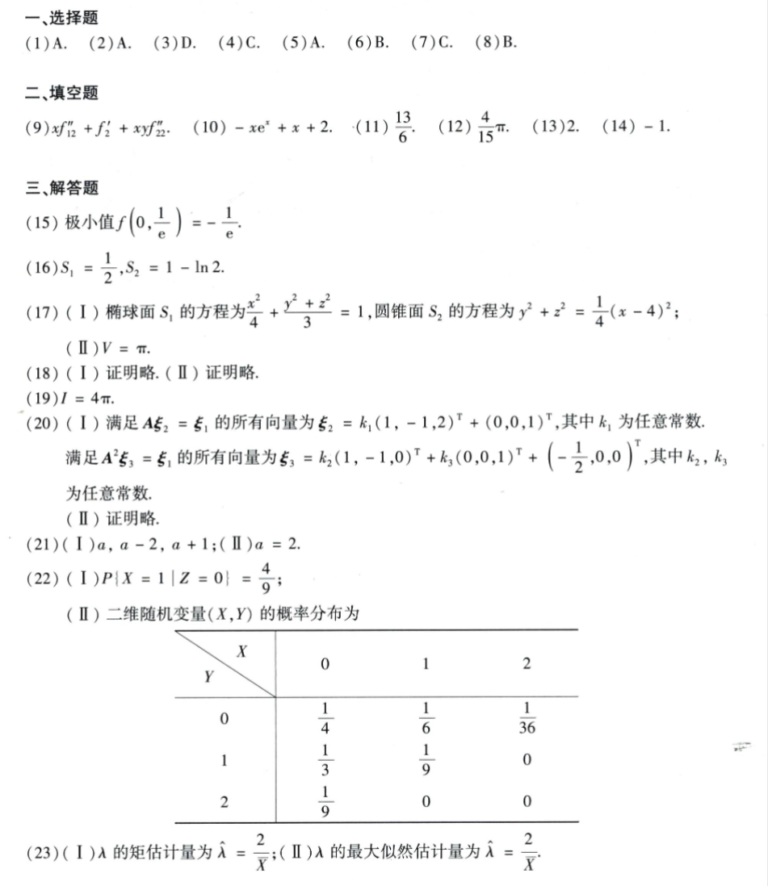
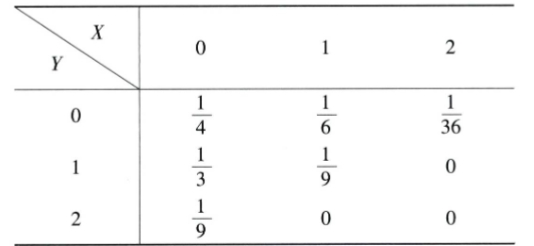

# Math 1 2009 Answers

资料类型：考研数学一答案速查  
年份：2009  
科目：数学一  
来源：本地答案速查图片 OCR/人工转写  
校对状态：待复核  

原图：

## 选择题

| 题号 | 答案 |
|---|---|
| 1 | A |
| 2 | A |
| 3 | D |
| 4 | C |
| 5 | A |
| 6 | B |
| 7 | C |
| 8 | B |

## 填空题

| 题号 | 答案 |
|---|---|
| 9 | `x f''_12 + f'_2 + xy f''_22` |
| 10 | `-x e^x + x + 2` |
| 11 | `13/6` |
| 12 | `4π/15` |
| 13 | `2` |
| 14 | `-1` |

## 解答题

| 题号 | 答案速查 |
|---|---|
| 15 | 极小值 `f(0,1/e)=-1/e` |
| 16 | `S_1=1/2, S_2=1-ln2` |
| 17 | （1）`S_1: x^2/4 + y^2/3 = 1`，`S_2: y^2+z^2=(x-4)^2/4`；（2）`V=π` |
| 18 | 证明略 |
| 19 | `I=4π` |
| 20 | 见原图，含 `Aξ_2=ξ_1`、`A^2ξ_3=ξ_1` 的通解表达 |
| 21 | （1）特征值：`a, a-2, a+1`；（2）`a=2` |
| 22 | （1）`P{X=1|Z=0}=4/9`；（2）二维分布表见下方 |
| 23 | （1）矩估计 `λ_hat=2/X_bar`；（2）最大似然估计 `λ_hat=2/X_bar` |

## 第 22 题二维分布

| Y \\ X | 0 | 1 | 2 |
|---|---:|---:|---:|
| 0 | `1/4` | `1/6` | `1/36` |
| 1 | `1/3` | `1/9` | `0` |
| 2 | `1/9` | `0` | `0` |

原图：

