# Math 1 2009 Exam Questions

资料类型：考研数学一历年真题  
年份：2009  
科目：数学一  
来源 PDF：`D:\download\2009考研数学一真题.pdf`  
整理状态：已初步校对  

说明：本文件由 PDF 文本层、用户补充文字和截图共同整理。公式统一先用可读文本/LaTeX 风格记录。

## 2009 数一 选择题 1-5

截图：

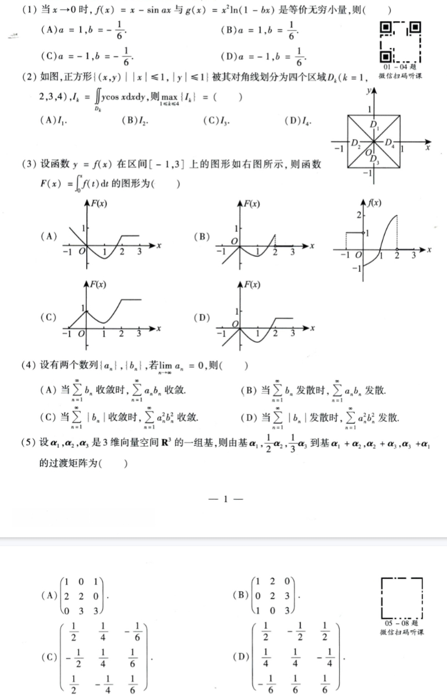

### 第 1 题

- 题型：选择题
- 题号：1
- 分值：4
- 模块：高数
- 考点：等价无穷小
- PDF 页码：1
- 校对状态：已根据用户补充校对

题干：

当 `x -> 0` 时，`f(x) = x - sin(ax)` 与 `g(x) = x^2 ln(1 - bx)` 是等价无穷小量，则（ ）

选项：

A. `a = 1, b = -1/6`  
B. `a = 1, b = 1/6`  
C. `a = -1, b = -1/6`  
D. `a = -1, b = 1/6`

### 第 2 题

- 题型：选择题
- 题号：2
- 分值：4
- 模块：高数
- 考点：二重积分、对称性
- PDF 页码：1
- 校对状态：已根据用户补充校对

配图：

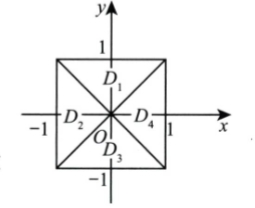

图形说明：两条对角线 `y=x` 与 `y=-x` 将正方形分成四个三角形区域，不是按坐标轴象限划分：

- `D_1` 为上方三角形：`-1 <= x <= 1, |x| <= y <= 1`；
- `D_2` 为左方三角形：`-1 <= y <= 1, -1 <= x <= -|y|`；
- `D_3` 为下方三角形：`-1 <= x <= 1, -1 <= y <= -|x|`；
- `D_4` 为右方三角形：`-1 <= y <= 1, |y| <= x <= 1`。

题干：

如图，正方形 `{(x,y) | |x| <= 1, |y| <= 1}` 被其对角线划分为四个区域 `D_k (k=1,2,3,4)`，设

```text
I_k = ∬_{D_k} y cos x dxdy
```

则 `max { I_k | 1 <= k <= 4 } = ( )`

选项：

A. `I_1`  
B. `I_2`  
C. `I_3`  
D. `I_4`

### 第 3 题

- 题型：选择题
- 题号：3
- 分值：4
- 模块：高数
- 考点：积分函数图像
- PDF 页码：1
- 校对状态：已根据截图校对

原函数图像：

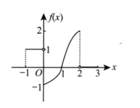

题干：

设函数 `y = f(x)` 在区间 `[-1,3]` 上的图形如右图所示，则函数

```text
F(x) = ∫_0^x f(t) dt
```

的图形为（ ）

选项：

A.

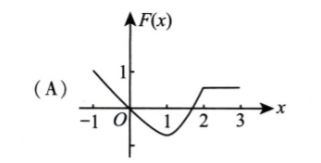

B.

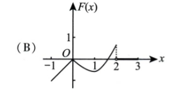

C.

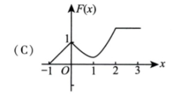

D.

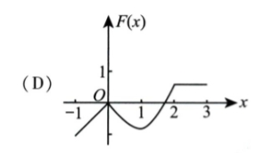

### 第 4 题

- 题型：选择题
- 题号：4
- 分值：4
- 模块：高数
- 考点：数项级数
- PDF 页码：1
- 校对状态：已根据用户补充校对题干条件

题干：

设有两个数列 `{a_n}`、`{b_n}`，若

```text
lim_{n -> ∞} a_n = 0
```

则（ ）

选项：

A. 当 `Σ b_n` 收敛时，`Σ a_n b_n` 收敛。  
B. 当 `Σ b_n` 发散时，`Σ a_n b_n` 发散。  
C. 当 `Σ |b_n|` 收敛时，`Σ a_n^2 b_n^2` 收敛。  
D. 当 `Σ |b_n|` 发散时，`Σ a_n^2 b_n^2` 发散。

### 第 5 题

- 题型：选择题
- 题号：5
- 分值：4
- 模块：线代
- 考点：基变换、过渡矩阵
- PDF 页码：1-2
- 校对状态：已根据用户补充校对

题干：

设 `α_1, α_2, α_3` 是 3 维向量空间 `R^3` 的一组基，则由基

```text
α_1, (1/2)α_2, (1/3)α_3
```

到基

```text
α_1 + α_2, α_2 + α_3, α_3 + α_1
```

的过渡矩阵为（ ）

选项：

A.

```text
[1 0 1
 2 2 0
 0 3 3]
```

B.

```text
[1 2 0
 0 2 3
 1 0 3]
```

C.

```text
[ 1/2   1/4  -1/6
 -1/2   1/4   1/6
  1/2  -1/4   1/6]
```

D.

```text
[ 1/2  -1/2   1/2
  1/4   1/4  -1/4
 -1/6   1/6   1/6]
```

## 2009 数一 选择题 6-8

截图：

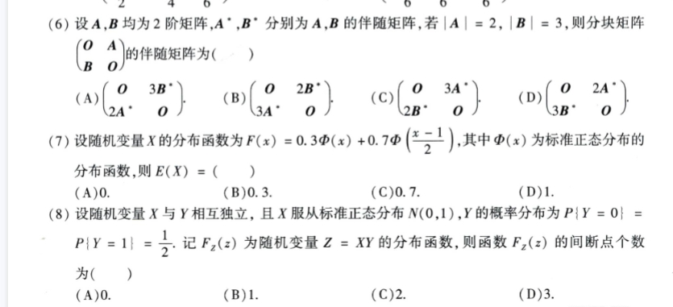

### 第 6 题

- 题型：选择题
- 题号：6
- 分值：4
- 模块：线代
- 考点：伴随矩阵、分块矩阵
- PDF 页码：2
- 校对状态：已根据截图校对

截图：

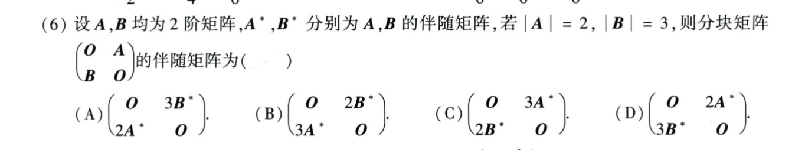

题干：

设 `A, B` 均为 2 阶矩阵，`A*`, `B*` 分别为 `A, B` 的伴随矩阵，若 `|A| = 2`，`|B| = 3`，则分块矩阵

```text
[O  A
 B  O]
```

的伴随矩阵为（ ）

选项：

A.

```text
[ O    3B*
  2A*  O  ]
```

B.

```text
[ O    2B*
  3A*  O  ]
```

C.

```text
[ O    3A*
  2B*  O  ]
```

D.

```text
[ O    2A*
  3B*  O  ]
```

### 第 7 题

- 题型：选择题
- 题号：7
- 分值：4
- 模块：概率统计
- 考点：正态分布、分布函数、数学期望
- PDF 页码：2
- 校对状态：已根据用户补充校对

题干：

设随机变量 `X` 的分布函数为

```text
F(x) = 0.3 Phi(x) + 0.7 Phi((x - 1) / 2)
```

其中 `Phi(x)` 为标准正态分布函数，则 `E(X) = ( )`

选项：

A. `0`  
B. `0.3`  
C. `0.7`  
D. `1`

### 第 8 题

- 题型：选择题
- 题号：8
- 分值：4
- 模块：概率统计
- 考点：随机变量函数、分布函数间断点
- PDF 页码：2
- 校对状态：已根据用户补充校对

题干：

设随机变量 `X` 与 `Y` 相互独立，且 `X` 服从标准正态分布 `N(0,1)`，`Y` 的概率分布为

```text
P{Y = 0} = 1/2, P{Y = 1} = 1/2
```

记 `F_Z(z)` 为随机变量 `Z = XY` 的分布函数，则函数 `F_Z(z)` 的间断点个数为（ ）

选项：

A. `0`  
B. `1`  
C. `2`  
D. `3`

## 2009 数一 填空题 9-14

截图：

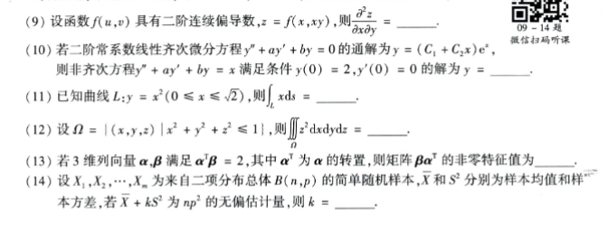

### 第 9 题

- 题型：填空题
- 题号：9
- 分值：4
- 模块：高数
- 考点：多元复合函数偏导
- PDF 页码：2
- 校对状态：已根据截图校对

题干：

设函数 `f(u,v)` 具有二阶连续偏导数，`z = f(x, xy)`，则

```text
∂²z / ∂x∂y = ____
```

### 第 10 题

- 题型：填空题
- 题号：10
- 分值：4
- 模块：高数
- 考点：二阶常系数线性微分方程
- PDF 页码：2
- 校对状态：已根据截图校对

题干：

若二阶常系数线性齐次微分方程

```text
y'' + a y' + b y = 0
```

的通解为

```text
y = (C_1 + C_2 x) e^x
```

则非齐次方程

```text
y'' + a y' + b y = x
```

满足条件 `y(0) = 2, y'(0) = 0` 的解为 `y = ____`。

### 第 11 题

- 题型：填空题
- 题号：11
- 分值：4
- 模块：高数
- 考点：曲线积分
- PDF 页码：2
- 校对状态：已根据截图校对

题干：

已知曲线 `L: y = x^2 (0 <= x <= sqrt(2))`，则

```text
∫_L x ds = ____
```

### 第 12 题

- 题型：填空题
- 题号：12
- 分值：4
- 模块：高数
- 考点：三重积分
- PDF 页码：2
- 校对状态：已根据截图校对

题干：

设

```text
Omega = { (x,y,z) | x^2 + y^2 + z^2 <= 1 }
```

则

```text
∭_Omega z^2 dxdydz = ____
```

### 第 13 题

- 题型：填空题
- 题号：13
- 分值：4
- 模块：线代
- 考点：矩阵特征值
- PDF 页码：2
- 校对状态：已根据截图校对

题干：

若 3 维列向量 `alpha, beta` 满足 `alpha^T beta = 2`，其中 `alpha^T` 为 `alpha` 的转置，则矩阵 `beta alpha^T` 的非零特征值为 `____`。

### 第 14 题

- 题型：填空题
- 题号：14
- 分值：4
- 模块：概率统计
- 考点：无偏估计
- PDF 页码：2
- 校对状态：已根据截图校对

题干：

设 `X_1, X_2, ..., X_n` 为来自二项分布总体 `B(n,p)` 的简单随机样本，`X_bar` 和 `S^2` 分别为样本均值和样本方差，若

```text
X_bar + k S^2
```

为 `np^2` 的无偏估计量，则 `k = ____`。

## 2009 数一 解答题 15-19

截图：

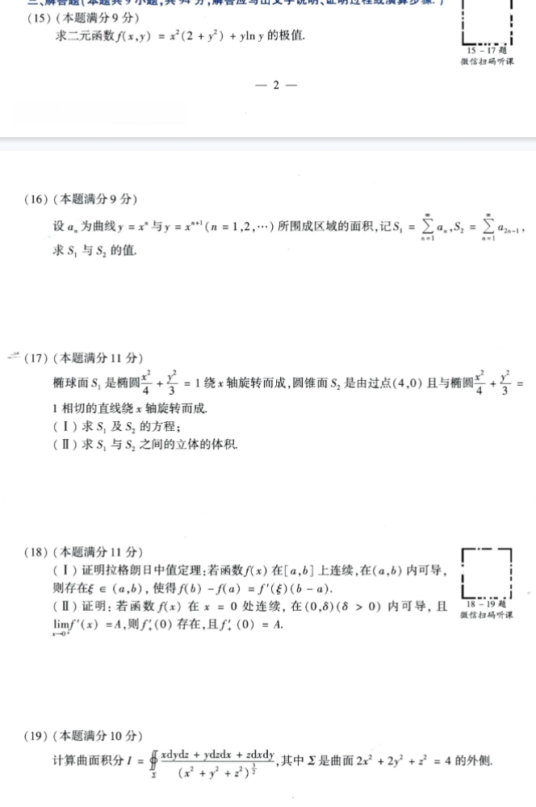

### 第 15 题

- 题型：解答题
- 题号：15
- 分值：9
- 模块：高数
- 考点：二元函数极值
- PDF 页码：2
- 校对状态：已根据截图校对

题干：

求二元函数

```text
f(x,y) = x^2(2 + y^2) + y ln y
```

的极值。

### 第 16 题

- 题型：解答题
- 题号：16
- 分值：9
- 模块：高数
- 考点：曲线围成面积、级数
- PDF 页码：3
- 校对状态：已根据截图校对

题干：

设 `a_n` 为曲线 `y = x^n` 与 `y = x^{n+1} (n = 1,2,...)` 所围成区域的面积，记

```text
S_1 = sum_{n=1}^{∞} a_n
S_2 = sum_{n=1}^{∞} a_{2n-1}
```

求 `S_1` 与 `S_2` 的值。

### 第 17 题

- 题型：解答题
- 题号：17
- 分值：11
- 模块：高数
- 考点：旋转曲面、立体体积
- PDF 页码：3
- 校对状态：已根据截图校对

题干：

椭球面 `S_1` 是椭圆

```text
x^2 / 4 + y^2 / 3 = 1
```

绕 `x` 轴旋转而成，圆锥面 `S_2` 是由过点 `(4,0)` 且与椭圆

```text
x^2 / 4 + y^2 / 3 = 1
```

相切的直线绕 `x` 轴旋转而成。

1. 求 `S_1` 及 `S_2` 的方程。
2. 求 `S_1` 与 `S_2` 之间的立体的体积。

### 第 18 题

- 题型：解答题
- 题号：18
- 分值：11
- 模块：高数
- 考点：拉格朗日中值定理、导数极限
- PDF 页码：3
- 校对状态：已根据截图校对

题干：

1. 证明拉格朗日中值定理：若函数 `f(x)` 在 `[a,b]` 上连续，在 `(a,b)` 内可导，则存在 `xi in (a,b)`，使得

```text
f(b) - f(a) = f'(xi)(b - a)
```

2. 证明：若函数 `f(x)` 在 `x = 0` 处连续，在 `(0, delta) (delta > 0)` 内可导，且

```text
lim_{x -> 0+} f'(x) = A
```

则 `f'_+(0)` 存在，且 `f'_+(0) = A`。

### 第 19 题

- 题型：解答题
- 题号：19
- 分值：10
- 模块：高数
- 考点：曲面积分
- PDF 页码：3
- 校对状态：已根据截图校对

题干：

计算曲面积分

```text
I = ∬_Sigma (x dydz + y dzdx + z dxdy) / (x^2 + y^2 + z^2)^(3/2)
```

其中 `Sigma` 是曲面

```text
2x^2 + 2y^2 + z^2 = 4
```

的外侧。

## 2009 数一 解答题 20-23

截图：

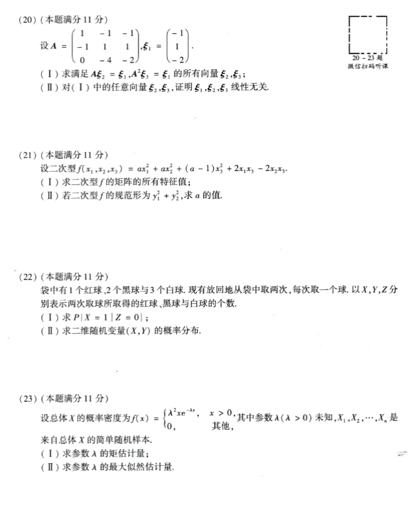

### 第 20 题

- 题型：解答题
- 题号：20
- 分值：11
- 模块：线代
- 考点：矩阵方程、向量线性无关
- PDF 页码：4
- 校对状态：已根据截图校对

题干：

设

```text
A = [ 1  -1  -1
     -1   1   1
      0  -4  -2 ],
xi_1 = [-1
         1
        -2]
```

1. 求满足 `A xi_2 = xi_1, A^2 xi_3 = xi_1` 的所有向量 `xi_2, xi_3`。
2. 对 1 中的任意向量 `xi_2, xi_3`，证明 `xi_1, xi_2, xi_3` 线性无关。

### 第 21 题

- 题型：解答题
- 题号：21
- 分值：11
- 模块：线代
- 考点：二次型、特征值、规范形
- PDF 页码：4
- 校对状态：已根据截图校对

题干：

设二次型

```text
f(x_1,x_2,x_3) = a x_1^2 + a x_2^2 + (a - 1) x_3^2 + 2 x_1 x_3 - 2 x_2 x_3
```

1. 求二次型 `f` 的矩阵的所有特征值。
2. 若二次型 `f` 的规范形为 `y_1^2 + y_2^2`，求 `a` 的值。

### 第 22 题

- 题型：解答题
- 题号：22
- 分值：11
- 模块：概率统计
- 考点：条件概率、二维随机变量分布
- PDF 页码：4
- 校对状态：已根据截图校对

题干：

袋中有 1 个红球、2 个黑球与 3 个白球。现有放回地从袋中取两次，每次取一个球。以 `X, Y, Z` 分别表示两次取球所取得的红球、黑球与白球的个数。

1. 求 `P{X = 1 | Z = 0}`。
2. 求二维随机变量 `(X,Y)` 的概率分布。

### 第 23 题

- 题型：解答题
- 题号：23
- 分值：11
- 模块：概率统计
- 考点：矩估计、最大似然估计
- PDF 页码：4
- 校对状态：已根据截图校对

题干：

设总体 `X` 的概率密度为

```text
f(x) = {
  lambda^2 x e^(-lambda x), x > 0
  0, 其他
}
```

其中参数 `lambda (lambda > 0)` 未知，`X_1, X_2, ..., X_n` 是来自总体 `X` 的简单随机样本。

1. 求参数 `lambda` 的矩估计量。
2. 求参数 `lambda` 的最大似然估计量。
