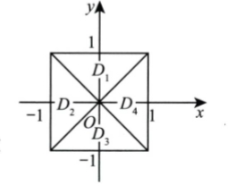

# 2009 数学一第 2 题

## 题目

配图：

图形说明：两条对角线 `y=x` 与 `y=-x` 将正方形分成四个三角形区域，不是按坐标轴象限划分：

- `D_1` 为上方三角形：`-1 <= x <= 1, |x| <= y <= 1`；
- `D_2` 为左方三角形：`-1 <= y <= 1, -1 <= x <= -|y|`；
- `D_3` 为下方三角形：`-1 <= x <= 1, -1 <= y <= -|x|`；
- `D_4` 为右方三角形：`-1 <= y <= 1, |y| <= x <= 1`。

题干：

如图，正方形 `{(x,y) | |x| <= 1, |y| <= 1}` 被其对角线划分为四个区域 `D_k (k=1,2,3,4)`，设

$$
I_k = ∬_{D_k} y cos x dxdy
$$

则 `max { I_k | 1 <= k <= 4 } = ( )`

选项：

A. `I_1`
B. `I_2`
C. `I_3`
D. `I_4`

## 标准答案

A

## 解析

令被积函数 $z=y\cos x$。它关于 $y$ 为奇函数，关于 $x$ 为偶函数。区域 $D_2,D_4$ 关于 $x$ 轴对称，因此
$$
I_2=I_4=0.
$$
上方区域 $D_1$ 上 $y\ge 0$，且 $\cos x>0$，所以 $I_1>0$；下方区域 $D_3$ 上 $y\le 0$，所以 $I_3<0$。更具体地，
$$
I_1=2\int_0^1\int_0^y y\cos x\,dx\,dy=2\int_0^1 y\sin y\,dy>0,
$$
而 $I_3<0$。故最大者为 $I_1$，选 A。

## 来源

- 题目来源：`math1_2009_questions.md`
- 答案来源：`math1_2009_answers.md`
