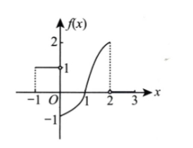
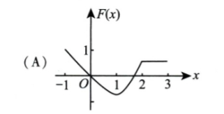
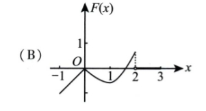
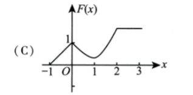
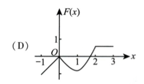

# 2009 数学一第 3 题

## 题目

原函数图像：

题干：

设函数 `y = f(x)` 在区间 `[-1,3]` 上的图形如右图所示，则函数

$$
F(x) = ∫_0^x f(t) dt
$$

的图形为（ ）

选项：

A.

B.

C.

D.

## 标准答案

D

## 解析

由题图可读出：在 $[-1,0)$ 上 $f(x)=1$，在 $[0,2]$ 上记为 $g(x)$，且 $g(0)=-1,g(1)=0,g(2)=2$，在 $(2,3]$ 上 $f(x)=0$。设
$$
F(x)=\int_0^x f(t)\,dt.
$$
当 $-1\le x<0$ 时，
$$
F(x)=\int_0^x f(t)\,dt=-\int_x^0 1\,dt=x<0,
$$
可排除 A、C。又当 $2<x\le 3$ 时，
$$
F(x)=\int_0^2 g(t)\,dt,
$$
由图形面积可知该值为正，并且此后保持常数。符合这些特征的只有 D。

## 来源

- 题目来源：`math1_2009_questions.md`
- 答案来源：`math1_2009_answers.md`
