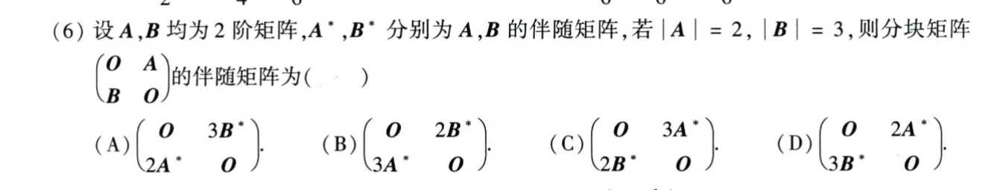

# 2009 数学一第 6 题

## 题目

截图：

题干：

设 `A, B` 均为 2 阶矩阵，`A*`, `B*` 分别为 `A, B` 的伴随矩阵，若 `\det A = 2`，`\det B = 3`，则分块矩阵

$$
[O  A
 B  O]
$$

的伴随矩阵为（ ）

选项：

A.

$$
[ O    3B*
  2A*  O  ]
$$

B.

$$
[ O    2B*
  3A*  O  ]
$$

C.

$$
[ O    3A*
  2B*  O  ]
$$

D.

$$
[ O    2A*
  3B*  O  ]
$$

## 标准答案

B

## 解析

设
$$
M=\begin{pmatrix}O&A\\B&O\end{pmatrix}.
$$
由 $\det A=2, \det B=3$ 知 $A,B$ 可逆，且
$$
A^*=\det AA^{-1}=2A^{-1},\qquad B^*=\det BB^{-1}=3B^{-1}.
$$
矩阵 $M$ 的逆矩阵为
$$
M^{-1}=\begin{pmatrix}O&B^{-1}\\A^{-1}&O\end{pmatrix},
$$
并且 $\det M=\det A\det B=6$。所以
$$
M^*=\det MM^{-1}
=\begin{pmatrix}O&6B^{-1}\\6A^{-1}&O\end{pmatrix}
=\begin{pmatrix}O&2B^*\\3A^*&O\end{pmatrix}.
$$
选 B。

## 来源

- 题目来源：`math1_2009_questions.md`
- 答案来源：`math1_2009_answers.md`
