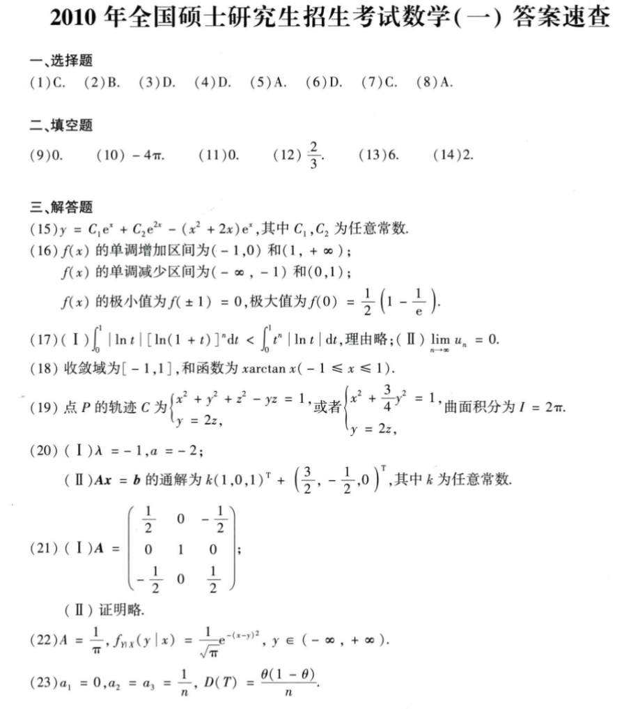

# Math 1 2010 Answers

资料类型：考研数学一答案速查  
年份：2010  
科目：数学一  
来源：本地答案速查图片 OCR/人工转写  
校对状态：待复核  

原图：

## 选择题

| 题号 | 答案 |
|---|---|
| 1 | C |
| 2 | B |
| 3 | D |
| 4 | D |
| 5 | A |
| 6 | D |
| 7 | C |
| 8 | A |

## 填空题

| 题号 | 答案 |
|---|---|
| 9 | `0` |
| 10 | `-4π` |
| 11 | `0` |
| 12 | `2/3` |
| 13 | `6` |
| 14 | `2` |

## 解答题

| 题号 | 答案速查 |
|---|---|
| 15 | `y=C_1 e^x + C_2 e^(2x) - (x^2+2x)e^x` |
| 16 | 单调增区间 `(-1,0)` 和 `(1,+∞)`；单调减区间 `(-∞,-1)` 和 `(0,1)`；极小值 `f(±1)=0`，极大值 `f(0)=1/2(1-1/e)` |
| 17 | （1）`∫_0^1 |ln t|[ln(1+t)]^n dt < ∫_0^1 t^n |ln t|dt`；（2）`lim u_n=0` |
| 18 | 收敛域 `[-1,1]`，和函数 `x arctan x (-1<=x<=1)` |
| 19 | 点 `P` 的轨迹 `C` 可写为 `{x^2+y^2+z^2-yz=1, y=2z}`，等价于 `{x^2+(3/4)y^2=1, y=2z}`；曲面积分 `I=2π` |
| 20 | （1）`λ=-1, a=-2`；（2）通解 `k(1,0,1)^T + (3/2,-1/2,0)^T` |
| 21 | （1）`A=[1/2,0,-1/2; 0,1,0; -1/2,0,1/2]`；（2）证明略 |
| 22 | `A=1/π`；`f_{Y|X}(y|x)=1/sqrt(π) e^{-(x-y)^2}` |
| 23 | （1）`a_1=0, a_2=a_3=1/n`；（2）`D(T)=θ(1-θ)/n` |
