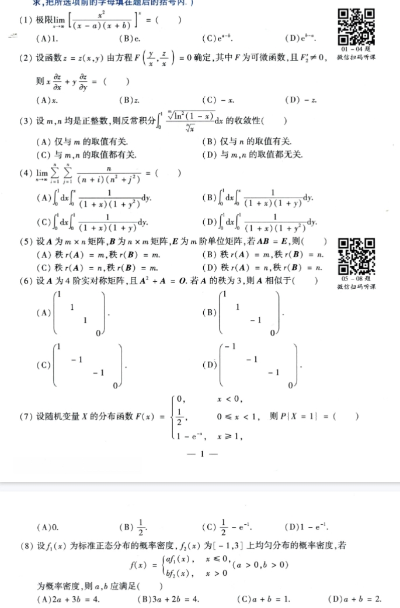
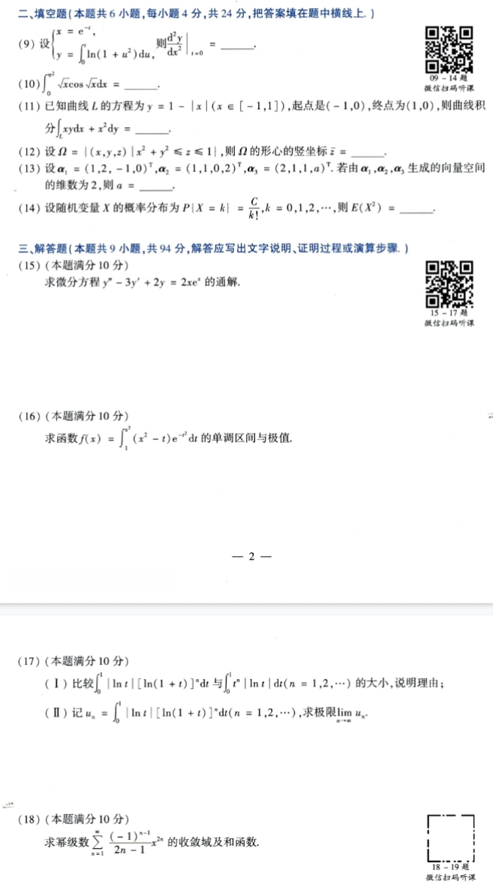
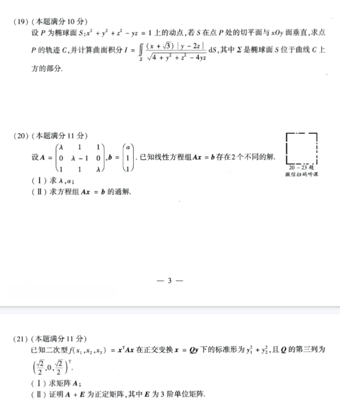
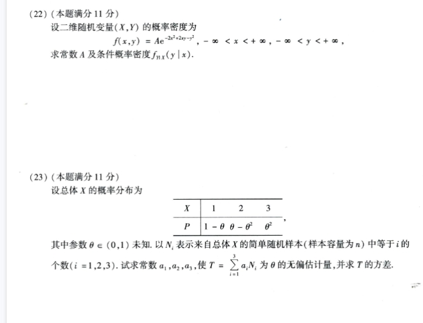

# Math 1 2010 Exam Questions

资料类型：考研数学一历年真题  
年份：2010  
科目：数学一  
整理状态：待复核  

说明：本文件根据用户提供的 2010 年真题截图整理。截图已保存到 `images/` 目录；细小公式处建议最终再对照原图复核。

## 2010 数一 选择题 1-8

截图：



### 第 1 题

- 题型：选择题
- 题号：1
- 分值：4
- 模块：高数
- 考点：重要极限
- 校对状态：根据截图整理

题干：

求极限

```text
lim_{x -> ∞} [ x^2 / ((x - a)(x + b)) ]^x = ( )
```

选项：

A. `1`  
B. `e`  
C. `e^(a-b)`  
D. `e^(b-a)`

### 第 2 题

- 题型：选择题
- 题号：2
- 分值：4
- 模块：高数
- 考点：隐函数求导、齐次函数
- 校对状态：根据截图整理

题干：

设函数 `z = z(x,y)` 由方程

```text
F(y/x, z/x) = 0
```

确定，其中 `F` 为可微函数，且 `F'_2 != 0`，则

```text
x ∂z/∂x + y ∂z/∂y = ( )
```

选项：

A. `x`  
B. `z`  
C. `-x`  
D. `-z`

### 第 3 题

- 题型：选择题
- 题号：3
- 分值：4
- 模块：高数
- 考点：反常积分敛散性
- 校对状态：根据截图整理

题干：

设 `m,n` 均是正整数，则反常积分

```text
∫_0^1 [ (ln^2(1 - x))^(1/m) / x^(1/n) ] dx
```

的收敛性（ ）

选项：

A. 仅与 `m` 的取值有关。  
B. 仅与 `n` 的取值有关。  
C. 与 `m,n` 的取值都有关。  
D. 与 `m,n` 的取值都无关。

### 第 4 题

- 题型：选择题
- 题号：4
- 分值：4
- 模块：高数
- 考点：二重积分、二重和极限
- 校对状态：根据截图整理

题干：

```text
lim_{n -> ∞} sum_{i=1}^n sum_{j=1}^n n / ((n+i)(n^2+j^2)) = ( )
```

选项：

A. `∫_0^1 dx ∫_0^x 1 / ((1+x)(1+y^2)) dy`  
B. `∫_0^1 dx ∫_0^x 1 / ((1+x)(1+y)) dy`  
C. `∫_0^1 dx ∫_0^1 1 / ((1+x)(1+y)) dy`  
D. `∫_0^1 dx ∫_0^1 1 / ((1+x)(1+y^2)) dy`

### 第 5 题

- 题型：选择题
- 题号：5
- 分值：4
- 模块：线代
- 考点：矩阵秩
- 校对状态：根据截图整理

题干：

设 `A` 为 `m x n` 矩阵，`B` 为 `n x m` 矩阵，`E` 为 `m` 阶单位矩阵，若 `AB = E`，则（ ）

选项：

A. `rank(A)=m, rank(B)=m`。  
B. `rank(A)=m, rank(B)=n`。  
C. `rank(A)=n, rank(B)=m`。  
D. `rank(A)=n, rank(B)=n`。

### 第 6 题

- 题型：选择题
- 题号：6
- 分值：4
- 模块：线代
- 考点：实对称矩阵、相似对角化
- 校对状态：根据截图整理

题干：

设 `A` 为 4 阶实对称矩阵，且 `A^2 + A = O`。若 `A` 的秩为 3，则 `A` 相似于（ ）

选项：

A.

```text
diag(1, 1, 1, 0)
```

B.

```text
diag(1, 1, -1, 0)
```

C.

```text
diag(1, -1, -1, 0)
```

D.

```text
diag(-1, -1, -1, 0)
```

### 第 7 题

- 题型：选择题
- 题号：7
- 分值：4
- 模块：概率统计
- 考点：分布函数、离散概率
- 校对状态：根据截图整理

题干：

设随机变量 `X` 的分布函数为

```text
F(x) = {
  0,        x < 0
  1/2,      0 <= x < 1
  1 - e^(-x), x >= 1
}
```

则 `P{X = 1} = ( )`

选项：

A. `0`  
B. `1/2`  
C. `1/2 - e^(-1)`  
D. `1 - e^(-1)`

### 第 8 题

- 题型：选择题
- 题号：8
- 分值：4
- 模块：概率统计
- 考点：概率密度归一化
- 校对状态：根据截图整理

题干：

设 `f_1(x)` 为标准正态分布的概率密度，`f_2(x)` 为 `[-1,3]` 上均匀分布的概率密度，若

```text
f(x) = {
  a f_1(x), x <= 0
  b f_2(x), x > 0
},  (a > 0, b > 0)
```

为概率密度，则 `a,b` 应满足（ ）

选项：

A. `2a + 3b = 4`  
B. `3a + 2b = 4`  
C. `a + b = 1`  
D. `a + b = 2`

## 2010 数一 填空题 9-14 与解答题 15-18

截图：



### 第 9 题

- 题型：填空题
- 题号：9
- 分值：4
- 模块：高数
- 考点：参数方程求导
- 校对状态：根据截图整理

题干：

设

```text
x = e^t,
y = ∫_0^t ln(1 + u^2) du
```

则

```text
(d²y/dx²)|_{t=0} = ____
```

### 第 10 题

- 题型：填空题
- 题号：10
- 分值：4
- 模块：高数
- 考点：定积分计算
- 校对状态：根据截图整理

题干：

```text
∫_0^(π²) sqrt(x) cos(sqrt(x)) dx = ____
```

### 第 11 题

- 题型：填空题
- 题号：11
- 分值：4
- 模块：高数
- 考点：曲线积分
- 校对状态：根据截图整理

题干：

已知曲线 `L` 的方程为 `y = 1 - |x| (x in [-1,1])`，起点是 `(-1,0)`，终点为 `(1,0)`，则曲线积分

```text
∫_L xy dx + x² dy = ____
```

### 第 12 题

- 题型：填空题
- 题号：12
- 分值：4
- 模块：高数
- 考点：形心
- 校对状态：根据截图整理

题干：

设

```text
Omega = { (x,y,z) | x² + y² <= z <= 1 }
```

则 `Omega` 的形心的竖坐标 `z_bar = ____`。

### 第 13 题

- 题型：填空题
- 题号：13
- 分值：4
- 模块：线代
- 考点：向量组秩、线性生成空间维数
- 校对状态：根据截图整理

题干：

设

```text
alpha_1 = (1, 2, -1, 0)^T,
alpha_2 = (1, 1, 0, 2)^T,
alpha_3 = (2, 1, 1, a)^T
```

若由 `alpha_1, alpha_2, alpha_3` 生成的向量空间的维数为 2，则 `a = ____`。

### 第 14 题

- 题型：填空题
- 题号：14
- 分值：4
- 模块：概率统计
- 考点：离散分布、数学期望
- 校对状态：根据截图整理

题干：

设随机变量 `X` 的概率分布为

```text
P{X = k} = C / k!,  k = 0,1,2,...
```

则 `E(X²) = ____`。

### 第 15 题

- 题型：解答题
- 题号：15
- 分值：10
- 模块：高数
- 考点：常系数线性微分方程
- 校对状态：根据截图整理

题干：

求微分方程

```text
y'' - 3y' + 2y = 2x e^x
```

的通解。

### 第 16 题

- 题型：解答题
- 题号：16
- 分值：10
- 模块：高数
- 考点：变限积分函数、单调区间、极值
- 校对状态：根据截图整理

题干：

求函数

```text
f(x) = ∫_1^(x²) (x² - t) e^(-t) dt
```

的单调区间与极值。

### 第 17 题

- 题型：解答题
- 题号：17
- 分值：10
- 模块：高数
- 考点：积分不等式、极限
- 校对状态：已根据用户补充校对

题干：

1. 比较

```text
∫_0^1 |ln t| [ln(1+t)]^n dt
```

与

```text
∫_0^1 t^n |ln t| dt   (n = 1,2,...)
```

的大小，说明理由。

2. 记

```text
u_n = ∫_0^1 |ln t| [ln(1+t)]^n dt  (n = 1,2,...)
```

求极限 `lim_{n -> ∞} u_n`。

### 第 18 题

- 题型：解答题
- 题号：18
- 分值：10
- 模块：高数
- 考点：幂级数、和函数
- 校对状态：根据截图整理

题干：

求幂级数

```text
Σ_{n=1}^∞ [(-1)^(n-1)/(2n-1)] x^(2n)
```

的收敛域及和函数。

## 2010 数一 解答题 19-21

截图：



### 第 19 题

- 题型：解答题
- 题号：19
- 分值：10
- 模块：高数
- 考点：曲面积分、切平面、轨迹
- 校对状态：待复核

题干：

设 `P` 为椭球面

```text
S: x² + y² + z² - yz = 1
```

上的动点，若 `S` 在点 `P` 处的切平面与 `xOy` 面垂直，求点 `P` 的轨迹 `C`，并计算曲面积分

```text
I = ∬_Sigma [((x + sqrt(3)) |y - 2z|) / sqrt(4 + y² + z² - 4yz)] dS
```

其中 `Sigma` 是椭球面 `S` 位于曲线 `C` 上方的部分。

待复核：

- 曲面积分分母中 `y,z` 的二次型按截图转写为 `4 + y² + z² - 4yz`，建议最终复核。

### 第 20 题

- 题型：解答题
- 题号：20
- 分值：11
- 模块：线代
- 考点：线性方程组、通解
- 校对状态：根据截图整理

题干：

设

```text
A = [ lambda    1       1
      0         lambda-1 0
      1         1       lambda ],

b = [a
     1
     1]
```

已知线性方程组 `Ax = b` 存在 2 个不同的解。

1. 求 `lambda, a`。
2. 求方程组 `Ax = b` 的通解。

### 第 21 题

- 题型：解答题
- 题号：21
- 分值：11
- 模块：线代
- 考点：二次型、正交变换、正定矩阵
- 校对状态：根据截图整理

题干：

已知二次型

```text
f(x_1,x_2,x_3) = x^T A x
```

在正交变换 `x = Qy` 下的标准形为

```text
y_1² + y_2²
```

且 `Q` 的第三列为

```text
(sqrt(2)/2, 0, sqrt(2)/2)^T
```

1. 求矩阵 `A`。
2. 证明 `A + E` 为正定矩阵，其中 `E` 为 3 阶单位矩阵。

## 2010 数一 解答题 22-23

截图：



### 第 22 题

- 题型：解答题
- 题号：22
- 分值：11
- 模块：概率统计
- 考点：二维连续型随机变量、条件密度
- 校对状态：根据截图整理

题干：

设二维随机变量 `(X,Y)` 的概率密度为

```text
f(x,y) = A e^(-2x² + 2xy - y²),  -∞ < x < +∞, -∞ < y < +∞
```

求常数 `A` 及条件概率密度 `f_{Y|X}(y|x)`。

### 第 23 题

- 题型：解答题
- 题号：23
- 分值：11
- 模块：概率统计
- 考点：无偏估计、方差
- 校对状态：根据截图整理

题干：

设总体 `X` 的概率分布为

```text
X: 1        2          3
P: 1-theta  theta-theta²  theta²
```

其中参数 `theta in (0,1)` 未知。以 `N_i` 表示来自总体 `X` 的简单随机样本（样本容量为 `n`）中等于 `i` 的个数 `(i=1,2,3)`。试求常数 `a_1,a_2,a_3`，使

```text
T = sum_{i=1}^3 a_i N_i
```

为 `theta` 的无偏估计量，并求 `T` 的方差。
