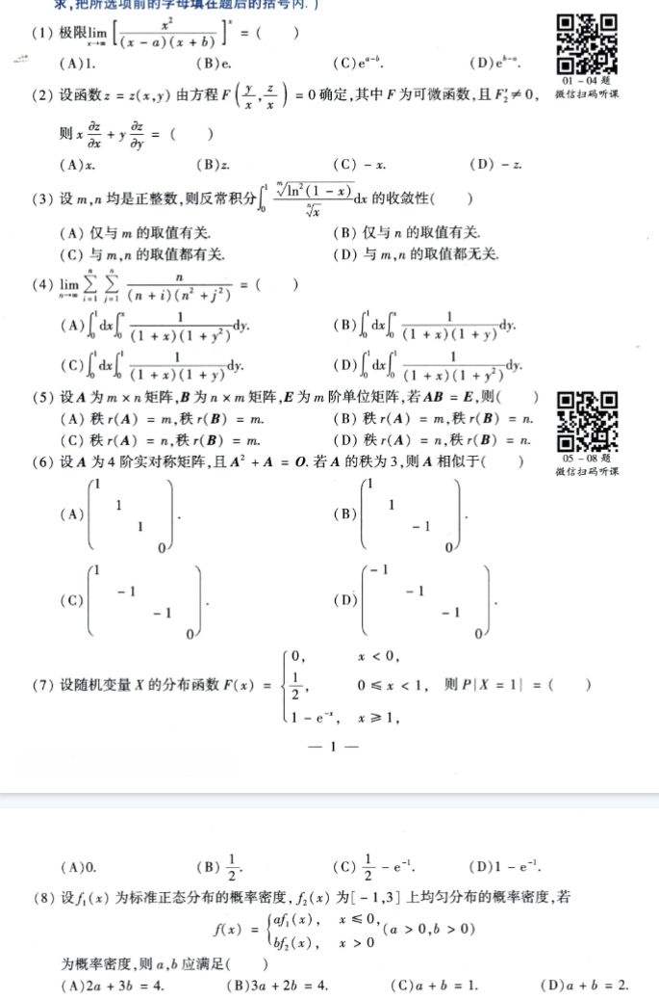
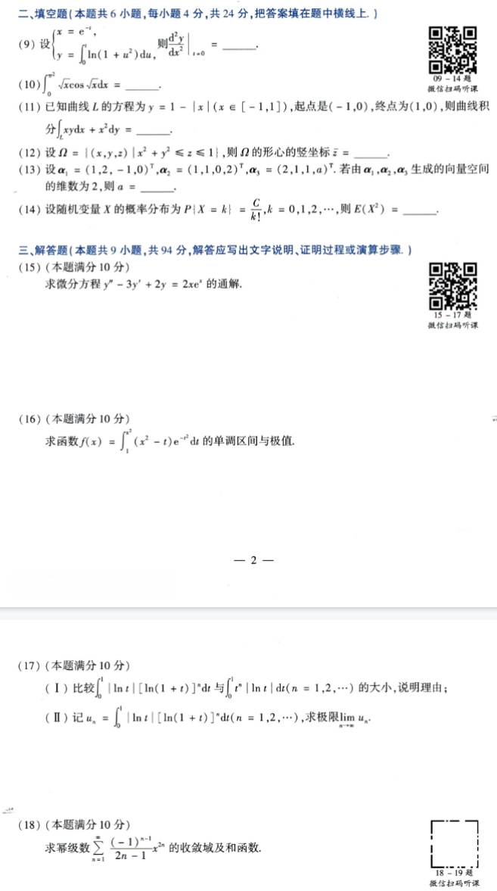
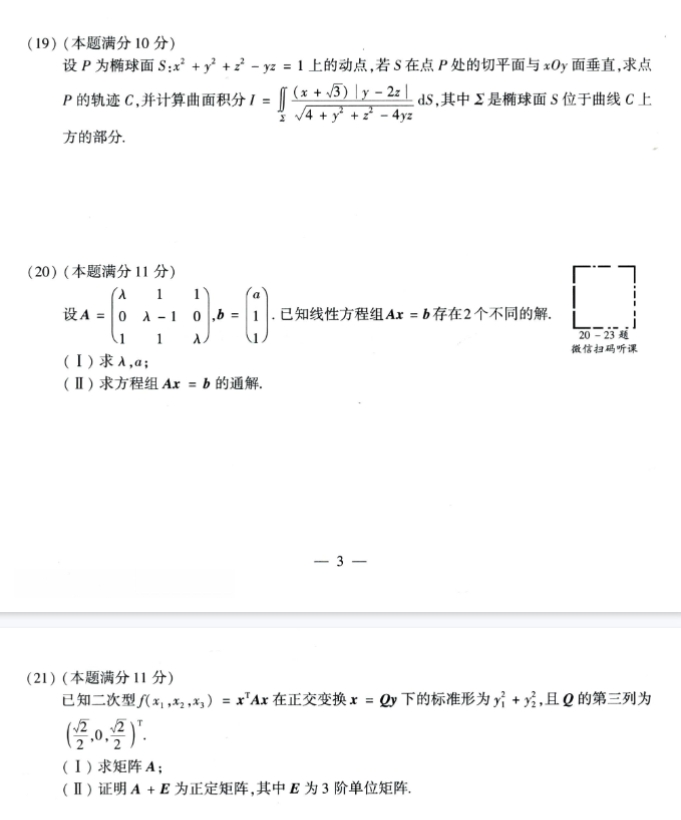
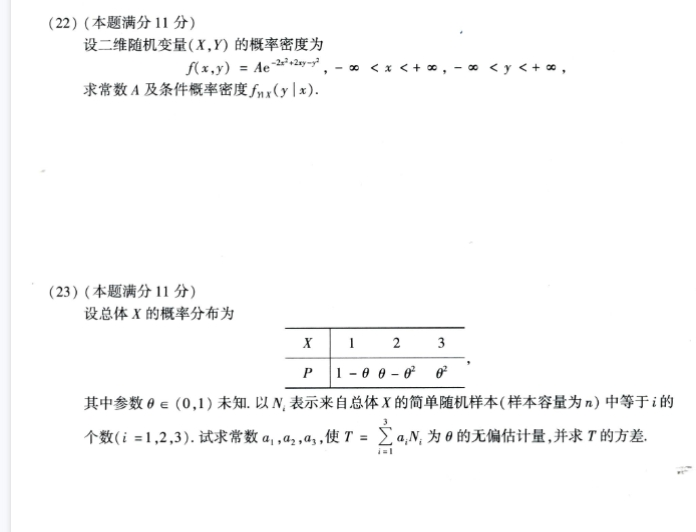

# Math 1 2010 Exam Questions

资料类型：考研数学一历年真题
年份：2010
科目：数学一
整理状态：已按截图与答案页校对

说明：本文件根据用户提供的 2010 年真题截图整理，截图已保存到 `images/` 目录。

## 2010 数一 选择题 1-8

**第 1-8 题题图**

### 第 1 题

- 题型：选择题
- 题号：1
- 分值：4
- 模块：高数
- 考点：重要极限
- 校对状态：根据截图整理

题干：

求极限

$$
\lim_{x\to\infty}\left[\frac{x^2}{(x-a)(x+b)}\right]^x=(\quad)
$$

选项：

A. `1`
B. `e`
C. `e^(a-b)`
D. `e^(b-a)`

### 第 2 题

- 题型：选择题
- 题号：2
- 分值：4
- 模块：高数
- 考点：隐函数求导、齐次函数
- 校对状态：根据截图整理

题干：

设函数 `z = z(x,y)` 由方程

$$
F\left(\frac{y}{x},\frac{z}{x}\right)=0
$$

确定，其中 `F` 为可微函数，且 `F'_2 != 0`，则

$$
x\frac{\partial z}{\partial x}+y\frac{\partial z}{\partial y}=(\quad)
$$

选项：

A. `x`
B. `z`
C. `-x`
D. `-z`

### 第 3 题

- 题型：选择题
- 题号：3
- 分值：4
- 模块：高数
- 考点：反常积分敛散性
- 校对状态：根据截图整理

题干：

设 `m,n` 均是正整数，则反常积分

$$
\int_0^1\frac{\sqrt[m]{\ln^2(1-x)}}{\sqrt[n]{x}}\,dx
$$

的收敛性（ ）

选项：

A. 仅与 `m` 的取值有关。
B. 仅与 `n` 的取值有关。
C. 与 `m,n` 的取值都有关。
D. 与 `m,n` 的取值都无关。

### 第 4 题

- 题型：选择题
- 题号：4
- 分值：4
- 模块：高数
- 考点：二重积分、二重和极限
- 校对状态：根据截图整理

题干：

$$
\lim_{n\to\infty}\sum_{i=1}^n\sum_{j=1}^n\frac{n}{(n+i)(n^2+j^2)}=(\quad)
$$

选项：

A. `∫_0^1 dx ∫_0^x 1 / ((1+x)(1+y^2)) dy`
B. `∫_0^1 dx ∫_0^x 1 / ((1+x)(1+y)) dy`
C. `∫_0^1 dx ∫_0^1 1 / ((1+x)(1+y)) dy`
D. `∫_0^1 dx ∫_0^1 1 / ((1+x)(1+y^2)) dy`

### 第 5 题

- 题型：选择题
- 题号：5
- 分值：4
- 模块：线代
- 考点：矩阵秩
- 校对状态：根据截图整理

题干：

设 `A` 为 `m x n` 矩阵，`B` 为 `n x m` 矩阵，`E` 为 `m` 阶单位矩阵，若 `AB = E`，则（ ）

选项：

A. `rank(A)=m, rank(B)=m`。
B. `rank(A)=m, rank(B)=n`。
C. `rank(A)=n, rank(B)=m`。
D. `rank(A)=n, rank(B)=n`。

### 第 6 题

- 题型：选择题
- 题号：6
- 分值：4
- 模块：线代
- 考点：实对称矩阵、相似对角化
- 校对状态：根据截图整理

题干：

设 `A` 为 4 阶实对称矩阵，且 `A^2 + A = O`。若 `A` 的秩为 3，则 `A` 相似于（ ）

选项：

A.

$$
\operatorname{diag}(1,1,1,0)
$$

B.

$$
\operatorname{diag}(1,1,-1,0)
$$

C.

$$
\operatorname{diag}(1,-1,-1,0)
$$

D.

$$
\operatorname{diag}(-1,-1,-1,0)
$$

### 第 7 题

- 题型：选择题
- 题号：7
- 分值：4
- 模块：概率统计
- 考点：分布函数、离散概率
- 校对状态：根据截图整理

题干：

设随机变量 `X` 的分布函数为

$$
F(x)=\begin{cases}
0,&x<0,\\
\frac{1}{2},&0\le x<1,\\
1-e^{-x},&x\ge1.
\end{cases}
$$

则 `P{X = 1} = ( )`

选项：

A. `0`
B. `1/2`
C. `1/2 - e^(-1)`
D. `1 - e^(-1)`

### 第 8 题

- 题型：选择题
- 题号：8
- 分值：4
- 模块：概率统计
- 考点：概率密度归一化
- 校对状态：根据截图整理

题干：

设 `f_1(x)` 为标准正态分布的概率密度，`f_2(x)` 为 `[-1,3]` 上均匀分布的概率密度，若

$$
f(x)=\begin{cases}
a f_1(x),&x\le0,\\
b f_2(x),&x>0,
\end{cases}\qquad a>0,\ b>0.
$$

为概率密度，则 `a,b` 应满足（ ）

选项：

A. `2a + 3b = 4`
B. `3a + 2b = 4`
C. `a + b = 1`
D. `a + b = 2`

## 2010 数一 填空题 9-14 与解答题 15-18

**第 9-18 题题图**

### 第 9 题

- 题型：填空题
- 题号：9
- 分值：4
- 模块：高数
- 考点：参数方程求导
- 校对状态：根据截图整理

题干：

设

$$
\begin{cases}
x=e^{-t},\\
y=\displaystyle\int_0^t\ln(1+u^2)\,du.
\end{cases}
$$

则

$$
\left.\frac{d^2y}{dx^2}\right|_{t=0}=\underline{\qquad}
$$

### 第 10 题

- 题型：填空题
- 题号：10
- 分值：4
- 模块：高数
- 考点：定积分计算
- 校对状态：根据截图整理

题干：

$$
\int_0^{\pi^2}\sqrt{x}\cos\sqrt{x}\,dx=\underline{\qquad}
$$

### 第 11 题

- 题型：填空题
- 题号：11
- 分值：4
- 模块：高数
- 考点：曲线积分
- 校对状态：根据截图整理

题干：

已知曲线 `L` 的方程为 `y = 1 - |x| (x in [-1,1])`，起点是 `(-1,0)`，终点为 `(1,0)`，则曲线积分

$$
\int_L xy\,dx+x^2\,dy=\underline{\qquad}
$$

### 第 12 题

- 题型：填空题
- 题号：12
- 分值：4
- 模块：高数
- 考点：形心
- 校对状态：根据截图整理

题干：

设

$$
\Omega=\{(x,y,z)\mid x^2+y^2\le z\le1\}
$$

则 `Omega` 的形心的竖坐标 `z_bar = ____`。

### 第 13 题

- 题型：填空题
- 题号：13
- 分值：4
- 模块：线代
- 考点：向量组秩、线性生成空间维数
- 校对状态：根据截图整理

题干：

设

$$
\alpha_1=(1,2,-1,0)^T,\quad
\alpha_2=(1,1,0,2)^T,\quad
\alpha_3=(2,1,1,a)^T
$$

若由 `alpha_1, alpha_2, alpha_3` 生成的向量空间的维数为 2，则 `a = ____`。

### 第 14 题

- 题型：填空题
- 题号：14
- 分值：4
- 模块：概率统计
- 考点：离散分布、数学期望
- 校对状态：根据截图整理

题干：

设随机变量 `X` 的概率分布为

$$
P\{X=k\}=\frac{C}{k!},\qquad k=0,1,2,\ldots
$$

则 `E(X²) = ____`。

### 第 15 题

- 题型：解答题
- 题号：15
- 分值：10
- 模块：高数
- 考点：常系数线性微分方程
- 校对状态：根据截图整理

题干：

求微分方程

$$
y''-3y'+2y=2xe^x
$$

的通解。

### 第 16 题

- 题型：解答题
- 题号：16
- 分值：10
- 模块：高数
- 考点：变限积分函数、单调区间、极值
- 校对状态：根据截图整理

题干：

求函数

$$
f(x)=\int_1^{x^2}(x^2-t)e^{-t^2}\,dt
$$

的单调区间与极值。

### 第 17 题

- 题型：解答题
- 题号：17
- 分值：10
- 模块：高数
- 考点：积分不等式、极限
- 校对状态：已根据用户补充校对

题干：

1. 比较

$$
\int_0^1\lvert\ln t\rvert[\ln(1+t)]^n\,dt
$$

与

$$
\int_0^1 t^n\lvert\ln t\rvert\,dt\qquad(n=1,2,\ldots)
$$

的大小，说明理由。

2. 记

$$
u_n=\int_0^1\lvert\ln t\rvert[\ln(1+t)]^n\,dt\qquad(n=1,2,\ldots)
$$

求极限 `lim_{n -> ∞} u_n`。

### 第 18 题

- 题型：解答题
- 题号：18
- 分值：10
- 模块：高数
- 考点：幂级数、和函数
- 校对状态：根据截图整理

题干：

求幂级数

$$
\sum_{n=1}^{\infty}\frac{(-1)^{n-1}}{2n-1}x^{2n}
$$

的收敛域及和函数。

## 2010 数一 解答题 19-21

**第 19-21 题题图**

### 第 19 题

- 题型：解答题
- 题号：19
- 分值：10
- 模块：高数
- 考点：曲面积分、切平面、轨迹
- 校对状态：已按截图校对

题干：

设 `P` 为椭球面

$$
S:\ x^2+y^2+z^2-yz=1
$$

上的动点，若 `S` 在点 `P` 处的切平面与 `xOy` 面垂直，求点 `P` 的轨迹 `C`，并计算曲面积分

$$
I=\iint_{\Sigma}\frac{(x+\sqrt{3})\lvert y-2z\rvert}{\sqrt{4+y^2+z^2-4yz}}\,dS
$$

其中 `Sigma` 是椭球面 `S` 位于曲线 `C` 上方的部分。

### 第 20 题

- 题型：解答题
- 题号：20
- 分值：11
- 模块：线代
- 考点：线性方程组、通解
- 校对状态：根据截图整理

题干：

设

$$
A=\begin{pmatrix}
\lambda&1&1\\
0&\lambda-1&0\\
1&1&\lambda
\end{pmatrix},\qquad
\boldsymbol{b}=\begin{pmatrix}
a\\1\\1
\end{pmatrix}
$$

已知线性方程组 `Ax = b` 存在 2 个不同的解。

1. 求 `lambda, a`。
2. 求方程组 `Ax = b` 的通解。

### 第 21 题

- 题型：解答题
- 题号：21
- 分值：11
- 模块：线代
- 考点：二次型、正交变换、正定矩阵
- 校对状态：根据截图整理

题干：

已知二次型

$$
f(x_1,x_2,x_3)=\boldsymbol{x}^TA\boldsymbol{x}
$$

在正交变换 `x = Qy` 下的标准形为

$$
y_1^2+y_2^2
$$

且 `Q` 的第三列为

$$
\left(\frac{\sqrt{2}}{2},0,\frac{\sqrt{2}}{2}\right)^T
$$

1. 求矩阵 `A`。
2. 证明 `A + E` 为正定矩阵，其中 `E` 为 3 阶单位矩阵。

## 2010 数一 解答题 22-23

**第 22-23 题题图**

### 第 22 题

- 题型：解答题
- 题号：22
- 分值：11
- 模块：概率统计
- 考点：二维连续型随机变量、条件密度
- 校对状态：根据截图整理

题干：

设二维随机变量 `(X,Y)` 的概率密度为

$$
f(x,y)=Ae^{-2x^2+2xy-y^2},\qquad -\infty<x<+\infty,\ -\infty<y<+\infty
$$

求常数 `A` 及条件概率密度 `f_{Y|X}(y|x)`。

### 第 23 题

- 题型：解答题
- 题号：23
- 分值：11
- 模块：概率统计
- 考点：无偏估计、方差
- 校对状态：根据截图整理

题干：

设总体 `X` 的概率分布为

$$
\begin{array}{c|ccc}
X&1&2&3\\
\hline
P&1-\theta&\theta-\theta^2&\theta^2
\end{array}
$$

其中参数 `theta in (0,1)` 未知。以 `N_i` 表示来自总体 `X` 的简单随机样本（样本容量为 `n`）中等于 `i` 的个数 `(i=1,2,3)`。试求常数 `a_1,a_2,a_3`，使

$$
T=\sum_{i=1}^3 a_iN_i
$$

为 `theta` 的无偏估计量，并求 `T` 的方差。
