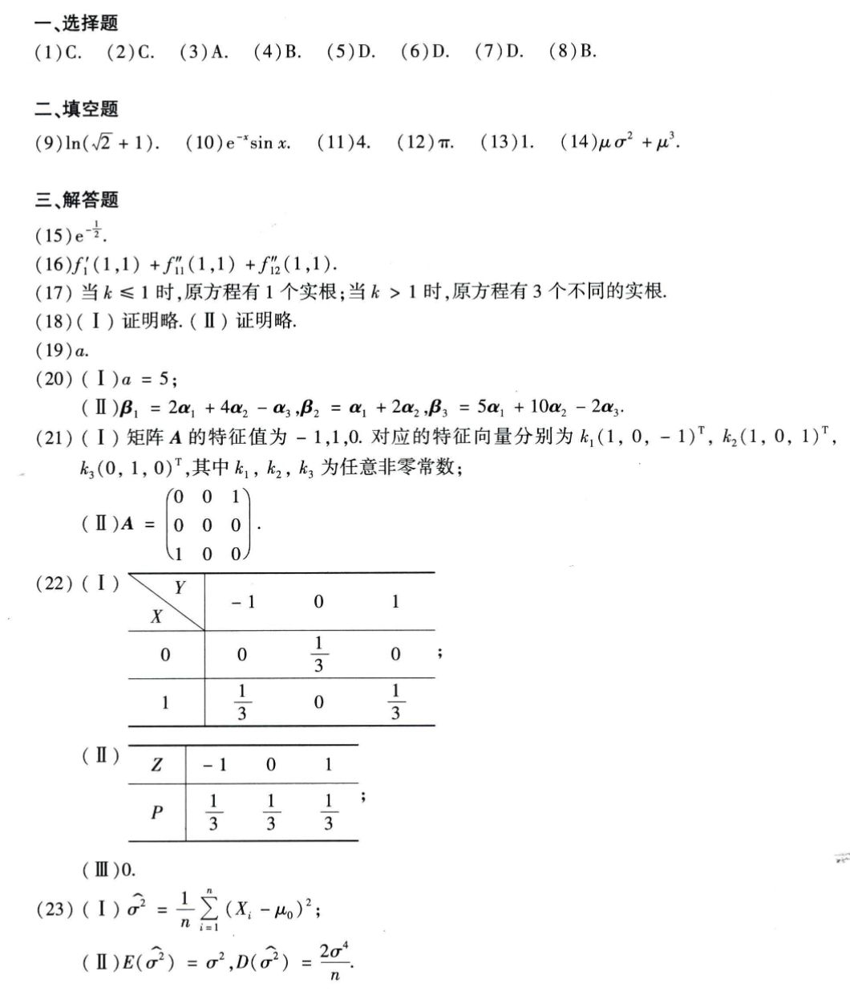

# Math 1 2011 Answers

资料类型：考研数学一答案速查  
年份：2011  
科目：数学一  
来源：本地答案速查图片 OCR/人工转写  
校对状态：待复核  

原图：

## 选择题

| 题号 | 答案 |
|---|---|
| 1 | C |
| 2 | C |
| 3 | A |
| 4 | B |
| 5 | D |
| 6 | D |
| 7 | D |
| 8 | B |

## 填空题

| 题号 | 答案 |
|---|---|
| 9 | `ln(sqrt(2)+1)` |
| 10 | `e^(-x) sin x` |
| 11 | `4` |
| 12 | `π` |
| 13 | `1` |
| 14 | `μσ^2+μ^3` |

## 解答题

| 题号 | 答案速查 |
|---|---|
| 15 | `e^(-1/2)` |
| 16 | `f'_1(1,1)+f''_11(1,1)+f''_12(1,1)` |
| 17 | `k<=1` 时 1 个实根；`k>1` 时 3 个不同实根 |
| 18 | 证明略 |
| 19 | `a` |
| 20 | （1）`a=5`；（2）`β_1=2α_1+4α_2-α_3, β_2=α_1+2α_2, β_3=5α_1+10α_2-2α_3` |
| 21 | （1）特征值 `-1,1,0`；特征向量分别可取 `(1,0,-1)^T,(1,0,1)^T,(0,1,0)^T`；（2）`A=[0 0 1; 0 0 0; 1 0 0]` |
| 22 | （1）二维分布表：`P(X=0,Y=0)=1/3, P(X=1,Y=-1)=1/3, P(X=1,Y=1)=1/3`，其余为 0；（2）`Z` 分布：`P(Z=-1)=P(Z=0)=P(Z=1)=1/3`；（3）相关系数 `0` |
| 23 | （1）`sigma_hat^2=(1/n)sum(X_i-mu_0)^2`；（2）`E(sigma_hat^2)=sigma^2, D(sigma_hat^2)=2sigma^4/n` |
