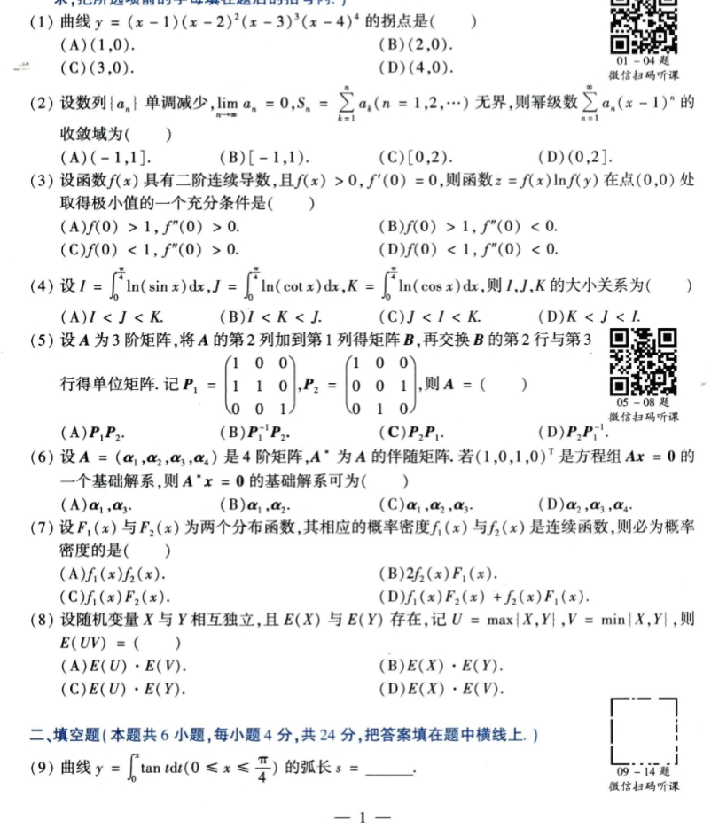
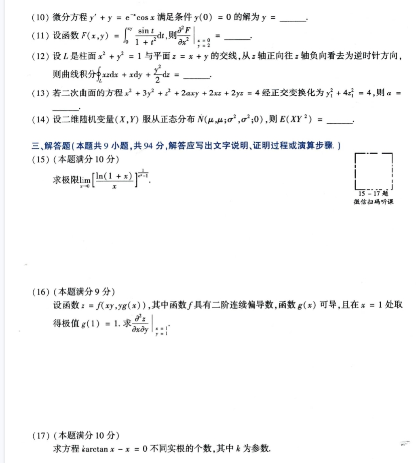
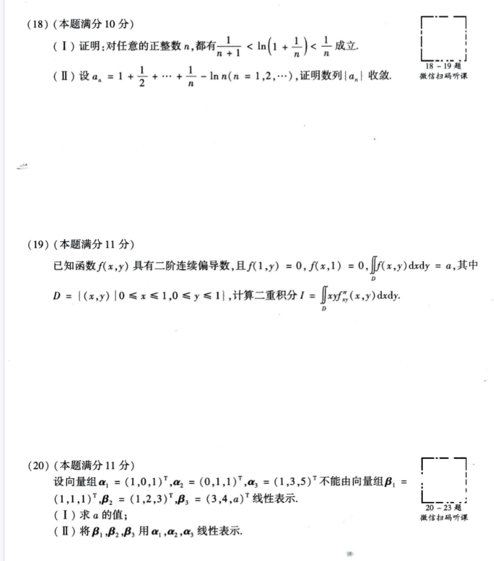
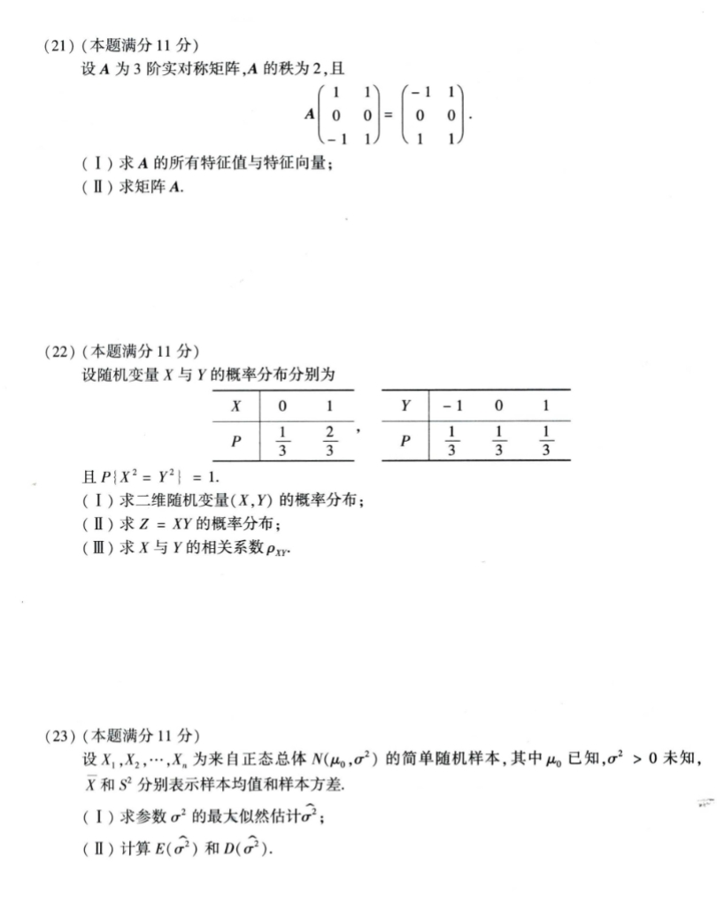

# Math 1 2011 Exam Questions

资料类型：考研数学一历年真题  
年份：2011  
科目：数学一  
整理状态：已初步校对  

说明：本文件根据用户提供的 2011 年真题截图整理。截图已保存到 `images/` 目录。

## 2011 数一 选择题 1-8 与填空题 9

截图：



### 第 1 题

- 题型：选择题
- 题号：1
- 分值：4
- 模块：高数
- 考点：拐点
- 校对状态：根据截图整理

题干：

曲线

```text
y = (x - 1)(x - 2)^2(x - 3)^3(x - 4)^4
```

的拐点是（ ）

选项：

A. `(1,0)`  
B. `(2,0)`  
C. `(3,0)`  
D. `(4,0)`

### 第 2 题

- 题型：选择题
- 题号：2
- 分值：4
- 模块：高数
- 考点：幂级数收敛域
- 校对状态：根据截图整理

题干：

设数列 `{a_n}` 单调减少，`lim_{n->∞} a_n = 0`，`S_n = sum_{k=1}^n a_k (n=1,2,...)` 无界，则幂级数

```text
sum_{n=1}^∞ a_n (x - 1)^n
```

的收敛域为（ ）

选项：

A. `(-1,1]`  
B. `[-1,1)`  
C. `[0,2)`  
D. `(0,2]`

### 第 3 题

- 题型：选择题
- 题号：3
- 分值：4
- 模块：高数
- 考点：多元函数极值充分条件
- 校对状态：根据截图整理

题干：

设函数 `f(x)` 具有二阶连续导数，且 `f(x) > 0, f'(0) = 0`，则函数

```text
z = f(x) ln f(y)
```

在点 `(0,0)` 处取得极小值的一个充分条件是（ ）

选项：

A. `f(0) > 1, f''(0) > 0`  
B. `f(0) > 1, f''(0) < 0`  
C. `f(0) < 1, f''(0) > 0`  
D. `f(0) < 1, f''(0) < 0`

### 第 4 题

- 题型：选择题
- 题号：4
- 分值：4
- 模块：高数
- 考点：定积分比较
- 校对状态：根据截图整理

题干：

设

```text
I = ∫_0^(π/4) ln(sin x) dx
J = ∫_0^(π/4) ln(cot x) dx
K = ∫_0^(π/4) ln(cos x) dx
```

则 `I,J,K` 的大小关系为（ ）

选项：

A. `I < J < K`  
B. `I < K < J`  
C. `J < I < K`  
D. `K < J < I`

### 第 5 题

- 题型：选择题
- 题号：5
- 分值：4
- 模块：线代
- 考点：初等矩阵、行列变换
- 校对状态：根据截图整理

题干：

设 `A` 为 3 阶矩阵，将 `A` 的第 2 列加到第 1 列得矩阵 `B`，再交换 `B` 的第 2 行与第 3 行得单位矩阵。记

```text
P_1 = [1 0 0
       1 1 0
       0 0 1],

P_2 = [1 0 0
       0 0 1
       0 1 0]
```

则 `A = ( )`

选项：

A. `P_1 P_2`  
B. `P_1^(-1) P_2`  
C. `P_2 P_1`  
D. `P_2 P_1^(-1)`

### 第 6 题

- 题型：选择题
- 题号：6
- 分值：4
- 模块：线代
- 考点：伴随矩阵、齐次线性方程组
- 校对状态：根据截图整理

题干：

设 `A = (alpha_1, alpha_2, alpha_3, alpha_4)` 是 4 阶矩阵，`A*` 为 `A` 的伴随矩阵。若 `(1,0,1,0)^T` 是方程组 `Ax = 0` 的一个基础解系，则 `A* x = 0` 的基础解系可为（ ）

选项：

A. `alpha_1, alpha_3`  
B. `alpha_1, alpha_2`  
C. `alpha_1, alpha_2, alpha_3`  
D. `alpha_2, alpha_3, alpha_4`

### 第 7 题

- 题型：选择题
- 题号：7
- 分值：4
- 模块：概率统计
- 考点：分布函数与概率密度
- 校对状态：根据截图整理

题干：

设 `F_1(x)` 与 `F_2(x)` 为两个分布函数，其相应的概率密度 `f_1(x)` 与 `f_2(x)` 是连续函数，则必为概率密度的是（ ）

选项：

A. `f_1(x) f_2(x)`  
B. `2 f_2(x) F_1(x)`  
C. `f_1(x) F_2(x)`  
D. `f_1(x) F_2(x) + f_2(x) F_1(x)`

### 第 8 题

- 题型：选择题
- 题号：8
- 分值：4
- 模块：概率统计
- 考点：独立随机变量、期望
- 校对状态：根据截图整理

题干：

设随机变量 `X` 与 `Y` 相互独立，且 `E(X)` 与 `E(Y)` 存在，记

```text
U = max{X,Y}, V = min{X,Y}
```

则 `E(UV) = ( )`

选项：

A. `E(U) E(V)`  
B. `E(X) E(Y)`  
C. `E(U) E(Y)`  
D. `E(X) E(V)`

### 第 9 题

- 题型：填空题
- 题号：9
- 分值：4
- 模块：高数
- 考点：弧长
- 校对状态：根据截图整理

题干：

曲线

```text
y = ∫_0^x tan t dt,  0 <= x <= π/4
```

的弧长 `s = ____`。

## 2011 数一 填空题 10-14 与解答题 15-17

截图：



### 第 10 题

- 题型：填空题
- 题号：10
- 分值：4
- 模块：高数
- 考点：一阶线性微分方程
- 校对状态：根据截图整理

题干：

微分方程

```text
y' + y = e^(-x) cos x
```

满足条件 `y(0)=0` 的解为 `y = ____`。

### 第 11 题

- 题型：填空题
- 题号：11
- 分值：4
- 模块：高数
- 考点：变限积分、偏导数
- 校对状态：已根据用户补充校对

题干：

设函数

```text
F(x,y) = ∫_0^(xy) [sin t / (1 + t^2)] dt
```

则

```text
(∂²F/∂x²)|_{x=0,y=2} = ____
```

### 第 12 题

- 题型：填空题
- 题号：12
- 分值：4
- 模块：高数
- 考点：空间曲线积分
- 校对状态：根据截图整理

题干：

设 `L` 是柱面 `x^2 + y^2 = 1` 与平面 `z = x + y` 的交线，从 `z` 轴正向往 `z` 轴负向看去为逆时针方向，则曲线积分

```text
∮_L xz dx + x dy + (y²/2) dz = ____
```

### 第 13 题

- 题型：填空题
- 题号：13
- 分值：4
- 模块：线代
- 考点：二次曲面、正交变换
- 校对状态：根据截图整理

题干：

若二次曲面的方程

```text
x^2 + 3y^2 + z^2 + 2axy + 2xz + 2yz = 4
```

经正交变换化为

```text
y_1^2 + 4z_1^2 = 4
```

则 `a = ____`。

### 第 14 题

- 题型：填空题
- 题号：14
- 分值：4
- 模块：概率统计
- 考点：二维正态分布
- 校对状态：根据截图整理

题干：

设二维随机变量 `(X,Y)` 服从正态分布

```text
N(mu, mu; sigma^2, sigma^2; 0)
```

则 `E(XY^2) = ____`。

### 第 15 题

- 题型：解答题
- 题号：15
- 分值：10
- 模块：高数
- 考点：极限
- 校对状态：根据截图整理

题干：

求极限

```text
lim_{x -> 0} [ ln(1+x) / x ]^(1/(e^x - 1))
```

### 第 16 题

- 题型：解答题
- 题号：16
- 分值：9
- 模块：高数
- 考点：多元复合函数偏导
- 校对状态：已根据用户补充校对

题干：

设函数

```text
z = f(xy, y g(x))
```

其中函数 `f` 具有二阶连续偏导数，函数 `g(x)` 可导，且在 `x=1` 处取得极值，`g(1)=1`。求

```text
(∂²z/∂x∂y)|_{x=1,y=1}
```

### 第 17 题

- 题型：解答题
- 题号：17
- 分值：10
- 模块：高数
- 考点：含参方程根的个数
- 校对状态：根据截图整理

题干：

求方程

```text
k arctan x - x = 0
```

不同实根的个数，其中 `k` 为参数。

## 2011 数一 解答题 18-20

截图：



### 第 18 题

- 题型：解答题
- 题号：18
- 分值：10
- 模块：高数
- 考点：不等式证明、数列收敛
- 校对状态：根据截图整理

题干：

1. 证明：对任意的正整数 `n`，都有

```text
1/(n+1) < ln(1 + 1/n) < 1/n
```

成立。

2. 设

```text
a_n = 1 + 1/2 + ... + 1/n - ln n,  n = 1,2,...
```

证明数列 `{a_n}` 收敛。

### 第 19 题

- 题型：解答题
- 题号：19
- 分值：11
- 模块：高数
- 考点：二重积分、分部积分
- 校对状态：已根据用户补充校对

题干：

已知函数 `f(x,y)` 具有二阶连续偏导数，且

```text
f(1,y)=0, f(x,1)=0, ∬_D f(x,y) dxdy = a
```

其中

```text
D = { (x,y) | 0 <= x <= 1, 0 <= y <= 1 }
```

计算二重积分

```text
I = ∬_D xy f''_{xy}(x,y) dxdy
```

### 第 20 题

- 题型：解答题
- 题号：20
- 分值：11
- 模块：线代
- 考点：向量组线性表示
- 校对状态：根据截图整理

题干：

设向量组

```text
alpha_1 = (1,0,1)^T,
alpha_2 = (0,1,1)^T,
alpha_3 = (1,3,5)^T
```

不能由向量组

```text
beta_1 = (1,1,1)^T,
beta_2 = (1,2,3)^T,
beta_3 = (3,4,a)^T
```

线性表示。

1. 求 `a` 的值。
2. 将 `beta_1,beta_2,beta_3` 用 `alpha_1,alpha_2,alpha_3` 线性表示。

## 2011 数一 解答题 21-23

截图：



### 第 21 题

- 题型：解答题
- 题号：21
- 分值：11
- 模块：线代
- 考点：实对称矩阵、特征值与特征向量
- 校对状态：已根据用户补充校对

题干：

设 `A` 为 3 阶实对称矩阵，`A` 的秩为 2，且

```text
A [ 1  1
    0  0
   -1  1 ]
=
[ -1  1
   0  0
   1  1 ]
```

1. 求 `A` 的所有特征值与特征向量。
2. 求矩阵 `A`。

### 第 22 题

- 题型：解答题
- 题号：22
- 分值：11
- 模块：概率统计
- 考点：二维离散随机变量、相关系数
- 校对状态：根据截图整理

题干：

设随机变量 `X` 与 `Y` 的概率分布分别为

```text
X: 0    1
P: 1/3  2/3

Y: -1   0    1
P: 1/3  1/3  1/3
```

且 `P{X^2 = Y^2} = 1`。

1. 求二维随机变量 `(X,Y)` 的概率分布。
2. 求 `Z = XY` 的概率分布。
3. 求 `X` 与 `Y` 的相关系数 `rho_XY`。

### 第 23 题

- 题型：解答题
- 题号：23
- 分值：11
- 模块：概率统计
- 考点：正态总体、最大似然估计、估计量期望方差
- 校对状态：根据截图整理

题干：

设 `X_1, X_2, ..., X_n` 为来自正态总体 `N(mu_0, sigma^2)` 的简单随机样本，其中 `mu_0` 已知，`sigma^2 > 0` 未知，`X_bar` 和 `S^2` 分别表示样本均值和样本方差。

1. 求参数 `sigma^2` 的最大似然估计 `hat_sigma^2`。
2. 计算 `E(hat_sigma^2)` 和 `D(hat_sigma^2)`。
