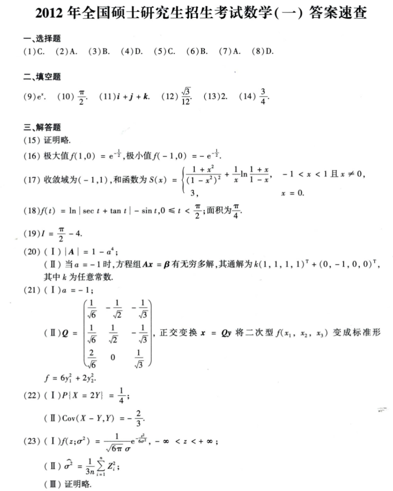

# Math 1 2012 Answers

资料类型：考研数学一答案速查  
年份：2012  
科目：数学一  
来源：本地答案速查图片 OCR/人工转写  
校对状态：待复核  

原图：

## 选择题

| 题号 | 答案 |
|---|---|
| 1 | C |
| 2 | A |
| 3 | B |
| 4 | D |
| 5 | C |
| 6 | B |
| 7 | A |
| 8 | D |

## 填空题

| 题号 | 答案 |
|---|---|
| 9 | `e^x` |
| 10 | `π/2` |
| 11 | `i+j+k` |
| 12 | `sqrt(3)/12` |
| 13 | `2` |
| 14 | `3/4` |

## 解答题

| 题号 | 答案速查 |
|---|---|
| 15 | 证明略 |
| 16 | 极大值 `f(1,0)=e^(-1/2)`；极小值 `f(-1,0)=-e^(-1/2)` |
| 17 | 收敛域 `(-1,1)`；和函数 `S(x)=((1+x^2)/(1-x^2)^2)+(1/x)ln((1+x)/(1-x))`，`-1<x<1 且 x!=0`；`S(0)=3` |
| 18 | （1）`f(t)=ln|sec t+tan t|-sin t`，`0<=t<π/2`；（2）面积 `π/4` |
| 19 | `I=π/2-4` |
| 20 | （1）`|A|=1-a^4`；（2）当 `a=-1` 时通解 `k(1,1,1,1)^T+(0,-1,0,0)^T` |
| 21 | （1）`a=-1`；（2）`Q=[1/sqrt(6), -1/sqrt(2), -1/sqrt(3); 1/sqrt(6), 1/sqrt(2), -1/sqrt(3); 2/sqrt(6), 0, 1/sqrt(3)]`，标准形 `f=6y_1^2+2y_2^2` |
| 22 | （1）`P{X=2Y}=1/4`；（2）`Cov(X-Y,Y)=-2/3` |
| 23 | （1）`f(z;sigma^2)=1/(sqrt(6π) sigma) e^{-z^2/(6sigma^2)}`；（2）`sigma_hat^2=(1/(3n))sum Z_i^2`；（3）证明略 |
