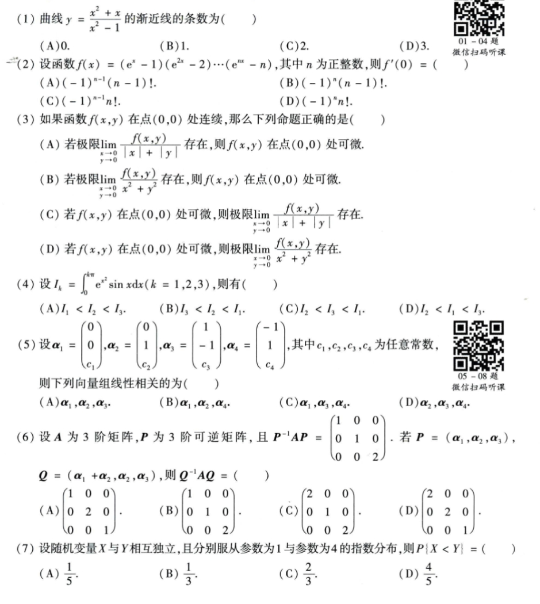
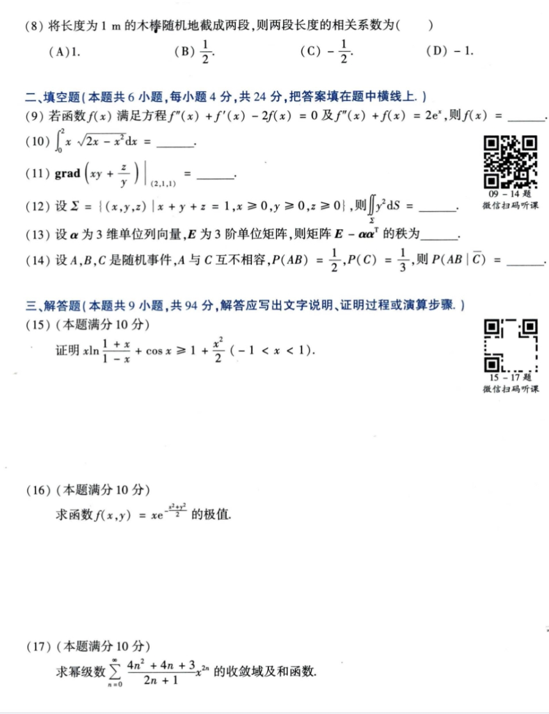
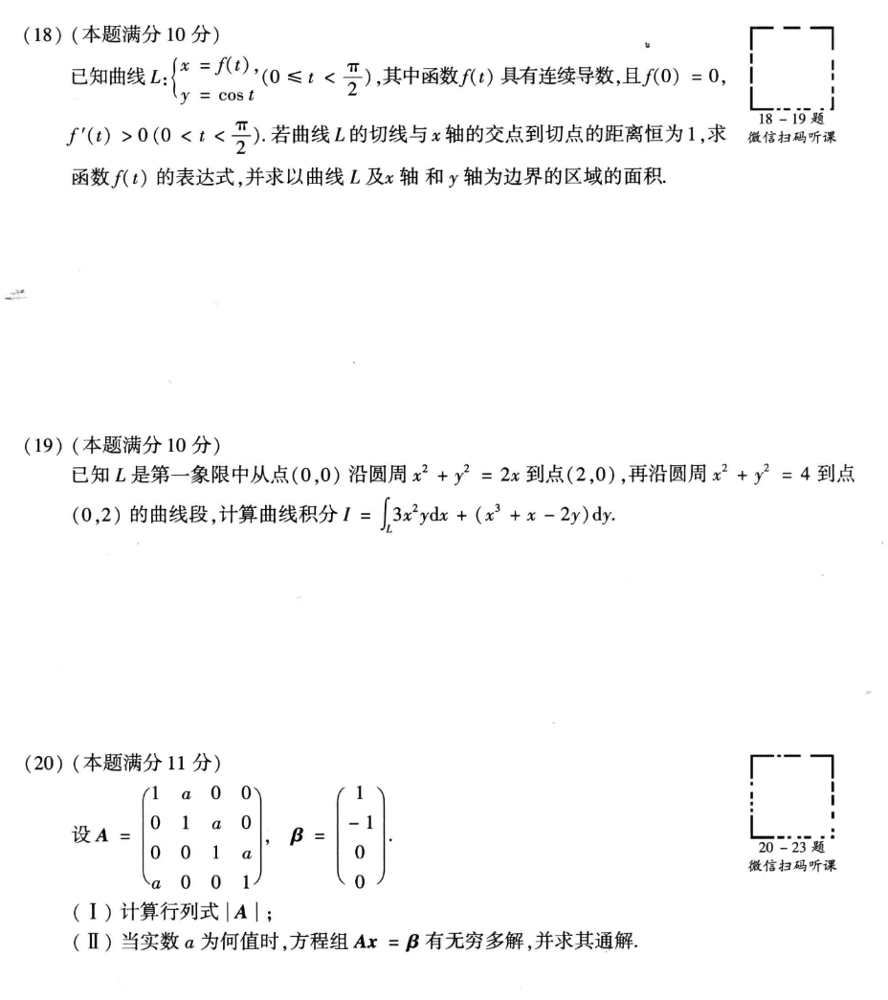
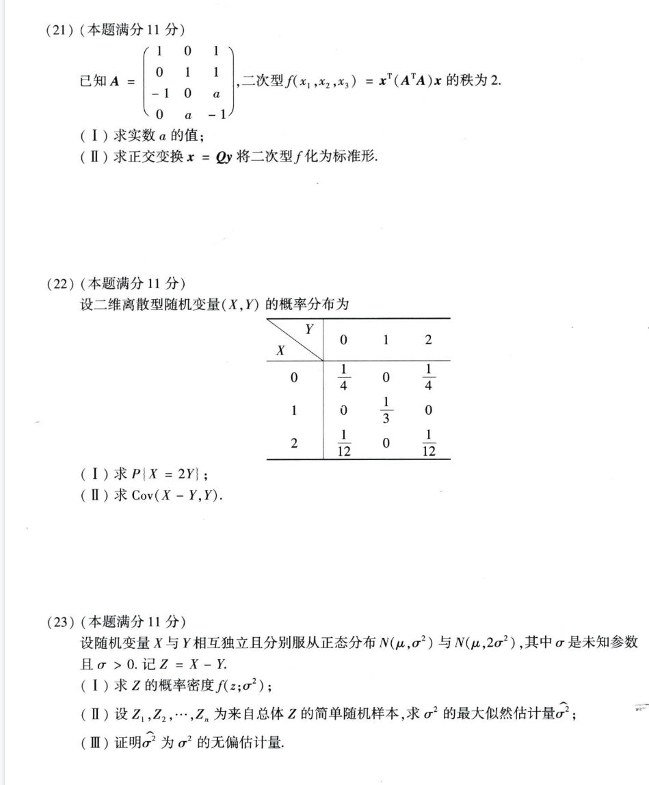

# Math 1 2012 Exam Questions

资料类型：考研数学一历年真题  
年份：2012  
科目：数学一  
整理状态：已初步校对  

说明：本文件根据用户提供的 2012 年真题截图整理。截图已保存到 `images/` 目录；已按后续确认修正第 3、4、10、14、23 题。

## 2012 数一 选择题 1-7

截图：



### 第 1 题

- 题型：选择题
- 题号：1
- 分值：4
- 模块：高数
- 考点：渐近线
- 校对状态：根据截图整理

题干：

曲线

```text
y = (x^2 + x) / (x^2 - 1)
```

的渐近线的条数为（ ）

选项：

A. `0`  
B. `1`  
C. `2`  
D. `3`

### 第 2 题

- 题型：选择题
- 题号：2
- 分值：4
- 模块：高数
- 考点：导数、乘积求导
- 校对状态：根据截图整理

题干：

设函数

```text
f(x) = (e^x - 1)(e^(2x) - 2)...(e^(nx) - n)
```

其中 `n` 为正整数，则 `f'(0) = ( )`

选项：

A. `(-1)^(n-1)(n-1)!`  
B. `(-1)^n(n-1)!`  
C. `(-1)^(n-1)n!`  
D. `(-1)^n n!`

### 第 3 题

- 题型：选择题
- 题号：3
- 分值：4
- 模块：高数
- 考点：多元函数可微、极限
- 校对状态：已确认

题干：

如果函数 `f(x,y)` 在点 `(0,0)` 处连续，那么下列命题正确的是（ ）

选项：

A. 若极限 `lim_{x->0,y->0} f(x,y) / (|x| + |y|)` 存在，则 `f(x,y)` 在点 `(0,0)` 处可微。  
B. 若极限 `lim_{x->0,y->0} f(x,y) / (x^2 + y^2)` 存在，则 `f(x,y)` 在点 `(0,0)` 处可微。  
C. 若 `f(x,y)` 在点 `(0,0)` 处可微，则极限 `lim_{x->0,y->0} f(x,y) / (|x| + |y|)` 存在。  
D. 若 `f(x,y)` 在点 `(0,0)` 处可微，则极限 `lim_{x->0,y->0} f(x,y) / (x^2 + y^2)` 存在。

### 第 4 题

- 题型：选择题
- 题号：4
- 分值：4
- 模块：高数
- 考点：定积分比较
- 校对状态：已确认

题干：

设

```text
I_k = ∫_0^(kπ) e^(x^2) sin x dx  (k = 1,2,3)
```

则有（ ）

选项：

A. `I_1 < I_2 < I_3`  
B. `I_3 < I_2 < I_1`  
C. `I_2 < I_3 < I_1`  
D. `I_2 < I_1 < I_3`

### 第 5 题

- 题型：选择题
- 题号：5
- 分值：4
- 模块：线代
- 考点：向量组线性相关
- 校对状态：根据截图整理

题干：

设

```text
alpha_1 = (0, 0, c_1)^T,
alpha_2 = (0, 1, c_2)^T,
alpha_3 = (1, -1, c_3)^T,
alpha_4 = (-1, 1, c_4)^T
```

其中 `c_1,c_2,c_3,c_4` 为任意常数，则下列向量组线性相关的为（ ）

选项：

A. `alpha_1, alpha_2, alpha_3`  
B. `alpha_1, alpha_2, alpha_4`  
C. `alpha_1, alpha_3, alpha_4`  
D. `alpha_2, alpha_3, alpha_4`

### 第 6 题

- 题型：选择题
- 题号：6
- 分值：4
- 模块：线代
- 考点：相似对角化、换基
- 校对状态：根据截图整理

题干：

设 `A` 为 3 阶矩阵，`P` 为 3 阶可逆矩阵，且

```text
P^(-1) A P = diag(1,1,2)
```

若 `P = (alpha_1, alpha_2, alpha_3)`，`Q = (alpha_1 + alpha_2, alpha_2, alpha_3)`，则 `Q^(-1) A Q = ( )`

选项：

A. `diag(1,2,1)`  
B. `diag(1,1,2)`  
C. `diag(2,1,2)`  
D. `diag(2,2,1)`

### 第 7 题

- 题型：选择题
- 题号：7
- 分值：4
- 模块：概率统计
- 考点：指数分布、概率比较
- 校对状态：根据截图整理

题干：

设随机变量 `X` 与 `Y` 相互独立，且分别服从参数为 1 与参数为 4 的指数分布，则 `P{X < Y} = ( )`

选项：

A. `1/5`  
B. `1/3`  
C. `2/3`  
D. `4/5`

## 2012 数一 选择题 8 与填空题 9-14 与解答题 15-17

截图：



### 第 8 题

- 题型：选择题
- 题号：8
- 分值：4
- 模块：概率统计
- 考点：相关系数
- 校对状态：根据截图整理

题干：

将长度为 `1m` 的木棒随机地截成两段，则两段长度的相关系数为（ ）

选项：

A. `1`  
B. `1/2`  
C. `-1/2`  
D. `-1`

### 第 9 题

- 题型：填空题
- 题号：9
- 分值：4
- 模块：高数
- 考点：微分方程
- 校对状态：根据截图整理

题干：

若函数 `f(x)` 满足方程

```text
f''(x) + f'(x) - 2f(x) = 0
```

及

```text
f''(x) + f(x) = 2e^x
```

则 `f(x) = ____`。

### 第 10 题

- 题型：填空题
- 题号：10
- 分值：4
- 模块：高数
- 考点：定积分
- 校对状态：根据截图整理

题干：

```text
∫_0^2 x sqrt(2x - x^2) dx = ____
```

### 第 11 题

- 题型：填空题
- 题号：11
- 分值：4
- 模块：高数
- 考点：梯度
- 校对状态：根据截图整理

题干：

```text
grad(xy + z/y) |_(2,1,1) = ____
```

### 第 12 题

- 题型：填空题
- 题号：12
- 分值：4
- 模块：高数
- 考点：曲面积分
- 校对状态：根据截图整理

题干：

设

```text
Sigma = { (x,y,z) | x + y + z = 1, x >= 0, y >= 0, z >= 0 }
```

则

```text
∫∫_Sigma y^2 dS = ____
```

### 第 13 题

- 题型：填空题
- 题号：13
- 分值：4
- 模块：线代
- 考点：矩阵秩
- 校对状态：根据截图整理

题干：

设 `alpha` 为 3 维单位列向量，`E` 为 3 阶单位矩阵，则矩阵

```text
E - alpha alpha^T
```

的秩为 `____`。

### 第 14 题

- 题型：填空题
- 题号：14
- 分值：4
- 模块：概率统计
- 考点：条件概率、事件关系
- 校对状态：根据截图整理

题干：

设 `A,B,C` 是随机事件，`A` 与 `C` 互不相容，`P(AB)=1/2, P(C)=1/3`，则

```text
P(AB | C_bar) = ____
```

### 第 15 题

- 题型：解答题
- 题号：15
- 分值：10
- 模块：高数
- 考点：不等式证明
- 校对状态：根据截图整理

题干：

证明

```text
x ln((1+x)/(1-x)) + cos x >= 1 + x^2/2,  -1 < x < 1
```

### 第 16 题

- 题型：解答题
- 题号：16
- 分值：10
- 模块：高数
- 考点：二元函数极值
- 校对状态：根据截图整理

题干：

求函数

```text
f(x,y) = x e^(-(x^2+y^2)/2)
```

的极值。

### 第 17 题

- 题型：解答题
- 题号：17
- 分值：10
- 模块：高数
- 考点：幂级数、和函数
- 校对状态：根据截图整理

题干：

求幂级数

```text
sum_{n=0}^∞ [(4n^2 + 4n + 3)/(2n + 1)] x^(2n)
```

的收敛域及和函数。

## 2012 数一 解答题 18-20

截图：



### 第 18 题

- 题型：解答题
- 题号：18
- 分值：10
- 模块：高数
- 考点：参数方程、切线、面积
- 校对状态：根据截图整理

题干：

已知曲线 `L`：

```text
x = f(t),
y = cos t,  0 <= t < π/2
```

其中函数 `f(t)` 具有连续导数，且 `f(0)=0, f'(t)>0 (0<t<π/2)`。若曲线 `L` 的切线与 `x` 轴的交点到切点的距离恒为 1，求函数 `f(t)` 的表达式，并求以曲线 `L` 及 `x` 轴和 `y` 轴为边界的区域的面积。

### 第 19 题

- 题型：解答题
- 题号：19
- 分值：10
- 模块：高数
- 考点：曲线积分、格林公式
- 校对状态：根据截图整理

题干：

已知 `L` 是第一象限中从点 `(0,0)` 沿圆周

```text
x^2 + y^2 = 2x
```

到点 `(2,0)`，再沿圆周

```text
x^2 + y^2 = 4
```

到点 `(0,2)` 的曲线段，计算曲线积分

```text
I = ∫_L 3x^2 y dx + (x^3 + x - 2y) dy
```

### 第 20 题

- 题型：解答题
- 题号：20
- 分值：11
- 模块：线代
- 考点：行列式、线性方程组
- 校对状态：根据截图整理

题干：

设

```text
A = [1  a  0  0
     0  1  a  0
     0  0  1  a
     a  0  0  1],

beta = [ 1
        -1
         0
         0]
```

1. 计算行列式 `|A|`。
2. 当实数 `a` 为何值时，方程组 `Ax = beta` 有无穷多解，并求其通解。

## 2012 数一 解答题 21-23

截图：



### 第 21 题

- 题型：解答题
- 题号：21
- 分值：11
- 模块：线代
- 考点：二次型、正交变换
- 校对状态：根据截图整理

题干：

已知

```text
A = [ 1  0   1
      0  1   1
     -1  0   a
      0  a  -1]
```

二次型

```text
f(x_1,x_2,x_3) = x^T(A^T A)x
```

的秩为 2。

1. 求实数 `a` 的值。
2. 求正交变换 `x = Qy` 将二次型 `f` 化为标准形。

### 第 22 题

- 题型：解答题
- 题号：22
- 分值：11
- 模块：概率统计
- 考点：二维离散型随机变量、协方差
- 校对状态：根据截图整理

题干：

设二维离散型随机变量 `(X,Y)` 的概率分布为

```text
        Y=0   Y=1   Y=2
X=0     1/4    0     1/4
X=1      0    1/3     0
X=2     1/12   0     1/12
```

1. 求 `P{X = 2Y}`。
2. 求 `Cov(X-Y, Y)`。

### 第 23 题

- 题型：解答题
- 题号：23
- 分值：11
- 模块：概率统计
- 考点：正态分布、最大似然估计、无偏估计
- 校对状态：已确认

题干：

设随机变量 `X` 与 `Y` 相互独立且分别服从正态分布 `N(mu, sigma^2)` 与 `N(mu, 2sigma^2)`，其中 `sigma` 是未知参数且 `sigma > 0`。记 `Z = X - Y`。

1. 求 `Z` 的概率密度 `f(z; sigma^2)`。
2. 设 `Z_1,Z_2,...,Z_n` 为来自总体 `Z` 的简单随机样本，求 `sigma^2` 的最大似然估计量 `hat_sigma^2`。
3. 证明 `hat_sigma^2` 为 `sigma^2` 的无偏估计量。
