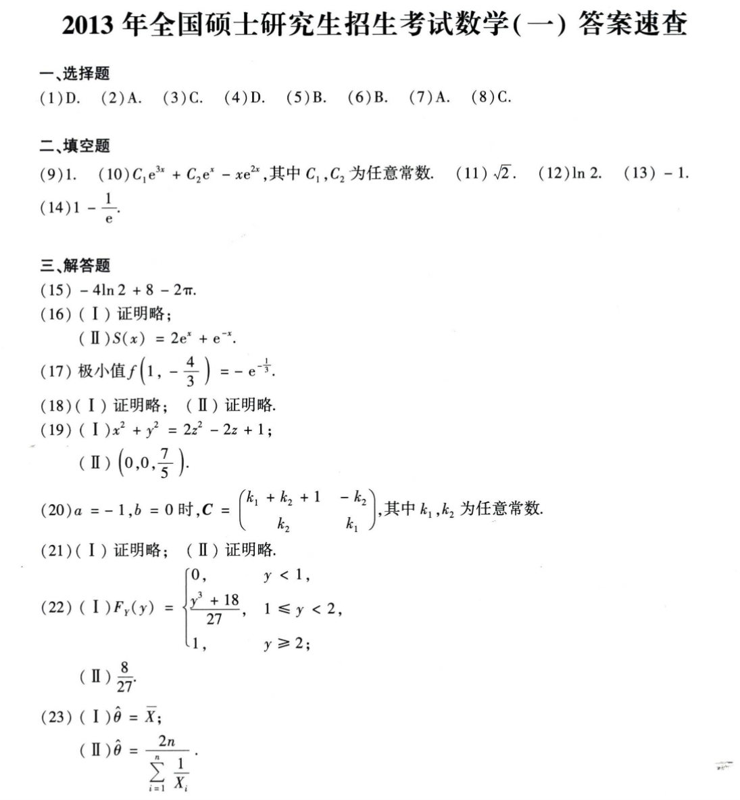

# Math 1 2013 Answers

资料类型：考研数学一答案速查  
年份：2013  
科目：数学一  
来源：本地答案速查图片 OCR/人工转写  
校对状态：待复核  

原图：

## 选择题

| 题号 | 答案 |
|---|---|
| 1 | D |
| 2 | A |
| 3 | C |
| 4 | D |
| 5 | B |
| 6 | B |
| 7 | A |
| 8 | C |

## 填空题

| 题号 | 答案 |
|---|---|
| 9 | `1` |
| 10 | `C_1 e^(3x)+C_2 e^x - x e^(2x)` |
| 11 | `sqrt(2)` |
| 12 | `ln 2` |
| 13 | `-1` |
| 14 | `1-1/e` |

## 解答题

| 题号 | 答案速查 |
|---|---|
| 15 | `-4ln2+8-2π` |
| 16 | （1）证明略；（2）`S(x)=2e^x+e^(-x)` |
| 17 | 极小值 `f(1,-4/3)=-e^(-1/3)` |
| 18 | 证明略 |
| 19 | （1）投影曲线 `x^2+y^2=2z^2-2z+1`；（2）形心 `(0,0,7/5)` |
| 20 | （1）`a=-1,b=0`；（2）`C=[k_1+k_2+1, -k_2; k_2, k_1]`，其中 `k_1,k_2` 为任意常数 |
| 21 | 证明略 |
| 22 | （1）`F_Y(y)=0(y<1); (y^3+18)/27(1<=y<2); 1(y>=2)`；（2）`E(Y)=8/27` |
| 23 | （1）矩估计 `theta_hat=X_bar`；（2）最大似然估计 `theta_hat=2n/(sum 1/X_i)` |
