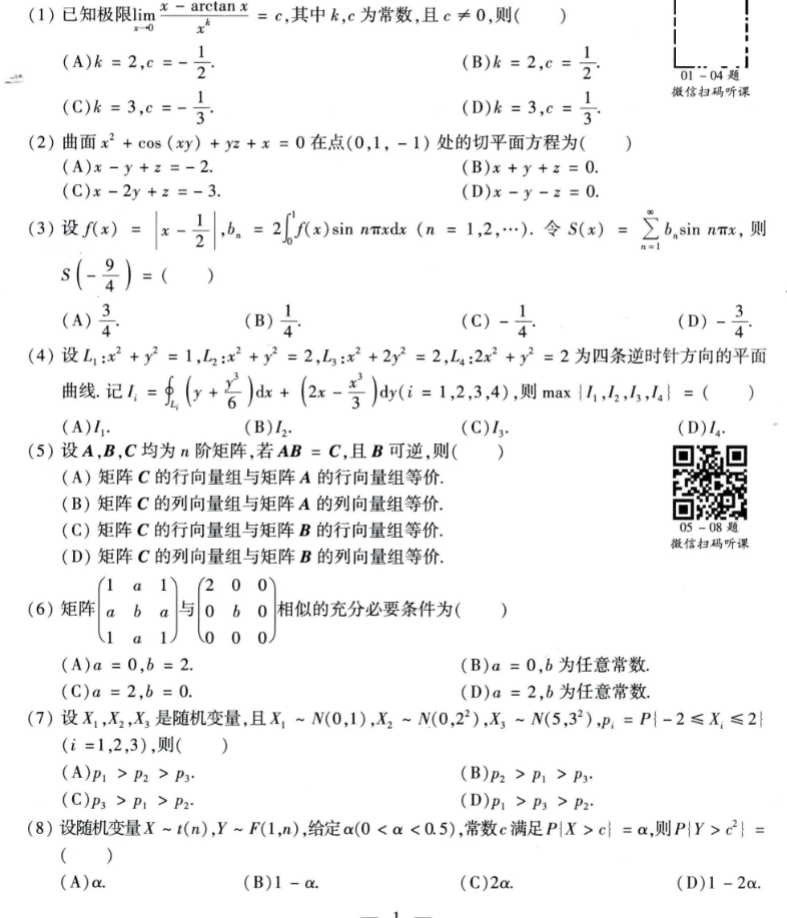
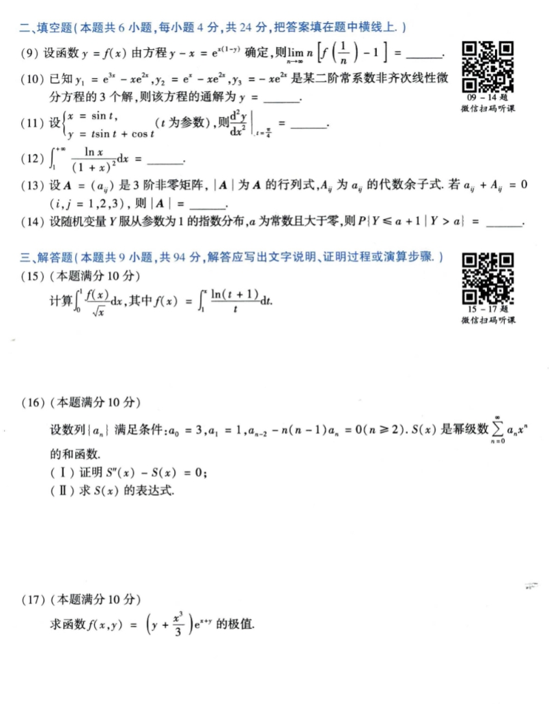
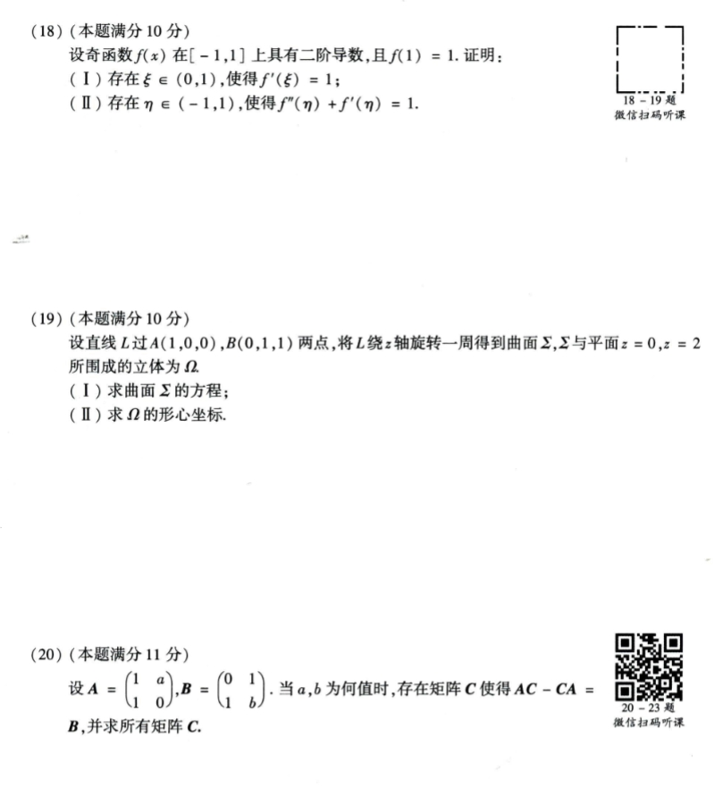
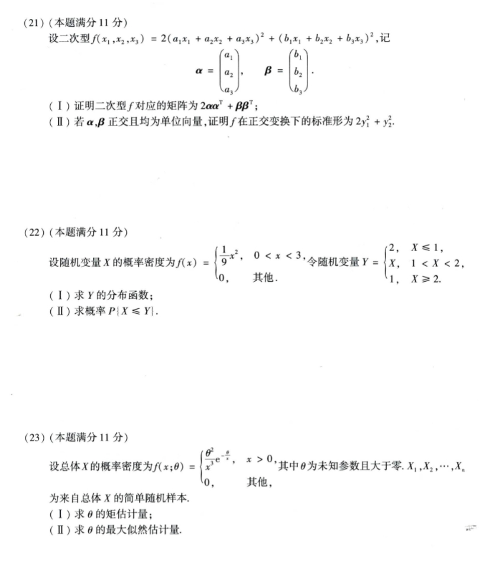

# Math 1 2013 Exam Questions

资料类型：考研数学一历年真题  
年份：2013  
科目：数学一  
整理状态：待复核  

说明：本文件根据用户提供的 2013 年真题截图整理。截图已保存到 `images/` 目录；细小公式处保留“待确认”说明。

## 2013 数一 选择题 1-8

截图：



### 第 1 题

- 题型：选择题
- 题号：1
- 分值：4
- 模块：高数
- 考点：极限
- 校对状态：根据截图整理

题干：

已知极限

```text
lim_{x -> 0} (x - arctan x) / x^k = c
```

其中 `k,c` 为常数，且 `c != 0`，则（ ）

选项：

A. `k=2, c=-1/2`  
B. `k=2, c=1/2`  
C. `k=3, c=-1/3`  
D. `k=3, c=1/3`

### 第 2 题

- 题型：选择题
- 题号：2
- 分值：4
- 模块：高数
- 考点：隐函数曲面切平面
- 校对状态：根据截图整理

题干：

曲面

```text
x^2 + cos(xy) + yz + x = 0
```

在点 `(0,1,-1)` 处的切平面方程为（ ）

选项：

A. `x - y + z = -2`  
B. `x + y + z = 0`  
C. `x - 2y + z = -3`  
D. `x - y - z = 0`

### 第 3 题

- 题型：选择题
- 题号：3
- 分值：4
- 模块：高数
- 考点：傅里叶级数
- 校对状态：根据截图整理

题干：

设

```text
f(x) = |x - 1/2|,
b_n = 2∫_0^1 f(x) sin(nπx) dx  (n=1,2,...)
```

令

```text
S(x) = sum_{n=1}^∞ b_n sin(nπx)
```

则 `S(-9/4) = ( )`

选项：

A. `3/4`  
B. `1/4`  
C. `-1/4`  
D. `-3/4`

### 第 4 题

- 题型：选择题
- 题号：4
- 分值：4
- 模块：高数
- 考点：曲线积分
- 校对状态：根据截图整理

题干：

设 `L_1: x^2+y^2=1`，`L_2: x^2+y^2=2`，`L_3: x^2+2y^2=2`，`L_4: 2x^2+y^2=2` 为四条逆时针方向的平面曲线。记

```text
I_i = ∮_{L_i} (y + y^3/6) dx + (2x - x^3/3) dy,  i=1,2,3,4
```

则 `max{|I_1|,|I_2|,|I_3|,|I_4|} = ( )`

选项：

A. `I_1`  
B. `I_2`  
C. `I_3`  
D. `I_4`

### 第 5 题

- 题型：选择题
- 题号：5
- 分值：4
- 模块：线代
- 考点：矩阵行列向量组等价
- 校对状态：根据截图整理

题干：

设 `A,B,C` 均为 `n` 阶矩阵，若 `AB=C`，且 `B` 可逆，则（ ）

选项：

A. 矩阵 `C` 的行向量组与矩阵 `A` 的行向量组等价。  
B. 矩阵 `C` 的列向量组与矩阵 `A` 的列向量组等价。  
C. 矩阵 `C` 的行向量组与矩阵 `B` 的行向量组等价。  
D. 矩阵 `C` 的列向量组与矩阵 `B` 的列向量组等价。

### 第 6 题

- 题型：选择题
- 题号：6
- 分值：4
- 模块：线代
- 考点：矩阵相似
- 校对状态：根据截图整理

题干：

矩阵

```text
[1  a  1
 a  b  a
 1  a  1]
```

与

```text
[2 0 0
 0 b 0
 0 0 0]
```

相似的充分必要条件为（ ）

选项：

A. `a=0, b=2`  
B. `a=0, b` 为任意常数  
C. `a=2, b=0`  
D. `a=2, b` 为任意常数

### 第 7 题

- 题型：选择题
- 题号：7
- 分值：4
- 模块：概率统计
- 考点：正态分布概率比较
- 校对状态：根据截图整理

题干：

设 `X_1,X_2,X_3` 是随机变量，且

```text
X_1 ~ N(0,1), X_2 ~ N(0,2^2), X_3 ~ N(5,3^2)
p_i = P{| -2 <= X_i <= 2 |}, i=1,2,3
```

则（ ）

选项：

A. `p_1 > p_2 > p_3`  
B. `p_2 > p_1 > p_3`  
C. `p_3 > p_1 > p_2`  
D. `p_1 > p_3 > p_2`

### 第 8 题

- 题型：选择题
- 题号：8
- 分值：4
- 模块：概率统计
- 考点：t 分布、F 分布
- 校对状态：根据截图整理

题干：

设随机变量 `X ~ t(n)`，`Y ~ F(1,n)`，给定 `alpha (0<alpha<0.5)`，常数 `c` 满足 `P{|X| > c}=alpha`，则 `P{Y > c^2} = ( )`

选项：

A. `alpha`  
B. `1-alpha`  
C. `2alpha`  
D. `1-2alpha`

## 2013 数一 填空题 9-14 与解答题 15-17

截图：



### 第 9 题

- 题型：填空题
- 题号：9
- 分值：4
- 模块：高数
- 考点：隐函数极限
- 校对状态：根据截图整理

题干：

设函数 `y=f(x)` 由方程

```text
y - x = e^(x(1-y))
```

确定，则

```text
lim_{n -> ∞} n [ f(1/n) - 1 ] = ____
```

### 第 10 题

- 题型：填空题
- 题号：10
- 分值：4
- 模块：高数
- 考点：二阶常系数非齐次线性微分方程
- 校对状态：根据截图整理

题干：

已知 `y_1=e^(3x)-xe^(2x)`, `y_2=e^x-xe^(2x)`, `y_3=-xe^(2x)` 是某二阶常系数非齐次线性微分方程的 3 个解，则该方程的通解为

```text
y = ____
```

### 第 11 题

- 题型：填空题
- 题号：11
- 分值：4
- 模块：高数
- 考点：参数方程求导
- 校对状态：根据截图整理

题干：

设

```text
x = sin t,
y = t sin t + cos t
```

则

```text
(d²y/dx²)|_{t=π/4} = ____
```

### 第 12 题

- 题型：填空题
- 题号：12
- 分值：4
- 模块：高数
- 考点：定积分
- 校对状态：根据截图整理

题干：

```text
∫_1^(+∞) [ln x / (1+x)^2] dx = ____
```

### 第 13 题

- 题型：填空题
- 题号：13
- 分值：4
- 模块：线代
- 考点：伴随矩阵、行列式
- 校对状态：根据截图整理

题干：

设 `A=(a_ij)` 是 3 阶非零矩阵，`|A|` 为 `A` 的行列式，`A_ij` 为 `a_ij` 的代数余子式。若

```text
a_ij + A_ij = 0, i,j=1,2,3
```

则 `|A| = ____`。

### 第 14 题

- 题型：填空题
- 题号：14
- 分值：4
- 模块：概率统计
- 考点：指数分布条件概率
- 校对状态：根据截图整理

题干：

设随机变量 `Y` 服从参数为 1 的指数分布，`a` 为常数且大于零，则

```text
P{Y <= a+1 | Y > a} = ____
```

### 第 15 题

- 题型：解答题
- 题号：15
- 分值：10
- 模块：高数
- 考点：积分计算
- 校对状态：根据截图整理

题干：

计算

```text
∫_0^1 [f(x)/sqrt(x)] dx
```

其中

```text
f(x) = ∫_1^x [ln(t+1)/t] dt
```

### 第 16 题

- 题型：解答题
- 题号：16
- 分值：10
- 模块：高数
- 考点：幂级数、微分方程
- 校对状态：根据截图整理

题干：

设数列 `{a_n}` 满足条件：

```text
a_0 = 3, a_1 = 1, a_{n-2} - n(n-1)a_n = 0 (n >= 2)
```

`S(x)` 是幂级数

```text
sum_{n=0}^∞ a_n x^n
```

的和函数。

1. 证明 `S''(x)-S(x)=0`。
2. 求 `S(x)` 的表达式。

### 第 17 题

- 题型：解答题
- 题号：17
- 分值：10
- 模块：高数
- 考点：二元函数极值
- 校对状态：根据截图整理

题干：

求函数

```text
f(x,y) = (y + x^3/3)e^(x+y)
```

的极值。

## 2013 数一 解答题 18-20

截图：



### 第 18 题

- 题型：解答题
- 题号：18
- 分值：10
- 模块：高数
- 考点：中值定理
- 校对状态：根据截图整理

题干：

设奇函数 `f(x)` 在 `[-1,1]` 上具有二阶导数，且 `f(1)=1`。证明：

1. 存在 `xi in (0,1)`，使得 `f'(xi)=1`。
2. 存在 `eta in (-1,1)`，使得 `f''(eta)+f'(eta)=1`。

### 第 19 题

- 题型：解答题
- 题号：19
- 分值：10
- 模块：高数
- 考点：旋转曲面、形心
- 校对状态：根据截图整理

题干：

设直线 `L` 过 `A(1,0,0), B(0,1,1)` 两点，将 `L` 绕 `z` 轴旋转一周得到曲面 `Sigma`，`Sigma` 与平面 `z=0, z=2` 所围成的立体为 `Omega`。

1. 求曲面 `Sigma` 的方程。
2. 求 `Omega` 的形心坐标。

### 第 20 题

- 题型：解答题
- 题号：20
- 分值：11
- 模块：线代
- 考点：矩阵方程
- 校对状态：根据截图整理

题干：

设

```text
A = [1 a
     1 0],
B = [0 1
     1 b]
```

当 `a,b` 为何值时，存在矩阵 `C` 使得 `AC - CA = B`，并求所有矩阵 `C`。

## 2013 数一 解答题 21-23

截图：



### 第 21 题

- 题型：解答题
- 题号：21
- 分值：11
- 模块：线代
- 考点：二次型、正交变换
- 校对状态：根据截图整理

题干：

设二次型

```text
f(x_1,x_2,x_3)=2(a_1x_1+a_2x_2+a_3x_3)^2+(b_1x_1+b_2x_2+b_3x_3)^2
```

记

```text
alpha = (a_1,a_2,a_3)^T,
beta = (b_1,b_2,b_3)^T
```

1. 证明二次型 `f` 对应的矩阵为 `2 alpha alpha^T + beta beta^T`。
2. 若 `alpha,beta` 正交且均为单位向量，证明 `f` 在正交变换下的标准形为 `2y_1^2 + y_2^2`。

### 第 22 题

- 题型：解答题
- 题号：22
- 分值：11
- 模块：概率统计
- 考点：随机变量函数、分布函数
- 校对状态：根据截图整理

题干：

设随机变量 `X` 的概率密度为

```text
f(x) = {
  (1/9)x^2, 0 < x < 3
  0, 其他
}
```

令随机变量

```text
Y = {
  2, X <= 1
  X, 1 < X < 2
  1, X >= 2
}
```

1. 求 `Y` 的分布函数。
2. 求概率 `P{X <= Y}`。

### 第 23 题

- 题型：解答题
- 题号：23
- 分值：11
- 模块：概率统计
- 考点：矩估计、最大似然估计
- 校对状态：根据截图整理

题干：

设总体 `X` 的概率密度为

```text
f(x;theta) = {
  theta^2 / x^3 * e^(-theta/x), x > 0
  0, 其他
}
```

其中 `theta` 为未知参数且大于零，`X_1,X_2,...,X_n` 为来自总体 `X` 的简单随机样本。

1. 求 `theta` 的矩估计量。
2. 求 `theta` 的最大似然估计量。
