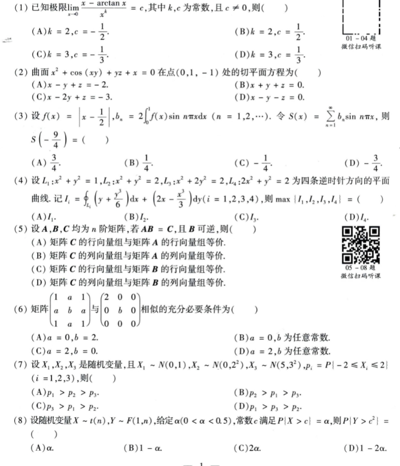
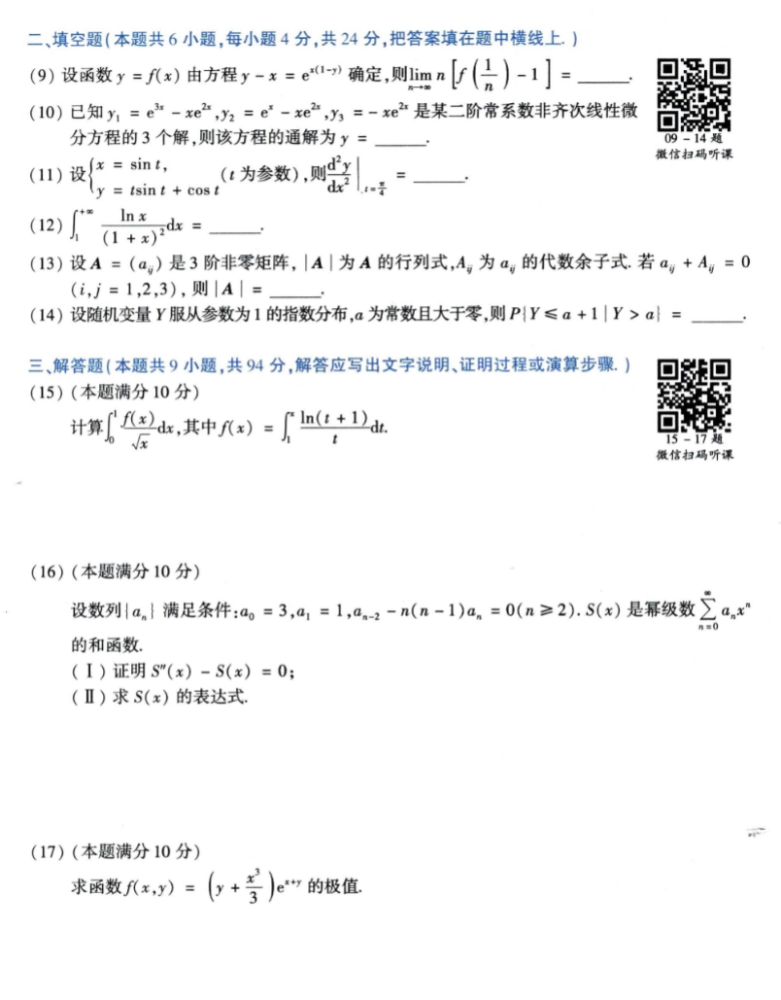
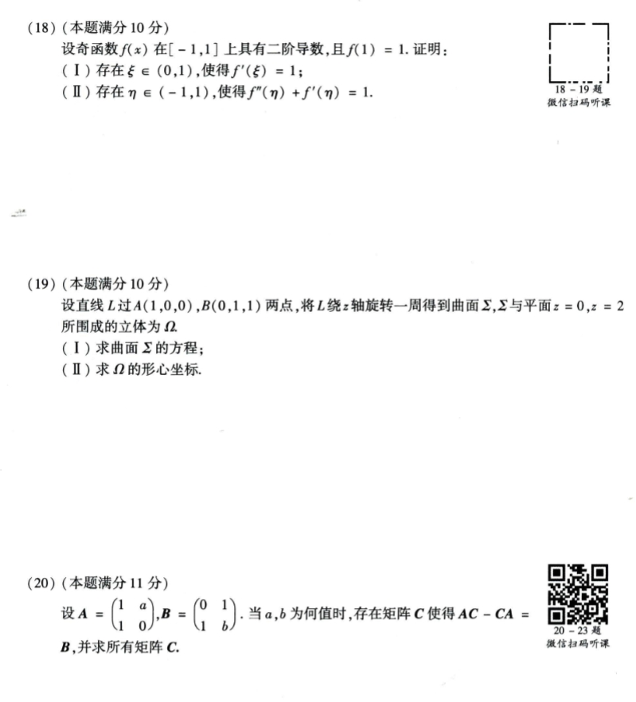
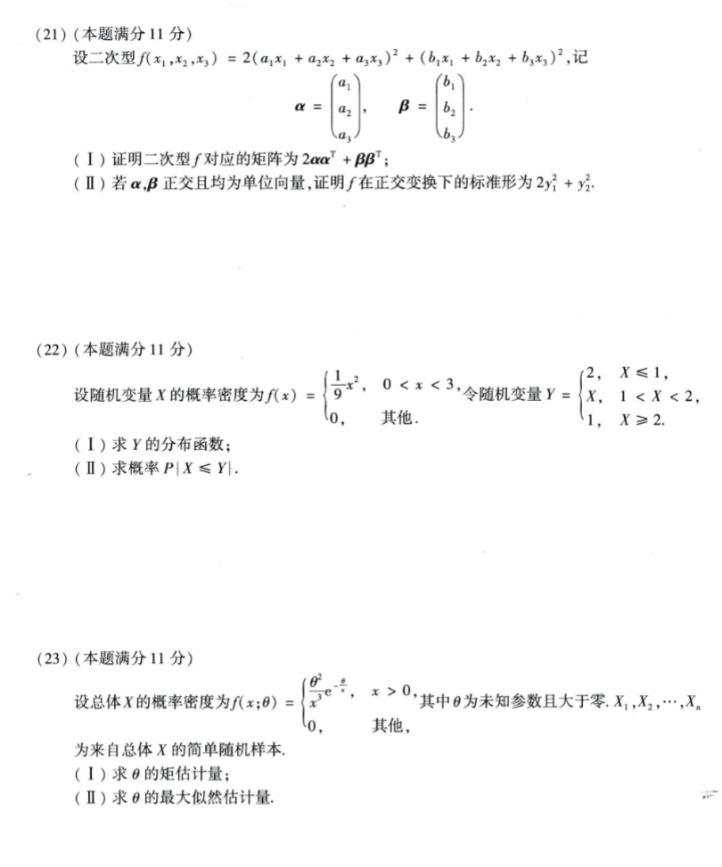

# Math 1 2013 Exam Questions

资料类型：考研数学一历年真题
年份：2013
科目：数学一
整理状态：已按本目录题干截图核对整理

说明：本文件根据 2013 年真题截图整理，截图保存在 `images/` 目录。第 8 题已按题图修正为 $P\{X>c\}=\alpha$。

## 2013 数一 选择题 1-8

**第 1-8 题题图**

### 第 1 题

- 题型：选择题
- 题号：1
- 分值：4
- 模块：高数
- 考点：极限
- 校对状态：根据截图核对

已知极限

$$
\lim_{x\to 0}\frac{x-\arctan x}{x^k}=c,
$$

其中 $k,c$ 为常数，且 $c\ne0$，则（ ）。

A. $k=2,\ c=-\frac{1}{2}$
B. $k=2,\ c=\frac{1}{2}$
C. $k=3,\ c=-\frac{1}{3}$
D. $k=3,\ c=\frac{1}{3}$

### 第 2 题

- 题型：选择题
- 题号：2
- 分值：4
- 模块：高数
- 考点：隐函数曲面切平面
- 校对状态：根据截图核对

曲面

$$
x^2+\cos(xy)+yz+x=0
$$

在点 $(0,1,-1)$ 处的切平面方程为（ ）。

A. $x-y+z=-2$
B. $x+y+z=0$
C. $x-2y+z=-3$
D. $x-y-z=0$

### 第 3 题

- 题型：选择题
- 题号：3
- 分值：4
- 模块：高数
- 考点：傅里叶级数
- 校对状态：根据截图核对

设

$$
f(x)=\left|x-\frac{1}{2}\right|,
\qquad
b_n=2\int_0^1 f(x)\sin n\pi x\,dx\quad(n=1,2,\ldots).
$$

令

$$
S(x)=\sum_{n=1}^{\infty}b_n\sin n\pi x,
$$

则 $S\left(-\frac{9}{4}\right)=($ )。

A. $\frac{3}{4}$
B. $\frac{1}{4}$
C. $-\frac{1}{4}$
D. $-\frac{3}{4}$

### 第 4 题

- 题型：选择题
- 题号：4
- 分值：4
- 模块：高数
- 考点：曲线积分、格林公式
- 校对状态：根据截图核对

设 $L_1:x^2+y^2=1$，$L_2:x^2+y^2=2$，$L_3:x^2+2y^2=2$，$L_4:2x^2+y^2=2$ 为四条逆时针方向的平面曲线。记

$$
I_i=\oint_{L_i}\left(y+\frac{y^3}{6}\right)dx+
\left(2x-\frac{x^3}{3}\right)dy,\quad i=1,2,3,4,
$$

则 $\max\{|I_1|,|I_2|,|I_3|,|I_4|\}=($ )。

A. $I_1$
B. $I_2$
C. $I_3$
D. $I_4$

### 第 5 题

- 题型：选择题
- 题号：5
- 分值：4
- 模块：线代
- 考点：矩阵、列向量组等价
- 校对状态：根据截图核对

设 $A,B,C$ 均为 $n$ 阶矩阵，若 $AB=C$，且 $B$ 可逆，则（ ）。

A. 矩阵 $C$ 的行向量组与矩阵 $A$ 的行向量组等价。
B. 矩阵 $C$ 的列向量组与矩阵 $A$ 的列向量组等价。
C. 矩阵 $C$ 的行向量组与矩阵 $B$ 的行向量组等价。
D. 矩阵 $C$ 的列向量组与矩阵 $B$ 的列向量组等价。

### 第 6 题

- 题型：选择题
- 题号：6
- 分值：4
- 模块：线代
- 考点：矩阵相似、特征值
- 校对状态：根据截图核对

矩阵

$$
\begin{pmatrix}
1&a&1\\
a&b&a\\
1&a&1
\end{pmatrix}
$$

与

$$
\begin{pmatrix}
2&0&0\\
0&b&0\\
0&0&0
\end{pmatrix}
$$

相似的充分必要条件为（ ）。

A. $a=0,\ b=2$
B. $a=0,\ b$ 为任意常数
C. $a=2,\ b=0$
D. $a=2,\ b$ 为任意常数

### 第 7 题

- 题型：选择题
- 题号：7
- 分值：4
- 模块：概率统计
- 考点：正态分布、概率比较
- 校对状态：根据截图核对

设 $X_1,X_2,X_3$ 是随机变量，且

$$
X_1\sim N(0,1),\qquad X_2\sim N(0,2^2),\qquad X_3\sim N(5,3^2),
$$

$$
p_i=P\{-2\le X_i\le2\},\quad i=1,2,3,
$$

则（ ）。

A. $p_1>p_2>p_3$
B. $p_2>p_1>p_3$
C. $p_3>p_1>p_2$
D. $p_1>p_3>p_2$

### 第 8 题

- 题型：选择题
- 题号：8
- 分值：4
- 模块：概率统计
- 考点：t 分布、F 分布
- 校对状态：根据截图核对

设随机变量 $X\sim t(n)$，$Y\sim F(1,n)$。给定 $\alpha(0<\alpha<0.5)$，常数 $c$ 满足

$$
P\{X>c\}=\alpha,
$$

则 $P\{Y>c^2\}=($ )。

A. $\alpha$
B. $1-\alpha$
C. $2\alpha$
D. $1-2\alpha$

## 2013 数一 填空题 9-14 与解答题 15-17

**第 9-17 题题图**

### 第 9 题

- 题型：填空题
- 题号：9
- 分值：4
- 模块：高数
- 考点：隐函数、极限
- 校对状态：根据截图核对

设函数 $y=f(x)$ 由方程

$$
y-x=e^{x(1-y)}
$$

确定，则

$$
\lim_{n\to\infty}n\left[f\left(\frac{1}{n}\right)-1\right]=\underline{\hspace{2cm}}.
$$

### 第 10 题

- 题型：填空题
- 题号：10
- 分值：4
- 模块：高数
- 考点：常系数线性微分方程
- 校对状态：根据截图核对

已知

$$
y_1=e^{3x}-xe^{2x},\qquad y_2=e^x-xe^{2x},\qquad y_3=-xe^{2x}
$$

是某二阶常系数非齐次线性微分方程的 $3$ 个解，则该方程的通解为

$$
y=\underline{\hspace{4cm}}.
$$

### 第 11 题

- 题型：填空题
- 题号：11
- 分值：4
- 模块：高数
- 考点：参数方程求导
- 校对状态：根据截图核对

设

$$
\begin{cases}
x=\sin t,\\
y=t\sin t+\cos t,
\end{cases}
$$

则

$$
\left.\frac{d^2y}{dx^2}\right|_{t=\frac{\pi}{4}}=\underline{\hspace{2cm}}.
$$

### 第 12 题

- 题型：填空题
- 题号：12
- 分值：4
- 模块：高数
- 考点：反常积分、分部积分
- 校对状态：根据截图核对

计算

$$
\int_1^{+\infty}\frac{\ln x}{(1+x)^2}\,dx=\underline{\hspace{2cm}}.
$$

### 第 13 题

- 题型：填空题
- 题号：13
- 分值：4
- 模块：线代
- 考点：伴随矩阵、行列式
- 校对状态：根据截图核对

设 $A=(a_{ij})$ 是 $3$ 阶非零矩阵，$\det A$ 为 $A$ 的行列式，$A_{ij}$ 为 $a_{ij}$ 的代数余子式。若

$$
a_{ij}+A_{ij}=0\quad(i,j=1,2,3),
$$

则 $\det A=\underline{\hspace{2cm}}$。

### 第 14 题

- 题型：填空题
- 题号：14
- 分值：4
- 模块：概率统计
- 考点：指数分布、条件概率
- 校对状态：根据截图核对

设随机变量 $Y$ 服从参数为 $1$ 的指数分布，$a$ 为常数且大于零，则

$$
P\{Y\le a+1\mid Y>a\}=\underline{\hspace{2cm}}.
$$

### 第 15 题

- 题型：解答题
- 题号：15
- 分值：10
- 模块：高数
- 考点：积分计算、分部积分
- 校对状态：根据截图核对

计算

$$
\int_0^1\frac{f(x)}{\sqrt{x}}\,dx,
$$

其中

$$
f(x)=\int_1^x\frac{\ln(t+1)}{t}\,dt.
$$

### 第 16 题

- 题型：解答题
- 题号：16
- 分值：10
- 模块：高数
- 考点：幂级数、微分方程
- 校对状态：根据截图核对

设数列 $\{a_n\}$ 满足条件：

$$
a_0=3,\qquad a_1=1,\qquad a_{n-2}-n(n-1)a_n=0\quad(n\ge2).
$$

$S(x)$ 是幂级数

$$
\sum_{n=0}^{\infty}a_nx^n
$$

的和函数。

1. 证明 $S''(x)-S(x)=0$。
2. 求 $S(x)$ 的表达式。

### 第 17 题

- 题型：解答题
- 题号：17
- 分值：10
- 模块：高数
- 考点：二元函数极值
- 校对状态：根据截图核对

求函数

$$
f(x,y)=\left(y+\frac{x^3}{3}\right)e^{x+y}
$$

的极值。

## 2013 数一 解答题 18-20

**第 18-20 题题图**

### 第 18 题

- 题型：解答题
- 题号：18
- 分值：10
- 模块：高数
- 考点：中值定理、罗尔定理
- 校对状态：根据截图核对

设奇函数 $f(x)$ 在 $[-1,1]$ 上具有二阶导数，且 $f(1)=1$。证明：

1. 存在 $\xi\in(0,1)$，使得 $f'(\xi)=1$。
2. 存在 $\eta\in(-1,1)$，使得 $f''(\eta)+f'(\eta)=1$。

### 第 19 题

- 题型：解答题
- 题号：19
- 分值：10
- 模块：高数
- 考点：旋转曲面、形心
- 校对状态：根据截图核对

设直线 $L$ 过 $A(1,0,0)$，$B(0,1,1)$ 两点，将 $L$ 绕 $z$ 轴旋转一周得到曲面 $\Sigma$，$\Sigma$ 与平面 $z=0,z=2$ 所围成的立体为 $\Omega$。

1. 求曲面 $\Sigma$ 的方程。
2. 求 $\Omega$ 的形心坐标。

### 第 20 题

- 题型：解答题
- 题号：20
- 分值：11
- 模块：线代
- 考点：矩阵方程
- 校对状态：根据截图核对

设

$$
A=\begin{pmatrix}1&a\\1&0\end{pmatrix},
\qquad
B=\begin{pmatrix}0&1\\1&b\end{pmatrix}.
$$

当 $a,b$ 为何值时，存在矩阵 $C$ 使得 $AC-CA=B$，并求所有矩阵 $C$。

## 2013 数一 解答题 21-23

**第 21-23 题题图**

### 第 21 题

- 题型：解答题
- 题号：21
- 分值：11
- 模块：线代
- 考点：二次型、正交变换
- 校对状态：根据截图核对

设二次型

$$
f(x_1,x_2,x_3)=2(a_1x_1+a_2x_2+a_3x_3)^2+(b_1x_1+b_2x_2+b_3x_3)^2.
$$

记

$$
\alpha=(a_1,a_2,a_3)^T,
\qquad
\beta=(b_1,b_2,b_3)^T.
$$

1. 证明二次型 $f$ 对应的矩阵为 $2\alpha\alpha^T+\beta\beta^T$。
2. 若 $\alpha,\beta$ 正交且均为单位向量，证明 $f$ 在正交变换下的标准形为 $2y_1^2+y_2^2$。

### 第 22 题

- 题型：解答题
- 题号：22
- 分值：11
- 模块：概率统计
- 考点：随机变量函数、分布函数
- 校对状态：根据截图核对

设随机变量 $X$ 的概率密度为

$$
f(x)=\begin{cases}
\frac{1}{9}x^2,&0<x<3,\\
0,&\text{其他}.
\end{cases}
$$

令随机变量

$$
Y=\begin{cases}
2,&X\le1,\\
X,&1<X<2,\\
1,&X\ge2.
\end{cases}
$$

1. 求 $Y$ 的分布函数。
2. 求概率 $P\{X\le Y\}$。

### 第 23 题

- 题型：解答题
- 题号：23
- 分值：11
- 模块：概率统计
- 考点：矩估计、最大似然估计
- 校对状态：根据截图核对

设总体 $X$ 的概率密度为

$$
f(x;\theta)=\begin{cases}
\frac{\theta^2}{x^3}e^{-\theta/x},&x>0,\\
0,&\text{其他},
\end{cases}
$$

其中 $\theta$ 为未知参数且大于零，$X_1,X_2,\ldots,X_n$ 为来自总体 $X$ 的简单随机样本。

1. 求 $\theta$ 的矩估计量。
2. 求 $\theta$ 的最大似然估计量。
