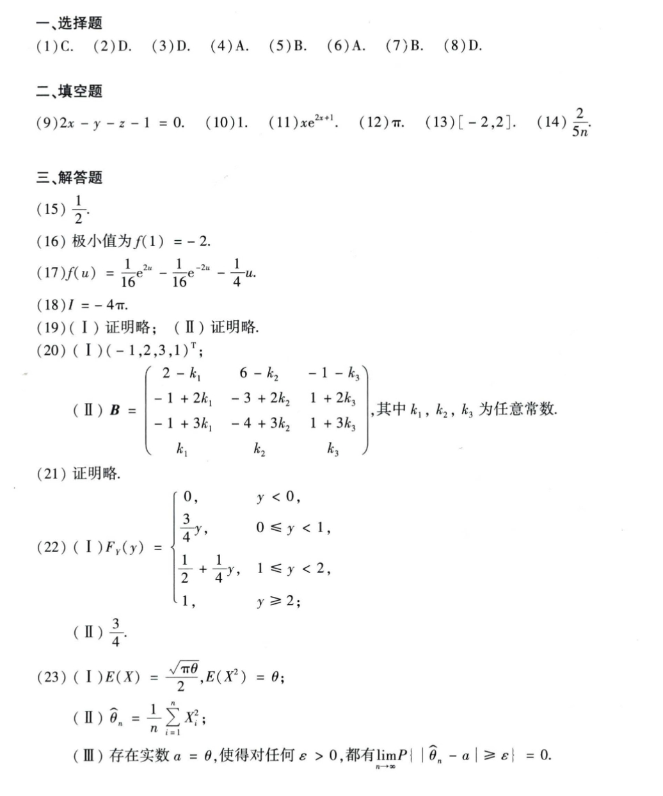

# Math 1 2014 Answers

资料类型：考研数学一答案速查  
年份：2014  
科目：数学一  
来源：本地答案速查图片 OCR/人工转写  
校对状态：待复核  

原图：

## 选择题

| 题号 | 答案 |
|---|---|
| 1 | C |
| 2 | D |
| 3 | D |
| 4 | A |
| 5 | B |
| 6 | A |
| 7 | B |
| 8 | D |

## 填空题

| 题号 | 答案 |
|---|---|
| 9 | `2x-y-z-1=0` |
| 10 | `1` |
| 11 | `x e^(2x+1)` |
| 12 | `π` |
| 13 | `[-2,2]` |
| 14 | `2/(5n)` |

## 解答题

| 题号 | 答案速查 |
|---|---|
| 15 | `1/2` |
| 16 | 极小值 `f(1)=-2` |
| 17 | `f(u)=1/16 e^(2u)-1/16 e^(-2u)-u/4` |
| 18 | `I=-4π` |
| 19 | 证明略 |
| 20 | （1）基础解系可取 `(-1,2,3,1)^T`；（2）`B=[2-k_1, 6-k_2, -1-k_3; -1+2k_1, -3+2k_2, 1+2k_3; -1+3k_1, -4+3k_2, 1+3k_3; k_1, k_2, k_3]`，其中 `k_1,k_2,k_3` 为任意常数 |
| 21 | 证明略 |
| 22 | （1）`F_Y(y)=0(y<0); 3y/4(0<=y<1); 1/2+y/4(1<=y<2); 1(y>=2)`；（2）`E(Y)=3/4` |
| 23 | （1）`E(X)=sqrt(πθ)/2, E(X^2)=θ`；（2）`theta_hat=(1/n)sum X_i^2`；（3）相合性证明略 |
