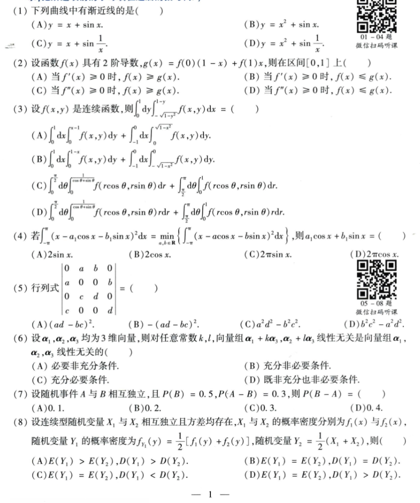
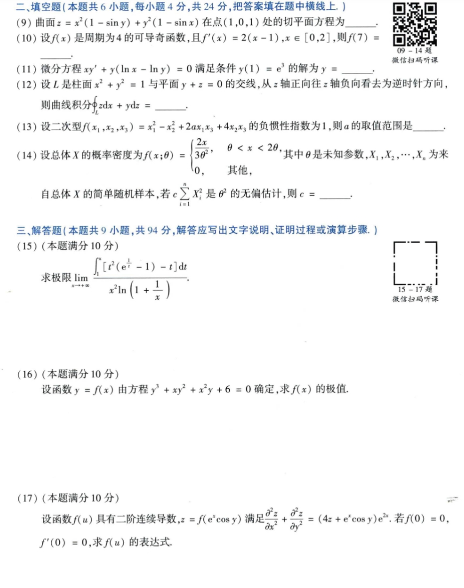
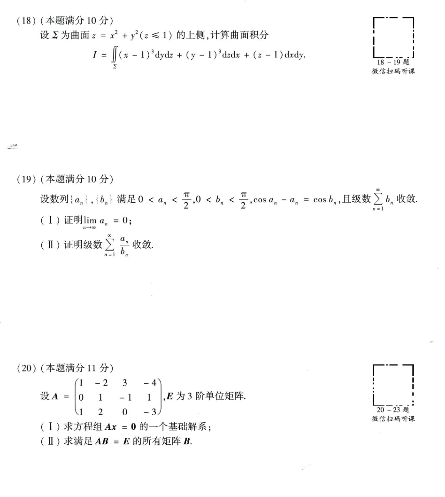
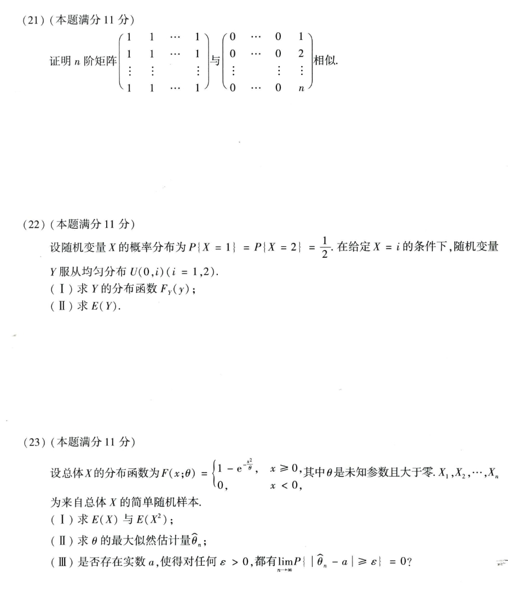

# Math 1 2014 Exam Questions

资料类型：考研数学一历年真题  
年份：2014  
科目：数学一  
整理状态：待复核  

说明：本文件根据用户提供的 2014 年真题截图整理。截图已保存到 `images/` 目录；细小公式处保留“待确认”说明。

## 2014 数一 选择题 1-8

截图：



### 第 1 题

- 题型：选择题
- 题号：1
- 分值：4
- 模块：高数
- 考点：渐近线
- 校对状态：根据截图整理

题干：

下列曲线中有渐近线的是（ ）

选项：

A. `y = x + sin x`  
B. `y = x^2 + sin x`  
C. `y = x + sin(1/x)`  
D. `y = x^2 + sin(1/x)`

### 第 2 题

- 题型：选择题
- 题号：2
- 分值：4
- 模块：高数
- 考点：凸性、弦线
- 校对状态：根据截图整理

题干：

设函数 `f(x)` 具有 2 阶导数，`g(x)=f(0)(1-x)+f(1)x`，则在区间 `[0,1]` 上（ ）

选项：

A. 当 `f'(x) >= 0` 时，`f(x) >= g(x)`。  
B. 当 `f'(x) >= 0` 时，`f(x) <= g(x)`。  
C. 当 `f''(x) >= 0` 时，`f(x) >= g(x)`。  
D. 当 `f''(x) >= 0` 时，`f(x) <= g(x)`。

### 第 3 题

- 题型：选择题
- 题号：3
- 分值：4
- 模块：高数
- 考点：二重积分换序、极坐标
- 校对状态：待确认

题干：

设 `f(x,y)` 是连续函数，则

```text
∫_0^1 dy ∫_{-sqrt(1-y^2)}^(1-y) f(x,y) dx = ( )
```

选项：

A. `∫_0^1 dx ∫_0^(x-1) f(x,y) dy + ∫_{-1}^0 dx ∫_0^(sqrt(1-x^2)) f(x,y) dy`

B. `∫_0^1 dx ∫_0^(1-x) f(x,y) dy + ∫_{-1}^0 dx ∫_(sqrt(1-x^2))^0 f(x,y) dy`

C. `∫_0^(π/2) dθ ∫_0^(1/(cosθ+sinθ)) f(r cosθ,r sinθ) dr + ∫_(π/2)^π dθ ∫_0^1 f(r cosθ,r sinθ) dr`

D. `∫_0^(π/2) dθ ∫_0^(1/(cosθ+sinθ)) f(r cosθ,r sinθ) r dr + ∫_(π/2)^π dθ ∫_0^1 f(r cosθ,r sinθ) r dr`

待确认：选项已按截图能辨认部分转写，建议你再核一遍 B 项第二个内层积分方向与 C/D 的极坐标上限。

### 第 4 题

- 题型：选择题
- 题号：4
- 分值：4
- 模块：高数
- 考点：最小二乘、傅里叶系数
- 校对状态：根据截图整理

题干：

若

```text
∫_{-π}^{π} (x - a_1 cos x - b_1 sin x)^2 dx
= min_{a,b in R} ∫_{-π}^{π} (x - a cos x - b sin x)^2 dx
```

则 `a_1 cos x + b_1 sin x = ( )`

选项：

A. `2 sin x`  
B. `2 cos x`  
C. `2π sin x`  
D. `2π cos x`

### 第 5 题

- 题型：选择题
- 题号：5
- 分值：4
- 模块：线代
- 考点：行列式
- 校对状态：根据截图整理

题干：

行列式

```text
|0 a b 0
 a 0 0 b
 0 c d 0
 c 0 0 d| = ( )
```

选项：

A. `(ad-bc)^2`  
B. `-(ad-bc)^2`  
C. `a^2d^2-b^2c^2`  
D. `b^2c^2-a^2d^2`

### 第 6 题

- 题型：选择题
- 题号：6
- 分值：4
- 模块：线代
- 考点：向量组线性无关
- 校对状态：根据截图整理

题干：

设 `alpha_1,alpha_2,alpha_3` 均为 3 维向量，则对任意常数 `k,l`，向量组

```text
alpha_1 + k alpha_3, alpha_2 + l alpha_3
```

线性无关是向量组 `alpha_1,alpha_2,alpha_3` 线性无关的（ ）

选项：

A. 必要非充分条件。  
B. 充分非必要条件。  
C. 充分必要条件。  
D. 既非充分也非必要条件。

### 第 7 题

- 题型：选择题
- 题号：7
- 分值：4
- 模块：概率统计
- 考点：事件独立
- 校对状态：根据截图整理

题干：

设随机事件 `A` 与 `B` 相互独立，且 `P(B)=0.5, P(A-B)=0.3`，则 `P(B-A) = ( )`

选项：

A. `0.1`  
B. `0.2`  
C. `0.3`  
D. `0.4`

### 第 8 题

- 题型：选择题
- 题号：8
- 分值：4
- 模块：概率统计
- 考点：混合分布、期望和方差
- 校对状态：根据截图整理

题干：

设连续型随机变量 `X_1` 与 `X_2` 相互独立且方差均存在，`X_1,X_2` 的概率密度分别为 `f_1(x)` 与 `f_2(x)`，随机变量 `Y_1` 的概率密度为

```text
f_{Y_1}(y)=1/2[f_1(y)+f_2(y)]
```

随机变量

```text
Y_2 = 1/2(X_1+X_2)
```

则（ ）

选项：

A. `E(Y_1)>E(Y_2), D(Y_1)>D(Y_2)`  
B. `E(Y_1)=E(Y_2), D(Y_1)=D(Y_2)`  
C. `E(Y_1)=E(Y_2), D(Y_1)<D(Y_2)`  
D. `E(Y_1)=E(Y_2), D(Y_1)>D(Y_2)`

## 2014 数一 填空题 9-14 与解答题 15-17

截图：



### 第 9 题

- 题型：填空题
- 题号：9
- 分值：4
- 模块：高数
- 考点：切平面
- 校对状态：根据截图整理

题干：

曲面

```text
z = x^2(1 - sin y) + y^2(1 - sin x)
```

在点 `(1,0,1)` 处的切平面方程为 `____`。

### 第 10 题

- 题型：填空题
- 题号：10
- 分值：4
- 模块：高数
- 考点：周期函数、奇函数
- 校对状态：根据截图整理

题干：

设 `f(x)` 是周期为 4 的可导奇函数，且 `f'(x)=2(x-1), x in [0,2]`，则 `f(7)=____`。

### 第 11 题

- 题型：填空题
- 题号：11
- 分值：4
- 模块：高数
- 考点：微分方程
- 校对状态：根据截图整理

题干：

微分方程

```text
x y' + y(ln x - ln y)=0
```

满足条件 `y(1)=e^3` 的解为 `y=____`。

### 第 12 题

- 题型：填空题
- 题号：12
- 分值：4
- 模块：高数
- 考点：空间曲线积分
- 校对状态：根据截图整理

题干：

设 `L` 是柱面 `x^2+y^2=1` 与平面 `y+z=0` 的交线，从 `z` 轴正向往 `z` 轴负向看去为逆时针方向，则曲线积分

```text
∮_L z dx + y dz = ____
```

### 第 13 题

- 题型：填空题
- 题号：13
- 分值：4
- 模块：线代
- 考点：二次型惯性指数
- 校对状态：根据截图整理

题干：

设二次型

```text
f(x_1,x_2,x_3)=x_1^2-x_2^2+2a x_1x_3+4x_2x_3
```

的负惯性指数为 1，则 `a` 的取值范围是 `____`。

### 第 14 题

- 题型：填空题
- 题号：14
- 分值：4
- 模块：概率统计
- 考点：无偏估计
- 校对状态：根据截图整理

题干：

设总体 `X` 的概率密度为

```text
f(x;theta) = {
  2x/(3theta^2), theta < x < 2theta
  0, 其他
}
```

其中 `theta` 是未知参数，`X_1,...,X_n` 为来自总体 `X` 的简单随机样本，若

```text
c sum_{i=1}^n X_i^2
```

是 `theta^2` 的无偏估计，则 `c=____`。

### 第 15 题

- 题型：解答题
- 题号：15
- 分值：10
- 模块：高数
- 考点：极限
- 校对状态：已确认

题干：

求极限

```text
lim_{x -> +∞} [∫_1^x (t^2(e^(1/t)-1)-t) dt] / [x^2 ln(1+1/x)]
```

### 第 16 题

- 题型：解答题
- 题号：16
- 分值：10
- 模块：高数
- 考点：隐函数极值
- 校对状态：根据截图整理

题干：

设函数 `y=f(x)` 由方程

```text
y^3 + xy^2 + x^2y + 6 = 0
```

确定，求 `f(x)` 的极值。

### 第 17 题

- 题型：解答题
- 题号：17
- 分值：10
- 模块：高数
- 考点：偏微分方程
- 校对状态：已确认

题干：

设函数 `f(u)` 具有二阶连续导数，`z=f(e^x cos y)` 满足

```text
∂²z/∂x² + ∂²z/∂y² = (4z + e^x cos y)e^(2x)
```

若 `f(0)=0, f'(0)=0`，求 `f(u)` 的表达式。

## 2014 数一 解答题 18-20

截图：



### 第 18 题

- 题型：解答题
- 题号：18
- 分值：10
- 模块：高数
- 考点：曲面积分
- 校对状态：根据截图整理

题干：

设 `Sigma` 为曲面 `z=x^2+y^2 (z<=1)` 的上侧，计算曲面积分

```text
I = ∬_Sigma (x-1)^3 dydz + (y-1)^3 dzdx + (z-1) dxdy
```

### 第 19 题

- 题型：解答题
- 题号：19
- 分值：10
- 模块：高数
- 考点：数列级数
- 校对状态：根据截图整理

题干：

设数列 `{a_n},{b_n}` 满足

```text
0 < a_n < π/2, 0 < b_n < π/2, cos a_n - a_n = cos b_n,
```

且级数 `sum_{n=1}^∞ b_n` 收敛。

1. 证明 `lim_{n->∞} a_n = 0`。
2. 证明级数 `sum_{n=1}^∞ a_n/b_n` 收敛。

### 第 20 题

- 题型：解答题
- 题号：20
- 分值：11
- 模块：线代
- 考点：基础解系、矩阵方程
- 校对状态：根据截图整理

题干：

设

```text
A = [1 -2  3 -4
     0  1 -1  1
     1  2  0 -3]
```

`E` 为 3 阶单位矩阵。

1. 求方程组 `Ax=0` 的一个基础解系。
2. 求满足 `AB=E` 的所有矩阵 `B`。

## 2014 数一 解答题 21-23

截图：



### 第 21 题

- 题型：解答题
- 题号：21
- 分值：11
- 模块：线代
- 考点：矩阵相似
- 校对状态：根据截图整理

题干：

证明 `n` 阶矩阵

```text
all-ones matrix
```

与

```text
[0 ... 0 1
 0 ... 0 2
 ...
 0 ... 0 n]
```

相似。

### 第 22 题

- 题型：解答题
- 题号：22
- 分值：11
- 模块：概率统计
- 考点：条件分布、分布函数、期望
- 校对状态：根据截图整理

题干：

设随机变量 `X` 的概率分布为

```text
P{X=1}=P{X=2}=1/2
```

在给定 `X=i` 的条件下，随机变量 `Y` 服从均匀分布 `U(0,i)`，`i=1,2`。

1. 求 `Y` 的分布函数 `F_Y(y)`。
2. 求 `E(Y)`。

### 第 23 题

- 题型：解答题
- 题号：23
- 分值：11
- 模块：概率统计
- 考点：分布函数、最大似然估计、相合性
- 校对状态：根据截图整理

题干：

设总体 `X` 的分布函数为

```text
F(x;theta) = {
  1 - e^(-x^2/theta), x >= 0
  0, x < 0
}
```

其中 `theta` 是未知参数且大于零，`X_1,...,X_n` 为来自总体 `X` 的简单随机样本。

1. 求 `E(X)` 与 `E(X^2)`。
2. 求 `theta` 的最大似然估计量 `hat_theta_n`。
3. 是否存在实数 `a`，使得对任意 `epsilon > 0`，都有 `lim_{n->∞} P{|hat_theta_n - a| >= epsilon}=0`？
