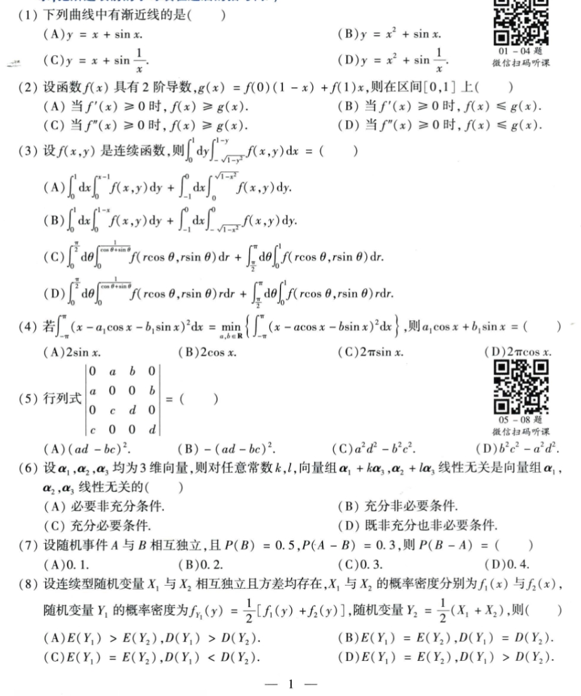
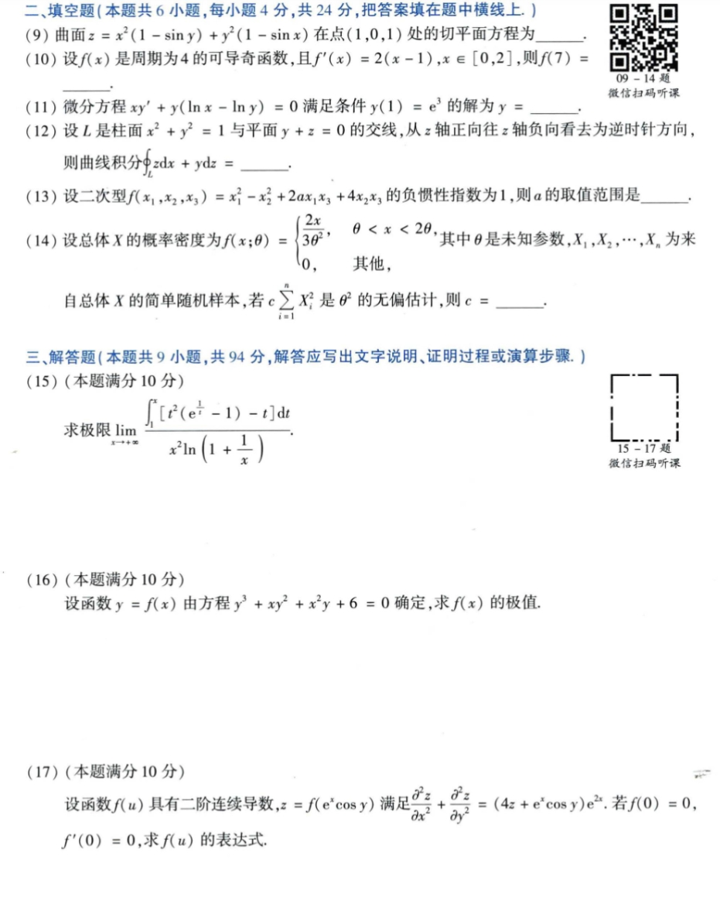
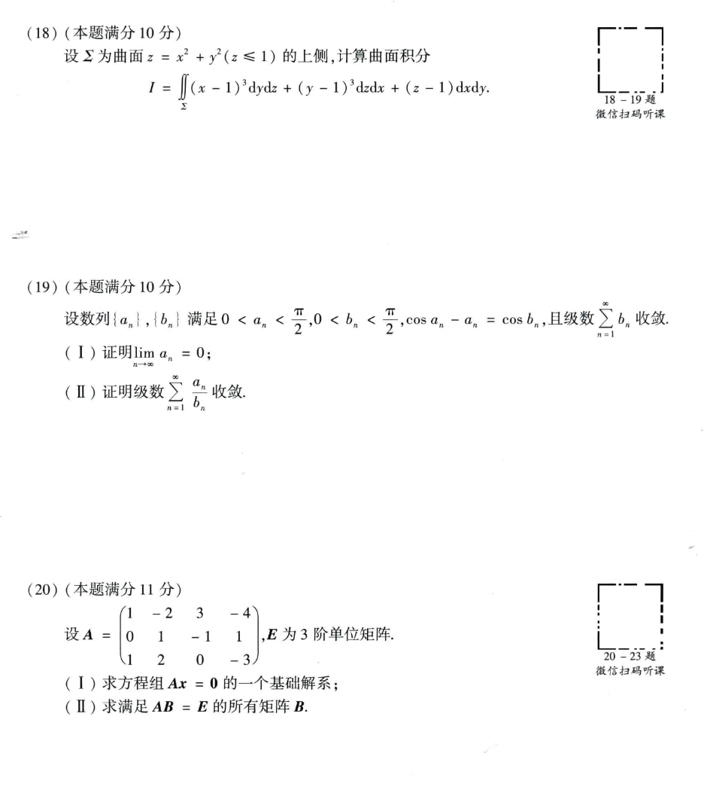
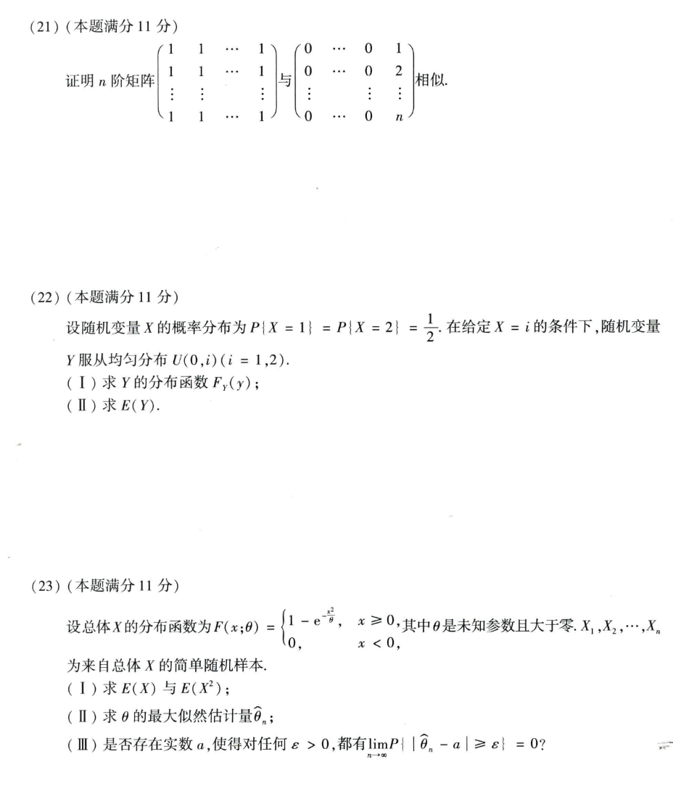

# Math 1 2014 Exam Questions

资料类型：考研数学一历年真题
年份：2014
科目：数学一
整理状态：已按题干截图清洗整理

## 2014 数一 选择题 1-8

**第 1-8 题题图**

### 第 1 题

- 题型：选择题
- 题号：1
- 分值：4
- 模块：高数
- 考点：渐近线

题干：

下列曲线中有渐近线的是（ ）

选项：

A. $y=x+\sin x$
B. $y=x^2+\sin x$
C. $y=x+\sin\frac{1}{x}$
D. $y=x^2+\sin\frac{1}{x}$

### 第 2 题

- 题型：选择题
- 题号：2
- 分值：4
- 模块：高数
- 考点：凸性、弦线

题干：

设函数 $f(x)$ 具有 2 阶导数，$g(x)=f(0)(1-x)+f(1)x$，则在区间 $[0,1]$ 上（ ）

选项：

A. 当 $f'(x)\ge 0$ 时，$f(x)\ge g(x)$。
B. 当 $f'(x)\ge 0$ 时，$f(x)\le g(x)$。
C. 当 $f''(x)\ge 0$ 时，$f(x)\ge g(x)$。
D. 当 $f''(x)\ge 0$ 时，$f(x)\le g(x)$。

### 第 3 题

- 题型：选择题
- 题号：3
- 分值：4
- 模块：高数
- 考点：二重积分换序、极坐标

题干：

设 $f(x,y)$ 是连续函数，则
$$
\int_0^1dy\int_{-\sqrt{1-y^2}}^{1-y}f(x,y)\,dx=(\ )
$$

选项：

A. $\displaystyle \int_0^1dx\int_0^{x-1}f(x,y)\,dy+\int_{-1}^0dx\int_0^{\sqrt{1-x^2}}f(x,y)\,dy$

B. $\displaystyle \int_0^1dx\int_0^{1-x}f(x,y)\,dy+\int_{-1}^0dx\int_{\sqrt{1-x^2}}^0f(x,y)\,dy$

C. $\displaystyle \int_0^{\frac{\pi}{2}}d\theta\int_0^{\frac{1}{\cos\theta+\sin\theta}}f(r\cos\theta,r\sin\theta)\,dr+\int_{\frac{\pi}{2}}^\pi d\theta\int_0^1f(r\cos\theta,r\sin\theta)\,dr$

D. $\displaystyle \int_0^{\frac{\pi}{2}}d\theta\int_0^{\frac{1}{\cos\theta+\sin\theta}}f(r\cos\theta,r\sin\theta)r\,dr+\int_{\frac{\pi}{2}}^\pi d\theta\int_0^1f(r\cos\theta,r\sin\theta)r\,dr$

### 第 4 题

- 题型：选择题
- 题号：4
- 分值：4
- 模块：高数
- 考点：最小二乘、傅里叶系数

题干：

若
$$
\int_{-\pi}^{\pi}(x-a_1\cos x-b_1\sin x)^2\,dx
=\min_{a,b\in\mathbb R}\int_{-\pi}^{\pi}(x-a\cos x-b\sin x)^2\,dx,
$$
则 $a_1\cos x+b_1\sin x=(\ )$

选项：

A. $2\sin x$
B. $2\cos x$
C. $2\pi\sin x$
D. $2\pi\cos x$

### 第 5 题

- 题型：选择题
- 题号：5
- 分值：4
- 模块：线代
- 考点：行列式

题干：

行列式
$$
\begin{vmatrix}
0&a&b&0\\
a&0&0&b\\
0&c&d&0\\
c&0&0&d
\end{vmatrix}=(\ )
$$

选项：

A. $(ad-bc)^2$
B. $-(ad-bc)^2$
C. $a^2d^2-b^2c^2$
D. $b^2c^2-a^2d^2$

### 第 6 题

- 题型：选择题
- 题号：6
- 分值：4
- 模块：线代
- 考点：向量组线性无关

题干：

设 $\alpha_1,\alpha_2,\alpha_3$ 均为 3 维向量，则对任意常数 $k,l$，向量组
$$
\alpha_1+k\alpha_3,\quad \alpha_2+l\alpha_3
$$
线性无关是向量组 $\alpha_1,\alpha_2,\alpha_3$ 线性无关的（ ）

选项：

A. 必要非充分条件。
B. 充分非必要条件。
C. 充分必要条件。
D. 既非充分也非必要条件。

### 第 7 题

- 题型：选择题
- 题号：7
- 分值：4
- 模块：概率统计
- 考点：事件独立

题干：

设随机事件 $A$ 与 $B$ 相互独立，且 $P(B)=0.5,\ P(A-B)=0.3$，则 $P(B-A)=(\ )$

选项：

A. $0.1$
B. $0.2$
C. $0.3$
D. $0.4$

### 第 8 题

- 题型：选择题
- 题号：8
- 分值：4
- 模块：概率统计
- 考点：混合分布、期望和方差

题干：

设连续型随机变量 $X_1$ 与 $X_2$ 相互独立且方差均存在，$X_1,X_2$ 的概率密度分别为 $f_1(x)$ 与 $f_2(x)$，随机变量 $Y_1$ 的概率密度为
$$
f_{Y_1}(y)=\frac{1}{2}\left[f_1(y)+f_2(y)\right],
$$
随机变量
$$
Y_2=\frac{1}{2}(X_1+X_2),
$$
则（ ）

选项：

A. $E(Y_1)>E(Y_2),\ D(Y_1)>D(Y_2)$
B. $E(Y_1)=E(Y_2),\ D(Y_1)=D(Y_2)$
C. $E(Y_1)=E(Y_2),\ D(Y_1)<D(Y_2)$
D. $E(Y_1)=E(Y_2),\ D(Y_1)>D(Y_2)$

## 2014 数一 填空题 9-14 与解答题 15-17

**第 9-17 题题图**

### 第 9 题

- 题型：填空题
- 题号：9
- 分值：4
- 模块：高数
- 考点：切平面

题干：

曲面
$$
z=x^2(1-\sin y)+y^2(1-\sin x)
$$
在点 $(1,0,1)$ 处的切平面方程为 ______。

### 第 10 题

- 题型：填空题
- 题号：10
- 分值：4
- 模块：高数
- 考点：周期函数、奇函数

题干：

设 $f(x)$ 是周期为 4 的可导奇函数，且 $f'(x)=2(x-1),\ x\in[0,2]$，则 $f(7)=______$。

### 第 11 题

- 题型：填空题
- 题号：11
- 分值：4
- 模块：高数
- 考点：微分方程

题干：

微分方程
$$
xy'+y(\ln x-\ln y)=0
$$
满足条件 $y(1)=e^3$ 的解为 $y=______$。

### 第 12 题

- 题型：填空题
- 题号：12
- 分值：4
- 模块：高数
- 考点：空间曲线积分

题干：

设 $L$ 是柱面 $x^2+y^2=1$ 与平面 $y+z=0$ 的交线，从 $z$ 轴正向往 $z$ 轴负向看去为逆时针方向，则曲线积分
$$
\oint_L z\,dx+y\,dz=______.
$$

### 第 13 题

- 题型：填空题
- 题号：13
- 分值：4
- 模块：线代
- 考点：二次型惯性指数

题干：

设二次型
$$
f(x_1,x_2,x_3)=x_1^2-x_2^2+2ax_1x_3+4x_2x_3
$$
的负惯性指数为 1，则 $a$ 的取值范围是 ______。

### 第 14 题

- 题型：填空题
- 题号：14
- 分值：4
- 模块：概率统计
- 考点：无偏估计

题干：

设总体 $X$ 的概率密度为
$$
f(x;\theta)=
\begin{cases}
\frac{2x}{3\theta^2},&\theta<x<2\theta,\\
0,&\text{其他},
\end{cases}
$$
其中 $\theta$ 是未知参数，$X_1,X_2,\ldots,X_n$ 为来自总体 $X$ 的简单随机样本。若
$$
c\sum_{i=1}^nX_i^2
$$
是 $\theta^2$ 的无偏估计，则 $c=______$。

### 第 15 题

- 题型：解答题
- 题号：15
- 分值：10
- 模块：高数
- 考点：极限

题干：

求极限
$$
\lim_{x\to+\infty}\frac{\displaystyle\int_1^x\left[t^2\left(e^{\frac{1}{t}}-1\right)-t\right]dt}{x^2\ln\left(1+\frac{1}{x}\right)}.
$$

### 第 16 题

- 题型：解答题
- 题号：16
- 分值：10
- 模块：高数
- 考点：隐函数极值

题干：

设函数 $y=f(x)$ 由方程
$$
y^3+xy^2+x^2y+6=0
$$
确定，求 $f(x)$ 的极值。

### 第 17 题

- 题型：解答题
- 题号：17
- 分值：10
- 模块：高数
- 考点：偏微分方程

题干：

设函数 $f(u)$ 具有二阶连续导数，$z=f(e^x\cos y)$ 满足
$$
\frac{\partial^2z}{\partial x^2}+\frac{\partial^2z}{\partial y^2}
=(4z+e^x\cos y)e^{2x}.
$$
若 $f(0)=0,\ f'(0)=0$，求 $f(u)$ 的表达式。

## 2014 数一 解答题 18-20

**第 18-20 题题图**

### 第 18 题

- 题型：解答题
- 题号：18
- 分值：10
- 模块：高数
- 考点：曲面积分

题干：

设 $\Sigma$ 为曲面 $z=x^2+y^2\ (z\le 1)$ 的上侧，计算曲面积分
$$
I=\iint_\Sigma (x-1)^3\,dy\,dz+(y-1)^3\,dz\,dx+(z-1)\,dx\,dy.
$$

### 第 19 题

- 题型：解答题
- 题号：19
- 分值：10
- 模块：高数
- 考点：数列级数

题干：

设数列 $\{a_n\},\{b_n\}$ 满足
$$
0<a_n<\frac{\pi}{2},\quad 0<b_n<\frac{\pi}{2},\quad \cos a_n-a_n=\cos b_n,
$$
且级数 $\sum_{n=1}^{\infty}b_n$ 收敛。

（1）证明 $\lim_{n\to\infty}a_n=0$；

（2）证明级数 $\sum_{n=1}^{\infty}\frac{a_n}{b_n}$ 收敛。

### 第 20 题

- 题型：解答题
- 题号：20
- 分值：11
- 模块：线代
- 考点：基础解系、矩阵方程

题干：

设
$$
A=\begin{pmatrix}
1&-2&3&-4\\
0&1&-1&1\\
1&2&0&-3
\end{pmatrix},
$$
$E$ 为 3 阶单位矩阵。

（1）求方程组 $Ax=0$ 的一个基础解系；

（2）求满足 $AB=E$ 的所有矩阵 $B$。

## 2014 数一 解答题 21-23

**第 21-23 题题图**

### 第 21 题

- 题型：解答题
- 题号：21
- 分值：11
- 模块：线代
- 考点：矩阵相似

题干：

证明 $n$ 阶矩阵
$$
A=\begin{pmatrix}
1&1&\cdots&1\\
1&1&\cdots&1\\
\vdots&\vdots&&\vdots\\
1&1&\cdots&1
\end{pmatrix}
$$
与
$$
B=\begin{pmatrix}
0&\cdots&0&1\\
0&\cdots&0&2\\
\vdots&&\vdots&\vdots\\
0&\cdots&0&n
\end{pmatrix}
$$
相似。

### 第 22 题

- 题型：解答题
- 题号：22
- 分值：11
- 模块：概率统计
- 考点：条件分布、分布函数、期望

题干：

设随机变量 $X$ 的概率分布为
$$
P\{X=1\}=P\{X=2\}=\frac{1}{2}.
$$
在给定 $X=i$ 的条件下，随机变量 $Y$ 服从均匀分布 $U(0,i)$，$i=1,2$。

（1）求 $Y$ 的分布函数 $F_Y(y)$；

（2）求 $E(Y)$。

### 第 23 题

- 题型：解答题
- 题号：23
- 分值：11
- 模块：概率统计
- 考点：分布函数、最大似然估计、相合性

题干：

设总体 $X$ 的分布函数为
$$
F(x;\theta)=
\begin{cases}
1-e^{-\frac{x^2}{\theta}},&x\ge0,\\
0,&x<0,
\end{cases}
$$
其中 $\theta$ 是未知参数且大于零，$X_1,X_2,\ldots,X_n$ 为来自总体 $X$ 的简单随机样本。

（1）求 $E(X)$ 与 $E(X^2)$；

（2）求 $\theta$ 的最大似然估计量 $\hat\theta_n$；

（3）是否存在实数 $a$，使得对任意 $\varepsilon>0$，都有
$$
\lim_{n\to\infty}P\{|\hat\theta_n-a|\ge\varepsilon\}=0?
$$
