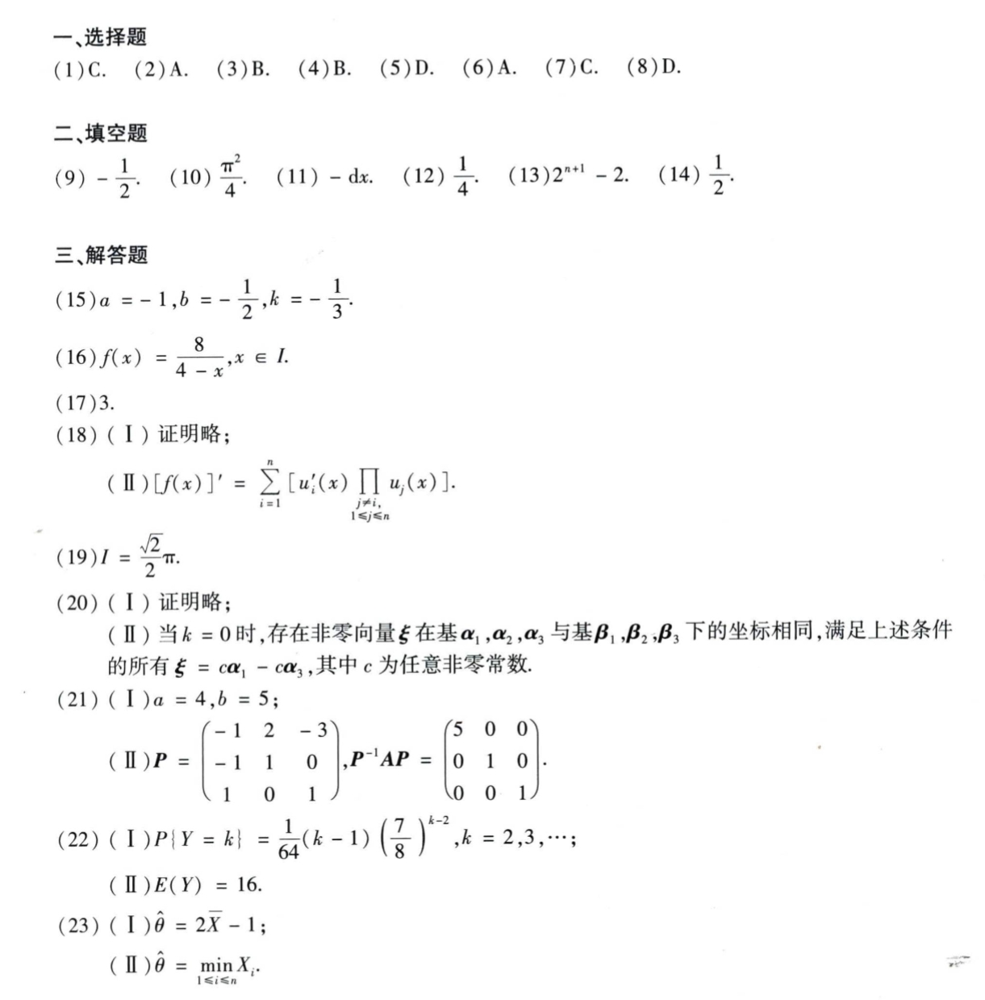

# Math 1 2015 Answers

资料类型：考研数学一答案速查  
年份：2015  
科目：数学一  
来源：本地答案速查图片 OCR/人工转写  
校对状态：待复核  

原图：

## 选择题

| 题号 | 答案 |
|---|---|
| 1 | C |
| 2 | A |
| 3 | B |
| 4 | B |
| 5 | D |
| 6 | A |
| 7 | C |
| 8 | D |

## 填空题

| 题号 | 答案 |
|---|---|
| 9 | `-1/2` |
| 10 | `π^2/4` |
| 11 | `-dx` |
| 12 | `1/4` |
| 13 | `2^(n+1)-2` |
| 14 | `1/2` |

## 解答题

| 题号 | 答案速查 |
|---|---|
| 15 | `a=-1,b=-1/2,k=-1/3` |
| 16 | `f(x)=8/(4-x), x in L` |
| 17 | `3` |
| 18 | （1）证明略；（2）`[f(x)]' = sum u_i'(x) prod_{j!=i}u_j(x)` |
| 19 | `I=(sqrt(2)/2)π` |
| 20 | （1）证明略；（2）当 `k=0` 时，`xi=cα_1-cα_3` |
| 21 | （1）`a=4,b=5`；（2）`P=[-1 2 -3; -1 1 0; 1 0 1]`，`P^-1AP=diag(5,1,1)` |
| 22 | （1）`P{Y=k}=1/64 (k-1)(7/8)^(k-2), k=2,3,...`；（2）`E(Y)=16` |
| 23 | （1）矩估计 `theta_hat=2X_bar-1`；（2）最大似然估计 `theta_hat=min X_i` |
