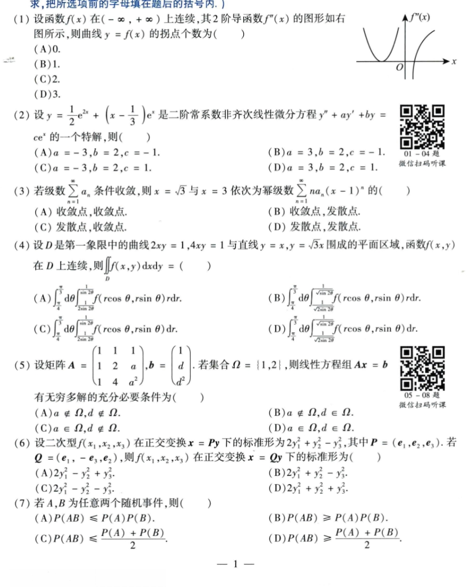
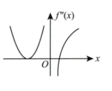
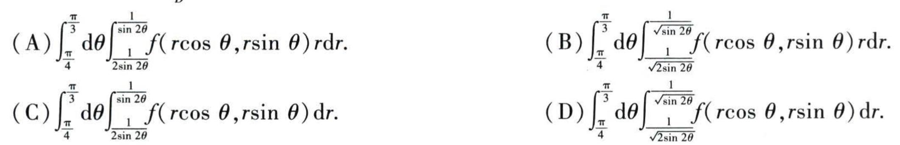
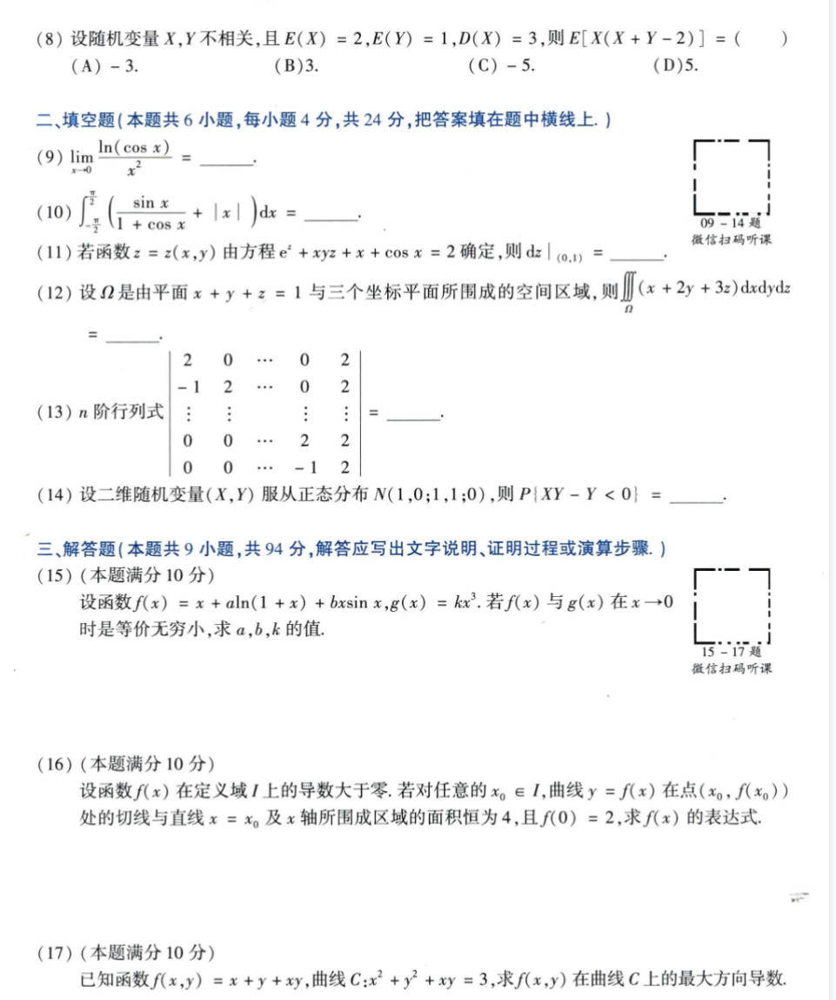
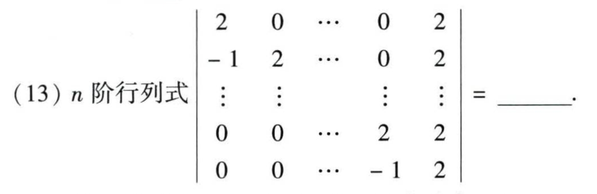
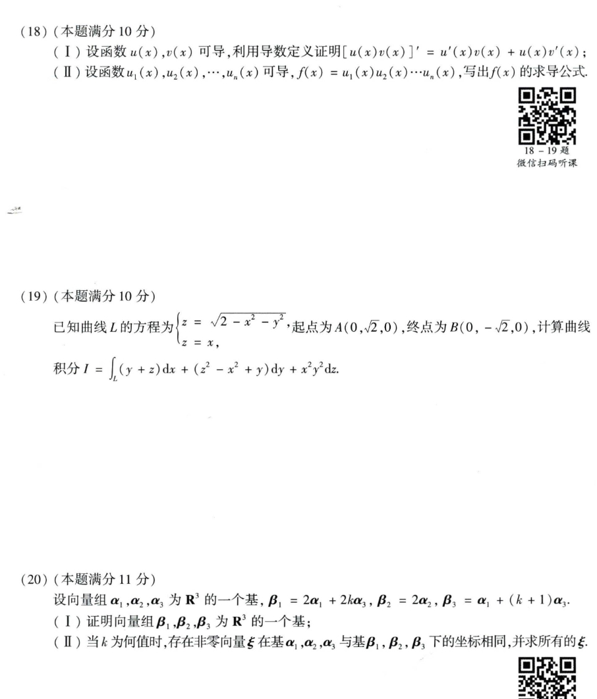
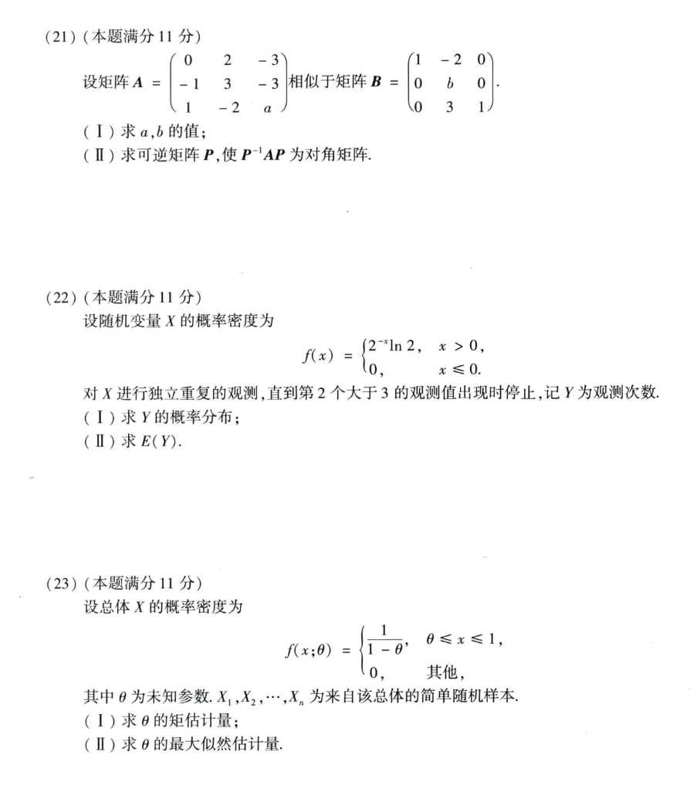

# Math 1 2015 Exam Questions

资料类型：考研数学一历年真题  
年份：2015  
科目：数学一  
整理状态：待复核  

说明：本文件根据用户提供的 2015 年真题截图整理。截图已保存到 `images/` 目录；第 1、4、13 题已补充清晰配图。

## 2015 数一 选择题 1-7

选择题 1-7 截图：



### 第 1 题

- 题型：选择题
- 题号：1
- 分值：4
- 模块：高数
- 考点：极限、导数、积分、级数、微分方程
- 校对状态：根据截图整理

设函数 `f(x)` 在 `(-∞,+∞)` 上连续，其二阶导函数 `f''(x)` 的图形如图所示，则曲线 `y=f(x)` 的拐点个数为（ ）

第 1 题配图：



选项：A. `0`  B. `1`  C. `2`  D. `3`

### 第 2 题

- 题型：选择题
- 题号：2
- 分值：4
- 模块：高数
- 考点：极限、导数、积分、级数、微分方程
- 校对状态：根据截图整理

设

```text
y = 1/2 e^(2x) + (x - 1/3)e^x
```

是二阶常系数非齐次线性微分方程 `y'' + ay' + by = ce^x` 的一个特解，则（ ）

选项：

A. `a=-3,b=2,c=-1`  
B. `a=3,b=2,c=-1`  
C. `a=-3,b=2,c=1`  
D. `a=3,b=2,c=1`

### 第 3 题

- 题型：选择题
- 题号：3
- 分值：4
- 模块：高数
- 考点：极限、导数、积分、级数、微分方程
- 校对状态：根据截图整理

若级数 `sum a_n` 条件收敛，则 `x=sqrt(3)` 与 `x=3` 依次为幂级数

```text
sum_{n=1}^∞ n a_n (x-1)^n
```

的（ ）

选项：

A. 收敛点，收敛点。  
B. 收敛点，发散点。  
C. 发散点，收敛点。  
D. 发散点，发散点。

### 第 4 题

- 题型：选择题
- 题号：4
- 分值：4
- 模块：高数
- 考点：极限、导数、积分、级数、微分方程
- 校对状态：根据截图整理

设 `D` 是第一象限中的曲线 `2xy=1, 4xy=1` 与直线 `y=x, y=sqrt(3)x` 围成的平面区域，函数 `f(x,y)` 在 `D` 上连续，则

```text
∫∫_D f(x,y) dxdy = ( )
```

第 4 题选项清晰截图：



选项：

A. `∫_(π/4)^(π/3) dθ ∫_(1/(2sin(2θ)))^(1/(sin(2θ))) f(r cosθ, r sinθ) r dr`

B. `∫_(π/4)^(π/3) dθ ∫_(1/sqrt(2sin(2θ)))^(1/sqrt(sin(2θ))) f(r cosθ, r sinθ) r dr`

C. `∫_(π/4)^(π/3) dθ ∫_(1/(2sin(2θ)))^(1/(sin(2θ))) f(r cosθ, r sinθ) dr`

D. `∫_(π/4)^(π/3) dθ ∫_(1/sqrt(2sin(2θ)))^(1/sqrt(sin(2θ))) f(r cosθ, r sinθ) dr`

### 第 5 题

- 题型：选择题
- 题号：5
- 分值：4
- 模块：线代
- 考点：矩阵、向量组、二次型
- 校对状态：根据截图整理

设

```text
A = [1 1 1
     1 2 a
     1 4 a^2],
b = [1, d, d^2]^T
```

若集合 `Omega={1,2}`，则线性方程组 `Ax=b` 有无穷多解的充分必要条件为（ ）

选项：

A. `a notin Omega, d notin Omega`  
B. `a notin Omega, d in Omega`  
C. `a in Omega, d notin Omega`  
D. `a in Omega, d in Omega`

### 第 6 题

- 题型：选择题
- 题号：6
- 分值：4
- 模块：线代
- 考点：矩阵、向量组、二次型
- 校对状态：根据截图整理

设二次型 `f(x_1,x_2,x_3)` 在正交变换 `x=Py` 下的标准形为 `2y_1^2+y_2^2-y_3^2`，其中 `P=(e_1,e_2,e_3)`。若 `Q=(e_1,-e_3,e_2)`，则 `f(x_1,x_2,x_3)` 在正交变换 `x=Qy` 下的标准形为（ ）

选项：

A. `2y_1^2-y_2^2+y_3^2`  
B. `2y_1^2+y_2^2-y_3^2`  
C. `2y_1^2-y_2^2-y_3^2`  
D. `2y_1^2+y_2^2+y_3^2`

### 第 7 题

- 题型：选择题
- 题号：7
- 分值：4
- 模块：概率统计
- 考点：随机变量、概率分布、参数估计
- 校对状态：根据截图整理

若 `A,B` 为任意两个随机事件，则（ ）

选项：

A. `P(AB) <= P(A)P(B)`  
B. `P(AB) >= P(A)P(B)`  
C. `P(AB) <= (P(A)+P(B))/2`  
D. `P(AB) >= (P(A)+P(B))/2`

## 2015 数一 选择题 8 与填空题 9-14 与解答题 15-17

截图：



### 第 8 题

- 题型：选择题
- 题号：8
- 分值：4
- 模块：概率统计
- 考点：随机变量、概率分布、参数估计
- 校对状态：根据截图整理

设随机变量 `X,Y` 不相关，且 `E(X)=2, E(Y)=1, D(X)=3`，则

```text
E[X(X+Y-2)] = ( )
```

选项：A. `-3`  B. `3`  C. `-5`  D. `5`

### 第 9 题

- 题型：填空题
- 题号：9
- 分值：4
- 模块：高数
- 考点：极限、导数、积分、级数、微分方程
- 校对状态：根据截图整理

```text
lim_{x->0} ln(cos x)/x^2 = ____
```

### 第 10 题

- 题型：填空题
- 题号：10
- 分值：4
- 模块：高数
- 考点：极限、导数、积分、级数、微分方程
- 校对状态：根据截图整理

```text
∫_{-π/2}^{π/2} (sin x/(1+cos x) + |x|) dx = ____
```

### 第 11 题

- 题型：填空题
- 题号：11
- 分值：4
- 模块：高数
- 考点：极限、导数、积分、级数、微分方程
- 校对状态：根据截图整理

若函数 `z=z(x,y)` 由方程

```text
e^z + xyz + x + cos x = 2
```

确定，则 `dz|_(0,1)=____`。

### 第 12 题

- 题型：填空题
- 题号：12
- 分值：4
- 模块：高数
- 考点：极限、导数、积分、级数、微分方程
- 校对状态：根据截图整理

设 `Omega` 是由平面 `x+y+z=1` 与三个坐标平面所围成的空间区域，则

```text
∭_Omega (x+2y+3z) dxdydz = ____
```

### 第 13 题

- 题型：填空题
- 题号：13
- 分值：4
- 模块：线代
- 考点：矩阵、向量组、二次型
- 校对状态：根据截图整理

`n` 阶行列式：

```text
|  2   0  ...   0   2 |
| -1   2  ...   0   2 |
|  :   :        :   : |
|  0   0  ...   2   2 |
|  0   0  ...  -1   2 |
```

求其值。

第 13 题清晰截图：



### 第 14 题

- 题型：填空题
- 题号：14
- 分值：4
- 模块：概率统计
- 考点：随机变量、概率分布、参数估计
- 校对状态：根据截图整理

设二维随机变量 `(X,Y)` 服从正态分布

```text
N(1,0;1,1;0)
```

则 `P{XY-Y<0}=____`。

### 第 15 题

- 题型：解答题
- 题号：15
- 分值：10
- 模块：高数
- 考点：极限、导数、积分、级数、微分方程
- 校对状态：根据截图整理

设函数

```text
f(x)=x+a ln(1+x)+b x sin x, g(x)=k x^3
```

若 `f(x)` 与 `g(x)` 在 `x->0` 时是等价无穷小，求 `a,b,k` 的值。

### 第 16 题

- 题型：解答题
- 题号：16
- 分值：10
- 模块：高数
- 考点：极限、导数、积分、级数、微分方程
- 校对状态：根据截图整理

设函数 `f(x)` 在定义域 `I` 上的导数大于零，若对任意 `x_0 in I`，曲线 `y=f(x)` 在点 `(x_0,f(x_0))` 处的切线与直线 `x=x_0` 及 `x` 轴所围成区域的面积恒为 4，且 `f(0)=2`，求 `f(x)` 的表达式。

### 第 17 题

- 题型：解答题
- 题号：17
- 分值：10
- 模块：高数
- 考点：极限、导数、积分、级数、微分方程
- 校对状态：根据截图整理

已知函数

```text
f(x,y)=x+y+xy
```

曲线 `C: x^2+y^2+xy=3`，求 `f(x,y)` 在曲线 `C` 上的最大方向导数。

## 2015 数一 解答题 18-20

截图：



### 第 18 题

- 题型：解答题
- 题号：18
- 分值：10
- 模块：高数
- 考点：极限、导数、积分、级数、微分方程
- 校对状态：根据截图整理

1. 设函数 `u(x),v(x)` 可导，利用导数定义证明

```text
[u(x)v(x)]' = u'(x)v(x)+u(x)v'(x)
```

2. 设函数 `u_1(x),u_2(x),...,u_n(x)` 可导，`f(x)=u_1(x)u_2(x)...u_n(x)`，写出 `f(x)` 的求导公式。

### 第 19 题

- 题型：解答题
- 题号：19
- 分值：10
- 模块：高数
- 考点：极限、导数、积分、级数、微分方程
- 校对状态：根据截图整理

已知曲线 `L` 的方程为

```text
z = sqrt(2 - x^2 - y^2),
z = x
```

起点为 `A(0,sqrt(2),0)`，终点为 `B(0,-sqrt(2),0)`，计算曲线积分

```text
I = ∫_L (y+z)dx + (z^2-x^2+y)dy + x^2y^2 dz
```

### 第 20 题

- 题型：解答题
- 题号：20
- 分值：11
- 模块：线代
- 考点：矩阵、向量组、二次型
- 校对状态：根据截图整理

设向量组 `alpha_1,alpha_2,alpha_3` 为 `R^3` 的一个基，

```text
beta_1 = 2alpha_1 + 2k alpha_3,
beta_2 = 2alpha_2,
beta_3 = alpha_1 + (k+1)alpha_3
```

1. 证明向量组 `beta_1,beta_2,beta_3` 为 `R^3` 的一个基。
2. 当 `k` 为何值时，存在非零向量 `xi` 在基 `alpha_1,alpha_2,alpha_3` 与基 `beta_1,beta_2,beta_3` 下的坐标相同，并求所有的 `xi`。

## 2015 数一 解答题 21-23

截图：



### 第 21 题

- 题型：解答题
- 题号：21
- 分值：11
- 模块：线代
- 考点：矩阵、向量组、二次型
- 校对状态：根据截图整理

设矩阵

```text
A = [ 0  2 -3
     -1  3 -3
      1 -2  a]
```

相似于矩阵

```text
B = [1 -2 0
     0  b 0
     0  3 1]
```

1. 求 `a,b` 的值。
2. 求可逆矩阵 `P`，使 `P^(-1)AP` 为对角矩阵。

### 第 22 题

- 题型：解答题
- 题号：22
- 分值：11
- 模块：概率统计
- 考点：随机变量、概率分布、参数估计
- 校对状态：根据截图整理

设随机变量 `X` 的概率密度为

```text
f(x) = {
  2^(-x) ln 2, x > 0
  0, x <= 0
}
```

对 `X` 进行独立重复观测，直到第 2 个大于 3 的观测值出现时停止，记 `Y` 为观测次数。

1. 求 `Y` 的概率分布。
2. 求 `E(Y)`。

### 第 23 题

- 题型：解答题
- 题号：23
- 分值：11
- 模块：概率统计
- 考点：随机变量、概率分布、参数估计
- 校对状态：根据截图整理

设总体 `X` 的概率密度为

```text
f(x;theta) = {
  1/(1-theta), theta <= x <= 1
  0, 其他
}
```

其中 `theta` 为未知参数，`X_1,...,X_n` 为来自该总体的简单随机样本。

1. 求 `theta` 的矩估计量。
2. 求 `theta` 的最大似然估计量。
