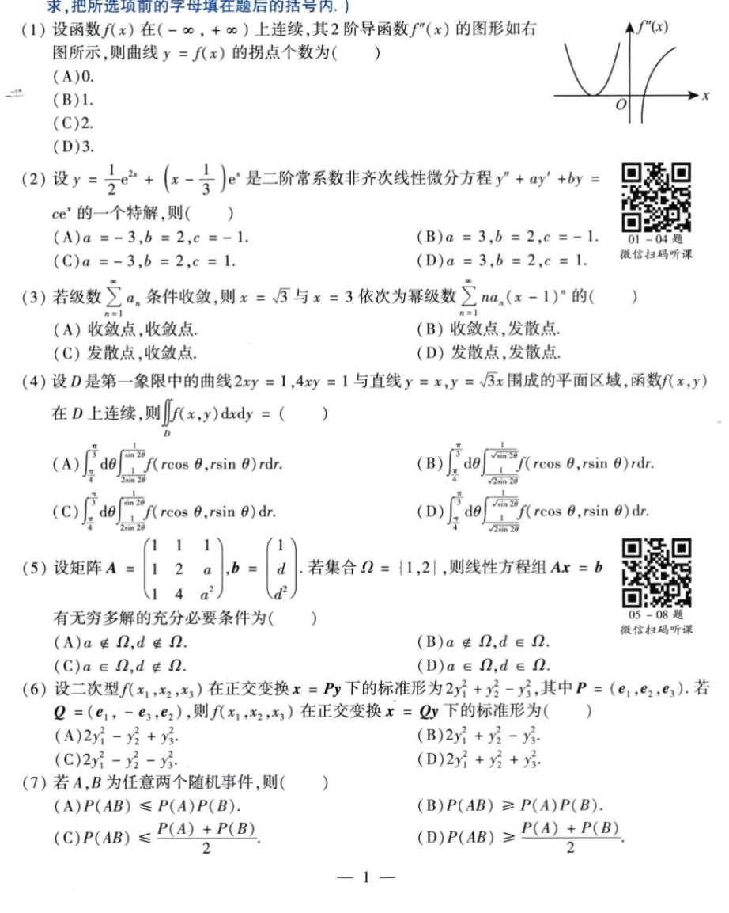
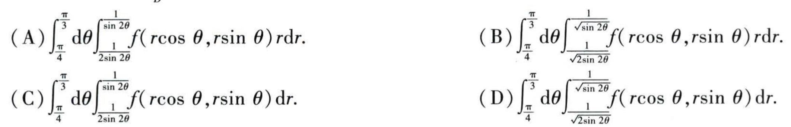
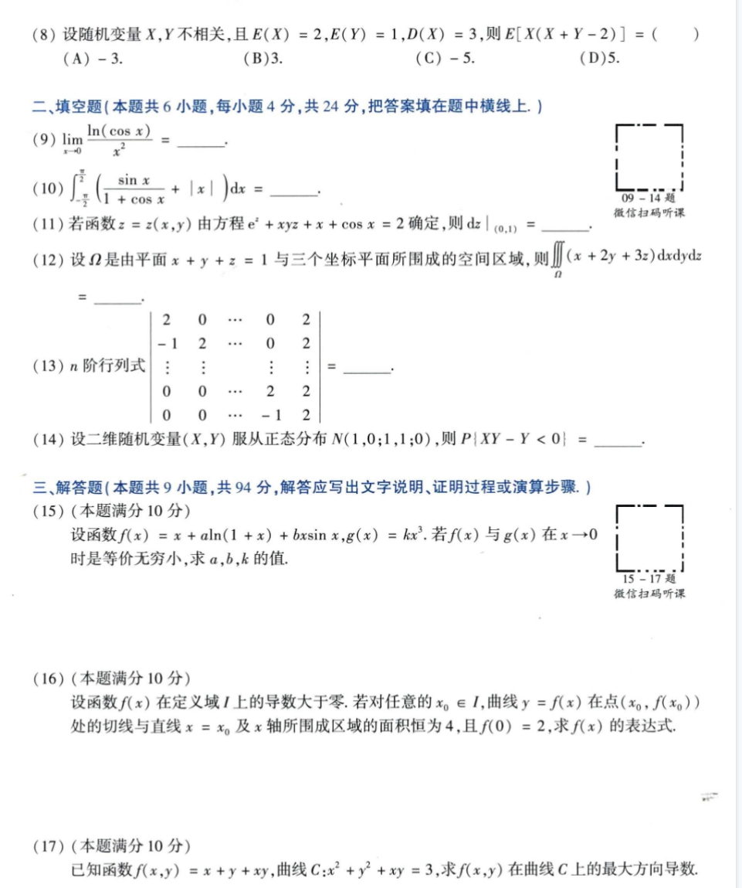
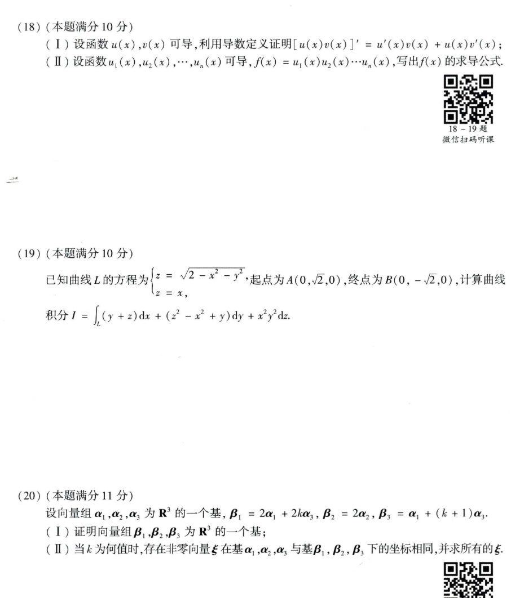
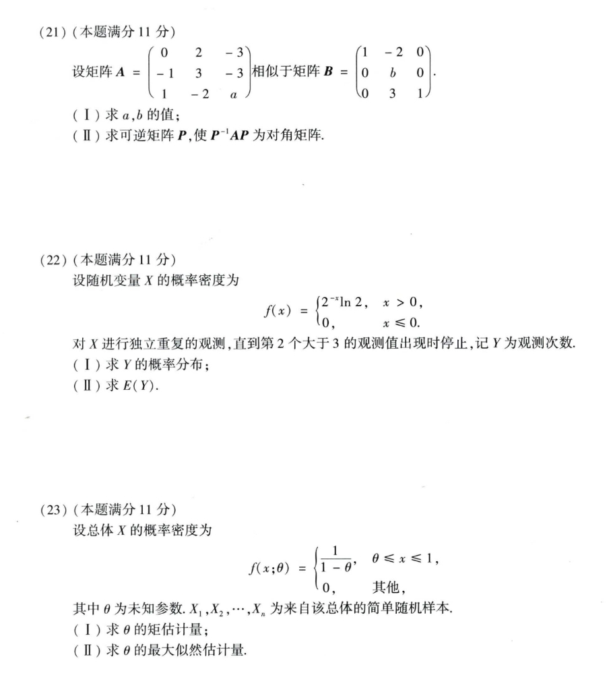

# Math 1 2015 Exam Questions

资料类型：考研数学一历年真题
年份：2015
科目：数学一
整理状态：已按题干截图校对

说明：本文件根据用户提供的 2015 年真题截图整理。截图已保存到 `images/` 目录；第 1、4、13 题已补充清晰配图。

## 2015 数一 选择题 1-7

**第 1-7 题题图**

### 第 1 题

- 题型：选择题
- 题号：1
- 分值：4
- 模块：高数
- 考点：极限、导数、积分、级数、微分方程
- 校对状态：根据题干截图整理

设函数 $f(x)$ 在 $(-\infty,+\infty)$ 上连续，其二阶导函数 $f''(x)$ 的图形如图所示，则曲线 $y=f(x)$ 的拐点个数为（ ）

第 1 题配图：

选项：A. $0$  B. $1$  C. $2$  D. $3$

### 第 2 题

- 题型：选择题
- 题号：2
- 分值：4
- 模块：高数
- 考点：极限、导数、积分、级数、微分方程
- 校对状态：根据题干截图整理

设
$$
y=\frac{1}{2}e^{2x}+\left(x-\frac{1}{3}\right)e^x
$$
是二阶常系数非齐次线性微分方程 $y''+ay'+by=ce^x$ 的一个特解，则（ ）

选项：

A. $a=-3,b=2,c=-1$
B. $a=3,b=2,c=-1$
C. $a=-3,b=2,c=1$
D. $a=3,b=2,c=1$

### 第 3 题

- 题型：选择题
- 题号：3
- 分值：4
- 模块：高数
- 考点：极限、导数、积分、级数、微分方程
- 校对状态：根据题干截图整理

若级数 $\sum_{n=1}^{\infty}a_n$ 条件收敛，则 $x=\sqrt{3}$ 与 $x=3$ 依次为幂级数
$$
\sum_{n=1}^{\infty}na_n(x-1)^n
$$
的（ ）

选项：

A. 收敛点，收敛点。
B. 收敛点，发散点。
C. 发散点，收敛点。
D. 发散点，发散点。

### 第 4 题

- 题型：选择题
- 题号：4
- 分值：4
- 模块：高数
- 考点：极限、导数、积分、级数、微分方程
- 校对状态：根据题干截图整理

设 $D$ 是第一象限中的曲线 $2xy=1, 4xy=1$ 与直线 $y=x, y=\sqrt{3}x$ 围成的平面区域，函数 $f(x,y)$ 在 $D$ 上连续，则
$$
\iint_D f(x,y)\,dxdy=(\ )
$$

第 4 题选项清晰截图：

选项：

A. $\displaystyle \int_{\pi/4}^{\pi/3}d\theta\int_{1/(2\sin2\theta)}^{1/(\sin2\theta)}f(r\cos\theta,r\sin\theta)r\,dr$

B. $\displaystyle \int_{\pi/4}^{\pi/3}d\theta\int_{1/\sqrt{2\sin2\theta}}^{1/\sqrt{\sin2\theta}}f(r\cos\theta,r\sin\theta)r\,dr$

C. $\displaystyle \int_{\pi/4}^{\pi/3}d\theta\int_{1/(2\sin2\theta)}^{1/(\sin2\theta)}f(r\cos\theta,r\sin\theta)\,dr$

D. $\displaystyle \int_{\pi/4}^{\pi/3}d\theta\int_{1/\sqrt{2\sin2\theta}}^{1/\sqrt{\sin2\theta}}f(r\cos\theta,r\sin\theta)\,dr$

### 第 5 题

- 题型：选择题
- 题号：5
- 分值：4
- 模块：线代
- 考点：矩阵、向量组、二次型
- 校对状态：根据题干截图整理

设
$$
A=\begin{pmatrix}
1&1&1\\
1&2&a\\
1&4&a^2
\end{pmatrix},\qquad
b=\begin{pmatrix}1\\d\\d^2\end{pmatrix}.
$$
若集合 $\Omega=\{1,2\}$，则线性方程组 $Ax=b$ 有无穷多解的充分必要条件为（ ）

选项：

A. $a\notin\Omega, d\notin\Omega$
B. $a\notin\Omega, d\in\Omega$
C. $a\in\Omega, d\notin\Omega$
D. $a\in\Omega, d\in\Omega$

### 第 6 题

- 题型：选择题
- 题号：6
- 分值：4
- 模块：线代
- 考点：矩阵、向量组、二次型
- 校对状态：根据题干截图整理

设二次型 $f(x_1,x_2,x_3)$ 在正交变换 $x=Py$ 下的标准形为 $2y_1^2+y_2^2-y_3^2$，其中 $P=(e_1,e_2,e_3)$。若 $Q=(e_1,-e_3,e_2)$，则 $f(x_1,x_2,x_3)$ 在正交变换 $x=Qy$ 下的标准形为（ ）

选项：

A. $2y_1^2-y_2^2+y_3^2$
B. $2y_1^2+y_2^2-y_3^2$
C. $2y_1^2-y_2^2-y_3^2$
D. $2y_1^2+y_2^2+y_3^2$

### 第 7 题

- 题型：选择题
- 题号：7
- 分值：4
- 模块：概率统计
- 考点：随机变量、概率分布、参数估计
- 校对状态：根据题干截图整理

若 $A,B$ 为任意两个随机事件，则（ ）

选项：

A. $P(AB)\le P(A)P(B)$
B. $P(AB)\ge P(A)P(B)$
C. $P(AB)\le \dfrac{P(A)+P(B)}2$
D. $P(AB)\ge \dfrac{P(A)+P(B)}2$

## 2015 数一 选择题 8 与填空题 9-14 与解答题 15-17

**第 8-17 题题图**

### 第 8 题

- 题型：选择题
- 题号：8
- 分值：4
- 模块：概率统计
- 考点：随机变量、概率分布、参数估计
- 校对状态：根据题干截图整理

设随机变量 $X,Y$ 不相关，且 $E(X)=2, E(Y)=1, D(X)=3$，则
$$
E[X(X+Y-2)]=(\ )
$$

选项：A. $-3$  B. $3$  C. $-5$  D. $5$

### 第 9 题

- 题型：填空题
- 题号：9
- 分值：4
- 模块：高数
- 考点：极限、导数、积分、级数、微分方程
- 校对状态：根据题干截图整理

求极限
$$
\lim_{x\to0}\frac{\ln(\cos x)}{x^2}=\underline{\hspace{2cm}}.
$$

### 第 10 题

- 题型：填空题
- 题号：10
- 分值：4
- 模块：高数
- 考点：极限、导数、积分、级数、微分方程
- 校对状态：根据题干截图整理

求定积分
$$
\int_{-\pi/2}^{\pi/2}\left(\frac{\sin x}{1+\cos x}+|x|\right)dx=\underline{\hspace{2cm}}.
$$

### 第 11 题

- 题型：填空题
- 题号：11
- 分值：4
- 模块：高数
- 考点：极限、导数、积分、级数、微分方程
- 校对状态：根据题干截图整理

若函数 $z=z(x,y)$ 由方程
$$
e^z+xyz+x+\cos x=2
$$
确定，则 $dz|_{(0,1)}=\underline{\hspace{2cm}}$。

### 第 12 题

- 题型：填空题
- 题号：12
- 分值：4
- 模块：高数
- 考点：极限、导数、积分、级数、微分方程
- 校对状态：根据题干截图整理

设 $\Omega$ 是由平面 $x+y+z=1$ 与三个坐标平面所围成的空间区域，则
$$
\iiint_\Omega (x+2y+3z)\,dxdydz=\underline{\hspace{2cm}}.
$$

### 第 13 题

- 题型：填空题
- 题号：13
- 分值：4
- 模块：线代
- 考点：矩阵、向量组、二次型
- 校对状态：根据题干截图整理

$n$ 阶行列式
$$
\begin{vmatrix}
2&0&\cdots&0&2\\
-1&2&\cdots&0&2\\
\vdots&\vdots&&\vdots&\vdots\\
0&0&\cdots&2&2\\
0&0&\cdots&-1&2
\end{vmatrix}=\underline{\hspace{2cm}}.
$$

第 13 题清晰截图：

### 第 14 题

- 题型：填空题
- 题号：14
- 分值：4
- 模块：概率统计
- 考点：随机变量、概率分布、参数估计
- 校对状态：根据题干截图整理

设二维随机变量 $(X,Y)$ 服从正态分布 $N(1,0;1,1;0)$，则
$$
P\{XY-Y<0\}=\underline{\hspace{2cm}}.
$$

### 第 15 题

- 题型：解答题
- 题号：15
- 分值：10
- 模块：高数
- 考点：极限、导数、积分、级数、微分方程
- 校对状态：根据题干截图整理

设函数
$$
f(x)=x+a\ln(1+x)+bx\sin x,\qquad g(x)=kx^3.
$$
若 $f(x)$ 与 $g(x)$ 在 $x\to0$ 时是等价无穷小，求 $a,b,k$ 的值。

### 第 16 题

- 题型：解答题
- 题号：16
- 分值：10
- 模块：高数
- 考点：极限、导数、积分、级数、微分方程
- 校对状态：根据题干截图整理

设函数 $f(x)$ 在定义域 $I$ 上的导数大于零，若对任意 $x_0\in I$，曲线 $y=f(x)$ 在点 $(x_0,f(x_0))$ 处的切线与直线 $x=x_0$ 及 $x$ 轴所围成区域的面积恒为 $4$，且 $f(0)=2$，求 $f(x)$ 的表达式。

### 第 17 题

- 题型：解答题
- 题号：17
- 分值：10
- 模块：高数
- 考点：极限、导数、积分、级数、微分方程
- 校对状态：根据题干截图整理

已知函数
$$
f(x,y)=x+y+xy,
$$
曲线 $C:x^2+y^2+xy=3$，求 $f(x,y)$ 在曲线 $C$ 上的最大方向导数。

## 2015 数一 解答题 18-20

**第 18-20 题题图**

### 第 18 题

- 题型：解答题
- 题号：18
- 分值：10
- 模块：高数
- 考点：极限、导数、积分、级数、微分方程
- 校对状态：根据题干截图整理

1. 设函数 $u(x),v(x)$ 可导，利用导数定义证明
$$
[u(x)v(x)]'=u'(x)v(x)+u(x)v'(x).
$$

2. 设函数 $u_1(x),u_2(x),\ldots,u_n(x)$ 可导，$f(x)=u_1(x)u_2(x)\cdots u_n(x)$，写出 $f(x)$ 的求导公式。

### 第 19 题

- 题型：解答题
- 题号：19
- 分值：10
- 模块：高数
- 考点：极限、导数、积分、级数、微分方程
- 校对状态：根据题干截图整理

已知曲线 $L$ 的方程为
$$
\begin{cases}
z=\sqrt{2-x^2-y^2},\\
z=x,
\end{cases}
$$
起点为 $A(0,\sqrt{2},0)$，终点为 $B(0,-\sqrt{2},0)$，计算曲线积分
$$
I=\int_L (y+z)dx+(z^2-x^2+y)dy+x^2y^2dz.
$$

### 第 20 题

- 题型：解答题
- 题号：20
- 分值：11
- 模块：线代
- 考点：矩阵、向量组、二次型
- 校对状态：根据题干截图整理

设向量组 $\alpha_1,\alpha_2,\alpha_3$ 为 $\mathbb R^3$ 的一个基，
$$
\beta_1=2\alpha_1+2k\alpha_3,\qquad
\beta_2=2\alpha_2,\qquad
\beta_3=\alpha_1+(k+1)\alpha_3.
$$

1. 证明向量组 $\beta_1,\beta_2,\beta_3$ 为 $\mathbb R^3$ 的一个基。
2. 当 $k$ 为何值时，存在非零向量 $\xi$ 在基 $\alpha_1,\alpha_2,\alpha_3$ 与基 $\beta_1,\beta_2,\beta_3$ 下的坐标相同，并求所有的 $\xi$。

## 2015 数一 解答题 21-23

**第 21-23 题题图**

### 第 21 题

- 题型：解答题
- 题号：21
- 分值：11
- 模块：线代
- 考点：矩阵、向量组、二次型
- 校对状态：根据题干截图整理

设矩阵
$$
A=\begin{pmatrix}
0&2&-3\\
-1&3&-3\\
1&-2&a
\end{pmatrix}
$$
相似于矩阵
$$
B=\begin{pmatrix}
1&-2&0\\
0&b&0\\
0&3&1
\end{pmatrix}.
$$

1. 求 $a,b$ 的值。
2. 求可逆矩阵 $P$，使 $P^{-1}AP$ 为对角矩阵。

### 第 22 题

- 题型：解答题
- 题号：22
- 分值：11
- 模块：概率统计
- 考点：随机变量、概率分布、参数估计
- 校对状态：根据题干截图整理

设随机变量 $X$ 的概率密度为
$$
f(x)=\begin{cases}
2^{-x}\ln2,&x>0,\\
0,&x\le0.
\end{cases}
$$
对 $X$ 进行独立重复观测，直到第 $2$ 个大于 $3$ 的观测值出现时停止，记 $Y$ 为观测次数。

1. 求 $Y$ 的概率分布。
2. 求 $E(Y)$。

### 第 23 题

- 题型：解答题
- 题号：23
- 分值：11
- 模块：概率统计
- 考点：随机变量、概率分布、参数估计
- 校对状态：根据题干截图整理

设总体 $X$ 的概率密度为
$$
f(x;\theta)=\begin{cases}
\dfrac{1}{1-\theta},&\theta\le x\le1,\\
0,&\text{其他}.
\end{cases}
$$
其中 $\theta$ 为未知参数，$X_1,\ldots,X_n$ 为来自该总体的简单随机样本。

1. 求 $\theta$ 的矩估计量。
2. 求 $\theta$ 的最大似然估计量。
