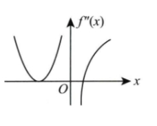

# 2015 数学一第 1 题

## 相关图片

## 题目

设函数 $f(x)$ 在 $(-\infty,+\infty)$ 上连续，其二阶导函数 $f''(x)$ 的图形如图所示，则曲线 $y=f(x)$ 的拐点个数为（ ）

第 1 题配图：

选项：A. $0$  B. $1$  C. $2$  D. $3$

## 标准答案

C

## 解析

由 $f''(x)$ 的图形可知，$f''(x)=0$ 的点有两个，另有 $x=0$ 处 $f''(x)$ 不存在。

曲线 $y=f(x)$ 的拐点对应 $f''(x)$ 在该点两侧变号。两个零点中只有一个零点两侧的二阶导数符号相反，因此给出一个拐点。又 $x=0$ 左侧 $f''(x)>0$，右侧 $f''(x)<0$，虽然 $f''(0)$ 不存在，但 $f(x)$ 连续且凹凸性发生改变，所以 $(0,f(0))$ 也是拐点。

故曲线 $y=f(x)$ 共有 $2$ 个拐点，选 C。

## 来源

- 题目来源：`math1_2015_questions.md`
- 答案来源：`math1_2015_answers.md`
