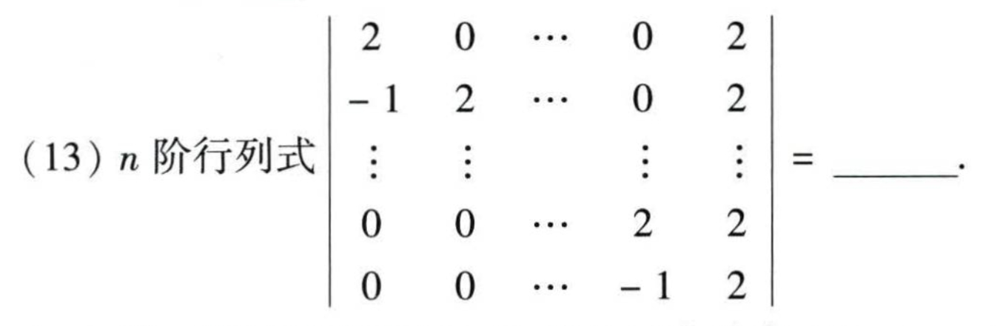

# 2015 数学一第 13 题

## 相关图片

## 题目

$n$ 阶行列式
$$
\begin{vmatrix}
2&0&\cdots&0&2\\
-1&2&\cdots&0&2\\
\vdots&\vdots&&\vdots&\vdots\\
0&0&\cdots&2&2\\
0&0&\cdots&-1&2
\end{vmatrix}=\underline{\hspace{2cm}}.
$$

第 13 题清晰截图：

## 标准答案

$2^{n+1}-2$

## 解析

记该 $n$ 阶行列式为 $D_n$。从第 $1$ 行开始，依次将第 $i$ 行的 $\frac{1}{2}$ 倍加到第 $i+1$ 行，$i=1,2,\ldots,n-1$。这些初等行变换不改变行列式的值，并把主对角线下方的 $-1$ 消去。

变换后矩阵成为上三角型，前 $n-1$ 个对角元均为 $2$，最后一个对角元为
$$
2\left[1+\frac{1}{2}+\left(\frac{1}{2}\right)^2+\cdots+\left(\frac{1}{2}\right)^{n-1}\right]
=4\left(1-2^{-n}\right).
$$
因此
$$
D_n=2^{n-1}\cdot4\left(1-2^{-n}\right)=2^{n+1}-2.
$$

## 来源

- 题目来源：`math1_2015_questions.md`
- 答案来源：`math1_2015_answers.md`
