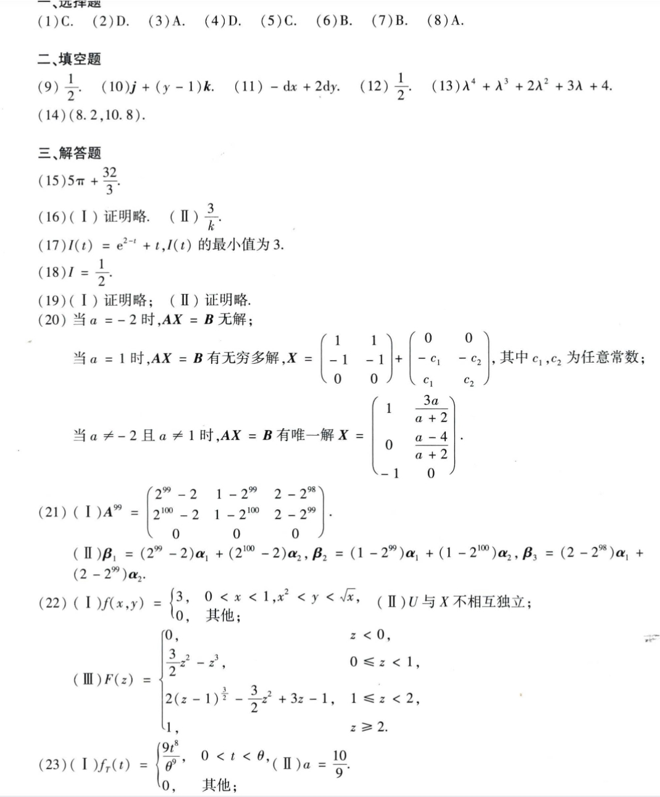

# Math 1 2016 Answers

资料类型：考研数学一答案速查  
年份：2016  
科目：数学一  
来源：本地答案速查图片 OCR/人工转写  
校对状态：待复核  

原图：

## 选择题

| 题号 | 答案 |
|---|---|
| 1 | C |
| 2 | D |
| 3 | A |
| 4 | D |
| 5 | C |
| 6 | B |
| 7 | B |
| 8 | A |

## 填空题

| 题号 | 答案 |
|---|---|
| 9 | `1/2` |
| 10 | `j+(y-1)k` |
| 11 | `-dx+2dy` |
| 12 | `1/2` |
| 13 | `λ^4+λ^3+2λ^2+3λ+4` |
| 14 | `(8.2,10.8)` |

## 解答题

| 题号 | 答案速查 |
|---|---|
| 15 | `5π+32/3` |
| 16 | （1）证明略；（2）`3/k` |
| 17 | （1）`I(t)=e^(2-t)+t`；（2）最小值 `3` |
| 18 | `I=1/2` |
| 19 | 证明略 |
| 20 | `a=-2` 时无解；`a=1` 时无穷多解，通解 `X=[1,1; -s-1,-t-1; s,t]`，其中 `s,t` 为任意常数；`a!=1,-2` 时唯一解 `X=[1,3a/(a+2); 0,(a-4)/(a+2); -1,0]` |
| 21 | （1）`A^99=[2^99-2, 1-2^99, 2-2^98; 2^100-2, 1-2^100, 2-2^99; 0,0,0]`；（2）`β_1=(2^99-2)α_1+(2^100-2)α_2`，`β_2=(1-2^99)α_1+(1-2^100)α_2`，`β_3=(2-2^98)α_1+(2-2^99)α_2` |
| 22 | （1）`f(x,y)=3`，`0<x<1, x^2<y<sqrt(x)`；（2）`U` 与 `X` 不相互独立；（3）`F_Z(z)=0(z<0), (3/2)z^2-z^3(0<=z<1), 2(z-1)^(3/2)-(3/2)z^2+3z-1(1<=z<2), 1(z>=2)` |
| 23 | （1）`f_T(t)=9t^8/theta^9, 0<t<theta`；（2）`a=10/9` |
