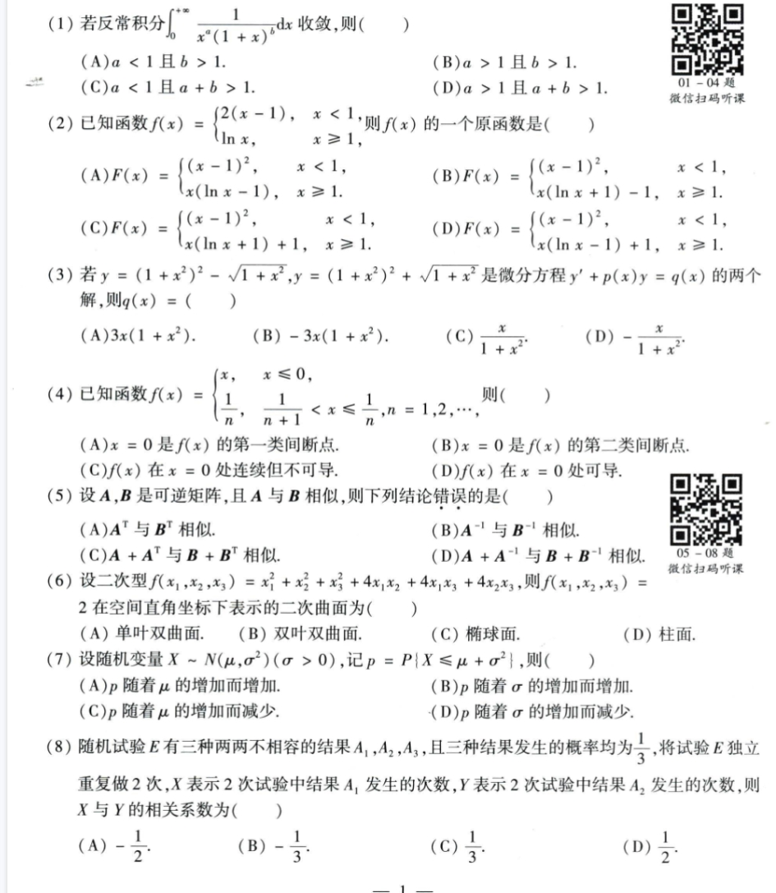
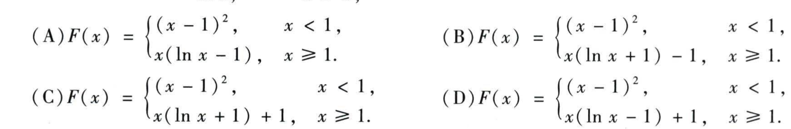
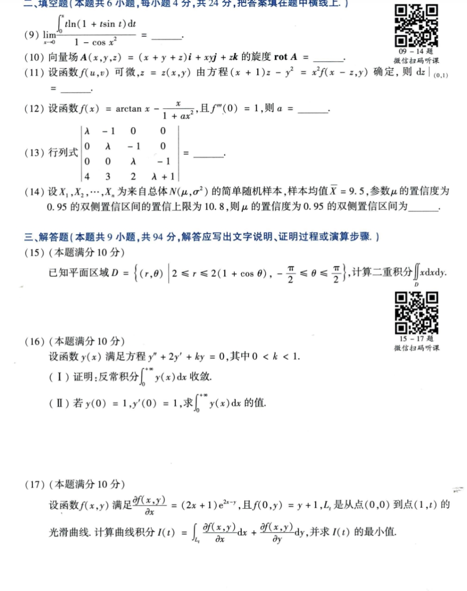
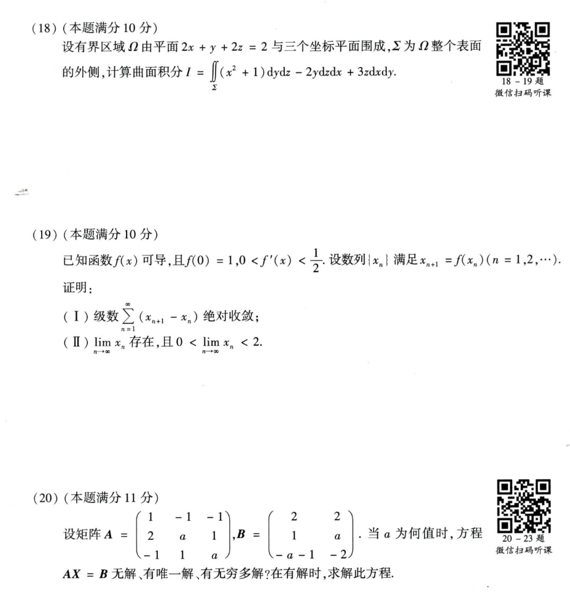
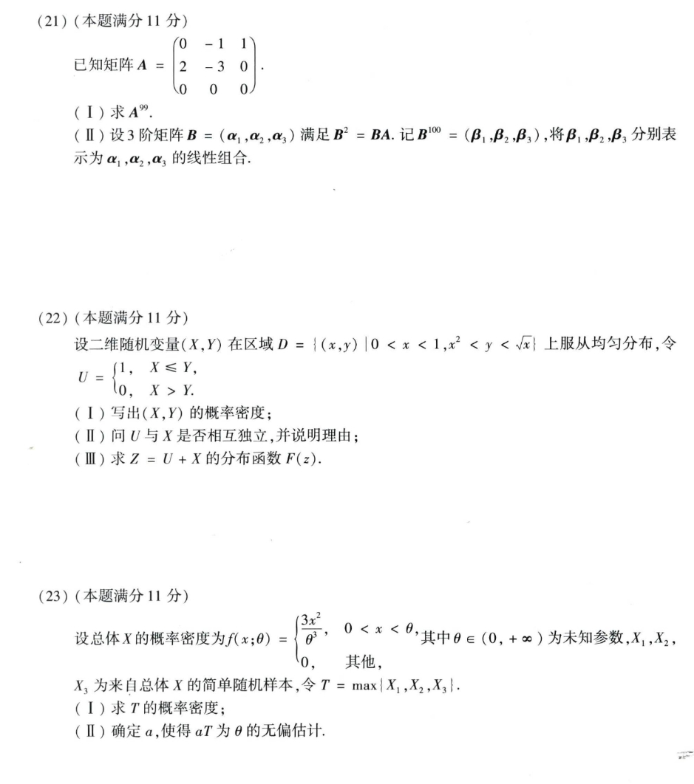

# Math 1 2016 Exam Questions

资料类型：考研数学一历年真题  
年份：2016  
科目：数学一  
整理状态：待复核  

说明：本文件根据用户提供的 2016 年真题截图整理。截图已保存到 `images/` 目录；第 2 题已补充清晰选项图。

## 2016 数一 选择题 1-8

选择题 1-8 截图：



### 第 1 题

- 题型：选择题
- 题号：1
- 分值：4
- 模块：高数
- 考点：极限、导数、积分、级数、微分方程
- 校对状态：根据截图整理

若反常积分

```text
∫_0^(+∞) 1 / (x^a(1+x)^b) dx
```

收敛，则（ ）

选项：

A. `a<1 且 b>1`  
B. `a>1 且 b>1`  
C. `a<1 且 a+b>1`  
D. `a>1 且 a+b>1`

### 第 2 题

- 题型：选择题
- 题号：2
- 分值：4
- 模块：高数
- 考点：极限、导数、积分、级数、微分方程
- 校对状态：根据截图整理

已知函数

```text
f(x) = {
  2(x-1), x<1
  ln x,   x>=1
}
```

则 `f(x)` 的一个原函数是（ ）

第 2 题选项清晰截图：



选项：

A.
```text
F(x) = {
  (x - 1)^2,      x < 1,
  x(ln x - 1),    x >= 1.
}
```

B.
```text
F(x) = {
  (x - 1)^2,          x < 1,
  x(ln x + 1) - 1,    x >= 1.
}
```

C.
```text
F(x) = {
  (x - 1)^2,          x < 1,
  x(ln x + 1) + 1,    x >= 1.
}
```

D.
```text
F(x) = {
  (x - 1)^2,          x < 1,
  x(ln x - 1) + 1,    x >= 1.
}
```

### 第 3 题

- 题型：选择题
- 题号：3
- 分值：4
- 模块：高数
- 考点：极限、导数、积分、级数、微分方程
- 校对状态：根据截图整理

若

```text
y=(1+x^2)^2 - sqrt(1+x^2),
y=(1+x^2)^2 + sqrt(1+x^2)
```

是微分方程 `y' + p(x)y = q(x)` 的两个解，则 `q(x) = ( )`

选项：

A. `3x(1+x^2)`  
B. `-3x(1+x^2)`  
C. `x/(1+x^2)`  
D. `-x/(1+x^2)`

### 第 4 题

- 题型：选择题
- 题号：4
- 分值：4
- 模块：高数
- 考点：极限、导数、积分、级数、微分方程
- 校对状态：根据截图整理

已知函数

```text
f(x) = {
  x, x <= 0
  1/n, 1/(n+1) < x <= 1/n, n=1,2,...
}
```

则（ ）

选项：

A. `x=0` 是 `f(x)` 的第一类间断点。  
B. `x=0` 是 `f(x)` 的第二类间断点。  
C. `f(x)` 在 `x=0` 连续但不可导。  
D. `f(x)` 在 `x=0` 处可导。

### 第 5 题

- 题型：选择题
- 题号：5
- 分值：4
- 模块：线代
- 考点：矩阵、向量组、二次型
- 校对状态：根据截图整理

设 `A,B` 是可逆矩阵，且 `A` 与 `B` 相似，则下列结论错误的是（ ）

选项：

A. `A^T` 与 `B^T` 相似。  
B. `A^(-1)` 与 `B^(-1)` 相似。  
C. `A+A^T` 与 `B+B^T` 相似。  
D. `A+A^(-1)` 与 `B+B^(-1)` 相似。

### 第 6 题

- 题型：选择题
- 题号：6
- 分值：4
- 模块：线代
- 考点：矩阵、向量组、二次型
- 校对状态：根据截图整理

设二次型

```text
f(x_1,x_2,x_3)=x_1^2+x_2^2+x_3^2+4x_1x_2+4x_1x_3+4x_2x_3
```

则 `f(x_1,x_2,x_3)=2` 在空间直角坐标下表示的二次曲面为（ ）

选项：A. 单叶双曲面  B. 双叶双曲面  C. 椭球面  D. 柱面

### 第 7 题

- 题型：选择题
- 题号：7
- 分值：4
- 模块：概率统计
- 考点：随机变量、概率分布、参数估计
- 校对状态：根据截图整理

设随机变量 `X ~ N(mu,sigma^2) (sigma>0)`，记

```text
p = P{X <= mu + sigma^2}
```

则（ ）

选项：

A. `p` 随着 `mu` 的增加而增加。  
B. `p` 随着 `sigma` 的增加而增加。  
C. `p` 随着 `mu` 的增加而减少。  
D. `p` 随着 `sigma` 的增加而减少。

### 第 8 题

- 题型：选择题
- 题号：8
- 分值：4
- 模块：概率统计
- 考点：随机变量、概率分布、参数估计
- 校对状态：根据截图整理

随机试验 `E` 有三种两两不相容的结果 `A_1,A_2,A_3`，且三种结果发生的概率均为 `1/3`。将试验 `E` 独立重复做 2 次，`X` 表示 2 次试验中结果 `A_1` 发生的次数，`Y` 表示 2 次试验中结果 `A_2` 发生的次数，则 `X` 与 `Y` 的相关系数为（ ）

选项：

A. `-1/2`  
B. `-1/3`  
C. `1/3`  
D. `1/2`

## 2016 数一 填空题 9-14 与解答题 15-17

截图：



### 第 9 题

- 题型：填空题
- 题号：9
- 分值：4
- 模块：高数
- 考点：极限、导数、积分、级数、微分方程
- 校对状态：根据截图整理

```text
lim_{x->0} [∫_0^x t ln(1+t sin t) dt] / [1 - cos x^2] = ____
```

### 第 10 题

- 题型：填空题
- 题号：10
- 分值：4
- 模块：高数
- 考点：极限、导数、积分、级数、微分方程
- 校对状态：根据截图整理

向量场

```text
A(x,y,z) = (x+y+z)i + xyj + zk
```

的旋度 `rot A = ____`。

### 第 11 题

- 题型：填空题
- 题号：11
- 分值：4
- 模块：高数
- 考点：极限、导数、积分、级数、微分方程
- 校对状态：根据截图整理

设函数 `f(u,v)` 可微，`z=z(x,y)` 由方程

```text
(x+1)z - y^2 = x^2 f(x-z,y)
```

确定，则 `dz|_(0,1)=____`。

### 第 12 题

- 题型：填空题
- 题号：12
- 分值：4
- 模块：高数
- 考点：极限、导数、积分、级数、微分方程
- 校对状态：根据截图整理

设函数

```text
f(x)=arctan x - x/(1+a x^2)
```

且 `f'''(0)=1`，则 `a=____`。

### 第 13 题

- 题型：填空题
- 题号：13
- 分值：4
- 模块：线代
- 考点：矩阵、向量组、二次型
- 校对状态：根据截图整理

行列式

```text
| lambda  -1       0       0
  0       lambda  -1       0
  0       0       lambda  -1
  4       3        2       lambda+1 | = ____
```

### 第 14 题

- 题型：填空题
- 题号：14
- 分值：4
- 模块：概率统计
- 考点：随机变量、概率分布、参数估计
- 校对状态：根据截图整理

设 `X_1,...,X_n` 为来自总体 `N(mu,sigma^2)` 的简单随机样本，样本均值 `X_bar=9.5`，参数 `mu` 的置信度为 `0.95` 的双侧置信区间的置信上限为 `10.8`，则 `mu` 的置信度为 `0.95` 的双侧置信区间为 `____`。

### 第 15 题

- 题型：解答题
- 题号：15
- 分值：10
- 模块：高数
- 考点：极限、导数、积分、级数、微分方程
- 校对状态：根据截图整理

已知平面区域

```text
D = { (r,theta) | 2 <= r <= 2(1+cos theta), -π/2 <= theta <= π/2 }
```

计算二重积分

```text
∫∫_D x dxdy
```

### 第 16 题

- 题型：解答题
- 题号：16
- 分值：10
- 模块：高数
- 考点：极限、导数、积分、级数、微分方程
- 校对状态：根据截图整理

设函数 `y(x)` 满足方程

```text
y'' + 2y' + ky = 0, 0 < k < 1
```

1. 证明反常积分 `∫_0^(+∞) y(x) dx` 收敛。
2. 若 `y(0)=1, y'(0)=1`，求 `∫_0^(+∞) y(x) dx` 的值。

### 第 17 题

- 题型：解答题
- 题号：17
- 分值：10
- 模块：高数
- 考点：极限、导数、积分、级数、微分方程
- 校对状态：根据截图整理

设函数 `f(x,y)` 满足

```text
∂f(x,y)/∂x = (2x+1)e^(2x-y)
```

且 `f(0,y)=y+1`，`L_t` 是从点 `(0,0)` 到点 `(1,t)` 的光滑曲线。计算曲线积分

```text
I(t)=∫_{L_t} ∂f/∂x dx + ∂f/∂y dy
```

并求 `I(t)` 的最小值。

## 2016 数一 解答题 18-20

截图：



### 第 18 题

- 题型：解答题
- 题号：18
- 分值：10
- 模块：高数
- 考点：极限、导数、积分、级数、微分方程
- 校对状态：根据截图整理

设有界区域 `Omega` 由平面 `2x+y+2z=2` 与三个坐标平面围成，`Sigma` 为 `Omega` 整个表面的外侧，计算曲面积分

```text
I = ∬_Sigma (x^2+1)dydz - 2y dzdx + 3z dxdy
```

### 第 19 题

- 题型：解答题
- 题号：19
- 分值：10
- 模块：高数
- 考点：极限、导数、积分、级数、微分方程
- 校对状态：根据截图整理

已知函数 `f(x)` 可导，且 `f(0)=1, 0<f'(x)<1/2`。设数列 `{x_n}` 满足

```text
x_{n+1}=f(x_n), n=1,2,...
```

证明：

1. 级数 `sum_{n=1}^∞ (x_{n+1}-x_n)` 绝对收敛。
2. `lim_{n->∞} x_n` 存在，且 `0 < lim_{n->∞} x_n < 2`。

### 第 20 题

- 题型：解答题
- 题号：20
- 分值：11
- 模块：线代
- 考点：矩阵、向量组、二次型
- 校对状态：根据截图整理

设矩阵

```text
A = [ 1 -1 -1
      2  a  1
     -1  1  a ],
B = [ 2  2
      1  a
     -a-1 -2]
```

当 `a` 为何值时，方程 `AX=B` 无解、有唯一解、有无穷多解？在有解时，求解此方程。

## 2016 数一 解答题 21-23

截图：



### 第 21 题

- 题型：解答题
- 题号：21
- 分值：11
- 模块：线代
- 考点：矩阵、向量组、二次型
- 校对状态：根据截图整理

已知矩阵

```text
A = [0 -1  1
     2 -3  0
     0  0  0]
```

1. 求 `A^99`。
2. 设 3 阶矩阵 `B=(alpha_1,alpha_2,alpha_3)` 满足 `B^2=BA`。记 `B^100=(beta_1,beta_2,beta_3)`，将 `beta_1,beta_2,beta_3` 分别表示为 `alpha_1,alpha_2,alpha_3` 的线性组合。

### 第 22 题

- 题型：解答题
- 题号：22
- 分值：11
- 模块：概率统计
- 考点：随机变量、概率分布、参数估计
- 校对状态：根据截图整理

设二维随机变量 `(X,Y)` 在区域

```text
D = { (x,y) | 0 < x < 1, x^2 < y < sqrt(x) }
```

上服从均匀分布，令

```text
U = {
  1, X <= Y
  0, X > Y
}
```

1. 写出 `(X,Y)` 的概率密度。
2. 问 `U` 与 `X` 是否相互独立，并说明理由。
3. 求 `Z=U+X` 的分布函数 `F(z)`。

### 第 23 题

- 题型：解答题
- 题号：23
- 分值：11
- 模块：概率统计
- 考点：随机变量、概率分布、参数估计
- 校对状态：根据截图整理

设总体 `X` 的概率密度为

```text
f(x;theta) = {
  3x^2/theta^3, 0 < x < theta
  0, 其他
}
```

其中 `theta in (0,+∞)` 为未知参数，`X_1,X_2,X_3` 为来自总体 `X` 的简单随机样本，令

```text
T = max{X_1,X_2,X_3}
```

1. 求 `T` 的概率密度。
2. 确定 `a`，使得 `aT` 为 `theta` 的无偏估计。
