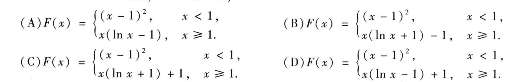

# 2016 数学一第 2 题

## 相关图片

## 题目

已知
$$
f(x)=
\begin{cases}
2(x-1),&x<1,\\
\ln x,&x\ge1,
\end{cases}
$$
则 $f(x)$ 的一个原函数是（ ）。

A. $F(x)=\begin{cases}(x-1)^2,&x<1,\\x(\ln x-1),&x\ge1.\end{cases}$

B. $F(x)=\begin{cases}(x-1)^2,&x<1,\\x(\ln x+1)-1,&x\ge1.\end{cases}$

C. $F(x)=\begin{cases}(x-1)^2,&x<1,\\x(\ln x+1)+1,&x\ge1.\end{cases}$

D. $F(x)=\begin{cases}(x-1)^2,&x<1,\\x(\ln x-1)+1,&x\ge1.\end{cases}$

## 标准答案

D

## 解析

在 $x<1$ 时，原函数可取 $(x-1)^2+C_1$；在 $x\ge1$ 时，原函数可取
$$
x\ln x-x+C_2.
$$
原函数在 $x=1$ 处必须连续。取左侧常数为 $0$，左极限为 $0$；右侧在 $x=1$ 的值为 $-1+C_2$，故 $C_2=1$。因此
$$
F(x)=
\begin{cases}
(x-1)^2,&x<1,\\
x(\ln x-1)+1,&x\ge1,
\end{cases}
$$
选 D。

## 来源

- 题目来源：math1_2016_questions.md
- 答案来源：math1_2016_answers.md
