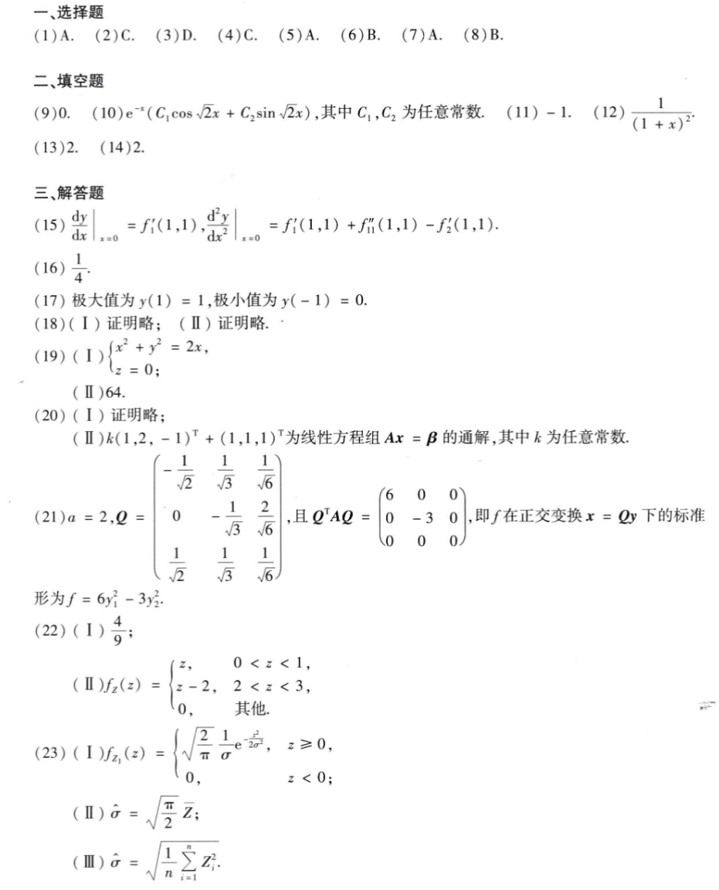

# Math 1 2017 Answers

资料类型：考研数学一答案速查  
年份：2017  
科目：数学一  
来源：本地答案速查图片 OCR/人工转写  
校对状态：待复核  

原图：

## 选择题

| 题号 | 答案 |
|---|---|
| 1 | A |
| 2 | C |
| 3 | D |
| 4 | C |
| 5 | A |
| 6 | B |
| 7 | A |
| 8 | B |

## 填空题

| 题号 | 答案 |
|---|---|
| 9 | `0` |
| 10 | `e^(-x)(C_1 cos(sqrt(2)x)+C_2 sin(sqrt(2)x))` |
| 11 | `-1` |
| 12 | `1/(1+x)^2` |
| 13 | `2` |
| 14 | `2` |

## 解答题

| 题号 | 答案速查 |
|---|---|
| 15 | （1）`(dy/dx)|_0=f'_1(1,1)`；（2）`(d²y/dx²)|_0=f'_1(1,1)+f''_11(1,1)-f'_2(1,1)` |
| 16 | `1/4` |
| 17 | 极大值 `y(1)=1`，极小值 `y(-1)=0` |
| 18 | 证明略 |
| 19 | 投影曲线 `x^2+y^2=2x, z=0`；质量 `64` |
| 20 | （1）证明略；（2）通解 `k(1,2,-1)^T+(1,1,1)^T` |
| 21 | （1）`a=2`；（2）`Q=[-1/sqrt(2), 1/sqrt(3), 1/sqrt(6); 0, -1/sqrt(3), 2/sqrt(6); 1/sqrt(2), 1/sqrt(3), 1/sqrt(6)]`，标准形 `f=6y_1^2-3y_2^2` |
| 22 | （1）`P{Y<=E(Y)}=4/9`；（2）`f_Z(z)=z(0<z<1), z-2(2<z<3), 0(其他)` |
| 23 | （1）`f_Z(z)=sqrt(2/π)·1/sigma·e^{-z^2/(2sigma^2)}, z>=0`；（2）矩估计 `sqrt(π/2) Z_bar`；（3）最大似然估计 `sqrt((1/n)sum Z_i^2)` |
